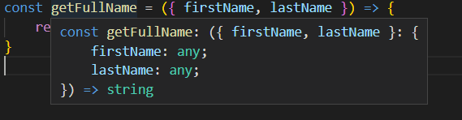
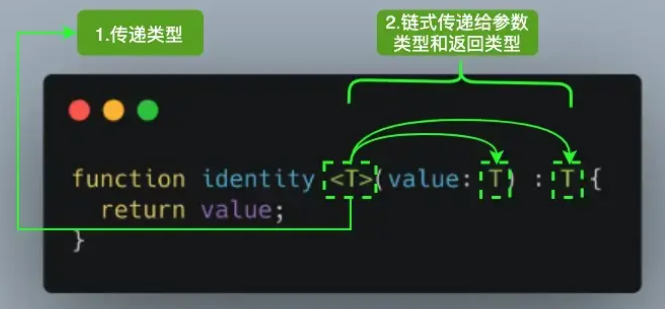

# 一、基础篇

## 1.快速入门

### 1.代码初始化

```
// npm
npm install -g typescriptl/ yarm
yarn global add typescript//查看版本
tsc -v
```

### 2. ts-node

```
npm i -g ts-node
```

### 3.初始化配置文件

```
tsc --init
```

```
{
	"compileroptions": {"target" : "es5", //指定ECMAScript目标版本: 'ES5'
	"module" : "commonjs ", //指定使用模块: 'commonjs ', 'amd ' , 'system ', "umd ' or 'es2015'
	"moduleResolution" : "node" , //选择模块解析策略
	"experimentalDecorators" : true,//启用实验性的Es装饰器
	"allowSyntheticDefaultImports": true，//允许从没有设置默认导出的模块中默认导入
	"sourceMap" : true, //把ts文件编译成js 文件的时候，同时生成对应的 map 文件
	"strict" : true, //启用所有严格类型检查选项
	"noImplicitAny" : true, //在表达式和声明上有隐含的any类型时报错
	"alwaysstrict" : true, //以严格模式检查模块，并在每个文件里加入'use strict'
	"declaration" : true, //生成相应的.d.ts文件
	"removeComments" : true, //删除编译后的所有的注释
	"noImplicitReturns" : true, //不是函数的所有返回路径都有返回值时报错
	"importHelpers" : true, //从tslib 导入辅助工具函数
	"lib": [ "es6", "dom" ], //指定要包含在编译中的库文件
	"typeRoots": [ "node_modules/@types"],
	"outDir": "./dist",
	"rootDir": "./src"},
	"include": [ //需要编译的ts文件*表示文件匹配**表示忽略文件的深度问题
	"./src/**/*.ts"
	],
	"exclude" : [ //不需要编译的ts文件
	"node_modules",
	"dist",
	"**/*.test.ts" ,
}
```

## 2.数据类型

### 1.简单数据类型

在语法层面，缺省类型注解的TypeScript与JavaScript完全一致。

类型的注解主要通过类型后置语法来实现："**变量:类型**"

```
let num = 996
let num: number = 996
```

第一行为 隐式定义，第二行显示声明了类型，两行的代码都不能给num赋值为其他类型。

在JavaScript中，原始类型指的是**非对象且没有方法的数据类型，包括：**

- number
- boolean
- string
- null
- undefined
- symbol
- bigInt

他们对应的TypeScript 如下

| **JavaScript原始基础类型** | **typescript类型** |
| -------------------------- | ------------------ |
| number                     | number             |
| boolean                    | boolean            |
| string                     | string             |
| null                       | null               |
| undefined                  | undefined          |
| symbol                     | symbol             |
| bigInt                     | bigInt             |

#### 1.number

```
let num: number
num = 123
num = 0b1111011 // 二进制
num = 0o146 // 八进制
num = 0x7b // 十六进制
```

#### 2.string

```
// string
let str: string = 'hello world'
```

#### 3.boolean

```
let bol: boolean = false
```

#### 4.null 和 undefined

它们既是实际的值，也是类型。

undefined 和 null 是所有类型的子类型，如果“compilerOptions”里设置为"strictNullChecks": false 时，则可以把他们赋值给其他类型，否则不可以。

```
let u: undefined = undefined
let n: null = null
```

#### 5.bigInt

使用BigInt 可以安全地存储和操作大整数。

BigInt 需要 "target": "es2020"

```
/* const max = Number.MAX_SAFE_INTEGER
const max1 = max +1
const max2 = max +2
console.log(max1 === max2) // true */

const max = BigInt(Number.MAX_SAFE_INTEGER)
const max1 = max +1n
const max2 = max +2n
console.log(max1 === max2) // false
```

#### 6.symbol

##### 1.symbol 的基本使用

- 使用Symbol 构造函数生成
- 用来标表示独一无二的值

```
const s1= Symbol('TypeScript')
const s2 = Symbol('TypeScript')
console.log(typeof s1)
// console.log(s1 === s2) // 报错，此条件始终返回false
```

##### 2.symbol 作为属性名

```
let title = Symbol()
let obj = {
    [title]: 'TypeScript'
}
console.log(obj) // { [Symbol()]: 'TypeScript' }
console.log(obj[title]) // TypeScript
// console.log(obj.title) // 报错，不存在属性title
```

##### 3. symbol 属性名遍历

```
const myTitle = Symbol('TypeScript')
const myObj = {
    [myTitle]: 'TypeScript',
    age: 18
}
// for in 与 下面的方法都取不到
for (const key in myObj) {
    console.log(key) // age
}
console.log(Object.keys(myObj)) // [ 'age' ]
console.log(Object.getOwnPropertyNames(myObj)) // [ 'age' ]
console.log(JSON.stringify(myObj)) // {"age":18}
// 可以使用 Object.getOwnPropertySymbols
console.log(Object.getOwnPropertySymbols(myObj)) // [ Symbol(TypeScript) ] 
// Reflect.ownKeys 可以获取所有类型的属性名
console.log(Reflect.ownKeys(myObj)) // [ 'age', Symbol(TypeScript) ]
```

##### 4.symbol 静态方法

- Symbol.for()
  - 使用Symbol.for()方法传入字符串会先检查有没有使用该字符串调用Symbol.for 方法创建的symbol值
- Symbol.keyFor()
  - 该方法传入一个symbol值，返回该值在全局注册的键名

```
const tsSymbol = Symbol.for('TypeScript')
console.log(tsSymbol === Symbol.for('TypeScript')) // true
console.log(Symbol.keyFor(tsSymbol)) // TypeScript
```

### 2.复杂数据类型

#### 1.Array

##### 两种定义方式

- 直接定义(推荐): number[]
- 数组泛型：Array<number>

```
let list1: number[] = [1,2,3]
let list2: Array<number> = [1,2,3]
```

##### 定义联合类型数组

```
let list3: (number | string | object)[] = ['a', 1, {}]
```

#### 2.object

```
let obj2: object
obj2 = {
    name: 'TypeScript'
}
function getKeys (obj: object) {
    return Object.keys(obj)
}
getKeys({
    a: 'a'
})
// getKeys(123) // 运行会报错，Argument of type 'number' is not assignable to parameter of type 'object'
```

#### 3.元组

- 已知元素数量
- 已知元素类型
- 各个位置上 的元素类型也要对应

```
let arr: [string, number, boolean]
arr = ['a', 1, false]
// arr = [1, 'a', false] error
// arr = ['a', 2] error
```

新版本中，[string, number]元组类型的声明效果可以看作等同于下面声明

```
interface Tuple extends Array<number | string> {
    0: string;
    1: number;
    length: 2;
}
```

#### 4.枚举

- **作用：给一组数值赋予名字**

- **默认从0开始，后一个是前一个的+1**

```
enum Roles {
    SUPER_ADMIN,
    ADMIN,
    USER
}
console.log(Roles.SUPER_ADMIN) // 0
enum Roles1 {
    SUPER_ADMIN = 5,
    ADMIN=4,
    USER
}
console.log(Roles1.SUPER_ADMIN) // 5
console.log(Roles1.USER) // 5
```

#### 5.any

它是一个任意类型，定义为any类型的变量就会绕过TypeScript的静态类型检测。

```
let anyType: any = 1
anyType = false
```

#### 6.void

- 表示没有类型，就是什么类型也不是
- 在定义函数，并且函数不返回任何内容（实际上返回undefined）
- null 和 undefined 可以赋值给它

```
const consoleText = (text: string): void => {
    console.log(text)
}
let consoleVal = consoleText('123')
consoleVal = null // 需要关闭strictNullChecks
consoleVal = undefined
```

#### 7.never

- unknown 的子类型

  ```
  type isNever = never extends unknown ? true : false
  ```

- 指永远不存在的类型
- 其值是**总会抛出异常或根本不会有返回值的函数表达式的返回值**

##### never 的特点

- never 是任何类型的子类型，可以赋值给任务类型
- 任何类型都不可以赋值给never 类型

```
const throwErrorFunc = () => { throw new Error()}
const add = (a:number,b:number):number => a + b
// let neverVal: never = add(1,2) // 不能将类型“number”分配给类型“never”
let neverVal: never = throwErrorFunc()
const myString = ''
// never 类型可以赋值给其他类型
const myInt: number = neverVal
// neverVal = myString // 其他类型不可以赋值给never类型
// 函数中的never
```

##### 函数中的never

TypeScript 使用 never 作为那些无法达到的终点的函数的返回值类型，主要有两种情况：

- 函数抛出异常
- 函数不会有返回值（无限循环）

```
// throwErrorFunc
const throwErrorFunc = () => { throw new Error()}

// const output: () => never
const output = () => {
    while(true) {
        console.log('循环')
    }
}
```

##### never 和 void 的区别？

- 类型赋值
  - void 类型值可以是 null、undefined
  - never 只能是never
- 函数中
  - void：没有返回任何内容（undefined）
  - never：抛出异常或者无限循环

#### 8.unknow

- 其是any 的安全类型
- unknown 与 any 一样，所有类型的值都可以赋值给它

```
let notSure: unknown = 4
notSure = 'string'
notSure = [1, 2, 3]
```

any 类型可以赋值给任何类型，unknown 类型只能赋值给 unknown 和 any

```
let nameString = 'well'
// nameString = notSure // error
let notSureA: unknown = 2
notSure = notSureA
let anyA: any = 2
anyA = notSure
```

**作用：缩小类型范围**

```
let result: unknown
if (typeof result === 'number') {
    result.toFixed()
}
```

#### 9.字面量类型与类型字面量

```
// 字面量类型
type Direction = 'Up' | 'Down' | 'Left' | 'Riht'
function move(direction: Direction) {
    console.log(direction)
}
move('Down')

// 类型字面量
type Person1 = {
    name: string,
    age: number
}
let p1: Person1 = {
    name: 'well',
    age: 18
}
```

## 3.枚举类型

- 1.数字枚举
  - 从0开始递增
- 2.字符串枚举
- 3.反向枚举
  - 只支持数字枚举
- 4.异构枚举
  - 既有数字又有字符串
- 5.常量枚举

```
// 数字枚举
enum Day {
    SUNDAY,
    MONDAY,
    TUESDAY,
    WEDNESDAY,
    THURSDAY,
    FRIDAY,
    SATURDAY
}
console.log(Day.SUNDAY) // 0

// 字符串枚举
enum message {
    Error = 'error',
    SUCCESS = 'success'
}

// 反向枚举(只支持数字枚举)
console.log(Day['MONDAY']) // 1
console.log(Day[1]) // MONDAY

// 异构枚举
enum Result {
    Faild = 0,
    Success = 'success'
}

// 常量枚举
const enum Animal {
    Dog,
    Cat
}
```

## 4.函数类型

### 1.函数类型定义

#### 直接定义

- 参数
- 返回值

```
function addFn (x: number, y: number):number {
    return x + y
}
const addFnArrow = (x: number, y: number): number => {
    return x + y
}
// 完整函数类型定义：指定参数、指定返回值
let addVal: (x: number, y: number) => number
addVal =  (x: number, y: number): number => x + y
```

- 如果省略参数类型，则默认参数 any 类型
- 如果省略返回值类型，如果没有返回内容，则未void，否则根据返回值推断出返回类型

#### 接口定义

```
interface AddInt {
    (x: number, y: number): number
}
let myAdd: AddInt = (x: number, y:number):number => x + y
```

#### 类型别名定义

```
type AddType = (x: number, y: number) => number
let myAddType = (x: number, y:number):number => x + y
```

### 2.函数参数定义

#### 可选参数

```
type AddMore = (x:number, y:number, z?:number) => number
let myAddMOre: AddMore = (x, y, z) => {
    if (z) {
        return x + y + z
    }
    return x + y
}
console.log(myAddMOre(1,2)) // 3
console.log(myAddMOre(1,2,3)) // 6
```

#### 默认参数

```
const AddDefault = (x: number, y: number = 2) => {
    return x + y
}
const AddDefaultMore = (x: number, y: number | string = 2) => {
    return `${x}${y}`
}
```

#### 剩余参数

```
const handleData = (x: number, ...args: number[]) => Array
const handleDataMore = (x: number, ...args: (number | string)[]) => Array
```

### 3.函数重载

```
let attrObj = {
    name: '',
    age: 0
}
// function attr():void
/* 
  如果传入的val是一个字符串赋值给attrObj.name
  如果传入的val是一个数字赋值给attrObj.age
  @param val
*/
function attr(val: string):void
function attr(val: number):void
function attr (val:any):void {
    if (typeof val === 'string') {
        attrObj.name = val
    } else if (typeof val === 'number') {
        attrObj.age  = val
    }
}
attr('well')
attr(18)
// attr(true) // 报错
```

- 重载的需要在上面，定义的需要跟着重载，不能被别的断开
- 如果重载了，则下面的attr(true)（没有boolean的重载）

## 5.类类型

### 1.类的概念

#### 类的使用

```
// 1.类的使用
class Point {
    x: number
    y: number
    constructor(x: number, y: number) {
        this.x = x
        this.y = y
    }
    getPosition():string {
        return `${this.x}${this.y}`
    }
}
const point = new Point(1,2)
point.getPosition()
```

es6之前，通过函数+原型链形式模拟实现

```
function Point(x, y){
	this.x = x;
	this.y = y;
}
Point. prototype.getPosition = function() {
	return(${this.x}，${this.y});
}
const point = new Point(1，2);
point.getPosition() // (1，2)

```

#### 类的继承

- super 函数会调用基类的构造函数
- 派生类如果包含一个构造函数constructor，则必须在构造函数中调用super方法

```
class A {
    name: string
    age: number
    constructor(name: string, age: number) {
        this.name = name
        this.age = age
    }
    getName () {
        return this.name
    }
}
class B extends A {
    job: string
    constructor(name: string, age: number) {
        super(name, age)
        this.job = 'IT'
    }
    getJob() {
        return this.job
    }
    getNameAndJob() {
        return super.getName() + this.job
    }
}
const b = new B('Tom', 20)
console.log(b.name) // Tom
console.log(b.age) // 20
console.log(b.getName()) // Tom
console.log(b.getJob()) // IT
console.log(b.getNameAndJob()) // TomIT
```


### 2.存取器

```
export {}
class User {
    myName: String;
    constructor(myName: string) {
        this.myName = myName
    }
    get name() {
        return this.myName
    }
    set name(value) {
        this.myName = value
    }
}

let user = new User('well')
user.name = 'liuguowei'
console.log(user.name)  // liuguowei
```

**就是通过Object.defineProperty 定义 User 函数的name 属性的getter与setter**

### 3.类的修饰符

#### 访问修饰符

- 定义在实例的属性和方法会在创建实例后添加到实例上
- 如果是定义在类里没有定义在this上的方法，实例可以继承
- 如果使用static 修饰符定义的属性和方法，则是静态的，实例不可以访问与继承

**TypeScript 中有三类访问修饰符**

- public(默认)：修饰的是 自己、自己的子类、其他类都能访问的属性或方法
- protected: 修饰的是 自己、自己的子类能访问，其他类不可访问的属性或方法
- private：修饰的是仅 自己能访问，子类和其他类不可访问的属性或方法
- static: 静态属性， 子类可以调用父类的

```
class Father {
    static fatherName:string = 'father'
    public name: string
    protected age: number
    private money: number
    constructor(name: string, age: number, money: number) {
        this.name = name
        this.age = age
        this.money = money
    }
    getName():string {
        // public 自己能访问
        return this.name
    }
}

class Child extends Father {
    static childName:string = 'child'
    constructor(name: string, age: number, money: number) {
        super(name, age, money)
    }
    desc() {
        // public protected 子类能访问
        console.log(this.name, this.age)
    }
    showMoney() {
        // console.log(this.money) // 属性“age”受保护，只能在类“Father”及其子类中访问。
    }
}

let child = new Child('well', 18, 2000)
// public 其他类能访问
console.log(child.name)
// console.log(child.age) // 属性“age”受保护，只能在类“Father”及其子类中访问。
// console.log(child.money) // 属性“money”为私有属性，只能在类“Father”中访问

// 子类也可以调用父类的静态属性或方法
console.log(Child.fatherName, Child.childName)
```

#### 只读修饰符

```
class UserInfo {
    readonly name: string
    constructor(name: string) {
        this.name = name
    }
}
const user = new UserInfo('TypeScript')
// user.name = 'haha' // 无法分配到 "name" ，因为它是只读属性
```

### 4.类装饰器

**在类声明前声明，用来监视、修改、替换类定义**

#### 类装饰器与工厂装饰器

```
export {}
/* function Person () {}
Object.defineProperty(Person.prototype,'say', {
    value: function say() {
        console.log('hello')
    }
})
let p1 = new(Person as any)()
p1.say() // hello */

// 普通装饰器
namespace a {
    function addNameEat(c: Function) {
        c.prototype.name = 'well'
        c.prototype.eat = function () {
           console.log(this.name) // well
        }
    }
    @addNameEat
    class Person {
        name!: string;
        eat!: Function;
        constructor(){
        }
    }
    let p:Person = new Person()
    console.log(p.name) // well
    p.eat()
}

// 工厂装饰器
namespace b {
    function addNameEatFactory(name: string) {
        return function addNameEat(c: Function) {
            c.prototype.name = name
            c.prototype.eat = function () {
            console.log(this.name)  // liuguowei
            }
        }
    }
    @addNameEatFactory('liuguowei')
    class Person {
        name!: string;
        eat!: Function;
        constructor(){
        }
    }
    let p:Person = new Person()
    console.log(p.name) // liuguowei
    p.eat()
}

namespace c {
    // 类装饰器 属性只可以多不能少（类型安全）
    function replaceClass (c: Function) {
        return class {
            name!: string
            eat!: Function
            age!: number
            constructor(){}
        }
    } 
    @replaceClass
    class Person {
        name!: string;
        eat!: Function;
        constructor(){
        }
    }
}
```

- nameSpace：命名空间，在一个文件里可以声明重复的变量
- tsconfig.json 需要experimentalDecorators: true

#### 属性、方法装饰器

```
export {}

/**
 * @param target 如果装饰的是实例属性的话，target是构造函数的原型
 *               如果是静态属性，taget是静态属性本身
 * @param propertyKey 
 */
function upperCase (target:any, propertyKey: string) {
    console.log('upperCase>>>',target, propertyKey) // {} name
    let value = target[propertyKey]
    const getter = () => value
    const setter = (newVal: string) => {
        value = newVal.toUpperCase()
    }
    // 把旧属性删除，重新定义属性
    if (delete target[propertyKey]) {
        Object.defineProperty(target, propertyKey, {
            get: getter,
            set: setter,
            enumerable: true,
            configurable: true
        })
    }
}
function staticPropertyDecorator(target:any, propertyKey: string) {
    console.log('staticPropertyDecorator>>>', target, propertyKey) // [class Person] { age: 10 } age
}

function methodDescorator(target:any, propertyKey:string, descriptor:PropertyDescriptor) {
    let oldMethod = descriptor.value
    descriptor.value = function(...args: any[]) {
        args = args.map(item => parseFloat(item))
        return oldMethod.apply(this, args)
    }
}
class Person {
    @upperCase
    name: string = 'well' // 实例属性
    @staticPropertyDecorator
    public static age: number = 10 // 静态属性
    getName() { // 实例方法
        console.log(this.name)
    }
     @methodDescorator
    sum(...args:any[]) { // 实例方法
        return args.reduce((acc: number, item: number) => acc+item, 0)
    }
}

let p = new Person()
console.log(p.name) // WELL
console.log(p.sum('1', '2', '3', '4')) // 10
```

```
upperCase>>> {} name
staticPropertyDecorator>>> [class Person] { age: 10 } age
WELL
10
```

- 如果装饰的是实例属性的话，target是构造函数的原型;如果是静态属性，taget是静态属性本身
- 第三个 methodDescorator 重写了方法，使字符串的参数转为浮点数后再进行计算

#### 参数装饰器

```
export {}
// target: 静态成员是构造函数， 非静态成员是构造函数原型
function addAge (target: any, methodName: string, paramIndex: number) {
    console.log(target,methodName, paramIndex)
    target.age = 18
}
class Person {
    age!: number
    login(userName: string, @addAge password: string) {
        console.log(this.age, userName, password) // 18 well password
    }
}
let p = new Person()
p.login('well', 'password')
```

#### 装饰器执行顺序

```
export {}
function classDecorator1() {
    return function (target: any) {
        console.log('classDecorator1')
    }
}
function classDecorator2() {
    return function (target: any) {
        console.log('classDecorator2')
    }
}
function propertyDecorator(key: string) {
    return function(target:any, propertyName: string) {
        console.log('propertyDecorator', propertyName, key)
    }
}
function methodDecorator() {
    return function(target:any, propertyName: string) {
        console.log('methodDecorator', propertyName)
    }
}
function parameterDecorator() {
    return function(target:any, methodName: string, index: number) {
        console.log('parameterDecorator', methodName)
    }
}
@classDecorator1()
@classDecorator2()
class Person {
    @propertyDecorator('name')
    name: string = ''
    @propertyDecorator('age')
    age: number = 18
    @methodDecorator()
    hello(@parameterDecorator() p1:string, @parameterDecorator() p2: string){}
}
```

```
propertyDecorator name name
propertyDecorator age age
parameterDecorator hello 
parameterDecorator hello 
methodDecorator hello    
classDecorator2
classDecorator1
```

**执行顺序：**

1. 装饰器是最后执行的，后写的类装饰器先执行
2. 一个方法，如果有方法装饰器又有参数装饰器，先执行参数装饰器
3. 属性、方法装饰器谁在前先执行谁

### 5.类的使用

#### 抽象类

```
abstract class People {
    constructor(public name: string) {}
    abstract printName(): void
}
class Man extends People {
    constructor(name: string) {
        super(name)
        this.name = name
    }

    printName(): void {
        console.log(this.name)   
    }
}
// const m = new Man() // 应有 1 个参数，但获得 0 个
const m = new Man('mike')
m.printName()
// const pike = new People('pike') // 无法创建抽象类的实例
```

- 定义了一个抽象类People，在抽象类里定义contructor方法必须传入一个字符串类型参数
- 抽象方法只能出现在抽象类中
- 使用**abstract**关键字定义的方法，在继承时必须自身实现（重写）。
- **多态：**同一个方法在不同子类中有不同的实现

#### 作为类型

```
class Component {
    static myName: '静态名称属性'
    myName: string = '实例名称属性'
}

let c: Component = new Component()
let f: Component = Component
console.log(c) // Component { myName: '实例名称属性' }
console.log(f) // [class Component]
```


## 6.接口类型

### 1.接口定义

- **TypeScript 的核心原则之一：对值所具有的结构进行类型检查,并且只要两个对象的结构一致，属性和方法的类型一致，则它们的类型是一致的 **
- **接口的作用：为这些类型命名和为代码或第三方代码定义契约**
- **同名的接口可以写多个，类型会自动合并**
- 接口一方面可以在面向对象编程中表示为**行为的抽象**，另外可以用来描述**对象的形状**
- 接口就是把一些类中共有属性和方法抽象出来，用来约束实现此接口的类
- 一个类可以继承另一个类并实现多个接口
- 接口像插件一样用来增强类的，而抽象类是具体类的抽象概念
- 一个类可以实现多个接口，一个接口也可以被多个类实现，但一个类可以有多个子类，单只能有一个父类

TypeScript 接口定义形式如下：

```
interface interface_name {}
```

**例子：**

```
const getFullName = ({ firstName, lastName }) => {
    return `${firstName}${lastName}`
}
```

默认 getFullName 的类型

```
const getFullName: ({ firstName, lastName }: {
    firstName: any;
    lastName: any;
}) => string
```



传入不想要的格式，则会导致错误

```
getFullName({firstName: 'hello', lastName: 'world'}) // sucess
getFullName() // error
getFullName({firstName: 'hello'}) // error
```

完整类型定义

```
const getFullName = ({ firstName, lastName }: {
    firstName: string;
    lastName: string;
}) => {
    return `${firstName}${lastName}`
}
```

**使用interface定义接口**

```
// 接口定义
interface Info {
    firstName: string
    lastName: string
}

const getFullName = ({ firstName, lastName }: Info) => {
    return `${firstName}${lastName}`
}
```

**{}包裹的是一个代码块，里面是声明语句，只不过声明的不是变量而是类型**

### 2.接口属性

#### 可选属性

```
interface Vegetables {
    color?: string
    type: string
}
const getVegetables = ({ color, type }: Vegetables) => {
    return `${color ? color + ' ' : ''}${type}`
}
getVegetables({color: 'red', type: 'long'})
```

#### 只读属性

```
interface Role {
    readonly 0: string
    readonly 1: string
}
const role: Role = {
    0: 'super_admin',
    1: 'admin'
}
console.log(role[1]) // admin
```

#### 多余属性检查

##### 使用类型断言

```
getVegetables({
    type: 'tomato',
    size: 12,
    price: 6
} as Vegetables)
```

##### 添加索引签名

```
interface VegetablesProps {
    color: string
    type: string
    [prop: string]: string | number
}
const getVegetablesProps = ({ color, type }: VegetablesProps) => {
    return `${color ? color + ' ' : ''}${type}`
}
getVegetablesProps({
    color: 'red',
    type: 'tomato',
    size: 12,
    price: 6
})
```

### 3.接口使用

#### 描述对象的形状

```
// 对象的描述
interface Speakable {
    name: string
    speak(): void
}
// 由于接口已经定义了name和speak,所以此接口类型的对象的属性必须对应
let speakMan: Speakable = {
    name: 'well',
    speak() {}
}
```

#### 行为的抽象

```
export {}

// 对象的描述
// 行为的抽象
interface Speakable {
    speak():void
}
interface Eatable {
    eat():void
}
class Person implements Speakable, Eatable {
    speak(): void {
        throw new Error("Method not implemented.")
    }
    eat(): void {
        throw new Error("Method not implemented.")
    }
}
```

#### 接口继承

```
interface Books {
    name: string
}
interface Cateory {
    cateory: string
}
interface Money {
    price: string
}
interface MathBook extends Books, Cateory, Money {
    range: string
}
const myMathBook: MathBook = {
    range: "上学期",
    name: "数学书",
    cateory: "教材",
    price: "55"
}
```

#### 定义构造函数类型

```
class Animal {
    name: string
    constructor(name: string) {
        this.name = name
    }
}
// 加上 new 之后就是用来描述构造函数类型
interface WithNameClass {
    new(name: string): any
}
function createClass(clazz: WithNameClass, name: string) {
    return new clazz(name)
}
let c = createClass(Animal, 'well')
console.log(c.name) // well
```

#### 定义函数类型

```
export {}
interface Type1 {
    (name: string): string
}
interface Type2 {
    (name: string): string
    age: number
}
interface Type3 {
    showName: (name: string) => string
    age: number
}

let t1: Type1 = (name: string) => name
console.log(t1('well')) // well

let t2: any = (name: string) => name
t2.age = 18
let t: Type2 = t2
console.log(t) // [Function: t2] { age: 18 }
console.log(t.age) // 18
console.log(t('liuguowei')) // liuguowei

let t3: Type3 = {
    showName: t1,
    age: 18
}
console.log(t3) // { showName: [Function: t1], age: 18 }


// 类型别名
type AddFuncType = (x: number, y: number) => number
```

**分别可以定义三种形式**

#### 定义索引类型

```
interface RoleDic {
    [id: string]: string
}

const roleDic: RoleDic = {
    0: 'super_admin',
    1: 'admin'
}
```

0 或 '0' 索引对象时，这两者等价。

### 4.抽象类vs接口

- 不同类之间公有的属性或方法，可以抽象成一个接口
- 而抽象类是供其他类继承的基类，抽象类不允许被实例化，抽象类中的抽象方法必须在子类中被实现
- 抽象类本质是一个无法被实例化的类，其中能够实现方法和初始化属性（抽象方法仅初始化，不可以在抽象类中实现，非抽象方法可以），而接口仅能够用于描述，既不提供方法的实现，也不为属性进行初始化
- 抽象类可以实现接口

```
export {}
abstract class Animal {
    name: string = 'well'
    constructor(name: string) {
        this.name = name
    }
    abstract speak(): void
    sing() {
        console.log('abcdefg')
    }
}

interface Flying {
    fly(): void
}

class Duck extends Animal implements Flying {
    price: number
    constructor(name: string, price: number) {
        super(name)
        this.price = price
    }
    fly(): void {
        console.log('fly...')
    }
    speak(): void {
        console.log('咕咕咕')
    }
}

let duck = new Duck('唐老鸭', 180)
console.log(duck.name) // 唐老鸭
console.log(duck.price) // 180
duck.fly() // fly...
duck.speak() // 咕咕咕
duck.sing() // abcdefg
```

# 二、进阶篇

## 7.泛型

### 1.泛型语法

#### 泛型函数



```
function pickObjectKeys(obj, keys) {
    let result = {}
    for (const key of keys) {
        if (key in obj) {
            result[key] = obj[key]
        }
    }
    return result
}
```

#### 泛型类

```
class MyArray<T> {
    private list:T[] = []
    add(value: T) {
        this.list.push(value)
    }
    getMax():T {
        return this.list[0]
    }
}
let array = new MyArray<number>()
array.add(1)
console.log(array.getMax()) // 1
```

#### 泛型接口

```
interface Calculate<T> {
    (a:T, b: T):T
}

let sum: Calculate<number> = function(a: number,b: number): number {
    return a + b
}
console.log(sum(1,2)) // 3
```

#### 泛型约束

```
type Lihua = {
    name: string
}
type xiaoming = {
    name: string
}
type bool = Lihua extends xiaoming ? 'yes' : 'no'
// let flag: bool = 'no' // 不能将类型“"no"”分配给类型“"yes"”
let flag: bool = 'yes'

interface LengthWise {
    length: number
}
function logger<T extends LengthWise>(val: T) {
    console.log(val.length)
}

function reflectSpecified<P extends number | string | boolean>(param: P): P {
    return param
}
reflectSpecified(1)
reflectSpecified('1')
reflectSpecified(false)
// reflectSpecified({}) // 类型“{}”的参数不能赋给类型“string | number | boolean”的参数
```

#### 泛型类型别名

- 接口创建了一个新的名称，他可以在其他任意地方被调用，而类型别名并不是创建新的名字，例如报错信息就不会使用别名
- 类型别名不能被extends和implements，这
- 时我们应该尽量使用接口代替类型别名
- 当我们需要使用联合类型或者元组类型的时候，类型别名会更适合
- 一个原则：能用接口实现别用type

```
type Cart<T> = {
    list: T[]
} | T []

let c1: Cart<string> = {
    list: ['1']
}
let c2: Cart<number> = [1]

interface MyCart<T=string> {
    list: T[]
}
let m1: MyCart<number> = {
    list: [1]
}
let m2: MyCart = {
    list: ['1']
}
```


### 2.在函数中使用类型

#### 分配泛型参数

```
function identity<T>(value: T): T {
    return value
}
// 显式指明与非显式指明
let myresult = identity<number>(123)
myresult = identity(123)
```

#### 直接传递类型参数

在使用自定义类型的时候，直接传递类型参数很有用

```
type ProgrammingLanguage = {
    name: string
}
const result2 = identity<ProgrammingLanguage>({name: 'ts'})
async function fetchApi<ResultType>(path: string): Promise<ResultType> {
    const response = await fetch(`https://example.com/api${path}`)
    return response.json()
}
```

#### 默认类型参数

```
async function myFetchApi<ResultType = Record<string, any>>(path: string): Promise<ResultType> {
    const response = await fetch(`https://example.com/api${path}`)
    return response.json()
}
const fetchData = fetchApi('/users') // const myFetchData: Promise<Record<string, any>>
const myFetchData = myFetchApi('/users') // const myFetchData: Promise<Record<string, any>>
```

#### 类型参数约束

```
interface Sizeable {
    size: number
}
function trace <T extends Sizeable>(value: T): T {
    return value
}
trace({size: 1})
```

### 3.在接口、类和类型中使用泛型

#### 接口和类中的泛型

```
interface MyInterface<T> {
    field: T
}
class MyClass<T> {
    field: T
    constructor(field: T) {
        this.field = field
    }
}
```

#### 自定义类型中的泛型

```
type MyIdentityType<T> = T
type TN = MyIdentityType<number>
```

### 4.使用泛型创建映射类型

```
type BooleanFields<T> = {
    [k in keyof T]: boolean
}
type User = {
    email: string
    name: string
}
type UserFetchOptions = BooleanFields<User>
const userFetchOptions: UserFetchOptions = {
    email: true,
    name: false
}
```

### 5.使用泛型创建条件类型

#### 基础条件类型

```
type IsStringType<T> = T extends string ? true : false
type AType = 'abc'
type BType = {
    name: string
}
type ResultA = IsStringType<AType> // true
type ResultB = IsStringType<BType> // false
```

## 8.结构类型系统

### 接口的兼容性

```
export {}

// 接口的兼容性
interface Animal {
    name: string
    age: number
}
interface Person {
    name: string
    age: number
    gender: number
}

let a: Animal = {
    name: '狗子',
    age: 2
}
let p: Person = {
    name: 'well',
    age: 18,
    gender: 1
}
// 这里的入参Animal 有 name、age 两个属性
function getName(a: Animal): string {
    return a.name
}
getName(a)
// Person 有 name、age、gender 三个属性，包含 Animal的两个属性
getName(p)
```

- Animal两个属性：name、age
- Person 三个属性：name、age、gender
- p能作为入参是因为他的属性包含了需要的属性

### 基本类型的兼容性

```
let num: string | number
let str: string = 'well'
num = str
```

- str 能赋值给 num 是因为他的属性包含了需要的属性

### 类的兼容性

```
class Animal {
    name!: string
}
class Bird extends Animal {
    age!: number
}
let b: Bird = {
    name: '',
    age: 0
}
const a: Animal = b
```

### 函数的兼容性

```
export {}

// 比较参数: 参数不能比定义的多
type Func = (a: number, b: number) => void
let sum: Func
const f1 = (a: number, b:number):void => {}
function f2(a:number):void {}
// sum  有两个number类型参数，只要符合子集即可满足类型
sum = f1
sum = f2

// 比较返回值：返回值不能比定义的少
type GetPerson = () => {name: string, age: number}
let getPerson: GetPerson
function g1 () {
    return {
        name: 'well',
        age: 18
    }
}
function g2 () {
    return {
        name: 'well'
    }
}
function g3 () {
    return {
        name: 'well',
        age: 18,
        sex: 1
    }
}
getPerson = g1
// getPerson = g2 // 类型 "{ name: string; }" 中缺少属性 "age"
getPerson().age.toString() // 以这个来理解， g2没有age就会报错
getPerson = g3
```

- 比较参数: 参数不能比定义的多
- 比较返回值：返回值不能比定义的少

## 9.类型保护

### typeof、instanceof  for in 类型保护

**通过一些关键字如 typeof instanceof for in 来缩小范围**

```
function double(input: string | number) {
    if (typeof input === 'string') {
    } else if (typeof input === 'number') {}
}

class Animal {}
class Bird extends Animal {}
class Dog extends Animal {}
function getName(animal: Animal) {
    if (animal instanceof Bird) {
        console.log('fly...')
    } else if(animal instanceof Dog) {
        console.log('run...')
    }
}

interface Bird {
    swing: number
}
interface Dog {
    leg: number
}
function getNumber(x: Bird | Dog) {
    if ('swing' in x) {
        console.log(x)
    } else {
        console.log(x)
    }
}
let bird: Bird = {
    swing: 2
}
```

### null 值类型保护

```
function getFirstLetter(s: string | null) {
    if (s === null) {
        return ''
    }
    return s.charAt(0)
    // return s?.charAt(0)
}
```

### 可辨识的联合类型

```
interface WarningButton {
    class: 'waring',
    text1: '修改'
}
interface DangerButton {
    class: 'danger',
    text2: '删除'
}

type Button = WarningButton | DangerButton
function getButton(button: Button) {
    if (button.class === 'waring') {
        console.log(button)
    }
    if (button.class === 'danger') {
        console.log(button)
    }
}

interface User {
    username: string
}
type Action = {
    type: 'add',
    payload: User
} | {
    type: 'delete',
    payload: number
}
const reducer = (action: Action) {
    switch (action.type) {
        case 'add':
            action.payload.username
            break;
        case 'delete':
            const id: number = action.payload
            break
        default:
            break;
    }
}
```

### 自定义类型保护

```
interface Bird {
    swing: number // 2: 两个翅膀
}
interface Dog {
    leg: number // 4：四条腿
}
function isBird(x: Bird | Dog): x is Bird {
    return (x as Bird).swing === 2
}

function getAnimal(x: Bird | Dog) {
    if (isBird(x)) {
        console.log(x) // (parameter) x: Bird
    } else {
        console.log(x) // (parameter) x: Dog
    }
}
```


## 10.类型变换

### 1.类型推断

#### 从右到左

```
// 从赋的值中推断出来（从右到左）
let name = 'well'
// name = 1 // 不能将类型“number”分配给类型“string”
```

#### 底部流出

```
// 根据 return 推断返回类型（底部流出）
function add(a:number, b: number) {
    return a+b
}
let c = add(1,2)
// c = '3' // 不能将类型“string”分配给类型“number”
```

#### 从左到右

```
// 从左到右
type Sum = (a: number, b: number) => number
let sum: Sum = (a, b) => {
    // a = '1' // 不能将类型“string”分配给类型“number”
    return a + b
}
```

#### 结构化

```
// 对象类型推断
let Person = {
    age: 18
}
let { age } = Person
// age = '18' // 不能将类型“string”分配给类型“number”
```

#### DefaultProps

```
// 接口类型推断
interface DefaultProps {
    name?: string
    age?: number
}
let defaultProps: DefaultProps = {
    name: 'well',
    age: 18
}
let props = {
    ...defaultProps,
    home: '深圳'
}
/**
 * let props: {
    home: string;
    name?: string | undefined;
    age?: number | undefined;
  }
 */
```

#### 消息使用返回值

```
// 小心使用返回值
function addOne (a: any) {
    return a+1
}
function total(a:number, b: number) {
    return a+addOne(b)
}
let k = total(1,2) // let k: any
```

### 2.交叉类型（交集）

```
// 交叉类型
interface A {
    name: string
    c: number
}
interface B {
    age: number
    c: number
}

let a: A
let b: B
type C = A&B
let c: C = {
    name: 'well',
    age: 18,
    c: 101
    // d: 333 // 对象字面量只能指定已知属性，并且“d”不在类型“C”中。
}

type AA = string | number
type BB = string | boolean
type CC = AA&BB // type CC = string
// let cc: CC = false
let cc: CC = 'WELL'
```

### 3. 联合类型（并集）

```
interface A {
    name: string
    c: number
}
interface B {
    age: number
    c: number
}
type C = A | B
let c1: C = {
    name: 'well',
    c: 18
}
let c2: C = {
    age: 18,
    c: 110
}
let c3: C = {
    name: 'well',
    age: 18,
    c: 110
}
let c4: C = {
    name: 'well',
    age: 18,
    c: 110,
    // type: 'boom' // error
}


type AA = string | number
type BB = string | boolean
type CC = AA | BB // type CC = string | number | boolean
let cc1: CC = 'WELL'
let cc2: CC = 18
let cc3: CC = false
```

### 4. mixin

```
function mixin<T,U>(one: T, two: U) {
    const result = <(T & U)>{}
    for (let key in one) {
        (<T>result)[key] = one[key]
    }
    for (let key in two) {
        (<U>result)[key] = two[key]
    }
    return result
}

const x = mixin({name: 'well'}, {age: 18})
console.log(x.name)
console.log(x.age)
```

### 5.typeof

```
type person = {
    name: string
}
let p: person = {
    name: 'well'
}
type doubleP = typeof p
let dp: doubleP = {
    name: 'liuguowei'
}
```

### 6.索引访问操作符

```
export {}
interface Person {
    name: string
    age: number
    job: {
        name: string
    }
}
let FrontEndJob:Person['job'] = {
    name: '前端'
}
```

### 7.映射类型 Partial

```
// 映射类型
interface Person {
    name: string
    age: number
    gender: 'male' | 'female'
}
// 批量把一个接口中的属性变成可选
type PartialPerson = {
    [key in keyof Person]?: Person[key]
}
// 也可以用内置类型
type PPerson = Partial<Person>

let p1: PartialPerson = {
    name: 'well'
}
let p2: PPerson = {
    name: 'well'
}
```

### 8.条件类型

#### 条件类型与条件类型的分发

```
// 定义条件类型
interface Fish {
    name1: string
}
interface Water {
    name2: string
}
interface Bird {
    name3: string
}
interface Sky {
    name4: string
}
type Condition<T> = T extends Fish ? Water : Bird
// let con: Water
let con: Condition<Fish> = {
    name2: '水'
}

// 条件类型的分发
// let con1: Water | Bird
let con1: Condition<Fish | Bird> = {
    name2: '水'
}
// let con2: Water | Bird
let con2: Condition<Fish | Bird> = {
    name4: '天空'
}

// 找出T中不包含U的部分
type Diff<T,U> = T extends U ? never : T
// type R = "d"
type R = Diff<'a' | 'b' | 'c' | 'd', 'a' | 'b' | 'c'>
let r: R = 'd'

// 找出TU共有部分
type Filter<T, U> = T extends U ? T : never
// type F = "a" | "b" | "c"
type F = Filter<'a' | 'b' | 'c' | 'd', 'a' | 'b' | 'c'>
let f: F = 'a'
```

#### 内置条件类型

##### Exclude

`Exclude<T, U>` 的作用是将T中属于U的类型移除掉。

```
type A = 'a' | 'b' | 'c' | 'd'
type B  = 'a' | 'b' | 'c'
// Exclude 手写
type MyExclue<T, U> = T extends U ? never : T

type T0 = Exclude<A, B> // type T0 = "d"
type MT0 = MyExclue<A, B> // type T0 = "d"

let t0: T0 = 'd'
let tt0: MT0 = 'd'
```

##### Extract

`Extract<T, U>`的作用是返回T中属于U的类型

```
type A = 'a' | 'b' | 'c' | 'd'
type B  = 'a' | 'b' | 'c'

type MyExtract<T,U> = T extends U ? T: never

type T0 = Extract<A,B> // type T0 = "a" | "b" | "c"
type MT0 = MyExtract<A, B> // type MT0 = "a" | "b" | "c"

let t0: T0 = 'a'
let tt0: MT0 = 'b'
```

##### NonNullable

`NonNullable<T>` 的作用是用来过滤类型中的 `null` 及 `undefined` 类型

```
type A = null | undefined | string

type MyNonNullable<T> = T extends null | undefined ? never : T
type T0 = NonNullable<A> // type T0 = string
type MT0 = NonNullable<A> // type MT0 = string

let t0: T0 = 'well'
let tt0: MT0 = 'well'
```

##### ReturnType

用来得到一个函数的返回值类型

```
/**
 * 自定义实现
 * 1. infer 在这里用于提取函数类型的返回值
 * 2.ReturnType<T> 只是将 infer R 从参数位置移动到返回值位置，因此此时 R 即是表示待推断的返回值类型
 */
type MyReturnType<T extends (...args: any[]) => any> = T extends (
    ...args: any[]
) => infer R ? R : any

function getUser(name: string, age: number) {
    return {
        name,
        age
    }
}
/**
 * type GetUserType = (name: string, age: number) => {
    name: string;
    age: number;
   }
 */
type GetUserType = typeof getUser
/**
 * type ReturnUser/MyReturnUser = {
    name: string;
    age: number;
  }
 */
type ReturnUser = ReturnType<GetUserType>
type MyReturnUser = MyReturnType<GetUserType>
let u: ReturnUser = {
    name: 'well',
    age: 18
}
```

##### Parameters

`Parameters<T>` 的作用是用于获得函数的参数类型组成的元组类型。

```
function getUser(name: string, age: number) {
    return {
        name,
        age
    }
}
type GetUserType = typeof getUser

type MyParameters<T extends (...args: any) => any> =
    T extends (...args: infer P) => any ? P : never

// type parametersUser = [name: string, age: number]
type parametersUser = Parameters<GetUserType>
type MyParametersUser = MyParameters<GetUserType>
let u1:parametersUser= ['123', 18]
let u2:MyParametersUser = ['well', 18]
```

##### ConstructorParameters

`ConstructorParameters<T>`的作用是用于获取类的构造函数的参数类型

```
class Person {
    name: string
    constructor(name: string) {
        this.name = name
    }
    getName() {
        console.log(this.name)
    }
}
type MyConstructorParameters<T extends abstract new (...args: any) => any> =
    T extends abstract new (...args: infer P) => any ? P : never
type params = ConstructorParameters<typeof Person>
// let p: [name: string]
let p: params = ['well']
```


## 11.工具类型

### 1.基础知识

#### typeof

- 用途：在类型上下文中获取变量或者属性的类型

```
let tom = {
    name: 'tom',
    age: 18,
    gender: 'male'
}
type PeopleType = typeof tom
/* type PeopleType = {
    name: string;
    age: number;
    gender: string;
} */
type nameType = typeof tom.name
// type nameType = string
```

#### keyof

- 用途：获取一个对象接口中的所有 key 值，返回的是联合类型

```
// 2.keyof
interface Person {
    name: string
    age: number
    gender: 'male' | 'female'
}
type PersonKey = keyof Person // 'name' || 'age' || 'gender'
function getValueByKey(p: Person, key: PersonKey) {
    return p[key]
}
let val = getValueByKey({
    name: 'tom',
    age: 18,
    gender: 'male'
}, 'name')
console.log(val) // tom
```

### 2.工具类型
