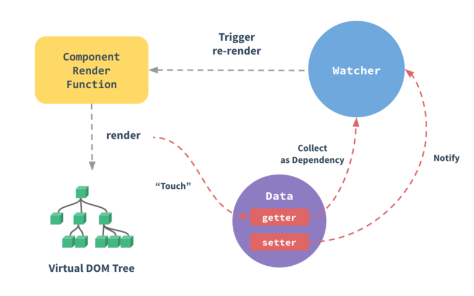
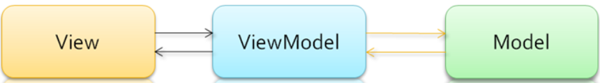

# 一、Vue 基础

## 1.Vue的基本原理

- 当一个Vue实例创建时，Vue会遍历data中的属性，用Object.defineProperty(proxy)，将他们转化为getter/setter，并且在内部追踪相关依赖，在属性被访问和修改时通知变化。
- 每个组件实例都有响应的 Watcher 程序实例，它会在组件渲染的过程中把属性记录为依赖，之后当依赖项的setter被调用时，会重新watcher重新计算，从而致使它关联的组件得以更新。

## 2.双向绑定的基本原理

## 3.使用Object.defineProperty()来进行数据处理的缺点

**无法触发：**

- 通过下标方式修改数组数据
- 给对象新增属性
- 数组的大部分操作

**vue3**

- 使用 Proxy 对对象进行代理，实现数据的劫持

## 4.MVVM

- Model:数据模型，定义数据和业务逻辑
- View: UI视图，负责数据展示
- ViewModel
  - Model 中数据改变时会触发View层的刷新
  - View 中用户操作改变的数据在Model 中同步

## 5.Computed 和 Watch 的区别？

### computed

- 支持缓存，只有依赖的数据发生了变化，才会重新计算
- 不支持异步，当Computed 中有异步操作时，无法监听数据的变化
- computed的值默认走缓存，计算属性是基于它们的响应式依赖进行缓存的，也就是基于data声明过，或者父组件传递过来的props中的数据进行计算的
- 如果一个属性是由其他属性计算而来，这个属性依赖其他的属性，一般会使用computed
- 如果computed属性的属性值是函数，那么默认使用get方法，函数的返回值就是属性的属性值，在computed中，属性由一个get方法和一个set方法，当数据发生变化时，会调用set方法

