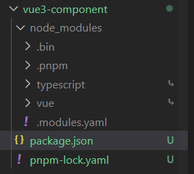
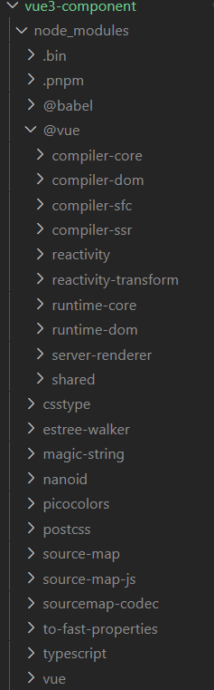
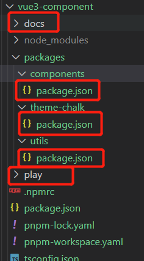
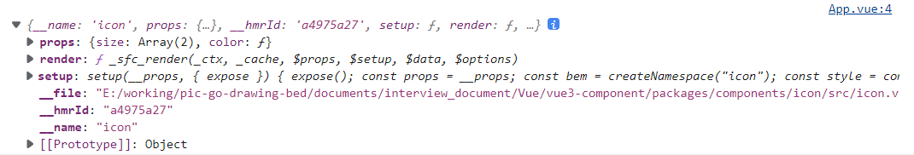
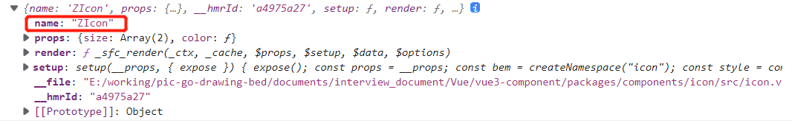
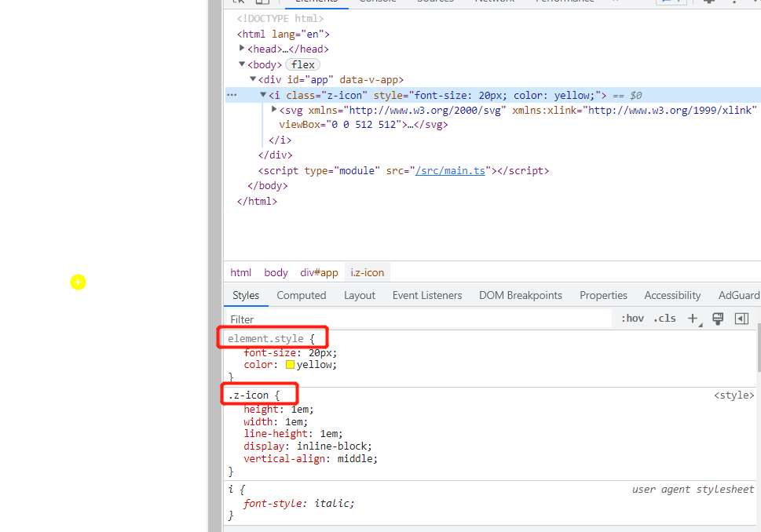

# 一、搭建monorepo环境

## 1.pnpm 与 初始化

使⽤pnpm安装包速度快，磁盘空间利⽤率⾼效，使⽤pnpm 可以快速建⽴monorepo，so ~ 这⾥我们使⽤pnpm workspace来实现monorepo

```
npm i pnpm -g // 全局安装pnpm
pnpm init // 初始化package.json配置⽂件 私有库
pnpm install vue typescript // 全局下添加依赖
```

只有package.json 中依赖声明了的vue与typescript会在node_modules的根目录下，其余的在 .pnpm目录下。



使⽤pnpm必须要建⽴.npmrc⽂件，shamefully-hoist = true，否则安装的模块⽆法放置到node_modules⽬录下

**.npmrc**

```
shamefully-hoist = true
```



**初始化typescript**

```
pnpm tsc --init
```

```
{
  "compilerOptions": {
    "module": "ESNext", // 打包模块类型ESNext
    "declaration": false, // 默认不要声明文件 
    "noImplicitAny": true, // 支持类型不标注可以默认any
    "removeComments": true, // 删除注释
    "moduleResolution": "node", // 按照node模块来解析
    "esModuleInterop": true, // 支持es6,commonjs模块
    "jsx": "preserve", // jsx 不转
    "noLib": false, // 不处理类库
    "target": "es6", // 遵循es6版本
    "sourceMap": true,
    "lib": [ // 编译时用的库
      "ESNext",
      "DOM"
    ],
    "allowSyntheticDefaultImports": true, // 允许没有导出的模块中导入
    "experimentalDecorators": true, // 装饰器语法
    "forceConsistentCasingInFileNames": true, // 强制区分大小写
    "resolveJsonModule": true, // 解析json模块
    "strict": true, // 是否启动严格模式
    "skipLibCheck": true // 跳过类库检测
  },
  "exclude": [ // 排除掉哪些类库
    "node_modules",
    "**/__tests__",
    "dist/**"
  ]
}
```

## 2.pnpm monorepo 配置

### **pnpm-workspace.yaml**

通过创建workspace 将多个项目合并要一个仓库中，每个仓库的根目录需要配置**package.json**

```
packages:
  - play # 存放我们组件测试的时候的代码
  - docs # 存放我们组件文档的
  - "packages/**"
```



- components/package.json

  ```json
  {
    "name": "@zi-shui/components",
    "version": "1.0.0",
    "description": "",
    "main": "index.js",
    "scripts": {
      "test": "echo \"Error: no test specified\" && exit 1"
    },
    "keywords": [],
    "author": "",
    "license": "ISC"
  }
  ```

- theme-chalk/package.json

  ```json
  {
    "name": "@zi-shui/theme-chalk",
    "version": "1.0.0",
    "description": "",
    "main": "index.js",
    "scripts": {
      "test": "echo \"Error: no test specified\" && exit 1"
    },
    "keywords": [],
    "author": "",
    "license": "ISC"
  }
  ```

- utils/package.json

  ```json
  {
    "name": "@zi-shui/utils",
    "version": "1.0.0",
    "description": "",
    "main": "index.js",
    "scripts": {
      "test": "echo \"Error: no test specified\" && exit 1"
    },
    "keywords": [],
    "author": "",
    "license": "ISC"
  }
  ```

### 安装到根目录

```
npm install @zi-shui/components -w
pnpm install @zi-shui/theme-chalk -w
pnpm install @zi-shui/utils -w 
```

- -w: 代表安装到工作区根目录

- vue3-component

  ```
  {
    "name": "vue3-component",
    "version": "1.0.0",
    "description": "",
    "main": "index.js",
    "scripts": {
      "test": "echo \"Error: no test specified\" && exit 1"
    },
    "keywords": [],
    "author": "",
    "license": "ISC",
    "devDependencies": {
      "typescript": "^4.8.4",
      "vue": "^3.2.41"
    },
    "dependencies": {
      "@zi-shui/components": "workspace:^1.0.0",
      "@zi-shui/theme-chalk": "workspace:^1.0.0",
      "@zi-shui/utils": "workspace:^1.0.0"
    }
  }
  ```

  依赖中成功引入了进来

### 总结

- vue3-componet 下管理了三个项目
  - docs
  - play
  - packages
- packages 下管理了三个项目
  - components
  - theme-chalk
  - utils

# 二、实现组件play环境

- vue3-component

  ```
  pnpm create vite play --template vue-ts
  ```

- vue3-component/play/vite-env.d.ts

  ```
  /// <reference types="vite/client" />
  
  declare module '*.vue' {
    import type { DefineComponent } from 'vue'
    const component: DefineComponent<{}, {}, any>
    export default component
  }
  ```

  - /// + reference 引入外部依赖的声明
  - .vue 文件智能提示

- vue3-component/typings/vue-shim.d.ts

  ```
  declare module '*.vue' {
    import type { DefineComponent } from 'vue'
    const component: DefineComponent<{}, {}, any>
    export default component
  }
  ```

- vue3-component/package.json

  ```
  "scripts": {
    "dev": "pnpm -C play dev"
  }
  ```

  - 运行 play 目录下的  dev 脚本

# 三、通过JS实现BEM规范

## 什么是BEM规范

即Block(块) Element(元素) Modifier(修饰器)，用来规范css命名

命名约定模式如下：

```
.block{}
.block__element{}
.block__element--modifier{}
```

对于块，若多个单词，则用 - 连接，如search-form

具体例子：

- 块即模块，如搜索表单 search-form,可以看做一个块
- 这个块内的按钮button、输入框input，为元素
- 元素可以由多种状态，如居中按钮，即修饰

```
<form class="search-form">
	<input class="search-form__input" />
	<button class="search-form__button"></button>
	<button class="search-form__button__primary"></button>
</form>
```

## css样式顺序

1. 定位属性：positon display float left top right bottom overflow clear z-index
2. 自身属性：width height margin padding border background
3. 文字样式：font-family font-size font-style font-weight font-varient
4. 文本属性：text-align vertical-align text-wrap text-transform text-indent text-decoration letter-spacing word-spacing white-space text-overflow
5. css3中新增属性：content box-shadow border-radius transform

## BEM

- vue3-component/packages/utils/create.ts

```
// block 代码块   element 元素   modifier 装饰  state 状态
// z-button
// z-button__element
// z-button__element--disabled
// is-checked is-enabeld

// :class=[bem.b()]

// 前缀名字   z-button-box__element--modifier
function _bem(
    prefixName: string,
    blockSuffix: string,
    element: string,
    modifier: string
) {
    if (blockSuffix) {
        prefixName += `-${blockSuffix}`;
    }
    if (element) {
        prefixName += `__${element}`;
    }
    if (modifier) {
        prefixName += `--${modifier}`;
    }
    return prefixName;
}

function createBEM(prefixName: string) {
    const b = (blockSuffix: string = "") => _bem(prefixName, blockSuffix, "", "");
    const e = (element: string = "") =>
        element ? _bem(prefixName, "", element, "") : "";
    const m = (modifier: string = "") =>
        modifier ? _bem(prefixName, "", "", modifier) : "";

    const be = (blockSuffix: string = "", element: string = "") =>
        blockSuffix && element ? _bem(prefixName, blockSuffix, element, "") : "";
    const bm = (blockSuffix: string = "", modifier: string = "") =>
        blockSuffix && modifier ? _bem(prefixName, blockSuffix, "", modifier) : "";
    const em = (element: string = "", modifier: string = "") =>
        element && modifier ? _bem(prefixName, "", element, modifier) : "";
    const bem = (
        blockSuffix: string = "",
        element: string = "",
        modifier: string = ""
    ) =>
        blockSuffix && element && modifier
            ? _bem(prefixName, blockSuffix, element, modifier)
            : "";

    const is = (name: string, state: string | boolean) => (state ? `is-${name}` : "");
    return {
        b,
        e,
        m,
        be,
        bm,
        em,
        bem,
        is
    };
}

export function createNamespace(name: string) {
    const prefixName = `z-${name}`;
    return createBEM(prefixName);
}

/* const bem = createNamespace("icon");
console.log(bem.b("box"));
console.log(bem.e('element'));
console.log(bem.m('modifier'));
console.log(bem.bem('box', 'element', 'modifier'));
console.log(bem.is('checked', true));
console.log(bem.be('box', 'element'));
console.log(bem.bm('box', 'modifier'));
console.log(bem.em('element', 'modifier')); */
```

# 四、实现icon组件

## 初步实现

- packages/components/icon/src/icon.ts

  ```
  // 这里面准备组件相关的属性 和 ts的类型
  
  import {ExtractPropTypes, PropType} from 'vue'
  
  export const iconProps = {
      color:String,
      size: [Number, String] as PropType<number | string>
  } as const;
  
  export type IconProps = ExtractPropTypes<typeof iconProps>;
  ```

- packages/components/icon/src/icon.vue

  ```
  <template>
      <i :class="bem.b()" :style="style">
          <slot></slot>
      </i>
  </template>
  
  <script setup lang="ts">
  import { computed } from '@vue/reactivity';
  import { createNamespace } from '@zi-shui/utils/create'
  import { iconProps } from './icon';
  
  const bem = createNamespace('icon')
  //  使用defineProps获取 props
  const props = defineProps(iconProps)
  
  // 计算属性 来计算一个样式处理
  const style = computed(() => {
      if (!props.size && !props.color) return {}
      return {
          ...(props.size ? { "font-size": props.size + "px" } : {}),
          ...(props.color ? { "color": props.color } : {})
      }
  })
  
  </script>
  ```

## 初步使用

- packages/play/src/App.vue

  ```
  <script setup lang="ts">
  import Icon from '@zi-shui/components/icon/src/icon.vue'
  
  console.log(Icon)
  </script>
  
  <template>
      <Icon :size="12" color="red"></Icon>
  </template>
  
  <style scoped>
  </style>
  ```



**缺点：**

- 这里是引入文件，如果需要全部注册呢？
- 通过打印发现，由于在组件里setup语法糖的形式，没有组件名称

## 生成组件名称

1. 非插件方式（packages/components/icon/src/icon.vue）

   ```
   ...
   <script lang="ts">
   export default {
       name: 'ZIcon'
   }
   </script>
   ...
   ```

   

2. 插件方式

   ```
   pnpm install unplugin-vue-define-options -D -w
   ```

   - 开发依赖
   
   - -w: 整个工作区都可以用
   
   - 通过这个插件，可以在<script setup> 中使用 Options API，尤其能够在一个函数中设置 `name`、`props`、`emit` 和 `render` 属性
   
   - https://github.com/sxzz/unplugin-vue-macros/blob/HEAD/packages/define-options/README-zh-CN.md
   
   - vite.config.ts
   
     ```
     import { defineConfig } from 'vite'
     import vue from '@vitejs/plugin-vue'
     import DefineOptions from 'unplugin-vue-define-options/vite'
     
     // https://vitejs.dev/config/
     export default defineConfig({
       plugins: [vue(), DefineOptions()]
     })
     ```
   
   - packages/components/icon/src/icon.vue
   
     ```
     ...
     // 定义组件名称
     defineOptions({
         name: 'z-icon'
     })
     ...
     ```
   
   - packages/utils/with-install.ts
   
     ```
     import { Plugin } from 'vue'
     export type SFCWithInstall<T> = T & Plugin;
     export function withInstall<T>(comp: T) {
         (comp as SFCWithInstall<T>).install = function (app) {
             const { name } = comp as unknown as { name: string }
             app.component(name, comp); // 将组件注册成全局的组件
         }
         return comp as SFCWithInstall<T>
     }
     ```

     - 导出一个 widthInstall
     - widthInstall 里有一个 install 方法（配合 Plugin use 的时候执行），在这个方法里进行组件的全局注册
   
   - packages/components/icon/index.ts
   
     ```
     // 用来整合组件的 最终实现导出组件
     
     import _Icon from "./src/icon.vue";
     import { withInstall } from "@zi-shui/utils/with-install"
     
     const Icon = withInstall(_Icon);
     
     export default Icon; // 可以通过app.use来使用 也可以通过 import方式单独使用
     
     export * from "./src/icon";
     
     
     // 这里添加的类型 可以再模版中被解析
     declare module 'vue'{
         export interface GlobalComponents { // 我们的接口可以自动合并
             ZIcon:typeof Icon
         }
     }
     ```

     - 导入 icon.vue, 通过 withInstall给 icon 组件添加 install 方法，配合 Plugin.use() 使用
     - 配合volar声明以给组件类型标注
   
   - packages/play/src/main.ts
   
     ```
     import { createApp } from 'vue'
     import './style.css'
     import App from './App.vue'
     import Icon from '@zi-shui/components/icon'
     
     const plugins = [
         Icon
     ]
     const app = createApp(App)
     plugins.forEach(plugin => app.use(plugin)) // 将组件注册成了全局组件，可以直接使用了
     
     app.mount('#app')
     ```
   
     - 引入 Icon，此时的 Icon 有 install 方法
     - 将组件注册成全局组件 

## svg 图标

https://github.com/07akioni/xicons/blob/main/README.zh-CN.md

- 安装@vicons/ionicons5

  ```
  pnpm i @vicons/ionicons5   
  ```

- play/src/App.vue

  ```
  <script setup lang="ts">
  import {  AddCircle } from '@vicons/ionicons5'
  </script>
  
  <template>
      <z-icon :color="'yellow'" :size="20">
          <AddCircle></AddCircle>
      </z-icon>
  </template>
  
  <style scoped>
  </style>
  ```

## scss 编写

### 结构目录

```
theme-chalk
│ └─src
│ └─mixins
│ └─config.scss # BEM规范命名
```

### sass 配置

#### **mixins/config.scss**

```
// 变量声明
$namespace: 'z';
$element-separator: '__';
$modifier-separator:'--';
$state-prefix:'is-';
```

#### **mixins/mixins.scss**

```
@use 'config'as *;
@forward 'config';

// .z-button{}
@mixin b($block) {
    $B: $namespace+'-'+$block;

    .#{$B} {
        @content;
    }
}

// .z-button.is-xxx
@mixin when($state) {
    @at-root {
        &.#{$state-prefix + $state} {
            @content;
        }
    }
}

// &--primary => .z-button--primary
@mixin m($modifier) {
    @at-root {
        #{&+$modifier-separator+$modifier} {
            @content;
        }
    }
}

// &__header => .z-button__header
@mixin e($element) {
    @at-root {
        #{&+$element-separator+$element} {
            @content;
        }
    }
}
```

- @use
  - scss真正意义上的模块化，可以从其它 scss样式表中加载mixin、function和变量
- @forward：引入另一个模块的所有变量、`mixins`和函数，将它们直接作为当前模块的`API`暴露出去，不会真的在当前模块增加代码
- @mixin:定义可重复使用的样式
- @include: 引用定义的mixin

#### **src/icon.scss**

```
@use 'mixins/mixins'as *;

@include b('icon') {
    height: 1em;
    width: 1em;
    line-height: 1em;
    display: inline-block;
    vertical-align: middle;

    svg {
        height: 1em;
        width: 1em;
    }
}
```

#### **src/index.scss**

```
@use './icon.scss'
```

### 引用样式

```
pnpm install sass -D -w
```

- play/src/main.ts

  ```
  ...
  import '@zi-shui/theme-chalk/src/index.scss'
  ...
  ```



# 五、eslint和prettier的配置

## 基本操作

```
npx eslint --init
```

**检查语法并提示错误行数**

```
? How would you like to use ESLint? ...
 To check syntax only
> To check syntax and find problems
 To check syntax, find problems, and enforce
code style
```

**才有js-module**

```
? What type of modules does your project use?
...
> JavaScript modules (import/export)
 CommonJS (require/exports)
 None of these
```

**项目采用vue项目**

```
? Which framework does your project use? ...
 React
> Vue.js
 None of these
```

**使用TypeScript**

```
Does your project use TypeScript?  Yes
```

**平台**

```
Where does your code run？ browser, node
```

**配置文件**

```
What format do you want your config file to be in? · JavaScript
```

**安装相关依赖**（no）

```
The config that you've selected requires the following dependencies:

eslint-plugin-vue@latest @typescript-eslint/eslint-plugin@latest @typescript-eslint/parser@latest eslint@latest
√ Would you like to install them now? · No / Yes
```

这里默认会yes，但是希望使用pnpm安装，则收到安装依赖

**手动安装插件**

```
pnpm i eslint-plugin-vue@latest @typescript-eslint/eslint-plugin@latest @typescript-eslint/parser@latest eslint@latest -D -w
```

**生成的.eslintrc.js**

```
module.exports = {
    "env": {
        "browser": true,
        "es2021": true,
        "node": true
    },
    "extends": [
        "eslint:recommended",
        "plugin:vue/vue3-essential",
        "plugin:@typescript-eslint/recommended"
    ],
    "overrides": [
    ],
    "parser": "@typescript-eslint/parser",
    "parserOptions": {
        "ecmaVersion": "latest",
        "sourceType": "module"
    },
    "plugins": [
        "vue",
        "@typescript-eslint"
    ],
    "rules": {
    }
}
```

```
"extends": [
    "eslint:recommended",
    "plugin:vue/vue3-essential",
    "plugin:@typescript-eslint/recommended"
]
```

- eslint:recommended ：eslint 推荐规范

- vue2/vue3 语法规范 (https://eslint.vuejs.org/user-guide/#installation)

- "plugin:@typescript-eslint/recommended" : 校验.vue文件ts语法

  ```
  pnpm i @vue/eslint-config-typescript -D -w
  ```

**.eslintrc.js**

```
module.exports = {
    "env": {
        "browser": true,
        "es2021": true,
        "node": true
    },
    "extends": [
        "eslint:recommended",
        "plugin:vue/vue3-essential",
        "plugin:@typescript-eslint/recommended"
    ],
    "overrides": [
    ],
    "parser": "@typescript-eslint/parser",
    "parserOptions": {
        "ecmaVersion": "latest",
        "sourceType": "module"
    },
    "plugins": [
        "vue",
        "@typescript-eslint"
    ],
    "rules": {
    },
    "globals": {
        defineOptions: "readOnly"
    }
}
```

## .eslintignore 配置

```
node_modules
dist
*.css
*.jpg
*.jpeg
*.png
*.gif
*.d.ts
```

**最终安装vscode 中eslint 插件：eslint只是检测代码规范**

## Prettier 配置

**.prettierrc.js**

```
module.exports = {
    singleQuote: true, //使⽤单引号
    semi: false, // 使⽤分号
    trailingComma: "none", // 末尾逗号
    arrowParens: "avoid", // 箭头函数括号
    endOfLine: "auto" // 结尾换⾏⾃动
}
```

**.prettierignore**

```
node_modules
dist
```

**最终安装vscode 中 Prettier插件：prettier 只是用来格式化代码**

**这⾥需要配置Format On Save 为启⽤，保存时⾃动格式 化 Default Formatter选择Prettier - Code formatter**

## 编辑器配置

**.editorconfig**

```
root = true
[*]
charset = utf-8
indent_style = space
indent_size = 2
end_of_line = lf
```

**最终安装vscode中EditorConfig for VS Code插件**

# 六、Vitepress 编写组件文档

## 安装依赖

```
pnpm init
pnpm install vitepress -D # 在doc⽬录下安装
```

## 运行

- docs/package.json

```
...
"dev": "vitepress dev ."
...
```

- vue3-component/package.json

  ```
  "docs:dev": "pnpm -C docs dev"
  ```

## 首页

- docs/index.md

  ```
  ---
  layout: home
  
  hero:
    name: z-ui 组件库
    text: 基于 Vue 3 的组件库.
    tagline: 掌握 vue3 组件编写
    actions:
      - theme: brand
        text: 快速开始
        link: /guide/quieStart
  
  features:
    - icon: 🛠️
      title: 组件库构建流程
      details: Vue3 组件库构建...
    - icon: ⚙️
      title: 组件库单元测试
      details: Vue3 组件库测试...
  ---
  ```

## 文档配置文件

- vitepress/config.js

```
module.exports = {
  title: 'Z-UI',
  description: 'zi-shui UI',
  themeConfig: {
    lastUpdated: '最后更新时间',
    docsDir: 'docs',
    editLinks: true,
    editLinkText: '编辑此网站',
    repo: 'https://gitee.com/login',
    footer: {
      message: 'Released under the MIT License.',
      copyright: 'Copyright © 2022-present Zi Shui'
    },
    nav: [
      { text: '指南', link: '/guide/installation', activeMatch: '/guide/' },
      { text: '组件', link: '/component/icon', activeMatch: '/component/' }
    ],
    sidebar: {
      '/guide/': [
        {
          text: '指南',
          items: [
            { text: '安装', link: '/guide/installation' },
            { text: '快速开始', link: '/guide/quieStart' }
          ]
        }
      ],
      '/component/': [
        {
          text: '基础组件',
          items: [{ text: 'Icon', link: '/component/icon' }]
        }
      ]
    }
  }
}
```

## 主题配置

- .vitepress/theme/index.ts

  ```
  import DefaultTheme from 'vitepress/theme'
  
  import ZIcon from '@zi-shui/components/icon'
  import '@zi-shui/theme-chalk/src/index.scss'
  
  console.log(ZIcon)
  export default {
    ...DefaultTheme,
    enhanceApp({ app }) {
      app.use(ZIcon) // 在vitepress中 注册全局组件
    }
  }
  ```

- component/icon.md

  ````
  # Icon 图标
  
  z-ui 推荐使用 xicons 作为图标库。
  
  ```
  $ pnpm install @vicons/ionicons5
  ```
  
  ## 使用图标
  
  - 如果你想像用例一样直接使用，你需要全局注册组件，才能够直接在项目里使用。
  
  <script setup lang="ts">
  import { CashOutline } from '@vicons/ionicons5'
  </script>
  <z-icon color="red" size="40">
    <CashOutline/>
  </z-icon>
  
  <z-icon color="green" size="40">
    <CashOutline/>
  </z-icon>
  <z-icon color="blue" size="40">
    <CashOutline/>
  </z-icon>
  <div>
  
  <z-icon color="red" size="60">
    <CashOutline/>
  </z-icon>
  
  <z-icon color="green" size="60">
    <CashOutline/>
  </z-icon>
  
  <z-icon color="blue" size="60">
    <CashOutline/>
  </z-icon>
  </div>
  
  ```vue
  <script setup lang="ts">
  import { CashOutline } from '@vicons/ionicons5'
  </script>
  <template>
    <z-icon color="red" size="40">
      <CashOutline />
    </z-icon>
  </template>
  ```
  
  ## API
  
  ### Icon Props
  
  | 名称  | 类型             | 默认值    | 说明     |
  | ----- | ---------------- | --------- | -------- |
  | color | string           | undefined | 图标颜色 |
  | size  | number \| string | undefined | 图片大小 |
  
  ````

- vite.config.ts

  ```
  import { defineConfig } from 'vite'
  import DefineOptions from 'unplugin-vue-define-options/vite'
  
  // https://vitejs.dev/config/
  export default defineConfig({
    plugins: [DefineOptions()]
  })
  ```

  **已经内置了此配置文件，但是我们的组件由于没有定义名称，这里引用插件完成**

- guide/installation.md

- guide/quieStart.md

# 七、虚拟列表组件

## props

```
import { ExtractPropTypes } from "vue"

export const virtualProps = {
  size: {
    type: Number,
    default: 35
  },
  remain: {
    default: 8,
    type: Number
  },
  items: {
    type: Array,
    default: () => []
  }
} as const

export type VirtualProps = ExtractPropTypes<typeof virtualProps>
```

## virtual.tsx

```
import { computed, defineComponent, onMounted, ref, watch } from 'vue'
import {virtualProps} from './virtualProps'
import { createNamespace } from '@zi-shui/utils/create'
import { reactive } from 'vue'

export default defineComponent({
  name: 'ZVirtualList',
  props: virtualProps,
  setup(props, { slots}) {
    const bem = createNamespace('vl')

    const wrapperRef = ref<HTMLElement>()
    const barRef = ref<HTMLElement>()

    // 计算显示的区域
    const state = reactive({
      start: 0,
      end: props.remain
    })
    // 偏移量：滚动过去了多少个
    const offset = ref(0)

    const prev = computed(() => {
      return Math.min(state.start, props.remain)
    })
    const next = computed(() => {
      return Math.min(props.remain, props.items.length - state.end)
    })

    // 这里应该多展示上八条和下八条(两屏)，保证快速滚动不会白屏
    const visibleData = computed(() => {
      return props.items.slice(state.start - prev.value, state.end + next.value)
    })

    // 监听滚动
    const handleScroll = () => {
      // 根据当前滚动的距离来算过去了几个数据
      const scrollTop = wrapperRef.value!.scrollTop
      // 滚动后的开始位置
      state.start = Math.floor(scrollTop / props.size)
      // 滚动后的结束位置
      state.end = state.start + props.remain
      // 滚动过去了多少个（- props.size * prev.value）：减去前面补的 
      offset.value = state.start * props.size - props.size * prev.value
    }

    const initWrapper = () => {
      wrapperRef.value!.style.height = `${props.remain * props.size}px`
      barRef.value!.style.height = `${props.items.length * props.size}px`
    }

    watch(() => props.items,
    () => {
      initWrapper  
    })

    onMounted(() => {
      initWrapper()
    })

    return () => {
      return (
      <div class={bem.b()} ref={wrapperRef} onScroll={handleScroll}>
        {/* 模拟总长度，感觉有很多数据 */}
        <div class={bem.e('scroll-bar')} ref={barRef}></div>
        <div 
          class={bem.e('scroll-list')} 
          style={ { transform: `translate3d(0, ${offset.value}px, 0)`} 
        }>
          {visibleData.value.map((node, idx) => slots.default!({ node }))}
        </div>
      </div>)
    }
  }
})
```

- onMounted =》 initWrapper
  - 外层的wrapperRef的高度 = 显示个数 * 高度
  - 里面的scroll-bar高度 = 数据个数 * 高度
- watch => props.item => initWrapper
- 滚动 =》 handleScroll

## 样式

```
@use 'mixins/mixins'as *;

@include b(vl) {
  overflow-y: scroll;
  position: relative;
  border: 2px solid red;

  @include e(scroll-list) {
    position: absolute;
    top: 0;
    left: 0;
    width: 100%;
  }
}
```

# 八、checkbox 组件

## props

```
import { ExtractPropTypes, PropType } from 'vue'

export const checkboxProps = {
  modelValue: {
    type: [Boolean, String, Number] as PropType<boolean | string | number>
  },
  indeterminate: Boolean,
  disabled: Boolean,
  label: {
    type: String as PropType<string>
  }
} as const

export type CheckboxProps = Partial<ExtractPropTypes<typeof checkboxProps>>

export const checkboxEmits = {
  'update:modelValue': (value: boolean | string | number) =>
    typeof value === 'boolean',
  change: (value: boolean) => typeof value === 'boolean'
}

export type CheckboxEmits = typeof checkboxEmits

```

## checkbox.vue

```
<template>
  <label :class="bem.b()">
    <span :class="bem.e('input')">
      <input
        ref="inputRef"
        v-model="model"
        type="checkbox"
        :disabled="disabled"
        :value="label"
        @change="handleChange"
      />
    </span>

    <span v-if="$slots.default || label" :class="bem.e('label')">
      <slot></slot>
      <template v-if="!$slots.default">{{ label }}</template>
    </span>
  </label>
</template>

<script lang="ts" setup>
import { computed } from '@vue/reactivity'
import { createNamespace } from '@zi-shui/utils/create'
import { onMounted, watch, ref } from 'vue'
import { checkboxEmits, checkboxProps } from './checkbox'
const bem = createNamespace('checkbox')
const props = defineProps(checkboxProps)
const emit = defineEmits(checkboxEmits)

defineOptions({
  name: 'z-checkbox'
})
const model = computed<any>({
  get() {
    return props.modelValue
  },
  set(val) {
    return emit('update:modelValue', val)
  }
})
const inputRef = ref<HTMLInputElement>()

function indeterminate(val: boolean) {
  inputRef.value!.indeterminate = val
}
function handleChange(e: Event) {
  const target = e.target as HTMLInputElement
  const value = target.checked ? true : false
  emit('change', value)
}

watch(() => props.indeterminate, indeterminate)

onMounted(() => {
  indeterminate(props.indeterminate)
})
</script>

```

- 通过computed 得到一个根据传入的v-model的值，由于单向数据流的缘故，所以set的时候直接emit的是改变v-model的方法
- handleChange =》 emit('change', value)

# 九、树组件

## props

```
import { InjectionKey } from 'vue'
import { SetupContext } from 'vue'
import {ExtractPropTypes, PropType} from 'vue'

export type Key = string | number
```

```
export interface TreeNode extends Required<TreeOption> {
  level: number,
  rawNode: TreeOption,
  children: TreeNode[],
  isLeaf: boolean,
  parentKey?: Key 
}

export interface TreeOption {
  isLeaf?: boolean
  label?: Key
  key?: Key
  children?: TreeOption[],
  disabled?: boolean
  [key: string]: unknown // 任意属性值
}
```

```
export const treeProps = {
  data: {
    type: Array as PropType<TreeOption[]>,
    default: () => []
  },
  defaultExpandedKeys: {
    type: Array as PropType<Key[]>,
    default: () => []
  },
  labelField: {
    type: String,
    default: 'label'
  },
  keyField: {
    type: String,
    default: 'key'
  },
  childrenField: {
    type: String,
    default: 'children'
  },
  onLoad: Function as PropType<(node: TreeOption) => Promise<TreeOption[]>>,
  // 选中节点
  selectedKeys: {
    type: Array as PropType<Key[]>
  },
  selectable: {
    type: Boolean,
    default: false
  },
  multiple: {
    type: Boolean,
    default: false
  },
  defaultCheckedKeys: {
    type: Array as PropType<Key[]>,
    default: () => []
  },
  showCheckbox: {
    type: Boolean,
    default: false
  }
} as const // as const 把 props 转为readOnly
```

- onLoad: Function as PropType<(node: TreeOption) => Promise<TreeOption[]>>
  - Promise里的泛型TreeOption[]是resolve返回的类型

```
export const treeNodeEmitts = {
  toggle: (node: TreeNode) => node,
  select: (node: TreeNode) => node,
  check: (node: TreeNode,val: boolean) => typeof val === 'boolean'
}

export const treeEmitts = {
  // 内部发射的事件，用来同步响应式数据
  'update:selectedKeys': (keys: Key[]) =>  keys
}
```

- 用于定义 emitts

  `const emit = defineEmits(treeNodeEmitts)`

  `const emit = defineEmits(treeEmitts)`

```
export interface TreeContext {
  slots: SetupContext['slots'],
  // emit: SetupContext<typeof treeEmitts>['emit']
}

// 此变量作为提供出去的属性
export const treeInjectKey: InjectionKey<TreeContext> = Symbol()
```

- SetupContext

  ```
  export declare interface SetupContext<E = EmitsOptions> {
      attrs: Data;
      slots: Slots;
      emit: EmitFn<E>;
      expose: (exposed?: Record<string, any>) => void;
  }
  ```

- 这里定义了一个context，其slots的类型是SetupContext[slots]

- treeInjectKey 的类型是 InjectionKey，作为注入的key

  ```
  // tree.vue
  provide(treeInjectKey, {
    slots: useSlots()
  })
  // InjectionKey
  export declare interface InjectionKey<T> extends Symbol {
  }
  ```

- useSlots：获取一个插槽对象，对象的key是插槽名称

- inject

  ```
  const treeContext = inject(treeInjectKey)
  ```

```
export const treeNodeContentProps = {
  node: {
    type: Object as PropType<TreeNode>,
    required: true
  }
}
```

## tree.vue

```
<template>
  <div :class="bem.b()">
    <z-virtual-list 
      :items="flattenTree"
      :remain="8"
      :size="35"
    >
      <template #default="{ node }">
        <z-tree-node
          :key="node.key"
          :node="node"
          :expanded="isExpanded(node)"
          :loadingKeys="loadingKeysRef"
          @toggle="toggleExpand"
          @select="handleSelect"
          :selectedKeys="selectKeysRef"
          :show-checkbox="showCheckbox"
          :checked="isChecked(node)"
          :disabled="isDisable(node)"
          :indeterminate="isIndeterminate(node)"
          @check="toggleCheck"
        >
        </z-tree-node>
      </template>
    </z-virtual-list>
  </div>
</template>
```

```
<script setup lang="ts">
	...
</script>
```

```
// component name
defineOptions({
  name: 'z-tree'
})
```

```
// 定义 emitts
const emit = defineEmits(treeEmitts)
```

```
const props = defineProps(treeProps)
```

```
const createOptions = (key: string, label: string, children: string) => {
  return {
    getKey(node: TreeOption) {
      return node[key] as string | number
    },
    getLabel(node: TreeOption) {
      return node[label] as string
    },
    getChildren(node: TreeOption) {
      return node[children] as TreeOption[]
    }
  }
}
const treeOptions = createOptions(
  props.keyField,
  props.labelField,
  props.childrenField
)
```

- 获取用户自定义的key、label、children字段

```
const tree = ref<TreeNode[]>([])

// 数据格式化
const createTree = (data: TreeOption[], parent: TreeNode | null = null): any => {
  const traversal = (data: TreeOption[], parent: TreeNode | null = null) => {
    return data.map(node => {
      const children = treeOptions.getChildren(node) || []
      const treeNode: TreeNode = {
        key: treeOptions.getKey(node),
        label: treeOptions.getLabel(node),
        children: [], // 默认为空，有children再去递归
        rawNode: node,
        level: parent ? parent.level + 1 : 0,
        disabled: !!node.disabled,
        // 判断节点是否自带了isLeaf, 如果自带了以自带的为准，如果没有自带的则根据有没有 children
        // children
        isLeaf: node.isLeaf ?? children.length === 0,
        parentKey: parent?.key
      }
      if (children.length > 0) {
        // 有 children再去递归 将其格式化为treeNode 类型
        treeNode.children = traversal(children, treeNode)
      }
      return treeNode
    })
  }
  const result: TreeNode[] = traversal(data, parent)
  return result
}

// 监控数据变化，调用格式化方法，一上来就调用
watch(
  () => props.data,
  (data: TreeOption[]) => {
    tree.value = createTree(data)
  },
  {
    immediate: true
  }
)
```

- 上面代码对数据进行了格式化

```
// 希望将一颗树拍平， 点击还能实现展开操作
// 需要展开的key有哪些 [40, 41]
const expandedKeysSet = ref(new Set(props.defaultExpandedKeys))
const flattenTree = computed(() => {
  // 需要展开的keys
  let expandedKeys = expandedKeysSet.value

  // 扁平后的节点
  let flattenNodes: TreeNode[] = []
  // 被格式化后的节点
  const nodes = tree.value || []
  // 用于遍历树的栈 [41, 40]
  const stack: TreeNode[] = []
  for (let i = nodes.length - 1; i >= 0; --i) {
    stack.push(nodes[i])
  }
  // 深度遍历
  while (stack.length) {
    const node = stack.pop()
    if (!node) continue
    flattenNodes.push(node)
    if (expandedKeys.has(node.key)) {
      // 如果有
      const children = node.children
      if (children) {
        for (let i = node.children.length - 1; i >= 0; --i) {
          stack.push(node.children[i])
        }
      }
    }
  }
  return flattenNodes
})
```

- 上面代码通过computed，根据expandedKeysSet里面的内容，返回匹配上的数据，这些数据展示出来就是展开的了

```
// 是否是展开的
const isExpanded = (node: TreeNode): boolean => {
  return expandedKeysSet.value.has(node.key)
}
// 折叠功能
const collpase = (node: TreeNode) => {
  expandedKeysSet.value.delete(node.key)
}
// loading 的keys
const loadingKeysRef = ref(new Set<Key>())
// 触发加载
const triggerLoading = async (node: TreeNode) => {
  // 需要异步加载的判断
  if (!node.children.length && !node.isLeaf) {
    const loadingKeys = loadingKeysRef.value
    if (!loadingKeys.has(node.key)) {
      loadingKeys.add(node.key)
      const onLoad = props.onLoad
      if (onLoad) {
        try {
          const children = await onLoad(node.rawNode)
          // 修改原来的节点
          node.rawNode.children = children
          // 更新自定义的node，下次点击就不用重写加载了
          node.children = createTree(children, node)
          loadingKeys.delete(node.key)
        } catch (error) {
          console.error(error)
        }
      }
    }
  }
}
// 展开功能
const expand = (node: TreeNode) => {
  expandedKeysSet.value.add(node.key)
  // 这里应该实现对应的加载逻辑
  triggerLoading(node)
}
// 切换展开
const toggleExpand = (node: TreeNode) => {
  const expandedKeys = expandedKeysSet.value
  // 如果节点正在加载中，不能收起
  if (expandedKeys.has(node.key) && !loadingKeysRef.value.has(node.key)) {
    collpase(node)
  } else {
    expand(node)
  }
}
```

- 这里实现了代码的折叠与展开功能

```
// 选中节点
const selectKeysRef = ref<Key[]>([])
watch(
  () => props.selectedKeys,
  value => {
    if (value) {
      selectKeysRef.value = value
    }
  },
  {
    immediate: true
  }
)

const handleSelect = (node: TreeNode) => {
  // selectKeysRef 是proxy的，可以使用Array.from 得到数组类型的
  let keys = Array.from(selectKeysRef.value)

  if (!props.selectable) return

  if (props.multiple) {
    let index = keys.findIndex(key => key === node.key)
    if (index > -1) {
      // 已选中移除
      keys.splice(index, 1)
    } else {
      // 未选中
      keys.push(node.key)
    }
  } else {
    if (keys.includes(node.key)) {
      // 已选中移除
      keys = []
    } else {
      // 未选中
      keys = [node.key]
    }
  }
  emit('update:selectedKeys', keys)
}

provide(treeInjectKey, {
  slots: useSlots()
})

// checkbox 选中的数据
const checkedKeysRefs = ref(new Set(props.defaultCheckedKeys))
// 是否选中
const isChecked = (node: TreeNode) => {
  return checkedKeysRefs.value.has(node.key)
}
// 是否禁用
const isDisable =(node: TreeNode) => {
  return !!node.disabled
}
const indeterminateRefs = ref<Set<Key>>(new Set())
// 是否半选
const isIndeterminate = (node: TreeNode) => {
  return indeterminateRefs.value.has(node.key)
}

// 切换选中
const toggleCheck = (node: TreeNode, checked: Boolean) => {
  toggle(node, checked)
  updateCheckedKeys(node)
}
// 自上而下的选中
const toggle = (node: TreeNode, checked: Boolean) => {
  if (!node) return
  const checkedKeys = checkedKeysRefs.value
  // 选中的时候 去掉半选
  if (checked) {
    indeterminateRefs.value.delete(node.key)
  }
  // 维护当前的 key 列表
  checkedKeys[checked ? 'add' : 'delete'](node.key)
  // 子节点选中
  const children = node.children
  if (children) {
    children.forEach(childNode => {
      if (!childNode.disabled) {
        toggle(childNode, checked)
      }
    })
  }
}
// 找对应的节点
const findNode = (key: Key) => {
  return flattenTree.value.find(node => node.key === key)
}
// 自下而上的更新
const updateCheckedKeys = (node: TreeNode) => {
  // 自下而上的更新
  if (node.parentKey) {
    const parentNode = findNode(node.parentKey)

    if (parentNode) {
      let allChecked = true //默认儿子应该全选
      let hasChecked = false // 儿子有没有被选中

      const nodes = parentNode.children
      for (const node of nodes) {
        if (checkedKeysRefs.value.has(node.key)) {
          hasChecked = true // 子节点被选中了
        } else if (indeterminateRefs.value.has(node.key)) {
          allChecked = false
          hasChecked = true
        } else {
          allChecked = false
        }
      }
      if (allChecked) {
        checkedKeysRefs.value.add(parentNode.key)
        indeterminateRefs.value.delete(parentNode.key)
      } else if (hasChecked) {
        checkedKeysRefs.value.delete(parentNode.key)
        indeterminateRefs.value.add(parentNode.key)
      }
      updateCheckedKeys(parentNode)
    }
  }
}

// 挂载的时候
onMounted(() => {
  checkedKeysRefs.value.forEach((key: Key) => {
    toggle(findNode(key)!, true)
  })
})
```

- 这里的是节点选中功能

## treeNode.vue

```
<template>
  <div :class="[
    bem.b(),
    bem.is('selected', isSelected),
    bem.is('disabled', node.disabled)
  ]">
    <div :class="bem.e('content')" :style="{ paddingLeft: `${node.level * 16}px` }">
      <span :class="[
        bem.e('expand-icon'),
        { expanded: expanded && !node.isLeaf },
        bem.is('leaf', node.isLeaf)
      ]" @click="handleExpand">
        <z-icon size="25">
          <Switcher v-if="!isLoading"></Switcher>
          <Loading v-else></Loading>
        </z-icon>
      </span>
      <z-checkbox 
        v-if="showCheckbox"
        :model-value="checked"
        :disabled="disabled"
        :indeterminate="indeterminate"
        @change="handleCheckChange"
      >
      </z-checkbox>
      <span @click="handleSelected" :class="bem.e('label')">
        <ZTreeNodeContent :node="node"></ZTreeNodeContent>
        <!-- {{ node?.label }}{{ treeContext?.slots.default!({ node }) }} -->
      </span>
    </div>
  </div>
</template>

<script lang="ts" setup>
import ZIcon from '@zi-shui/components/icon'
import Switcher from '@zi-shui/components/internal-icon/Switcher';
import Loading from '@zi-shui/components/internal-icon/Loading'
import ZCheckbox from '@zi-shui/components/checkbox';
import ZTreeNodeContent from './tree-node-content'
import { createNamespace } from '@zi-shui/utils/create';
import { treeInjectKey, treeNodeEmitts, treeNodeProps } from './tree';
import { computed } from 'vue';
import { inject } from 'vue';

// 定义 props
const props = defineProps(treeNodeProps)

// 定义 emitts
const emit = defineEmits(treeNodeEmitts)

const bem = createNamespace('tree-node')

// 触发切换
const handleExpand = () => {
  emit('toggle', props.node)
}

// 是否正在加载
const isLoading = computed(() => {
  return props.loadingKeys.has(props.node.key)
})

// 是否选中
const isSelected = computed(() => {
  return props.selectedKeys.includes(props.node.key)
})

const handleSelected = () => {
  // 如果是禁用的
  if (props.node.disabled) return
  emit('select', props.node)
}

// checkbox 点击
const handleCheckChange = (val: boolean) => {
  emit('check', props.node, val)
}

const treeContext = inject(treeInjectKey)
</script>
```

## tree-node-content.tsx

```
import { defineComponent } from "vue";
import { treeInjectKey, treeNodeContentProps } from "./tree";
import { inject } from "vue";

export default defineComponent({
  name: 'ZTreeNodeContent',
  props: treeNodeContentProps,
  setup(props) {
    const treeContext = inject(treeInjectKey)
    const node = props.node
    return () => {
      return treeContext?.slots.default ? treeContext?.slots.default({ node }) : node?.label
    }
  }
})
```

# 十、Button

## button.ts

```
// 存储组件的属性和相关事件

import { ExtractPropTypes, PropType } from 'vue'

// size 组件的大小
// type 颜色展现类型
// round 是否为圆角
// loading 是否按钮正在加载
// disabled 是否禁用按钮
// native-type 原始类型
// icon-placement 图标的位置

// 插槽 icon

export type Size = 'small' | 'medium' | 'large'
export type Type =
  | 'primary'
  | 'success'
  | 'warning'
  | 'danger'
  | 'info'
  | 'default'
  | ''
export type NativeType = 'button' | 'submit' | 'reset'
export type Placement = 'left' | 'right'

export const buttonProps = {
  size: String as PropType<Size>,
  type: {
    type: String as PropType<Type>,
    validator: (val: string) => {
      // 自定义校验器
      return [
        'primary',
        'success',
        'warning',
        'danger',
        'info',
        'default',
        ''
      ].includes(val)
    },
    default: ''
  },
  round: Boolean,
  loading: Boolean,
  disabled: Boolean,
  nativeType: {
    type: String as PropType<NativeType>,
    default: 'button'
  },
  iconPlacement: {
    type: String as PropType<Placement>,
    default: ''
  }
} as const
export const buttonEmits = {
  click: (e: MouseEvent) => e instanceof MouseEvent,
  mousedown: (e: MouseEvent) => e instanceof MouseEvent
  // ...
}

export type ButtonProps = ExtractPropTypes<typeof buttonProps>
export type ButtonEmits = typeof buttonEmits

```

## button.vue

```
<template>
  <button
    :class="[
      bem.b(),
      bem.m(type),
      bem.m(size),
      bem.is('round', round),
      bem.is('loading', loading),
      bem.is('disabled', disabled)
    ]"
    :type="nativeType"
    :disabled="disabled || loading"
    @click="emitClick"
    @mousedown="emitMousedown"
  >
    <template v-if="iconPlacement === 'left'">
      <z-icon>
        <LoadingComponent v-if="loading"></LoadingComponent>
        <template v-else-if="slots.icon">
          <Component :is="slots.icon"></Component>
        </template>
      </z-icon>
    </template>
    <slot> </slot>
    <template v-if="iconPlacement === 'right'">
      <z-icon>
        <LoadingComponent v-if="loading"></LoadingComponent>
        <template v-else-if="slots.icon">
          <Component :is="slots.icon"></Component>
        </template>
      </z-icon>
    </template>
  </button>
</template>

<script lang="ts" setup>
import LoadingComponent from '@zi-shui/components/internal-icon/Loading'
import { createNamespace } from '@zi-shui/utils/create'
import { buttonEmits, buttonProps } from './button'
import ZIcon from '@zi-shui/components/icon'
import { useSlots } from 'vue'

const bem = createNamespace('button') // z-button
defineOptions({
  name: 'z-button',
  inheritAttrs: false
})
const props = defineProps(buttonProps)
const emit = defineEmits(buttonEmits)
const slots = useSlots()

const emitClick = (e: MouseEvent) => {
  emit('click', e)
}
const emitMousedown = (e: MouseEvent) => {
  emit('mousedown', e)
}
</script>

```

## index.ts

```
import { withInstall } from '@zi-shui/utils/with-install';
import _Button from './src/button.vue';

const Button = withInstall(_Button);

export default Button;

export type {ButtonProps} from './src/button';

declare module 'vue'{
  export interface GlobalComponents{
    ZButton: typeof Button
  }
}

```

