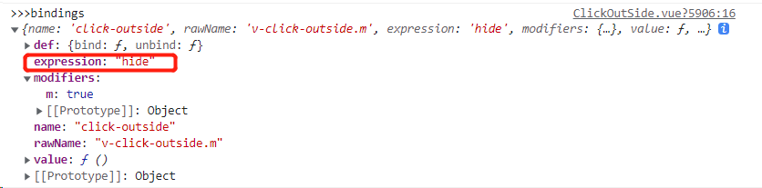
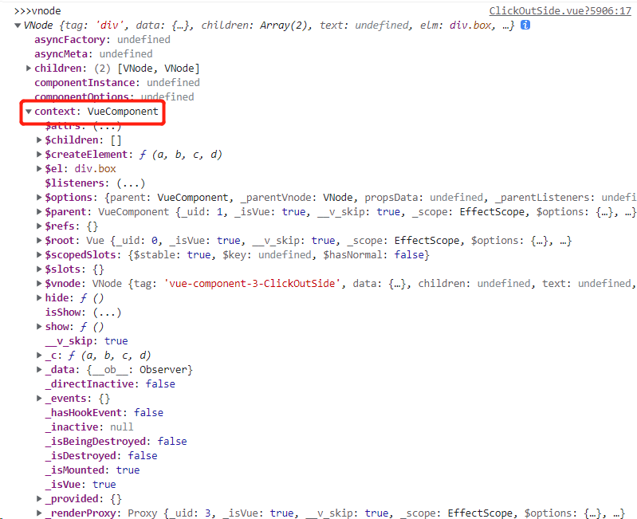

## 1.指令

```
<template>
  <div class="box" v-click-outside.m="hide">
    <input type="text" @focus="show">
    <div v-show="isShow">
      面板
    </div>
  </div>
</template>

<script>
export default {
  name: 'ClickOutSide',
  directives: {
    clickOutside: {
      bind(el, bindings,vnode) {
        console.log('>>>el', el)
        console.log('>>>bindings', bindings)
        console.log('>>>vnode', vnode)
        const handler = e => {
          // 如果点击的是外面
          if (!el.contains(e.target)) {
            let fn = vnode.context[bindings.expression]
            fn()
          }
        }
        el.handler = handler
        document.addEventListener('click', handler)
      },
      unbind(el) {
        document.removeEventListener('click', el.handler)
      }
    }
  },
  data() {
    return {
      isShow: false
    }
  },
  methods: {
    show() {
      this.isShow = true
    },
    hide() {
      this.isShow = false
    }
  }
}
```





## 2.图片懒加载

- LazyLoad.vue

  ```
  <template>
      <div class="box">
          <li v-for="(item, index) in list" :key="index">
              
          </li>
      </div>
    </template>
    
    <script>
    export default {
      name: 'LazyLoad',
      data() {
          return {
              list: []
          }
      },
      mounted() {
          this.list = [
          	...
          ]
      }
    }
    </script>
    
    <style scoped>
    .box {
      width: 400px;
      height: 400px;
      overflow: scroll;
    }
    img {
      width: 100px;
      height: 150px;
    }
    </style>
    
  ```

- main.js

  ```
  import Vue from 'vue'
  import App from './App.vue'
  import VueLazyLoad from '@/plugins/vue-lazyload'
  import logo from '@/assets/logo.png'
  
  Vue.use(VueLazyLoad, {
    loading: logo,
    preload: 1.2
  })
  
  new Vue({
    render: h => h(App),
  }).$mount('#app')
  
  ```

- plugins/vue-lazyload.js

  ```
  import _ from 'lodash'
  
  const VueLazyLoad = {
      install(Vue, options) {
          const LazyClass = lazy(Vue)
          const instance = new LazyClass(options)
          Vue.directive('lazy', {
              bind: instance.add.bind(instance),
              unbind: instance.remove.bind(instance)
          })
      }
  }
  
  const scrollParent = el => {
      let parent = el.parentNode
      while(parent) {
          // getComputedStyle: 原生方法用于获取元素样式
          if (/scroll/.test(getComputedStyle(parent)['overflow'])) {
              return parent
          }
          parent = parent.parentNode
      }
  }
  
  const render = (listener, status) => {
      let el = listener.el
      let src = ''
      switch (status) {
          case 'loading':
              src = listener.options.loading
              break;
          case 'loaded':
              src = listener.src
              break;
          case 'error':
              src = listener.options.error
          default:
              break;
      }
      el.setAttribute('src', src)
  }
  
  const loadImg = (src, resolve, reject) => {
      let img = new Image()
      img.src = src
      img.onload = resolve
      img.onerror = reject
  }
  
  const lazy = (Vue) => {
  
      class ReactiveListener {
          constructor({el, src, options}) {
              this.el = el
              this.src = src
              this.options = options
              this.state = {
                  loading:  false
              }
          }
          // 用来检测自己在不在可视区域内
          checkInView() {
              // 获取当前元素距离屏幕的位置
              let { top } = this.el.getBoundingClientRect()
              return top < window.innerHeight * this.options.preload
          }
          load() {
              // 先显示loading图片
              // 再去加载真实图片，图片成功后显示成功内容，失败显示失败内容
              render(this, 'loading')
              loadImg(this.src, () => {
                  this.state.loading = true
                  render(this, 'loaded')
              }, () => {
                  render(this, 'error')
              })
          }
      }
  
      return class LazyClass {
          constructor(options) {
              this.options = options
              this.bindHandler = false
              this.listeners = []
          }
          add(el, bindings) {
              Vue.nextTick(() => {
                  // 寻找到可滚动的元素
                  let ele = scrollParent(el)
                  // 1. 监控el是否需要显示
                  let listener = new ReactiveListener({
                      el,
                      src: bindings.value,
                      options: this.options
                  })
                  this.listeners.push(listener)
                  // 2.绑定滚动事件
                  // 只需要绑定一次
                  if (!this.bindHandler) {
                      // 也可以使用 intersectionObserver(兼容性不好)
                      // 节流降低使用频率
                      let lazyHandler = _.throttle(this.lazyLoadHandler.bind(this), 500)
                      ele.addEventListener('scroll', lazyHandler, {
                          passive: true
                      })
                      this.bindHandler = true
                  }
                  // 默认不滚动也需要展示的
                  this.lazyLoadHandler() 
              })
          }
          lazyLoadHandler() {
              // 看一下 哪些需要加载
              // 在可视区域内，这个元素没有被加载过
              this.listeners.forEach(listener => {
                  // 如果加载过
                  if (listener.state.loading) return
                  listener.checkInView() && listener.load()
              })
          }
          remove() {
  
          }
      }
  }
  
  export default VueLazyLoad
  ```


## 3.Vuex 实现原理

### 1. Vuex 中初始化逻辑

#### 1. 主要代码

- Store.vue

  ```
  <template>
      <div>
          {{ this.$store.state.name }}<br>
          {{ this.$store.state.age }}<br>
          <!-- {{ this.$store.getters.myAge }}<br> -->
          <button @click="$store.state.age++">加1</button>
      </div>
  </template>
  
  <script>
  export default {
      name: 'Store',
      mounted() {
          console.log(this.$store)
      }
  }
  </script>
  ```

  

- src/store/index.

  ```
  import Vue from 'vue'
  import Vuex from '@/vuex'
  
  Vue.use(Vuex)
  
  export default new Vuex.Store({
      state: {
          name: 'well',
          age: 18
      },
      mutations: {
  
      },
      actions: {
  
      },
      getters: {
          myAge(state) {
              return `年龄为${state.age}`
          }
      },
      modules: {
  
      }
  })
  ```

- src/main.js

  ```
  import Vue from 'vue'
  import App from './App.vue'
  import store from './store'
  ...
  let vm = new Vue({
    name: 'App',
    store,
    render: h => h(App),
  }).$mount('#app')
  console.log(vm.$store)
  ```

- src/vuex/index.js

  ```
  import {install} from './install'
  import Store from './store'
  
  export default {
      install,
      Store
  }
  ```

- src/vuex/install.js

  ```
  let Vue
  
  function install (_Vue) {
      Vue = _Vue
  
      Vue.mixin({
          beforeCreate() { // this 代表每个组件实例
              // 获取根组件上的 store 将他共享给每个组件
              let options = this.$options
              if (options.store) {
                  this.$store = options.store
              } else {
                  if (this.$parent && this.$parent.$store) {
                      this.$store = this.$parent.$store
                  }
              }
          }
      })
  }
  
  export {
      Vue,
      install
  }
  ```

- src/vuex/store.js

  ```
  import { Vue } from './install'
  
  class Store {
      constructor(options) {
          let { state, getters, mutation, actions, module, strice } = options
          // 这个状态在页面渲染时需要收集对应的渲染 watcher， 这样状态更新才会更新视图
          this._vm = new Vue({
              data: { 
                  // $符号开头的数据不会被挂载到实例上，但是会挂载到当前的_data 上，减少了一次代理
                  $$state: state
              }
              // 用户组件中使用的$store = this
          })
      }
      // 类的属性访问器
      get state() {
          return this._vm._data.$$state
      }
  }
  
  export default Store
  ```

#### 2. 代码逻辑

1. src/store/index.js 中 通过 Vue.use(Vuex) 使用插件，这会执行其install 方法，同是把实例化的store 作为 参数传入了main.js 的作为vue实例属性
2. install 中通过 Vue.mixin 给每个组件的 beforeCreate 钩子合并了操作，这样每个组件都有一个$store 属性
3. store.js 中的每个实例都通过 new Vue 把 state 作为了 vue 实例的data.$$state 属性，通过类属性访问器触发vue实例的getter，实现更新视图

### 2.getters 实现

#### 1.主要代码

- vuex/utils.js

  ```
  export const forEachValue = (obj, fn) => {
      Object.keys(obj).forEach(key => fn(obj[key], key))
  } 
  ```

- vuex/store.js

  ```
  import { forEachValue } from './utils'
  
  class Store {
      constructor(options) {
          ...
          // 在取getters 的时候,把它代理到计算属性上
          this.getters = {}
          const computed = {}
          forEachValue(getters, (fn, key) => {
              computed[key] = () => {
                  return fn(this.state)
              }
              Object.defineProperty(this.getters, key, {
                  get: () => this._vm[key] // this._vm[key] 触发了data 的代理
              })
          })
          ...
          this._vm = new Vue({
          	...
              computed // 利用计算属性实现缓存
          })
      }
      ...
  }
  
  
  ```

#### 2.代码逻辑

1. 把getters 的方法作为 Vue 实例的 computed 的属性
2. 利用 Object.defineProperty 把 this.getters 里的 每个属性的 get 方法 触发响应式代理

### 3.mutations

#### 1.主要代码

```
this.mutations = {}
forEachValue(mutations, (fn, key) => {
	// commit('changeAge', 10)
	// this.mutations = {changeAge: () => {}}
	this.mutations[key] = (payload) => fn.call(this, this.state, payload)
})

...
// 用箭头函数的写法，this永远指向Store的实例对象
commit = (type, payload) => {
	this.mutations[type](payload)
}
```

#### 2. 代码逻辑

1. 把mutations 中的作为 this.mutations 中的方法，需要包一层方法，返回通过call指定this的返回
2. 实现commit， 调用方法

### 4.actions

#### 1.主要代码

```
this.actions = {}
forEachValue(actions, (fn, key) => {
	this.actions[key] = (payload) => fn.call(this, this, payload)
})
...
dispatch = (type, payload) => {
	this.actions[type](payload)
}
```

#### 2.代码逻辑

1. 把actions 里的属性作为 this.actions 中的属性，需要包一层，返回通过call 指定this返回，第一个参数是store 实例
2. 实现 dispatch，调用方法

### 5.vuex 中的模块化

#### 1.格式化用户数据&抽离模块类

##### 1.主要代码

- 组装后的数据解构

  ```
  /* 
  this.root = {
      _raw: 用户定义的模块,
      state: 当前模块自己的状态,
      _children: { // 孩子列表
          a: {
              _raw: 用户定义的模块,
              state: 当前模块自己的状态
              _children: {
                  c: {
                      ...
                  }
              }
          }
      }
  }
  */
  ```

- vuex/store.js

  ```
  import ModuleCollection from './module/module-collection'
  
  class Store {
      constructor(options) {
          // 对用户的参数进行格式化操作（树）
          let r =new ModuleCollection(options)
          console.log(r)
      }
  }
  
  export default Store
  ```

- vuex/module/module-collection.js

  ```
  import Module from './module'
  import { forEachValue } from "../utils"
  
  export default class ModuleCollection {
      constructor(options) {
          this.root = null
          this.register([], options)
      }
      register(path, rootModule) {
          let newModule = new Module(rootModule)
          if (path.length === 0) {
              this.root = newModule
          } else {
              // 其父亲的[key]
              // let temp = path.slice(0, -1)
              // 取出父亲节点
              let parent = path.slice(0, -1).reduce((memo, current) => {
                  return memo.getChild(current)
              }, this.root)
              // 把新的子节点作为父亲节点的children
              parent.addChild([path[path.length-1]], newModule)
          }
          if (rootModule.modules) {
              // 根据kkey递归注册子模块
              forEachValue(rootModule.modules, (module, moduleName) => {
                  this.register(path.concat(moduleName), module)
              })
          }
      }
  }
  ```

- vuex/module/module.js

  ```
  export default class Module {
      constructor(rawModule) {
          this._children = {}
          this._rawModule = rawModule
          this.state = rawModule.state
      }
      getChild(key) {
          return this._children[key]
      }
      addChild(key, module) {
          this._children[key] = module
      }
  }
  ```

##### 2.代码逻辑

1. 通过module-collection.js这个类把数据进行树的格式化
2. 通过module.js这个类对数据进行抽离，实现其添加与查找children方法

#### 2.安装模块

##### 1.主要代码

- vuex/store.js

  ```
  import ModuleCollection from './module/module-collection'
  import { Vue } from './install'
  import { forEachValue } from './utils'
  
  function installModule(store, rootState, path, module) {
      // 需要循环当前模块
      // module.state => 放到rootState 对应的儿子里
      if(path.length > 0) {
          // 需要找到对应的夫模块，将状态声明上去
          let parent = path.slice(0, -1).reduce((memo, current) => {
              return memo[current]
          }, rootState)
          // 使用set对对象新增属性进行响应式
          Vue.set(parent, path[path.length - 1], module.state)
      }
      module.forEachGetter((getter, key) => {
          store._wrappedGetters[key] = function() {
              return getter(module.state)
          }
      })
      module.forEachMutation((mutation, key) => {
          store._mutations[key] =(store._mutations[key] || [])
          store._mutations[key].push((payload) => {
              mutation.call(store, module.state, payload)
          })
      })
      module.forEachAction((action, key) => {
          store._actions[key] = (store._actions[key] || [])
          store._actions[key].push(function(payload) {
              action.call(store, this, payload)
          })
      })
      module.forEachChild((child, key) => {
          installModule(store, rootState, path.concat(key), child)
      })
  }
  
  function resetStoreVM(store, state) {
      const computed = {}
      store.getters = {}
      const wrappedGetters = store._wrappedGetters
      forEachValue(wrappedGetters, (fn, key) => {
          computed[key] = () => {
              return fn(store.state)
          }
          Object.defineProperty(store.getters, key, {
              get: () => store._vm[key]
          })
      })
      store._vm = new Vue({
          data: {
              $$state: state
          },
          computed
      })
  }
  
  class Store {
      constructor(options) {
          // 对用户的参数进行格式化操作（树）
          this._modules =new ModuleCollection(options)
          
          // 将模块中的所有getter、mutations、actions进行收集
          // 没有namespaced的时候，getters都放到根上， actions、mutations 将被合并到数组
          this._mutations ={}
          this._actions = {}
          this._wrappedGetters = {}
          const { state } = options
  
          // 安装模块
          installModule(this, state, [], this._modules.root)
  
          resetStoreVM(this, state)
      }
      get state() {
          return this._vm._data.$$state
      }
      // 发布
      commit = (mutationName, payload) => {
          this._mutations[mutationName] && this._mutations[mutationName].forEach(fn => fn(payload))
      }
      dispatch = (actionName, payload) => {
          this._actions[actionName] && this._actions[actionName].forEach(fn => fn(payload))
      }
  }
  
  export default Store
  ```

- module/module.js

  ```
  import { forEachValue } from '../utils'
  export default class Module {
      ...
      forEachGetter(fn) {
          if (this._rawModule.getters) {
              forEachValue(this._rawModule.getters, fn)
          }
      }
      forEachMutation(fn) {
          if (this._rawModule.mutations) {
              forEachValue(this._rawModule.mutations, fn)
          }
      }
      forEachAction(fn) {
          if (this._rawModule.actions) {
              forEachValue(this._rawModule.actions, fn)
          }
      }
      forEachChild(fn) {
          forEachValue(this._children, fn)
      }
  }
  ```

##### 2.代码逻辑

