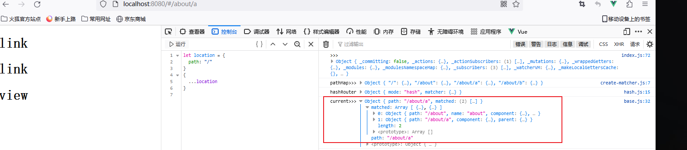
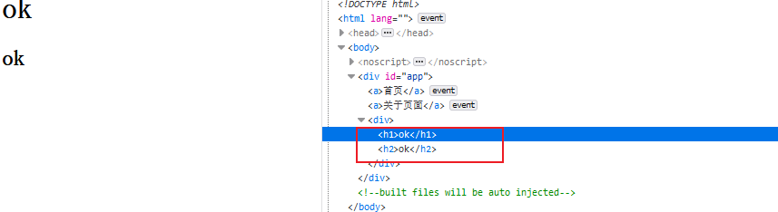

## 1.指令

```
<template>
  <div class="box" v-click-outside.m="hide">
    <input type="text" @focus="show">
    <div v-show="isShow">
      面板
    </div>
  </div>
</template>

<script>
export default {
  name: 'ClickOutSide',
  directives: {
    clickOutside: {
      bind(el, bindings,vnode) {
        console.log('>>>el', el)
        console.log('>>>bindings', bindings)
        console.log('>>>vnode', vnode)
        const handler = e => {
          // 如果点击的是外面
          if (!el.contains(e.target)) {
            let fn = vnode.context[bindings.expression]
            fn()
          }
        }
        el.handler = handler
        document.addEventListener('click', handler)
      },
      unbind(el) {
        document.removeEventListener('click', el.handler)
      }
    }
  },
  data() {
    return {
      isShow: false
    }
  },
  methods: {
    show() {
      this.isShow = true
    },
    hide() {
      this.isShow = false
    }
  }
}
```


## 2.图片懒加载

- LazyLoad.vue

  ```
  <template>
      <div class="box">
          <li v-for="(item, index) in list" :key="index">
              
          </li>
      </div>
    </template>
    
    <script>
    export default {
      name: 'LazyLoad',
      data() {
          return {
              list: []
          }
      },
      mounted() {
          this.list = [
          	...
          ]
      }
    }
    </script>
    
    <style scoped>
    .box {
      width: 400px;
      height: 400px;
      overflow: scroll;
    }
    img {
      width: 100px;
      height: 150px;
    }
    </style>
    
  ```

- main.js

  ```
  import Vue from 'vue'
  import App from './App.vue'
  import VueLazyLoad from '@/plugins/vue-lazyload'
  import logo from '@/assets/logo.png'
  
  Vue.use(VueLazyLoad, {
    loading: logo,
    preload: 1.2
  })
  
  new Vue({
    render: h => h(App),
  }).$mount('#app')
  
  ```

- plugins/vue-lazyload.js

  ```
  import _ from 'lodash'
  
  const VueLazyLoad = {
      install(Vue, options) {
          const LazyClass = lazy(Vue)
          const instance = new LazyClass(options)
          Vue.directive('lazy', {
              bind: instance.add.bind(instance),
              unbind: instance.remove.bind(instance)
          })
      }
  }
  
  const scrollParent = el => {
      let parent = el.parentNode
      while(parent) {
          // getComputedStyle: 原生方法用于获取元素样式
          if (/scroll/.test(getComputedStyle(parent)['overflow'])) {
              return parent
          }
          parent = parent.parentNode
      }
  }
  
  const render = (listener, status) => {
      let el = listener.el
      let src = ''
      switch (status) {
          case 'loading':
              src = listener.options.loading
              break;
          case 'loaded':
              src = listener.src
              break;
          case 'error':
              src = listener.options.error
          default:
              break;
      }
      el.setAttribute('src', src)
  }
  
  const loadImg = (src, resolve, reject) => {
      let img = new Image()
      img.src = src
      img.onload = resolve
      img.onerror = reject
  }
  
  const lazy = (Vue) => {
  
      class ReactiveListener {
          constructor({el, src, options}) {
              this.el = el
              this.src = src
              this.options = options
              this.state = {
                  loading:  false
              }
          }
          // 用来检测自己在不在可视区域内
          checkInView() {
              // 获取当前元素距离屏幕的位置
              let { top } = this.el.getBoundingClientRect()
              return top < window.innerHeight * this.options.preload
          }
          load() {
              // 先显示loading图片
              // 再去加载真实图片，图片成功后显示成功内容，失败显示失败内容
              render(this, 'loading')
              loadImg(this.src, () => {
                  this.state.loading = true
                  render(this, 'loaded')
              }, () => {
                  render(this, 'error')
              })
          }
      }
  
      return class LazyClass {
          constructor(options) {
              this.options = options
              this.bindHandler = false
              this.listeners = []
          }
          add(el, bindings) {
              Vue.nextTick(() => {
                  // 寻找到可滚动的元素
                  let ele = scrollParent(el)
                  // 1. 监控el是否需要显示
                  let listener = new ReactiveListener({
                      el,
                      src: bindings.value,
                      options: this.options
                  })
                  this.listeners.push(listener)
                  // 2.绑定滚动事件
                  // 只需要绑定一次
                  if (!this.bindHandler) {
                      // 也可以使用 intersectionObserver(兼容性不好)
                      // 节流降低使用频率
                      let lazyHandler = _.throttle(this.lazyLoadHandler.bind(this), 500)
                      ele.addEventListener('scroll', lazyHandler, {
                          passive: true
                      })
                      this.bindHandler = true
                  }
                  // 默认不滚动也需要展示的
                  this.lazyLoadHandler() 
              })
          }
          lazyLoadHandler() {
              // 看一下 哪些需要加载
              // 在可视区域内，这个元素没有被加载过
              this.listeners.forEach(listener => {
                  // 如果加载过
                  if (listener.state.loading) return
                  listener.checkInView() && listener.load()
              })
          }
          remove() {
  
          }
      }
  }
  
  export default VueLazyLoad
  ```


## 3.Vuex 实现原理

### 1. Vuex 中初始化逻辑

#### 1. 主要代码

- Store.vue

  ```
  <template>
      <div>
          {{ this.$store.state.name }}<br>
          {{ this.$store.state.age }}<br>
          <!-- {{ this.$store.getters.myAge }}<br> -->
          <button @click="$store.state.age++">加1</button>
      </div>
  </template>
  
  <script>
  export default {
      name: 'Store',
      mounted() {
          console.log(this.$store)
      }
  }
  </script>
  ```

  

- src/store/index.

  ```
  import Vue from 'vue'
  import Vuex from '@/vuex'
  
  Vue.use(Vuex)
  
  export default new Vuex.Store({
      state: {
          name: 'well',
          age: 18
      },
      mutations: {
  
      },
      actions: {
  
      },
      getters: {
          myAge(state) {
              return `年龄为${state.age}`
          }
      },
      modules: {
  
      }
  })
  ```

- src/main.js

  ```
  import Vue from 'vue'
  import App from './App.vue'
  import store from './store'
  ...
  let vm = new Vue({
    name: 'App',
    store,
    render: h => h(App),
  }).$mount('#app')
  console.log(vm.$store)
  ```

- src/vuex/index.js

  ```
  import {install} from './install'
  import Store from './store'
  
  export default {
      install,
      Store
  }
  ```

- src/vuex/install.js

  ```
  let Vue
  
  function install (_Vue) {
      Vue = _Vue
  
      Vue.mixin({
          beforeCreate() { // this 代表每个组件实例
              // 获取根组件上的 store 将他共享给每个组件
              let options = this.$options
              if (options.store) {
                  this.$store = options.store
              } else {
                  if (this.$parent && this.$parent.$store) {
                      this.$store = this.$parent.$store
                  }
              }
          }
      })
  }
  
  export {
      Vue,
      install
  }
  ```

- src/vuex/store.js

  ```
  import { Vue } from './install'
  
  class Store {
      constructor(options) {
          let { state, getters, mutation, actions, module, strice } = options
          // 这个状态在页面渲染时需要收集对应的渲染 watcher， 这样状态更新才会更新视图
          this._vm = new Vue({
              data: { 
                  // $符号开头的数据不会被挂载到实例上，但是会挂载到当前的_data 上，减少了一次代理
                  $$state: state
              }
              // 用户组件中使用的$store = this
          })
      }
      // 类的属性访问器
      get state() {
          return this._vm._data.$$state
      }
  }
  
  export default Store
  ```

#### 2. 代码逻辑

1. src/store/index.js 中 通过 Vue.use(Vuex) 使用插件，这会执行其install 方法，同是把实例化的store 作为 参数传入了main.js 的作为vue实例属性
2. install 中通过 Vue.mixin 给每个组件的 beforeCreate 钩子合并了操作，这样每个组件都有一个$store 属性
3. store.js 中的每个实例都通过 new Vue 把 state 作为了 vue 实例的data.$$state 属性，通过类属性访问器触发vue实例的getter，实现更新视图

### 2.getters 实现

#### 1.主要代码

- vuex/utils.js

  ```
  export const forEachValue = (obj, fn) => {
      Object.keys(obj).forEach(key => fn(obj[key], key))
  } 
  ```

- vuex/store.js

  ```
  import { forEachValue } from './utils'
  
  class Store {
      constructor(options) {
          ...
          // 在取getters 的时候,把它代理到计算属性上
          this.getters = {}
          const computed = {}
          forEachValue(getters, (fn, key) => {
              computed[key] = () => {
                  return fn(this.state)
              }
              Object.defineProperty(this.getters, key, {
                  get: () => this._vm[key] // this._vm[key] 触发了data 的代理
              })
          })
          ...
          this._vm = new Vue({
          	...
              computed // 利用计算属性实现缓存
          })
      }
      ...
  }
  
  
  ```

#### 2.代码逻辑

1. 把getters 的方法作为 Vue 实例的 computed 的属性
2. 利用 Object.defineProperty 把 this.getters 里的 每个属性的 get 方法 触发响应式代理

### 3.mutations

#### 1.主要代码

```
this.mutations = {}
forEachValue(mutations, (fn, key) => {
	// commit('changeAge', 10)
	// this.mutations = {changeAge: () => {}}
	this.mutations[key] = (payload) => fn.call(this, this.state, payload)
})

...
// 用箭头函数的写法，this永远指向Store的实例对象
commit = (type, payload) => {
	this.mutations[type](payload)
}
```

#### 2. 代码逻辑

1. 把mutations 中的作为 this.mutations 中的方法，需要包一层方法，返回通过call指定this的返回
2. 实现commit， 调用方法

### 4.actions

#### 1.主要代码

```
this.actions = {}
forEachValue(actions, (fn, key) => {
	this.actions[key] = (payload) => fn.call(this, this, payload)
})
...
dispatch = (type, payload) => {
	this.actions[type](payload)
}
```

#### 2.代码逻辑

1. 把actions 里的属性作为 this.actions 中的属性，需要包一层，返回通过call 指定this返回，第一个参数是store 实例
2. 实现 dispatch，调用方法

### 5.vuex 中的模块化

#### 1.格式化用户数据&抽离模块类

##### 1.主要代码

- 组装后的数据解构

  ```
  /* 
  this.root = {
      _raw: 用户定义的模块,
      state: 当前模块自己的状态,
      _children: { // 孩子列表
          a: {
              _raw: 用户定义的模块,
              state: 当前模块自己的状态
              _children: {
                  c: {
                      ...
                  }
              }
          }
      }
  }
  */
  ```

- vuex/store.js

  ```
  import ModuleCollection from './module/module-collection'
  
  class Store {
      constructor(options) {
          // 对用户的参数进行格式化操作（树）
          let r =new ModuleCollection(options)
          console.log(r)
      }
  }
  
  export default Store
  ```

- vuex/module/module-collection.js

  ```
  import Module from './module'
  import { forEachValue } from "../utils"
  
  export default class ModuleCollection {
      constructor(options) {
          this.root = null
          this.register([], options)
      }
      register(path, rootModule) {
          let newModule = new Module(rootModule)
          if (path.length === 0) {
              this.root = newModule
          } else {
              // 其父亲的[key]
              // let temp = path.slice(0, -1)
              // 取出父亲节点
              let parent = path.slice(0, -1).reduce((memo, current) => {
                  return memo.getChild(current)
              }, this.root)
              // 把新的子节点作为父亲节点的children
              parent.addChild([path[path.length-1]], newModule)
          }
          if (rootModule.modules) {
              // 根据kkey递归注册子模块
              forEachValue(rootModule.modules, (module, moduleName) => {
                  this.register(path.concat(moduleName), module)
              })
          }
      }
  }
  ```

- vuex/module/module.js

  ```
  export default class Module {
      constructor(rawModule) {
          this._children = {}
          this._rawModule = rawModule
          this.state = rawModule.state
      }
      getChild(key) {
          return this._children[key]
      }
      addChild(key, module) {
          this._children[key] = module
      }
  }
  ```

##### 2.代码逻辑

1. 通过module-collection.js这个类把数据进行树的格式化
2. 通过module.js这个类对数据进行抽离，实现其添加与查找children方法

#### 2.安装模块

##### 1.主要代码

- vuex/store.js

  ```
  import ModuleCollection from './module/module-collection'
  import { Vue } from './install'
  import { forEachValue } from './utils'
  
  function installModule(store, rootState, path, module) {
      // 需要循环当前模块
      // module.state => 放到rootState 对应的儿子里
      if(path.length > 0) {
          // 需要找到对应的夫模块，将状态声明上去
          let parent = path.slice(0, -1).reduce((memo, current) => {
              return memo[current]
          }, rootState)
          // 使用set对对象新增属性进行响应式
          Vue.set(parent, path[path.length - 1], module.state)
      }
      module.forEachGetter((getter, key) => {
          store._wrappedGetters[key] = function() {
              return getter(module.state)
          }
      })
      module.forEachMutation((mutation, key) => {
          store._mutations[key] =(store._mutations[key] || [])
          store._mutations[key].push((payload) => {
              mutation.call(store, module.state, payload)
          })
      })
      module.forEachAction((action, key) => {
          store._actions[key] = (store._actions[key] || [])
          store._actions[key].push((payload) => {
              action.call(store, store, payload)
          })
      })
      module.forEachChild((child, key) => {
          installModule(store, rootState, path.concat(key), child)
      })
  }
  
  function resetStoreVM(store, state) {
      const computed = {}
      store.getters = {}
      const wrappedGetters = store._wrappedGetters
      forEachValue(wrappedGetters, (fn, key) => {
          computed[key] = () => {
              return fn(store.state)
          }
          Object.defineProperty(store.getters, key, {
              get: () => store._vm[key]
          })
      })
      store._vm = new Vue({
          data: {
              $$state: state
          },
          computed
      })
  }
  
  class Store {
      constructor(options) {
          // 对用户的参数进行格式化操作（树）
          this._modules =new ModuleCollection(options)
          
          // 将模块中的所有getter、mutations、actions进行收集
          // 没有namespaced的时候，getters都放到根上， actions、mutations 将被合并到数组
          this._mutations ={}
          this._actions = {}
          this._wrappedGetters = {}
          const { state } = options
  
          // 安装模块
          installModule(this, state, [], this._modules.root)
  
          resetStoreVM(this, state)
      }
      get state() {
          return this._vm._data.$$state
      }
      // 发布
      commit = (mutationName, payload) => {
          this._mutations[mutationName] && this._mutations[mutationName].forEach(fn => fn(payload))
      }
      dispatch = (actionName, payload) => {
          this._actions[actionName] && this._actions[actionName].forEach(fn => fn(payload))
      }
  }
  
  export default Store
  ```

- module/module.js

  ```
  import { forEachValue } from '../utils'
  export default class Module {
      ...
      forEachGetter(fn) {
          if (this._rawModule.getters) {
              forEachValue(this._rawModule.getters, fn)
          }
      }
      forEachMutation(fn) {
          if (this._rawModule.mutations) {
              forEachValue(this._rawModule.mutations, fn)
          }
      }
      forEachAction(fn) {
          if (this._rawModule.actions) {
              forEachValue(this._rawModule.actions, fn)
          }
      }
      forEachChild(fn) {
          forEachValue(this._children, fn)
      }
  }
  ```

##### 2.代码逻辑

1. 循环当前父模块，使用set对对象新增属性进行响应式
2. resetStoreVM 中实例化vue，对其data 和 computed 进行声明
3. 实现 get State() 访问到data 的变量监听watcher
4. 实现 commit 和 dispatch

### 6.Vuex 命名空间

#### 1.主要代码

- vuex/module/module.js

  ```
  // 用于标识他自己是否写了namespaced
  get namespace() {
  	return !!this._rawModule.namespaced
  }
  ```

- vuex/module/module-collection.js

  ```
  import Module from './module'
  import { forEachValue } from "../utils"
  
  export default class ModuleCollection {
  	...
      getNamespace(path) {
          let module = this.root
          return path.reduce((namespace, key) => {
              module = module.getChild(key)
              console.log(module)
              return namespace + (module.namespace ? key + '/' : '')
          }, '')
      }
      ...
  }
  ```

- vuex/store.js

  ```
  function installModule(store, rootState, path, module) {
  
      // 命名空间： a a/c
      let namespace = store._modules.getNamespace(path)
  
      
      module.forEachGetter((getter, key) => {
          store._wrappedGetters[namespace + key] = function() {
              return getter(module.state)
          }
      })
      module.forEachMutation((mutation, key) => {
          store._mutations[namespace + key] =(store._mutations[namespace + key] || [])
          store._mutations[namespace + key].push((payload) => {
              mutation.call(store, module.state, payload)
          })
      })
      module.forEachAction((action, key) => {
          store._actions[namespace + key] = (store._actions[namespace + key] || [])
          store._actions[namespace + key].push((payload) => {
              action.call(store, store, payload)
          })
      })
      
  }
  ```

#### 2.代码逻辑

1. 在module 类中添加 getNamespace 函数返回 namespaced
2. module-collection 类中 添加 getNamespace 模块的命名空间
3. store 类中通过注册函数给他们的getters、actions、mutations 对应的key 拼接上命名空间

### 7.插件机制

#### 1.主要代码

- store/index.js

  ```
  function logger () {
      return function (store) {
          let prevState = JSON.stringify(store.state)
          store.subscribe((mutation, state) => {
              // 所有的更新操作都基于 mutation （状态变化都是通过mutation）
              // 如果直接手动的更改状态，此subcribe 是不会执行的
              console.log('prevState:', prevState)
              console.log('mutation:', JSON.stringify(mutation))
              console.log(JSON.stringify(state))
              prevState = JSON.stringify(state)
          })
      }
  }
  
  function persists() {
      return function (store) {
          let local = localStorage.getItem('VUES:state')
          if (local) {
              store.replaceState(JSON.parse(local))
          }
          store.subscribe((mutation, state) => {
              // 这里需要做一个防抖
              localStorage.setItem('VUES:state', JSON.stringify(state))
          })
      }
  }
  ...
  let store = new Vuex.Store({
      plugins: [
          logger(),
          persists()
      ]
  })
  ...
  ```

- vuex/store.js

  ```
  function getNewState(store, path) {
      return path.reduce((memo, cur) => {
          return memo[cur]
      }, store.state)
  }
  
  module.forEachGetter((getter, key) => {
  	store._wrappedGetters[namespace + key] = function() {
  		return getter(getNewState(store, path))
  	}
  })
  module.forEachMutation((mutation, key) => {
  	store._mutations[namespace + key] =(store._mutations[namespace + key] || [])
  	store._mutations[namespace + key].push((payload) => {
  		mutation.call(store, getNewState(store, path), payload)
  		store._subscribe.forEach(fn => fn({type: namespace + key, payload}, store.state))
  	})
  })
  ...
  class Store {
      constructor(options) {
      	this._subscribe = []
      	...
      	// 插件
          if (options.plugins) {
              options.plugins.forEach(plugin => plugin(this))
          }
      }
      subscribe(fn) {
          this._subscribe.push(fn)
      }
  
      replaceState(newState) {
          // 替换最新的状态，赋予对象类型会被重新劫持
          // 虽然替换了状态，但是mutaions等中的老的状态已经被绑死了
          // 需要通过getNewState 去取最新的
          this._vm._data.$$state = newState
      }
  }
  ```

#### 2.代码逻辑

1. 插件中通过 return function() {} 返回一个高阶函数，而我们的store需要遍历这些插件，把这些插件执行，此时插件代码中的subscribe方法会push 到 store 中的_subscribe 中
2. replaceState 中对数据进行重新劫持，但是由于先执行的installModule，导致mutaions等中的老的状态已经被绑死了，需要通过getNewState 去取最新的

### 8.辅助函数

#### 1.主要代码

- vuex/index.js

  ```
  import {install} from './install'
  import Store from './store'
  function mapState (arrList) {
      let obj = {}
      for (let i=0; i<arrList.length; i++) {
          let stateName = arrList[i]
          obj[stateName] = function() {
              return this.$store.state[stateName]
          }
      }
      return obj
  }
  function mapGetters (arrList) {
      let obj = {}
      for (let i=0; i<arrList.length; i++) {
          let getterName = arrList[i]
          obj[getterName] = function() {
              return this.$store.getters[getterName]
          }
      }
      return obj
  }
  function mapMutations (arrList) {
      let obj = {}
      for (let i=0; i<arrList.length; i++) {
          let type = arrList[i]
          obj[type] = function(payload) {
              this.$store.commit(type, payload)
          }
      }
      return obj
  }
  function mapActions (arrList) {
      let obj = {}
      for (let i=0; i<arrList.length; i++) {
          let type = arrList[i]
          obj[type] = function(payload) {
              this.$store.dispatch(type, payload)
          }
      }
      return obj
  }
  export {
      install,
      Store,
      mapState,
      mapGetters,
      mapMutations,
      mapActions
  }
  ```

- store.vue

  ```
  <template>
      <div>
          辅助函数：<br/>
          name:{{ name }}<br/>
          myAge: {{ myAge }}<br/>
          <button @click="changeAge(10)">加10(commit)</button>
          <button @click="$store.dispatch('changeAge', 10)">加10(dispatch)</button>
  
      </div>
  </template>
  
  <script>
  import { mapState, mapGetters, mapMutations, mapActions } from '@/vuex'
  export default {
      name: 'Store',
      computed: {
          ...mapState(['name']),
          ...mapGetters(['myAge'])
          // name() {
          //     return this.$store.state.name
          // },
          // myAge() {
          //     return this.$store.getters.myAge
          // }
      },
      methods: {
          ...mapMutations(['changeAge'])
          // ...mapActions(['changeAge'])
      },
      mounted() {
          console.log(this.$store)
      }
  }
  </script>
  ```

#### 2.代码逻辑

1. 通过返回一个对象配合...解构到对应的钩子中，即得到对应的computed或者methods

## 4.Vue-Router

### 1.Vue-Router 基本应用

- router.js

  ```
  import Vue from 'vue'
  // import Router from 'vue-router'
  import Router from '@/vue-router'
  import Home from '@/views/Home'
  import About from '@/views/About'
  
  Vue.use(Router)
  
  /* 
      / => home
      /about => [about]
      /about/a => [about, a]
      /about/b => [about, b]
  */
  
  export default new Router({
      routes: [
          {
              path: '/',
              name: 'home',
              component: Home
          },
          {
              path: '/about',
              name: 'about',
              component: About,
              children: [
                  {
                      path: 'a',
                      component: {
                          render(h) {
                              return <h1>about A</h1>
                          }
                      }
                  },
                  {
                      path: 'b',
                      component: {
                          render(h) {
                              return <h1>about B</h1>
                          }
                      }
                  }
              ]
          }
      ]
  })
  ```

- main.js

  ```
  import Vue from 'vue'
  import router from 'router'
  ...
  let vm = new Vue({
    router,
    render: h => h(App),
  }).$mount('#app')
  ```

- App.vue

  ```
  <template>
    <div id="app">
      <router-link to="/">首页</router-link>
      <router-link to="/about">关于页面</router-link>
      <router-view />
    </div>
  </template>
  ```

- About.vue

  ```
  <template>
      <div>
          This is About page
          <div>
              <router-link to="/about/a">about - a</router-link>
              <router-link to="/about/b">about - b</router-link>
          </div>
          <router-view />
      </div>
  </template>
  ```

### 2.编写Vue-Router

#### 1.编写 install 方法

##### 1.主要代码

- vue-router/components(router-link、router-view)

  - link.js
  - view.js

- vue-router/index.js

  ```
  import { install } from './install'
  export default class VueRouter{
      constructor(options={}) {
          const { mode='hash', routes=[] } = options
          // 给我个路径，我就返回给你对应的记录
          // match 匹配方法
  
          // addRoutes 动态添加路由 
          this.matcher = createMatcher(routes)
      }
      init() {
          console.log('init')
      }
  }
  VueRouter.install = install
  ```

- vue-router/install.js

  ```
  import RouterLink from './components/link'
  import RouterView from './components/view'
  
  let _Vue
  function install (Vue) {
      _Vue = Vue
      // 给所有组件的声明周期都增加beforeCreate 方法
      Vue.mixin({
          beforeCreate() {
              if (this.$options.router) { // 如果有router属性说明是根实例
                  this._routerRoot = this // 将根实例挂载在_routerRoot属性上
                  this._router = this.$options.router // 将当前router 实例挂载在_router 上
  
                  this._router.init(this) // 初始化路由，这里的 this 指向的是根实例
              } else {
                  // 父组件渲染后会渲染子组件
                  this._routerRoot = this.$parent  && this.$parent._routerRoot
                  // 保证所有子组件都拥有_routerRoot 属性，指向根实例
                  // 保证所有组件都可以通过 this._routerRoot._router 拿到用户传递进来的路由实例对象
              }
          }
      })
  
      // 给所有组件统一添加$router 和 $route 属性
      Object.defineProperty(Vue.prototype, '$router', {
          get() {
          }
      })
      Object.defineProperty(Vue.prototype, '$route', {
          get() {
  
          }
      })
  
      // 定义全局组件
      Vue.component('router-link', RouterLink)
      Vue.component('router-view', RouterView)
  }
  
  export {
      _Vue,
      install
  }
  ```

##### 2.代码逻辑

- 实现VueRouter 类并导出，挂载install方法
- 实现install 方法
  - 通过Vue.mixin 使所有的组件拥有_routerRoot，指向根实例
  - 所有组件都可以通过 this._routerRoot._router 拿到用户传递进来的路由实例对象
- 添加$router、$route 的代理
- 定义全局组件 router-link、router-view

#### 2.编写createMatcher 方法

##### 1.主要代码

- vue-router/create-matcher.js

  ```
  import createRouteMap from "./create-router-map"
  
  export default function createMatcher(routes) {
      // 收集所有的路由路径，收集路径的对应渲染关系
      // pathMap = {'/': '/的记录', '/about':'/about的记录',... }
      let { pathMap } = createRouteMap(routes)
      console.log(pathMap)
  
      // 这个方法是动态加载路由的方法
      function addRoutes(routes) {
          // 将新增的路由追加到 pathMap 中
          createRouteMap(routes, pathMap)
      }
  
      // 根据路径找到对应的记录
      function match(path) {
          return pathMap[path]
      }
  
      return {
          addRoutes,
          match
      }
  }
  ```

##### 2.代码逻辑

1. 导出两个方法
   - addRouters: 动态加载路由
   - match: 匹配路由
2. 通过 createRouteMap 得到扁平化的路由映射表

#### 3.编写 createRouteMap 方法

##### 1.主要代码

- create-router-map.js

  ```
  export default function createRouteMap(routes, oldPathMap) {
      // 当第一次加载的时候没有 pathMap
      let pathMap = oldPathMap || Object.create(null)
      // 遍历路由配置
      routes.forEach(route => {
          // 添加到路由记录
          addRouteRecord(route, pathMap)
      });
      return {
          pathMap
      }
  }
  
  function addRouteRecord (route, pathMap, parent) {
      // 如果是子路由记录，需要增加前缀
      let path = parent ? `${parent.path}/${route.path}` : route.path
      // 需要提取的信息
      let record = {
          path,
          component: route.component,
          parent
      }
      if (!pathMap[path]) {
          pathMap[path] = record
      }
      // 递归添加子路由
      if (route.children) {
          route.children.forEach(childRoute => {
              // 这里需要标记父亲是谁
              addRouteRecord(childRoute, pathMap, route)
          })
      }
  }
  ```

##### 2.代码逻辑

1. 在createRouteMap 中遍历路由配置，通过addRouteRecorde 获取路由映射
2. 在 addRouteRecorde  中 提取信息，递归往 pathMap 中添加对应映射信息

#### 4.hash 路由实现

##### 1.主要代码

- vue-router/history/base.js

  ```
  function createRoute (record, location) { // 创建路由
      const matched = []
      if (record) {
          // 不停地去父级查找
          while(record) {
              matched.unshift(record)
              record = record.parent
          }
      }
      return {
          ...location,
          matched
      }
  } 
  
  export default class History {
      constructor (router) {
          this.router = router
  
          // 有一个数据来保存数据的变化
          // null: 当前没有匹配到记录
          this.current = createRoute(null, {
              path: '/'
          })
      }
  
      transitionTo(path, cb) {
          let route = this.router.match(path)
          this.current = createRoute(route, {
              path
          })
          console.log('current>>>', this.current)
  
          // 路径变化 需要渲染组件 响应式原理
          // 我们需要将current 属性变成响应式，这样后续更改current 就可以渲染组件了
          // 我们可以在router-view 组件中使用current 属性，如果路径变化就可以更新router-view
  
          // 默认第一次 cb 是进行 hashChange 监听
          cb && cb()
      }
  }
  ```

- vue-router/history/hash.js

  ```
  import History from "./base";
  
  const ensureHash = () => {
      if (!window.location.hash) {
          window.location.hash = '/'
      }
  }
  
  const getHash = () => {
      return window.location.hash.slice(1)
  }
  export default class Hash extends History {
      constructor(router) {
          super(router)
          console.log('hashRouter', router)
          // hash 路由初始化的时候需要增加一个默认的hash值 /#/
          ensureHash()
      }
      getCurrentLocation() {
          return getHash()
      }
  
      setUpListener() {
          window.addEventListener('hashchange', () => {
              // 等待hash值变化后再去切换组件
              this.transitionTo(getHash())
          })
      }
  }
  ```

- vue-router/index.js

  ```
  import HTML5History from './history/h5'
  import Hash from './history/hash'
  export default class VueRouter{
      constructor(options={}) {
      	...
          this.mode = mode
          ...
          switch (this.mode) {
              case 'hash': // location.hash
                  this.history = new Hash(this)
                  break
              case 'history':
                  this.history = new HTML5History(this)
                  break
          }
      }
  
      match(location) {
          return this.matcher.match(location)
      }
  
      init() {
          const history = this.history
          // hash => hashChange 但是浏览器支持popState时优先采用 popstate
          // history => popstate，性能高于 hashchange 但是有兼容性问题
          // 可以在控制台中输入，然后切换路由测试
          /* window.addEventListener('popstate', () => {
              console.log(window.location)
          }) */
  
          const setUpListener = () => {
              history.setUpListener()
          }
  
          // 页面初始化完毕后 需要先进行一次调整
          history.transitionTo(
              history.getCurrentLocation(), // 各自获取路径方法
              setUpListener // 跳转到某个路径
          )
      }
  }
  VueRouter.install = install
  ```

##### 2.代码逻辑

1. base.js

   - 导出实现History 类，实现this.router与this.current 属性，实现 transitionTo

   - 通过createRoute方法实现映射

     

2. hash.js

   - 导出实现Hash类继承 History
   - 初始化增加一个默认的hash值 /#/
   - setUpListener： 监听 hashChange 事件，调用 History 的 transitionTo并传入hash值

3. index.js

   - 根据mode 生成不同的history
   - 页面初始化完毕后，通过 history.transitionTo(path, setUpListener)，进行初始化路由并实现监听

#### 5.编写router-link 与 router-view

- vue-router/install.js

  ```
  function install (Vue) {
     
      Vue.mixin({
          beforeCreate() {
              if (this.$options.router) { // 如果有router属性说明是根实例
                  ...
                  this._router.init(this) // 初始化路由，这里的 this 指向的是根实例
                  // 使current变为响应式数据，在哪里使用就收集对应的watcher
                  Vue.util.defineReactive(this, '_route',this._router.history.current)
              } else {
                  ...
              }
          }
      })
  
      // 给所有组件统一添加$router 和 $route 属性
      Object.defineProperty(Vue.prototype, '$router', {
          get() {
              return this._routerRoot._router
          }
      })
      Object.defineProperty(Vue.prototype, '$route', {
          get() {
              return this._routerRoot._route
          }
      })
  }
  ```

  - 调用init方法会走下面index的init方法
  - 通过` Vue.util.defineReactive(this, '_route',this._router.history.current)`使current变为响应式数据
  - 给所有组件统一添加$router 和 $route 属性

- vue-router/index.js

  ```
  export default class VueRouter{
      constructor(options={}) {
          ...
      }
      // 跳转页面
      push(location) {
          this.history.transitionTo(location, ()=> {
              // 更改hash值
              window.location.hash = location
          })
      }
  
  
      init(app) {
      	...
          history.listen((route) => {
              // 监听如果current变化，则重新给_route赋值
              app._route = route
          })
      }
  }
  VueRouter.install = install
  ```

  - 实现 push 方法，通过push方法改变hash值
  - 在init方法中调用history.listen 中传入方法，此传入的方法监听current变化，则重新给_route赋值

- vue-router/base.js

  ```
  export default class History {
      ...
      listen(cb) {
          // 保存当前的cb函数
          this.cb = cb
      }
  
      transitionTo(path, cb) {
          let record = this.router.match(path)
          let route = createRoute(record, {
              path
          })
          // 保证跳转的路径和当前路径一致
          // 匹配的记录个数，应该和当前的匹配个数一致，说明是相同路由
          if (path === this.current.path && route.matched.length && this.current.matched.length) {
              return
          }
          this.current = route
          console.log('current>>>', this.current)
  
          // 路径变化 需要渲染组件 响应式原理
          // 我们需要将current 属性变成响应式，这样后续更改current 就可以渲染组件了
          // 我们可以在router-view 组件中使用current 属性，如果路径变化就可以更新router-view
  
          this.cb && this.cb(route) // 更改了组件中._route的值，才会响应式更改到$route的值，重新渲染
          // 默认第一次 cb 是进行 hashChange 监听
          cb && cb()
      }
  }
  ```

  - 实现listen方法，保存cb属性
  - 给transitionTo 方法增加匹配路径和匹配个数判断，如果是相等的则不做操作了，这是由于link组件在点击时候push更改了hash值，而我们前面已经安装了hash值的监听与回调，会再调一遍，但是相同的就return掉就好了
  - 更新 this._current,调用this.cb 更新 `this._route`, 由于是响应式的则会导致this.$route也已经刷新，否则router-view 组件获取的$router 是旧数据

- vue-router/components/link.js

  ```
  export default {
      // 函数式组件，会导致render函数中没有this
      functional: true,
      props: {
          to: {
              type: String,
              required: true
          }
      },
      render(h, { props, slots, parent }) { // render 方法和 template等价的，template 语法需要被编译成render函数
          const click= () => {
              // 组件中的$router（由于没有this，需要获取parent的引用中获取）
              parent.$router.push(props.to)
          }
          // jsx 和 react 语法一样 < 开头表示的是html {}开头表示的是js属性
          return <a onClick={click}>{slots().default}</a>
      }
  }
  ```

- vue-router/components/view.js

  ```
  export default {
      functional: true,
      render(h, {parent, data}) {
          // 获取current 对象 current={matched: []}
          let route = parent.$route
          // 依次将matched的结果赋予给每个 router-view
          // 记录返回matched 的第几项 前一项是后一项的父亲 
          let depth = 0
          // 需要是组件 <router-view></router-view> <App></App>
          while(parent) {
              if (parent.$vnode && parent.$vnode.data.routerView) {
                  depth++
              }
              parent = parent.$parent
          }
          // 两个router-view /about /about/a
          let record = route.matched[depth]
          if (!record) {
              return h()
          }
          // 给组件打上标识，代表已经标识过了
          data.routerView = true
          // 渲染匹配到的组件
          return h(record.component, data)
      }
  }
  ```

  - 获取当前的$route，通过depth的结果，返回对应的组件

  - 核心是通过递归当前组件往父组件上递归，如果已经对应返回过的则给其routerView赋值true，且depth++，则根据匹配到的顺序返回了对应的组件

  - 即获取从父级开始，先返回其对应的组件，然后标识其返回过了，再从头开始，由于已经标识过的跳过，depth++就可以找到对应的了

  - 例如：http://localhost:8080/#/about =》 http://localhost:8080/#/about/a

    - route的数据如下

      ```
      {
      	path: "/about/a",
      	matched: [
      		{
      			component: ...,
                  children: ...,
                  name: "about"
                  path: "/about"
      		},
      		{
      			component: ...,
                  parent: ...,
                  path: "/about/a"
      		}
      	]
      }
      ```

      

    - 第一次是先渲染about对应的router-view,然后标识了，depth为0
    
    - 第二次渲染a对应的router-view，由于about的标识了，depth++，返回'/about/a'对应的组件

#### 6.路由钩子实现

- router.js

  ```
  // 全局路由钩子
  router.beforeEach((to, from, next) => {
      console.log(to, from, 1)
      setTimeout(() => {
          next()
      },1000)
  })
  router.beforeEach((to, from, next) => {
      console.log(to, from, 2)
      next()
  })
  ```

- vue-router/index.js

  ```
  export default class VueRouter{
      constructor(options={}) {
          ...
          this.beforeHooks = []
      }
      ...
      beforeEach(fn) {
          this.beforeHooks.push(fn)
      }
  }
  ```

- vue-router/history/base.js

  ```
  function runQueue(queue, iterator, cb) {
      function step(index) {
          if (index >= queue.length) return cb()
          let hook = queue[index]
          iterator(hook, () => step(index+1))
      }
      step(0)
  }
  
  transitionTo(path, cb) {
          ...
  
          // 在跳转前需要先走对应的钩子
          let queue = this.router.beforeHooks
          // 依次执行逻辑 [beforeEach, beforeEnter, beforeRouteEnter]
          const iterator = (hook, next) => {
              hook(route, this.current, next)
          }
          runQueue(queue, iterator, () => {
              // 修改current._route 实现跳转
              this.updateRoute(route)
  
              // 默认第一次 cb 是进行 hashChange 监听
              cb && cb()
          })
      }
  
      updateRoute(route) {
          // 路径变化 需要渲染组件 响应式原理
          // 我们需要将current 属性变成响应式，这样后续更改current 就可以渲染组件了
          // 我们可以在router-view 组件中使用current 属性，如果路径变化就可以更新router-view
          this.current = route
          console.log('current>>>', this.current)
          this.cb && this.cb(route) // 更改了组件中._route的值，才会响应式更改到$route的值，重新渲染
      }
  ```

  - iterator: 执行每一个hooks
  - runQueue：传入所有的 钩子数组，iterator，cb，在里面通过step方法遍历执行钩子（next的作用就是使step+1），如果执行完了所有钩子，则执行传入的cb，cb的作用是更新路由实现跳转

#### 7.history 路由实现

- vue-router/index.js

  ```
  // 跳转页面
  push(location) {
  	this.history.transitionTo(location, ()=> {
  		this.history.pushState(location)
  	})
  }
  ```

- vue-router/history/h5.js

  ```
  import History from "./base";
  
  export default class HTML5History extends History {
      constructor(router) {
          super(router)
      }
      getCurrentLocation() {
          // 获取路径
          return window.location.pathname
      }
      setUpListener() {
          window.addEventListener('popstate', () => {
              this.transitionTo(window.location.pathname)
          })
      }
  
      pushState() {
          history.pushState({}, null, location)
      }
  }
  ```

- vue-router/history/hash.js

  ```
  pushState(location) {
  	// 更改hash值
  	window.location.hash = location
   }
  ```


## 5.组件训练

### 1.Level

- components/level.js

  ```
  export default {
      props: {
          type: String
      },
      render(h) {
          return h('h' + this.type, this.$slots.default)
      }
  }
  ```

- Level.vue

  ```
  <template>
      <div>
          <level type="1">
              ok
          </level>
          <level type="2">
              ok
          </level>
      </div>
  </template>
  
  <script>
  import level from '@/components/level'
  export default {
      components: {
          level
      }
  }
  </script>
  ```

  

### 2.递归组件与jsx

- el-meun.vue

  ```
  <template>
      <ul>
          <slot></slot>
      </ul>
  </template>
  ```

- el-submenu.vue

  ```
  <template>
      <li>
          <div>
              <slot name="title"></slot>
          </div>
          <ul>
              <slot></slot>
          </ul>
      </li>
  </template>
  ```

- el-menu-item.vue

  ```
  <template>
      <li>
          <slot></slot>
      </li>
  </template>
  ```

- resub.vue

  ```
  <template>
      <el-menu-item :key="data.title" v-if="!data.children">{{ data.title }}</el-menu-item>
      <el-submenu v-else>
          <template #title>{{ data.title }}</template>
          <template v-for="d in data.children">
              <resub :data="d" :key="d.title"></resub>
          </template>
      </el-submenu>
  </template>
  
  <script>
  import elSubmenu from '@/components/el-submenu.vue'
  import elMenuItem from '@/components/el-menu-item.vue'
  export default {
      name: 'resub',
      components: {
          elSubmenu,
          elMenuItem,
      },
      props: {
          data: {}
      }
  }
  </script>
  ```

- my-menu.vue

  ```
  <template>
      <el-menu>
          <template v-for="item in data">
              <resub :data="item" :key="item.title"></resub>
          </template>
      </el-menu>
  </template>
  
  <script>
  import elMenu from '@/components/el-menu.vue'
  import resub from '@/components/resub.vue'
  export default {
      components: {
          elMenu,
          resub
      },
      props: {
          data: {
              type: Array,
              default: () => {
                  return []
              }
          }
      }
  }
  </script>
  ```

- my-menu.jsx

  ```
  import elMenu from '@/components/el-menu.vue'
  import elSubmenu from '@/components/el-submenu.vue'
  import elMenuItem from '@/components/el-menu-item.vue'
  
  export default {
      props: {
          data: {}
      },
      components: {
          elMenu,
          elSubmenu,
          elMenuItem,
      },
      render() {
          let renderChildren = (data) => {
              return data.map(child => (
                  child.children ?
                  <el-submenu>
                      <div slot="title">{child.title}</div>
                      {renderChildren(child.children)}
                  </el-submenu> :
                  <el-menu-item>{child.title}</el-menu-item>
              ))
          }
          return (
              <el-menu>
                  {renderChildren(this.data)}
              </el-menu>
          )
      }
  }
  ```

- Menu.vue(使用)

  ```
  <template>
      <div>
          <my-menu :data="tree"></my-menu>
      </div>
  </template>
  
  <script>
  // import myMenu from '@/components/my-menu.vue'
  import myMenu from '@/components/my-menu.jsx'
  export default {
      name: 'Menu',
      components: {
          myMenu
      },
      data() {
          return {
              tree: [
                  {
                      title: '菜单1',
                      children: [
                          {
                              title: '菜单1-1',
                              children: [
                                  {
                                      title: '菜单1-1-1',
                                      children: [
                                      {
                                          title: '菜单1-1-1-1',
                                      }
                                  ]
                                  },
                                  {
                                      title: '菜单1-1-2'
                                  },
                              ]
                          }
                      ]
                  },
                  {
                      title: '菜单2',
                      children: [
                          {
                              title: '菜单2-1'
                          }
                      ]
                  },
                  {
                      title: '菜单3'
                  }
              ]
          }
      }
  }
  </script>
  ```

## 6.axios 封装与取消请求

- utils/axios.js

  ```
  import axios from 'axios'
  import store from '../store/index'
  import * as Types from '@/store/action-types'
  
  class HttpRequest {
      constructor() {
          this.baseURL = process.env.NODE_ENV === 'production' ? '/' : 'http://localhost:3000/'
          this.timeout = 3000
          // loading 需要加
          this.queue = {} // 专门用来维护请求队列 {'/':true}
          // 页面切换，需要取消请求
      }
      // 通过 request 方法来进行请求操作
      request(options) {
          // 每次请求可以创建一个新实例，如果业务不复杂可以不创建实例，直接使用axios
          let instance = axios.create()
          // 默认配置项
          let config = {
              baseURL: this.baseURL,
              timeout: this.timeout,
              ...options
          }
          // 拦截器
          this.setInterceptor(instance, config.url)
          return instance(config) // 产生的是一个 promise axios()
      }
      // 拦截器
      setInterceptor(instance, url) {
          instance.interceptors.request.use((config) => {
              // 开启loading
              if (!Object.keys(this.queue).length) {
                  console.log('开启loading...')
                  this.toast = vant.Toast.loading({
                      duration: 0, // 持续展示 toast
                      forbidClick: true,
                      message: '加载中'
                  });
              }
  
              // 可以记录请求的取消函数
              let CancleToken = axios.CancelToken
              config.cancelToken = new CancleToken(c => {
                  // 存到vuex 中，页面切换的时候，组件销毁的时候执行
                  // c 就是当前取消请求的token
                  store.commit(Types.SET_TOKEN, c)
              }) 
              this.queue[url] = true
              // 扩展请求 axios.get('×××', config)
              // 此拦截器拦截的return会作为最新的配置 
              return config
          })
  
          instance.interceptors.response.use((res) => {
              delete this.queue[url]
              
              if (!Object.keys(this.queue).length) {
                  // close loading
                  console.log('关闭loading...')
                  this.toast?.clear()
              }
  
              // 根据接口状态做不同的事情
              if (res?.data?.data || true) {
                  return res
              } else {
                  return Promise.reject(res.data)
              }
  
          }, (err) => {
              delete this.queue[url]
              if (!Object.keys(this.queue).length) {
                  // close loading
                  console.log('关闭loading...')
                  this.toast?.clear()
              }
              return Promise.reject(err)
          })
      }
      get(url, data) { // url, {} axios.get('/×××', {params: ×××})
          return this.request({
              url,
              method: 'get',
              ...data
          })
      }
      post(url, data) { // url, {} axios.get('/×××', {data})
          return this.request({
              url,
              method: 'post',
              data
          })
      }
  }
  
  export default new HttpRequest
  ```

  - 在请求前把此生成的cancleToken 存入 vuex 中
  - 在路由切换的时候把此方法执行并清空即可

- store/token.js

  ```
  import * as Types from '@/store/action-types'
  
  export default {
      state: {
          tokens: []
      },
      mutations: {   
          // 设置 token
          [Types.SET_TOKEN](state, token) {
              state.tokens = [...state.tokens, token]
          },
          // 清空token
          [Types.CLEAR_TOKEN](state) {
              // 执行所有的axios取消方法
              state.tokens.forEach(token => {
                  console.log('执行cancletoken')
                  token()
              })
              // 清空列表
              state.token = []
          }
      }
  }
  ```

  
