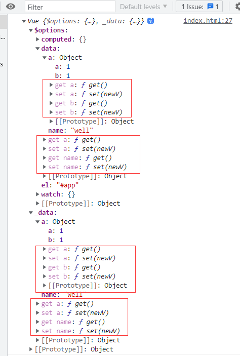
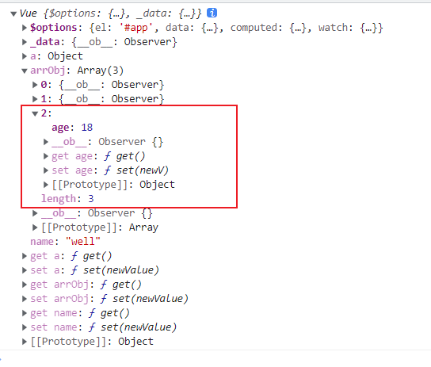
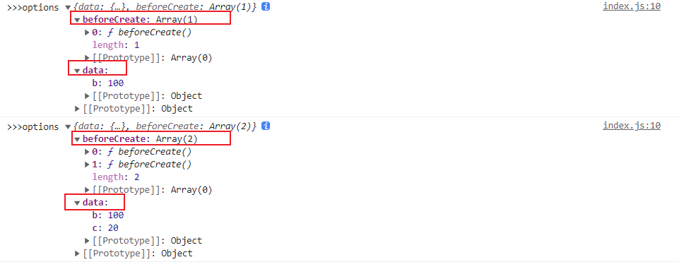
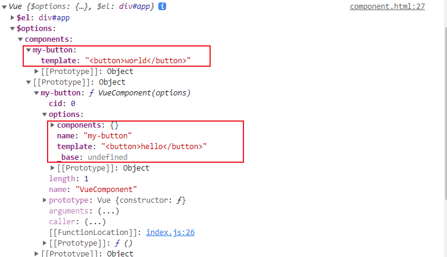

# 一、使用rollup搭建开发环境

```
npm install  @babel/preset-env @babel/core rollup rollup-plugin-babel -D
```

- @babel/core: babel 核心包
- @babel/preset-env：es6+转es5
- rollup-plugin-babel：rollup 的 babel 插件

## rollup.config.js

```
import babel from 'rollup-plugin-babel'

export default {
    input: './src/index.js', // 入口
    output: {
        format: 'umd', // 支持amd 和 commonjs 规范
        name: 'Vue', // window.Vue
        file: 'dist/vue.js',
        sourcemap: true
    },
    pulgins: [
        babel({
            exclude: 'node_modules/**'
        })
    ]
}
```

## 配置.babelrc 文件

```
{
    "presets": [
        "@babel/preset-env"
    ]
}
```

## 执行脚本配置

```
"serve": "rollup -c -w"
```

# 二、响应式原理

## 1.导出 Vue 构造函数

- src/index.js

  ```
  import { initMixin } from "./init"
  
  function Vue(options) {
      // options 为用户传入的选项
      this._init(options) // 初始化操作、组件
  }
  
  // 给原型上新增_init 方法
  initMixin(Vue)
  
  export default Vue
  ```

  - 其_init 是在 initMIxin 中新增的

## 2.init方法中初始化vue状态

- src/init.js

  ```
  import { initState } from "./state"
  
  export function initMixin (Vue) {
      Vue.prototype._init = function (options) {
          // el, data
          const vm = this
          vm.$options = options
  
          // 对数据进行初始化（watch、computed、props、data...）
          // 这些数据都存在于vm.options
          initState(vm)
      }
  }
  ```

  - 把实例化的参数options 赋值给 $options
  - 对数据进行初始化

## 3. 根据不同属性进行初始化操作

- src/state.js

  ```
  import { isFunction } from "./utils"
  import { observe } from "./observer/index"
  
  export function initState (vm) {
      const opts = vm.$options
      // 初始化data
      if (opts.data) {
          initData(vm)
      }
      // 初始化方法
      if (opts.methods) {
          initMethod(vm)
      }
      // 初始化 props
      if (opts.props) {
          initProps(vm)
      }
      // 初始化 computed
      if (opts.computed) {
          initComputed(vm)
      }
      // 初始化 watch
      if (opts.watch) {
          initWatch(vm)
      }
      
      function initData(vm) {
          let data = vm.$options.data
          // vue2 中会将data 中的所有数值进行数据劫持(Object.defineProperty)
          // 如果传入的data 是一个方法，则取其返回值，否则取其值
          data = vm._data = isFunction(data) ? data.call(vm) : data
  
          // 数据响应式
          observe(data)
      }
  
      // 未实现的方法
      function initProps() {}
      function initMethod() {}
      function initComputed() {}
      function initWatch() {}
  }
  ```

  - vue2 中将data 中的所有数值进行数据劫持（object.defineProperty）
  - 判断data，如果传入的是一个方法，则取其返回值，否则取其值即可
  - 通过observe(data) 进行劫持

## 4.数据劫持

- src/observer/index.js

  ```
  import { isObject } from "../utils";
  
  class Observer {
      // 对对象中的所有属性进行劫持
      constructor (data) {
          this.walk(data)
      }
      walk(data) {
          Object.keys(data).forEach(key => {
              defineReactive(data, key, data[key])
          })
      }
  }
  
  // vue2 会对对象进行遍历，将每个属性使用defineProperty 重新定义，导致性能差
  function defineReactive(data, key, value) {
      // 如果value是一个对象，则继续递归进行劫持
      observe(value) 
      Object.defineProperty(data, key, {
          get() {
              return value
          },
          set(newV) {
              // 如果用户赋值一个新对象，需要将这个对象进行劫持
              observe(newV)
              value = newV
          }
      })
  }
  
  export function observe(data) {
      // 如果是对象才观察（省略对数组进行处理）
      if (!isObject(data)) {
          return
      }
      
      // 默认最外层 data 必须是一个对象
      return new Observer(data)
  }
  ```

  1. 判断是否是对象才进行劫持
  2. 递归遍历对象，通过defineReactive 这个函数进行劫持
  3. defineReactive 中通过Object.defineProperty进行劫持
     - 如果劫持的属性值是一个对象的时候，继续递归劫持
     - 自定义set函数中，如果用户对一个属性重新赋值，需要对这个属性进行劫持

## 5.测试

```
<body>
    <div id="app"></div>
    <script src="../dist/vue.js"></script>
    <script>
        // viewModal 数据模型
        // 典型的MVVM view vm modal
        let vm = new Vue({
            el: '#app',
            data: {
                name: 'well',
                a: {
                    a: 1
                }
            },
            computed: {},
            watch: {}
        })
        vm._data.a = { ...vm._data.a, b: 1}
    </script>
</body>
```



## 6.数据代理

- src/state.js

  ```js
  ...
  function proxy (vm, source, key) {
          Object.defineProperty(vm, key, {
              get() {
                  return vm[source][key]
              },
              set(newValue) {
                  vm[source][key] = newValue
              }
          })
      }
      
  function initData(vm) {
      let data = vm.$options.data
      // vue2 中会将data 中的所有数值进行数据劫持(Object.defineProperty)
      // 如果传入的data 是一个方法，则取其返回值，否则取其值
      data = vm._data = isFunction(data) ? data.call(vm) : data
  
      // 数据响应式
      observe(data)
  
      // 数据代理
      for (let key in data) {
          proxy(vm, '_data', key)
      }
  }
      
  ```

## 7.数组的递归监控

用户很少通过索引操作数组，vue 内部就想到不对索引进行劫持，因为消耗严重，内部数组不采用defineProperty

- push
- shift
- pop
- unshift
- reverse
- sort
- splice

上面7个方法非纯函数，会更改原数组

- src/observer/index.js

  ```
  import { isObject } from "../utils";
  import { arrayMethods } from './array'
  
  class Observer {
      // 对对象中的所有属性进行劫持
      constructor (data) {
          // 使__ob__属性不可枚举，如果不这么做，data会一直是一个对象，则溢栈
          // 这里把__ob__挂载在实例上，同时此属性不可枚举
          Object.defineProperty(data, '__ob__', {
              value: this,
              enumerable: false
          })
          // 如果是数组，则进行数组劫持的逻辑
          // 对数组原来的方法进行改写
          if (Array.isArray(data)) {
              data.__proto__ = arrayMethods
              // 如果数组中的数据是对象类型，需要监控对象的变化
              this.observeArray(data)
          } else {
              this.walk(data)
          }
      }
      observeArray(data) {
          // 对数组中的数组 数组中的对象再次劫持
          data.forEach(item => {
              observe(item)
          })
      }
      walk(data) {
          ...
      }
  }
  
  // vue2 会对对象进行遍历，将每个属性使用defineProperty 重新定义，导致性能差
  function defineReactive(data, key, value) {
     ...
  }
  
  export function observe(data) {
      ...
      // 如果已经被观察过了则不需再观察
      if (data.__ob__) {
          return
      }
      // 默认最外层 data 必须是一个对象
      return new Observer(data)
  }
  ```

  - 如果是数组，则调用observeArray()

  - observeArray 方法遍历data进行劫持

  - ```
     Object.defineProperty(data, '__ob__', {
                value: this,
                enumerable: false
     })
    ```

    这里把`__ob__`挂载到实例上，同时不可枚举，防止后面一直判断到data是一个对象死循环

- src/observer/array.js

  ```
  // arrayMethods.__proto__ = Array.prototype
  let oldArrayProrotype = Array.prototype
  export let arrayMethods = Object.create(oldArrayProrotype)
  
  let methods = [
      'push',
      'shift',
      'unshift',
      'pop',
      'reverse',
      'sort',
      'splice'
  ]
  
  methods.forEach(method => {
      // 用户调用的，如果是以上七个方法，则使用自己重写的，否则用原来的数组方法
      arrayMethods[method] = function (...args) {
          // vm.name.push(×××), 则this表示vm
          oldArrayProrotype[method].call(this, ...args)
          // 新增的内容
          let inserted
          // 根据当前数组获取到observe实例
          let ob = this.__ob__
          switch (method) {
              case 'push':
              case 'unshift':
                  inserted = args
                  break
              case 'splice':
                  inserted = args.splice(2)
                  break
              default:
                  break
          }
          // 如果有新增的内容要进行继续劫持
          if (inserted) {
              ob.observeArray(inserted)
          }
      }
  })
  ```

  - 对数组的方法进行重写
  - 对数组的方法增加的内容进行劫持

- index.html

  ```
  <script>
          // viewModal 数据模型
          // 典型的MVVM view vm modal
          let vm = new Vue({
              el: '#app',
              data: {
                  name: 'well',
                  a: {
                      a: 1
                  },
                  // arr: [1, 2, 3],
                  arrObj: [
                      {
                          name: 'well'
                      },
                      {
                          name: 'well'
                      }
                  ]
              },
              computed: {},
              watch: {}
          })
          vm._data.a = { ...vm._data.a, b: 1}
          vm.arrObj[1].name = '123'
          vm.arrObj.push({age: 18})
          console.log(vm)
      </script>
  ```

  

# 三、模板编译

## 1.处理render方法

- src/init.js

```
import { initState } from "./state"
import { compileToFunctions } from './compiler/index'

export function initMixin (Vue) {
    Vue.prototype._init = function (options) {
        ...
        // 页面挂载
        if (vm.$options.el) {
            // 将数据挂载到这个模板上
            vm.$mount(vm.$options.el)
        }
    }
    Vue.prototype.$mount = function (el) {
        const vm = this
        const options = vm.$options
        el = document.querySelector(el)
        // 把模板转化成对应的渲染函数 =》虚拟dom的概念 Vnode =》
        // diff算法更新虚拟dom =》 产生真实节点，更新
        // 如果没有render方法
        if (!options.render) {
            let template = options.template
            // 如果没有模板但是有el
            if (!template && el) {
                template = el.outerHTML
            }
            const render = compileToFunctions(template)
            options.render = render
        }
    }
}
```

- 往Vue的prototype挂载$mount方法
- 执行$mount方法
- 通过$mount方法将模板转化成渲染函数

## 2.解析标签和模板

- src/compiler/index.js

  ```
  // 匹配标签名 div
  const ncname = `[a-zA-Z_][\\-\\.0-9_a-zA-Z]*`
  // 获取获取标签名的 match 数组索引为1的: div
  const qnameCapture = `((?:${ncname}\\:)?${ncname})`
  /* let r = '<div></div>'.match(new RegExp(qnameCapture))
  console.log(r) // [ 'div', 'div', index: 1, input: '<div></div>', groups: undefined ] */
  
  // 匹配开始标签
  const startTagOpen = new RegExp(`^<${qnameCapture}`)
  // 匹配闭合标签
  const endTag = new RegExp(`^<\\/${qnameCapture}[^>]*>`)
  
  // 匹配属性 a=b a="b" a='b'
  const attribute = /^\s*([^\s"'<>\/=]+)(?:\s*(=)\s*(?:"([^"]*)"+|'([^']*)'+|([^\s"'=<>`]+)))?/
  //  />
  const startTagClose = /^\s*(\/?)>/
  // {{name}}
  const defaultTagRE = /\{\{((?:.|\r?\n)+?)\}\}/g
  
  // html 字符串解析成对应的脚本来触发 tokens <div id="app">{{name}}</div>
  
  function start (tagName, attributes) {
      console.log(tagName, attributes)
  }
  function end (tagName) {
      console.log(tagName)
  }
  function chars(text) {
      console.log(text)
  }
  function parserHTML(html) { // <div id="app">{{name}}</div>
      // 截取字符串
      function advance (len) {
          html = html.substring(len)
      }
      // 匹配标签开头
      function parseStartTag () {
          const start = html.match(startTagOpen)
          // console.log(start) // ['<div', 'div']
          if (start) {
              const match = {
                  tagName: start[1],
                  attrs: []
              }
              advance(start[0].length)
              // console.log(html) // id="app">{{name}}</div>
              let end,attr
              // 如果没有遇到标签结尾就不停的解析
              while(!(end = html.match(startTagClose)) && (attr = html.match(attribute))) {
                  // console.log(attr) // [' id="app"', 'id', '=', 'app', undefined, undefined]
                  advance(attr[0].length)
                  match.attrs.push({
                      name: attr[1],
                      value: attr[3] || attr[4] || attr[5]
                  })
                  /* console.log(match)
                  {
                      tagName: 'div',
                      attrs: [
                          {
                              name: 'id',
                              value: 'app'
                          }
                      ]
  
                  } */
                  // console.log(html) // >{{name}}</div>
              }
              if (end) {
                  // console.log(end)
                  // ['>', '']
                  advance(end[0].length)
                  return match
              }
  
          }
          // 不是开始标签
          return false 
      }
      
      // 解析的内容如果存在则不停地解析
      while (html) {
          // 当前解析的开头
          let textEnd = html.indexOf('<')
          if (textEnd === 0) {
              const startTagMatch = parseStartTag(html)
              if (startTagMatch) {
                  start(startTagMatch.tagName, startTagMatch.attrs)
                  continue
              }
              const endTagMatch = html.match(endTag)
              if (endTagMatch) {
                  end(endTagMatch[1])
                  advance(endTagMatch[0].length)
                  continue
              }
          }
          // 处理文本
          let text // {{name}}</div>
          if (textEnd >= 0) {
              text = html.substring(0, textEnd)
          }
          if (text) {
              chars(text)
              advance(text.length)
          }
      }
  }
  export function compileToFunctions (template) {
      
      parserHTML(template)
  }
  ```

  - 调用parserHTML()
  - 匹配标签开头、属性、结尾、文本

## 3.构造AST语法树

- compiler/parser.js

  ```
  let root
  let currentParent
  let stack = []
  const ELEMENT_TYPE = 1
  const TEXT_TYPE = 3
  function createASTElement(tagName, attrs) {
      return {
          tag: tagName,
          type: ELEMENT_TYPE,
          children: [],
          attrs,
          parent: null
      }
  }
  
  // html 字符串解析成对应的脚本来触发 tokens <div id="app">{{name}}</div>
  
  function start(tagName, attributes) {
      let element = createASTElement(tagName, attributes)
      if (!root) {
          root = element
      }
      currentParent = element
      stack.push(element)
  }
  function end(tagName) {
      let element = stack.pop()
      currentParent = stack[stack.length - 1]
      if (currentParent) {
          element.parent = currentParent
          currentParent.children.push(element)
      }
  }
  function chars(text) {
      text = text.replace(/\s/g, '')
      if (text) {
          currentParent.children.push({
              type: TEXT_TYPE,
              text
          })
      }
  }
  ```

## 4.codegen生成对应代码

- src/compiler/generate.js

  ```
  const defaultTagRE = /\{\{((?:.|\r?\n)+?)\}\}/g
  
  function gen (node) {
      if (node.type === 1) {
          return generate(node)
      } else {
          let text = node.text
          if (!defaultTagRE.test(text)) {
              return `_v(${JSON.stringify(text)})`
          }
          let lastIndex = defaultTagRE.lastIndex = 0
          let tokens = []
          let match,index
          while(match = defaultTagRE.exec(text)) {
              index = match.index
              if (index > lastIndex) {
                  tokens.push(JSON.stringify(text.slice(lastIndex, index)))
              }
              tokens.push(`_s(${match[1].trim()})`)
              lastIndex = index + match[0].length
          }
          if (lastIndex < text.length) {
              tokens.push(JSON.stringify(text.slice(lastIndex)))
          }
          return `_v(${tokens.join('+')})`
      }
  }
  
  function getChildren(el) {
      const children = el.children
      if (children) {
          return `${children.map(c => gen(c)).join(',')}`
      } else {
          return false
      }
  }
  
  function genProps(attrs) {
      let str = ''
      for (let i=0; i<attrs.length; i++) {
          let attr = attrs[i]
          if (attr.name === 'style') {
              let obj = {}
              attr.value.split(';').forEach(item => {
                  let [key, value] = item.split(':')
                  obj[key] = value
              })
              attr.value = obj
          }
          str += `${attr.name}:${JSON.stringify(attr.value)},`
      }
      return `{${str.slice(0, -1)}}`
  }
  
  export function generate (el) {
      let children = getChildren(el)
      let code = `_c('${el.tag}',${
          el.attrs.length?`${genProps(el.attrs)}`:'undefined'
      }${
          children?`,${children}`:''
      })`
      return code
  }
  ```

- index.html

  ```
  <div id="app">
          <ul>
              <li class="first" style="color: red;background: blue;">{{name}}</li>
              <li class="second">{{name}}</li>
          </ul>
          <ul>
              <li class="first">{{name}}</li>
              <li class="second">{{name}}</li>
          </ul>
      </div>
  ```

- 结果

  ```
  _c('div',{id:"app"},_c('ul',undefined,_c('li',{class:"first",style:{"color":" red","background":" blue"}},_v(_s(name))),_c('li',{class:"second"},_v(_s(name)))),_c('ul',undefined,_c('li',{class:"first"},_v(_s(name))),_c('li',{class:"second"},_v(_s(name)))))
  ```

## 5.生成render模板

即使字符串转成代码，有两种方法

- eval：消耗性能，作用域问题
- new Function()

- compiler/index.js

```
import { parserHTML } from './parser'
import { generate } from './generate'

export function compileToFunctions (template) {
    
    let root = parserHTML(template)
    console.log(root)
    let code = generate(root)
    console.log(code)
    let render = `with(this){return ${code}}`
    return render
}
```

- 由于数据在data上，需要用with去指定作用域

# 四、组件挂载

## 1.生成虚拟dom

- src/index.js

  ```
  import { initMixin } from "./init"
  import { lifecycleMixin } from "./lifecycle"
  import { renderMixin } from "./render"
  function Vue(options) {
      // options 为用户传入的选项
      this._init(options) // 初始化操作、组件
  }
  
  // 给原型上新增_init 方法
  initMixin(Vue)
  renderMixin(Vue)
  lifecycleMixin(Vue)
  
  export default Vue
  ```

  - 执行renderMixin、lifecycleMixin
  - 给原型上挂载对应方法

- src/lifecycle.js

  ```
  export function lifecycleMixin(Vue) {
      Vue.prototype._update = function (vnode) {
          console.log('update')
      }
  }
  
  export function mountComponent(vm, el) {
      // 更新函数 数据变化后 会再次调用此函数
      let updateComponent = () => {
          // 1.调用render函数，生成、更新虚拟dom
          // 2.用虚拟dom生成真实dom
  
          vm._update(vm._render())
      }
      updateComponent()
  }
  ```

  - 挂载 _update 方法，用于更新虚拟dom
  - 导出mountComponent 方法, 此方法中执行updateComponent函数，用于更新组件

- src/render.js

  ```
  import { createElement, createTextNode } from "./vdom/index"
  
  export function renderMixin (Vue) {
      Vue.prototype._c = function () {
          return createElement(this, ...arguments)
      }
      Vue.prototype._v = function (text) {
          return createTextNode(this, text)
      }
      Vue.prototype._s = function (val) {
          return val == null ? '' : (typeof val === 'object' ? JSON.stringify(val) : val)
      }
      Vue.prototype._render = function() {
          const vm = this
          // 获取 render 函数
          let render = vm.$options.render
          let vnode = render.call(vm)
          console.log('vnode>>>', vnode)
          return vnode
      }
  }
  ```

  - 导出_render 方法，用于调用渲染函数render,生成虚拟dom
  - 挂载`_c、_v、_s`，供渲染函数render内部调用

- src/init.js

  ```
  import { initState } from "./state"
  import { compileToFunctions } from './compiler/index'
  import { mountComponent } from "./lifecycle"
  
  export function initMixin (Vue) {
      Vue.prototype._init = function (options) {
          ...
      }
      Vue.prototype.$mount = function (el) {
         ...
          // 组件挂载
          mountComponent(vm, el)
      }
  }
  ```

## 2.生成真实dom

- src/lifecycle.js

  ```
  import { patch } from "./vdom/patch"
  
  export function lifecycleMixin(Vue) {
      Vue.prototype._update = function (vnode) {
          const vm = this
          patch(vm.$el, vnode)
      }
  }
  
  export function mountComponent(vm, el) {
    ...
  }
  ```

  - 调用patch函数

- src/vdom/patch.js 

  ```
  export function patch(oldVnode, vnode) {
      // 如果是元素
      if (oldVnode.nodeType === 1) {
          // 用vnode来生成真实dom，替换成原来的dom元素
  
          // 找到其父亲元素
          const parentElm = oldVnode.parentNode
          // 根据虚拟节点创建元素
          let elm = createElm(vnode)
          parentElm.insertBefore(elm, oldVnode.nextSibling)
          // 把自己删除
          parentElm.removeChild(oldVnode)
      }
  }
  
  function createElm (vnode) {
      let { tag, data, children, text, vm } = vnode
      // 如果是元素
      if (typeof tag ==='string') {
          // 虚拟节点会有一个el属性，对应真实节点
          vnode.el = document.createElement(tag)
          updateProperties(vnode)
          children.forEach(child => {
              vnode.el.appendChild(createElm(child))
          })
      } else {
          vnode.el = document.createTextNode(text)
      }
      return vnode.el
  }
  
  function updateProperties(vnode) {
      let newProps = vnode.data || {}
      // 当前真实节点
      let el = vnode.el
      for (let key in newProps) {
          // 如果是有style属性
          if (key === 'style') {
              for (let styleName in newProps.style) {
                  el.style[styleName] = newProps.style[styleName]
              }
          } else if (key === 'class') {
              el.className = newProps.class
          } else {
              el.setAttribute(key, newProps[key])
          }
      }
  }
  ```

  - 找到真实dom的父节点，通过vnode创建真实节点挂载在父节点上，删除旧节点

# 五.响应式原理

## 1.对象依赖收集

### 1 手动更新视图

- src/vdom/patch.js

  ```
  export function patch(oldVnode, vnode) {
      // 如果是元素
      if (oldVnode.nodeType === 1) {
          // 用vnode来生成真实dom，替换成原来的dom元素
  
          // 找到其父亲元素
          const parentElm = oldVnode.parentNode
          // 根据虚拟节点创建元素
          let elm = createElm(vnode)
          parentElm.insertBefore(elm, oldVnode.nextSibling)
          // 把自己删除
          parentElm.removeChild(oldVnode)
          return elm
      }
  }
  ```

  - 返回新的dom元素

- src/lifecycle.js

  ```
  export function lifecycleMixin(Vue) {
      Vue.prototype._update = function (vnode) {
          const vm = this
          vm.$el = patch(vm.$el, vnode)
      }
  }
  ```

  - 将返回的dom元素作为$el,下次对比的时候vnode跟他对比

- index.html

  ```
  // 数据变化需要影响视图
  setTimeout(() => {
  	vm.name = 'liuguowei'
  	// 重新调用render方法产生
  	vm._update(vm._render())
  }, 1000)
  ```

### 2 自动更新

- 观察者模式
  - 属性：“被观察者”
  - 刷新页面：“观察者”
- 每个组件渲染的时候都会有一个watcher

- src/lifecycle.js

  ```
  export function mountComponent(vm, el) {
      // 更新函数 数据变化后 会再次调用此函数
      let updateComponent = () => {
          // 1.调用render函数，生成、更新虚拟dom
          // 2.用虚拟dom生成真实dom
  
          vm._update(vm._render())
      }
      // updateComponent()
      // 观察者模式 属性：“被观察者” 刷新页面：“观察者”
      new Watcher(vm, updateComponent, () => {
          console.log('更新视图了')
      }, true) // true 表示是一个渲染watcher，后续有其他watcher
  }
  ```

  - 不再手动调用updateComponent
  - 通过 new Watcher() 创建 Watcher 实例

- src/observer/watcher.js

  ```
  import { popTarget, pushTarget } from "./dep"
  
  let id = 0
  class Watcher {
      constructor(vm, exprOrFn, cb, options) {
          this.vm = vm
          this.exprOrFn = exprOrFn
          this.cb = cb
          this.options = options
          this.id = id++
          this.deps = [] // 存放 dep
          this.depsId = new Set() // 用于去重 dep
  
          // 默认应该让exprOrFn 执行，exprOrFn => render => 去vm上取值
          this.getter = exprOrFn
          this.get() // 默认初始化，要取值
      }
      get() {
          // 由于取值会触发 defineProperty.get
          // 一个属性可以有多个watcher，一个watcher可以对应多个属性（多对多）
          // 每个属性都可以收集自己的watcher
          pushTarget(this) // 往Dep的target属性上挂载Watcher 实例
          this.getter()
          popTarget()
      }
      // 存放dep，同时让dep存储watcher实例
      addDep(dep) {
          let id = dep.id
          if (!this.depsId.has(id)) {
              this.depsId.add(id)
              this.deps.push(dep)
              dep.addSub(this) // 让dep 存储Watcher 实例
          }
      }
      // 更新视图
      update() {
          this.get()
      }
  }
  
  export default Watcher
  ```

  - 实例化的时候就执行get方法
    1. 往Dep的target属性上挂载Watcher 实例
    2. 执行传入的updateComponent，这里会取data的值，触发object.defineProperty()
    3. 清除Dep的target属性上的Watcher 实例
  - addDep
    1. 由于在Dep的target属性上挂载了Watcher 实例，可以通过Dep.target获取Watcher实例，调用此方法
    2. 此方法可以存储dep实例，同时通过传参获取dep实例使实例存储Watcher实例

- src/observer/dep.js

  ```
  // 每个属性都分配一份dep,
  // dep 可以用来存放watcher
  // watcher 中还要存放这个dep
  
  let id = 0
  export class Dep {
      constructor () {
          this.id = id++
          this.subs = [] // 存放watcher
      }
      // 让Watcher实例存放dep
      depend () {
          // Dep.target 就是Watcher
          if (Dep.target) {
              Dep.target.addDep(this) // 让Watcher 去存放dep
          }
      }
      // dep 实例存放 watcher 实例
      addSub(watcher) {
          this.subs.push(watcher)
      }
      // 通知关联的每一个watcher更新
      notify() {
          this.subs.forEach(watcher => watcher.update())
      }
  }
  
  Dep.target = null
  
  export function pushTarget(watcher) {
      Dep.target = watcher
  }
  
  export function popTarget() {
      Dep.target = null
  }
  ```

  - depend
  - addSub
  - notify

- src/observer/index.js

  ```
  function defineReactive(data, key, value) {
      // 如果value是一个对象，则继续递归进行劫持
      observe(value) 
      // 每个属性都有一个dep属性
      // 创建dep实例，下面的setter和getter可以通过闭包访问到
      let dep = new Dep()
      Object.defineProperty(data, key, {
          get() {
              // 取值时将watcher和dep对应起来
              if (Dep.target) {
                  // 收集依赖
                  dep.depend()
              }
              return value
          },
          set(newV) {
              // 如果用户赋值一个新对象，需要将这个对象进行劫持
  
              // 如果新旧值相同则return
              if (newV === value) return 
              observe(newV)
              value = newV
              dep.notify() // 通知渲染Watcher 去更新
          }
      })
  }
  ```
  
  - 通过闭包使getter和setter可以访问到对应的实例

## 2.异步更新原理之nextTick

- src/observer/watcher.js

  ```
  import { popTarget, pushTarget } from "./dep"
  import { queueWatcher } from "./scheduler"
  
  let id = 0
  class Watcher {
      constructor(vm, exprOrFn, cb, options) {
          ...
      }
      get() {
         ...
      }
      // 存放dep，同时让dep存储watcher实例
      addDep(dep) {
         ...
      }
      // 更新视图(vue中更新是异步的)
      update() {
          // this.get()
          // 多次调用update，先将watcher缓存下来，收集起来一起更新
          queueWatcher(this)
      }
      run () {
          this.get()
      }
  }
  
  export default Watcher
  ```

- src/observer/scheduler.js

  ```
  import { nextTick } from "../next-tick"
  
  let queue = []
  let has = {} // 做列表的 列表维护存放了哪些watcher
  
  function flushSchedulerQueue () {
      for (let i=0; i<queue.length; i++) {
          let watcher = queue[i]
          watcher.run()
      }
      queue = []
      has = {}
  }
  
  let pending = false
  export function queueWatcher (watcher) {
      const id = watcher.id
      if (has[id] == null) {
          has[id] = true
          queue.push(watcher)
          // 开启一次更新操作，批处理
          if (!pending) {
              nextTick(flushSchedulerQueue)
              pending = true
          }
      }
  }
  ```

  - 通过queueWatcher方法过滤相同的watcher的id，存储到栈中
  - 由于vue的更新操作是异步的，所以需要使用nextTick方法对。

- src/next-tick.js

  ```
  let callbacks = []
  
  function flushCallbacks () {
      callbacks.forEach(cb => cb())
  }
  
  let timerFunc
  let waiting = false
  if (Promise) {
      timerFunc = () => {
          Promise.resolve().then(flushCallbacks)
      }
  } else if (MutationObserver) {
      let observe = new MutationObserver(flushCallbacks)
      let textNode = document.createTextNode(1)
      observe.observe(textNode, {
          characterData: true
      })
      timerFunc = () => {
          textNode.textContent = 2
      }
  } else if (setImmediate) {
      timerFunc = () => {
          setImmediate(flushCallbacks)
      }
  } else {
      timerFunc = () => {
          setTimeout(flushCallbacks, 0)
      }
  }
  
  export function nextTick (cb) {
      callbacks.push(cb)
      if (!waiting) {
          timerFunc()
          waiting = true
      }
  }
  ```

  - 收集所有的callback，使callback在微任务中调用，后于同步代码的执行（多个判断是做了兼容性处理）

- src/lifecycle.js

  ```
  import { nextTick } from "./next-tick"
  
  export function lifecycleMixin(Vue) {
      ...
      Vue.prototype.$nextTick = nextTick
  }
  ```

- index.html

  ```
  setTimeout(() => {
      vm.name = 'liuguowei'
      vm.name = '123'
      vm.name = 'abc'
  
      vm.$nextTick(() => {
      	console.log('>>>nextTick', vm.$el)
      })
  }, 1000)
  ```

## 3.数组依赖收集

- src/observer/index.js

  ```
  import { isObject } from "../utils";
  import { arrayMethods } from './array'
  import { Dep } from './dep'
  
  // 如果给对象新增一个属性不会触发视图更新（需要用$set）
  // 给对象本身也增加一个dep进行存储watcher，如果增加一个属性手动的触发watcher的更新
  class Observer {
      // 对对象中的所有属性进行劫持
      constructor (data) {
          // 数据可能使数组或者对象
          this.dep = new Dep()
          ...
      }
  }
  
  function dependArray (value) {
      for (let i=0; i<value.length; i++) {
          let current = value[i]
          // current 是数组里面的数组
          current.__ob__ && current.__ob__.dep.depend()
          if (Array.isArray(current)) {
              // 取外层数组要将数组里面的也进行依赖收集
              dependArray(current)
          }
      }
  }
  
  // vue2 会对对象进行遍历，将每个属性使用defineProperty 重新定义，导致性能差
  function defineReactive(data, key, value) {
      // 如果value是一个对象，则继续递归进行劫持
      let childOb = observe(value) 
      // 每个属性都有一个dep属性
      // 创建dep实例，下面的setter和getter可以通过闭包访问到
      let dep = new Dep()
      Object.defineProperty(data, key, {
          get() {
              // 取值时将watcher和dep对应起来
              if (Dep.target) {
                  // 收集依赖
                  dep.depend()
                  // childOb 可能是数组或者对象，后续写$set方法需要触发他自己的更新
                  if (childOb) {
                      // 让数组和对象也记录watcher
                      childOb.dep.depend()
                      if (Array.isArray(value)) {
                          dependArray(value)
                      }
                  }
              }
              return value
          },
          set(newV) {
              ...
          }
      })
  }
  ```

  - 通过在Observer的constructor中，给每个实例加上dep
  - dependArray： 如果是数组，则通过其dep.depend去收集依赖，数组嵌套数组使用递归的方式去收集

- src/observer/array.js

  ```
  methods.forEach(method => {
      arrayMethods[method] = function (...args) {
         	...
          // 数组的observer.dep 数组
          ob.dep.notify()
      }
  })
  ```


# 六、watcher&computed

## 1.watcher

- src/state.js

  ```
  // 初始化 watch
  if (opts.watch) {
  	initWatch(vm, opts.watch)
  }
  
  function initWatch(vm, watch) {
  	for (const key in watch) {
  	const handler = watch[key]
      // 如果结果值是数组循环创建watcher
      if (Array.isArray(handler)) {
          for (let i=0; i<handler.length; i++) {
              createWatcher(vm, key, handler[i])
              }
          } else {
              createWatcher(vm, key, handler)
          }
      }
  }
  function createWatcher(vm, exprOrFn, handler, options) {
      // 如果是对象则提取函数和配置
      if (isObject(handler)) {
          options = handler
          handler = handler.handler
      }
      // 如果是字符串就是实例上的函数
      if (typeof handler === 'string') {
      	handler = vm[handler]
      }
      	return vm.$watch(exprOrFn, handler, options)
      }
  }
  
  export function stateMixin(Vue) {
      Vue.prototype.$watch = function(exprOrFn, cb, options = {})  {
          // 标记为用户watcher
          options.user = true
          // 核销就是创建个watcher
          const watcher = new Watcher(this, exprOrFn, cb, options)
          if (options.immediate) {
              cb.call(vm, watcher.value)
          }
      }
  ```

  - initWatch: 对数组进行初始化
  - createWatcher：最终都是调用vm.$watch来实现
    1. 值是对象
    2. 值是数组
    3. 值是字符串

- src/observer/watcher.js

  ```
  
  class Watcher {
      constructor(vm, exprOrFn, cb, options) {
          ...
          this.user = !!options.user
  
          // 如果是渲染watcher
          if (typeof exprOrFn === 'function') {
              this.getter = exprOrFn
          } else {
              this.getter = function () {
                  let path = exprOrFn.split('.')
                  let obj = vm
                  for (let i=0; i<path.length; i++) {
                      obj = obj[path[i]]
                  }
                  return obj
              }
          }
          // 将初始值记录到value属性上
          this.value = this.get() // 默认初始化，要取值
      }
      get() {
          pushTarget(this)
          const value = this.getter.call(this.vm)
          popTarget()
          return value
      }
      run () {
          let value = this.get()
          let oldValue = this.value
          this.value = value
          if (this.user) {
              this.cb.call(this.vm, value, oldValue)
          }
      }
  }
  
  export default Watcher
  ```

  借助vue响应式原理，默认在取值时将watcher存放到对应属性得dep中，当数据发生变化时通知对应的watcher重新执行

## 2.computed

- 计算属性默认不执行=》Object.defineProperty => getter

- 多次取值如果依赖的值不变化，就不会重新执行

- 依赖的值变化，需要重新执行

- src/state.js

  ```
  // 初始化 computed
  if (opts.computed) {
  	initComputed(vm, opts.computed)
  }
  function initComputed(vm, computed) {
  	// 存放计算属性的watcher
  	const watchers = vm._computedWatchers = {}
  	for (let key in computed) {
  		const userDef = computed[key]
  		// 依赖的属性变化就重新取值
  		let getter = typeof userDef === 'function' ? userDef : userDef.get
  
          // 每个计算属性本质上就是watcher
          // lazy:true 默认不执行
          // 将watcher和属性做一个映射
          watchers[key] = new Watcher(vm, getter, () => {}, {lazy: true})
          // 将key定义在vm上
          defineComputed(vm, key, userDef)
  	}
  }
  function defineComputed(vm, key, userDef) {
      let sharedProperty = {}
      if (typeof userDef === 'function') {
      	sharedProperty.get = createComputedGetter(key)
      } else {
          sharedProperty.get = createComputedGetter(key)
          sharedProperty.set = userDef.set
      }
      Object.defineProperty(vm, key, sharedProperty)
  }
  function createComputedGetter(key) {
  	// 取计算属性的值，走的是这个函数
  	return function computedGetter() {
          // this._computedWatchers 包含着所有的计算属性
          // 通过key 可以拿到对应的watcher，这个watcher中包含了getter
          let watcher = this._computedWatchers[key]
          if (watcher.dirty) {
              watcher.evaluate()
          }
          // 如果当前取值后 Dep.target 还有值，需要继续向上收集
          if (Dep.target) {
              watcher.depend()
          }
          return watcher.value
  	}
  }
  ```

- observer/watcher.js

  ```
  // 如果是计算属性，lazy，dirty默认为true
  this.lazy = options.lazy
  this.dirty = options.lazy
  ...
  this.value = this.lazy ? undefined : this.get() // 默认初始化，要取值
  ...
  update() {
  	// this.get()
      if (this.lazy) {
      	this.dirty = true 
      } else {
      	// 多次调用update，先将watcher缓存下来，收集起来一起更新
      	queueWatcher(this)
      }
  }
  ...
  evaluate() {
      // 已经取过值了
      this.dirty = false
      // 用户的getter执行
      this.value = this.get()
  }
  depend() {
      let i = this.deps.length
      while (i--) {
      	this.deps[i].depend()
      }
  }
  ```

- observer/dep.js

  ```
  let stack = []
  
  export function pushTarget(watcher) {
      Dep.target = watcher
      stack.push(watcher)
      console.log('>>>stack', stack)
  }
  
  export function popTarget() {
      stack.pop()
      Dep.target = stack[stack.length - 1]
  }
  ```


# 七、生命周期

## 1.Mixin 与 合并生命周期

- src/index.js

  ```
  import { initGlobalApi } from "./global-api/index"
  ...
  // 在类上扩展的Vue.mixin
  initGlobalApi(Vue)
  
  export default Vue
  ```

  

- src/global-api/index.js

  ```
  import { mergeOptions } from "../utils"
  
  export function initGlobalApi(Vue) {
      // 用来存放全局的配置，每个组件初始化的时候都会和options选项进行合并
      // 如 Vue.component Vue.filter Vue.directive
      Vue.options = {}
      
      Vue.mixin = function (options) {
          this.options = mergeOptions(this.options, options)
          console.log('>>>options', this.options)
          return this
      }
  }
  ```

  - 通过 mergeOptions 把 mixin 中传入的对象进行合并

- 合并生命周期

  ```
  export const LIFECYCLE_HOOKS = [
      'beforeCreate',
      'created',
      'beforeMount',
      'mounted',
      'beforeUpdate',
      'updated',
      'beforeDestroy',
      'destroyed'
  ]
  
  const starts = {}
  function mergeHook(parentVal, childVal) {
      if (childVal) {
          if (parentVal) {
              return parentVal.concat(childVal)
          } else {
              return [childVal]
          }
      } else {
          return parentVal
      }
  }
  LIFECYCLE_HOOKS.forEach(hook => {
      starts[hook] = mergeHook
  })
  
  export function mergeOptions(parent, child) {
      // 合并后的结果
      const options = {}
      for (let key in parent) {
          mergeFiled(key)
      }
      for (let key in child) {
          if (!parent.hasOwnProperty(key)) {
              mergeFiled(key)
          }
      }
      function mergeFiled(key) {
          // 使用策略模式处理钩子
          if (starts[key]) {
              options[key] = starts[key](parent[key], child[key])
          } else {
              if (isObject(parent[key]) && isObject(child[key])) {
                  options[key] = {
                      ...parent[key],
                      ...child[key]
                  }
              } else {
                  options[key] = child[key]
              }
          }
      }
      return options
  }
  ```

  - 先遍历parent后遍历children，通过mergeFiled实现生命周期的合并与其他属性的合并
  - 使用策略模式处理生命周期钩子，使得每个starts 的生命周期属性得到一个具备合并的方法
  - 调用此方法得到合并后的生命周期数组

- 输出

  ```
  Vue.mixin({
      data: {
      b: 100
  	},
      beforeCreate() {
      	console.log('>>>beforeCreate')
      }
  })
  Vue.mixin({
  	data: {
  		c: 20
  	},
  	beforeCreate() {
  		console.log('>>>beforeCreate')
  	}
  })
  const vm = new Vue({
  	el: '#app',
  	beforeCreate() {
  		console.log('>>>beforeCreate')
  	}
  })
  ```

  

## 2.调用生命周期

- src/init.js

  ```
  import { callHook, mountComponent } from "./lifecycle"
  import { mergeOptions } from "./utils"
  
  export function initMixin (Vue) {
      Vue.prototype._init = function (options) {
          // el, data
          const vm = this
          vm.$options = mergeOptions(this.constructor.options, options)
  
          // 对数据进行初始化（watch、computed、props、data...）
          // 这些数据都存在于vm.options
          callHook(vm, 'beforeCreate')
          initState(vm)
          callHook(vm, 'created')
  
          // 页面挂载
          if (vm.$options.el) {
              // 将数据挂载到这个模板上
              vm.$mount(vm.$options.el)
          }
      }
      ...
  }
  ```

  - 把类上的options 和实例上的options进行合并
  - 在数据初始化前调用`beforeCreate` 
  - 在数据初始化后调用`created`

- src/lifecycle.js

  ```
  export function mountComponent(vm, el) {
      // 更新函数 数据变化后 会再次调用此函数
      let updateComponent = () => {
          // 1.调用render函数，生成、更新虚拟dom
          // 2.用虚拟dom生成真实dom
  
          vm._update(vm._render())
      }
      
      callHook(vm, 'beforeMount')
  
      // 观察者模式 属性：“被观察者” 刷新页面：“观察者”
      new Watcher(vm, updateComponent, () => {
          console.log('更新视图了')
      }, true) // true 表示是一个渲染watcher，后续有其他watcher
  }
  
  export function callHook(vm, hook) {
      let handlers = vm.$options[hook]
      if (handlers) {
          for (let i=0; i<handlers.length; i++) {
              handlers[i].call(vm)
          }
      }
  }
  ```

  - 在页面渲染前调用`beforeMount`

# 八、组件原理

## 1.组件的定义流程

- src/global-api/index.js

  ```
  Vue.options.components = {}
  Vue.options._base = Vue
  let cid = 0
  Vue.component = function(id, definition) {
      definition.name = definition.name || id
      // 保证组件的隔离，每个组件都会产生一个新的类，去继承父类
      definition = this.options._base.extend(definition)
      this.options['components'][id] = definition
  }
  // 创建一个子类，继承于Vue，并返回这个类
  Vue.extend = function (extendOptions) {
      const Super = this
      const Sub = function VueComponent(options) {
      	this._init(options)
  	}
  	Sub.cid = cid++
  	// 原型继承
      Sub.prototype = Object.create(Super.prototype)
      Sub.prototype.constructor = Sub
      Sub.options = mergeOptions(
          Super.options,
          extendOptions
      )
  	return Sub
  }
  ```

- utils.js

  ```
  starts.components = function (parentVal, childVal) {
      let options = Object.create(parentVal)
      if (childVal) {
          for (let key in childVal) {
              options[key] = childVal[key]
          }
      }
      return options
  }
  ```

- html

  ```
  Vue.component('my-button', {
  	template: '<button>hello</button>'
  })
  const vm = new Vue({
      el: '#app',
      components: {
          'my-button': {
              template: '<button>world</button>'
          }
  	}
  })
  console.log(vm)
  ```

  

## 2.组件的渲染流程

### 1.创建组件的虚拟节点

- src/vdom/index.js

  ```
  export function createElement(vm, tag, data = {}, ...children) {
      // 在创建虚拟节点的时候我们需要判断这个标签是否是组件，普通标签的虚拟节点和组件标签虚拟节点有所不同
      if (isReservedTag(tag)) {
          return vnode(vm, tag, data, data.key, children, undefined)
      } else {
          // 如果tag是组件，应该渲染一个组件的vnode
          let Ctor = vm.$options.components[tag]
          return createComponent(vm, tag, data, data.key, children, Ctor)
      }
  }
  
  function createComponent(vm, tag, data, key, children, Ctor) {
      // 获取父类构造函数
      const baseCtor = vm.$options._base
      if (isObject(Ctor)) {
          Ctor = baseCtor.extend(Ctor)
      }
      // 组件的生命周期钩子(渲染组件时需要调用此初始化方法)
      data.hook = {
          init(vnode){
              // new 的时候等于 new Vue(), 走init()
              let child = vnode.componentInstance = new Ctor({_isComponent: true})
              // 挂载组件
              child.$mount()
          }
      }
      return vnode(vm, `vue-component-${tag}`, data, key, undefined, {Ctor, children})
  }
  
  function vnode(vm, tag, data, key, children, text, componentOptions) {
      return {
          vm,
          tag,
          data,
          key,
          children,
          text,
          componentOptions
      }
  }
  ```

  - 通过isReservedTag方法判断tag是原生还是非原生，如果不是原生则是组件tag
  - 如果是组件tag，则调用createComponent
    - 通过extends 获取一个继承vue的函数
    - 往组件的data上添加hook属性，此属性的init方法会通过实例化，相当与new Vue()

- utils.js

  ```
  function makeMap(str) {
      const map = {}
      const list = str.split(',')
      for (let i=0; i<list.length; i++) {
          map[list[i]] = true
      }
      return (key) => map[key]
  }
  
  export const isReservedTag = makeMap(
      'a,div,img,image,text,span,input,p,button,ul,li'
  )
  ```

### 2.创建组件真实节点

- src/vdom/patch.js

  ```
  export function patch(oldVnode, vnode) {
      // 判断是要要跟新还是要渲染
      if (!oldVnode) {
          return createElm(vnode)
      }
      ...
  }
  
  function createElm (vnode) {
      let { tag, data, children, text, vm } = vnode
      // 如果是元素
      if (typeof tag ==='string') {
          if (createComponent(vnode)) {
              // 返回组件对应的真实节点
              return vnode.componentInstance.$el
          }
         ...
  }
  
  function createComponent (vnode) {
      let i = vnode.data
      if ((i=i.hook) && (i = i.init)) {
          // 调用init方法
          i(vnode)
      }
      if (vnode.componentInstance) {
          return true
      }
  }
  ```


# 九、diff 算法解析

## 1.基本diff算法

- src/index.js

  ```
  // diff 核心
  // compileToFunctions: 传入template 获得render函数
  import { compileToFunctions } from "./compiler/index"
  // createElm：传入vnode得到真实dom
  import { createElm, patch } from "./vdom/patch"
  
  // 1.标签名不一样，直接删掉老的换成新的即可
  // let oldTemplate = `<div>{{message}}</div>`
  // 2.标签一样比较属性
  // let oldTemplate = `<div style="color: red;background: blue;font-size: 20px;" a=1>{{message}}</div>`
  // 3.一方有儿子 一方没儿子
  // 3.1 老的没儿子， 新的有儿子
  // let oldTemplate = `<div style="color: red;background: blue;font-size: 20px;" a=1></div>`
  // 3.2 老的有儿子,新的没儿子
  let oldTemplate = `<div style="color: red;background: blue;font-size: 20px;" a=1>{{message}}</div>`
  let vm1 = new Vue({data: {message: 'hello'}})
  const render1 = compileToFunctions(oldTemplate)
  const oldVnode = render1.call(vm1)
  document.body.appendChild(createElm(oldVnode))
  
  // v-if v-else
  // 1.标签名不一样，直接删掉老的换成新的即可
  // let newTemplate = `<p>{{message}}</p>`
  // 2.标签一样比较属性
  // let newTemplate = `<div style="color: blue;background: red;" b=2>{{message}}</div>`
  // 3.一方有儿子 一方没儿子
  // 3.1 老的没儿子， 新的有儿子
  // let newTemplate = `<div style="color: blue;background: red;" b=2>{{message}}</div>`
  // 3.2 老的有儿子,新的没儿子
  let newTemplate = `<div style="color: blue;background: red;" b=2></div>`
  let vm2 = new Vue({data: {message: 'world'}})
  const render2 = compileToFunctions(newTemplate)
  const newVnode = render2.call(vm2)
  
  // 根据新的虚拟节点更新老的节点，老的节点能复用尽量复用
  setTimeout(() => {
      patch(oldVnode, newVnode)
  }, 2000)
  
  ```

- src/vdom/patch.js

  ```
  export function patch(oldVnode, vnode) {
     ...
      // 如果是元素
      if (oldVnode.nodeType === 1) {
        ...
      } else {
          // 如果标签名称不一样， 直接删掉老的换成新的即可
          if (oldVnode.tag !== vnode.tag) {
              // 可以通过vnode.el 属性，获取现在真实的dom元素
             return oldVnode.el.parentNode.replaceChild(createElm(vnode), oldVnode.el)
          
          }
          // 新节点复用老节点
          let el = vnode.el = oldVnode.el
  
          // 如果两个虚拟节点是文本节点（比较文本内容）
          if (vnode.tag === undefined) {
              if (oldVnode.text !== vnode.text) {
                  el.textContent = vnode.text
              }
              return
          }
  
          // 如果标签一样比较属性，用新的属性更新老的(目前data的值还有bug)
          updateProperties(vnode, oldVnode.data)
  
          // 一方有儿子 一方没儿子
          let oldChildren = oldVnode.children || []
          let newChildren = vnode.children || []
          if (oldChildren.length > 0 && newChildren.length > 0) {
              // 如果双方都有儿子
          } else if (newChildren.length > 0) {
              // 老的没儿子，但是新的有儿子
              // 循环创建新节点
              for (let i=0; i < newChildren.length; i++) {
                  let child = createElm(newChildren[i])
                  el.appendChild(child)
              }
          } else if (oldChildren.length > 0) {
              // 老的有儿子新的没儿子(bug: 属性还是会保留新属性)
              // 直接删除老节点
              el.innerHTML = ``
          }
      }
  }
  
  function updateProperties(vnode, oldProps={}) {
      let newProps = vnode.data || {}
      // 当前真实节点
      let el = vnode.el
  
      let newStyle = newProps.style || {}
      let oldStyle = oldProps.style || {}
      // 去除老的style中新的没有的
      for (let key in oldStyle) {
          if (!newStyle[key]) {
              el.style[key] = ''
          }
      }
  
      // 如果老的属性有，新的没有直接删除
      for (let key in oldProps) {
          if (!newProps[key]) {
              el.removeAttribute(key)
          }
      }
      for (let key in newProps) {
          // 如果是有style属性
          if (key === 'style') {
              for (let styleName in newProps.style) {
                  el.style[styleName] = newProps.style[styleName]
              }
          } else if (key === 'class') {
              el.className = newProps.class
          } else {
              el.setAttribute(key, newProps[key])
          }
      }
  }
  ```

  1. 标签名不一样，直接删掉老的换成新的即可
  2. 标签一样比较属性
  3. 一方有儿子 一方没儿子
     1. 老的没儿子， 新的有儿子
     2.  老的有儿子,新的没儿子
     3. 新老都有儿子
  4. 如果两个虚拟节点是文本节点（新文本代替旧文本）

