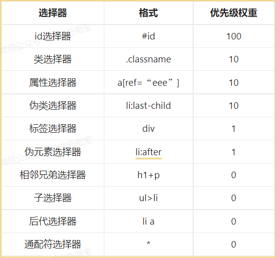
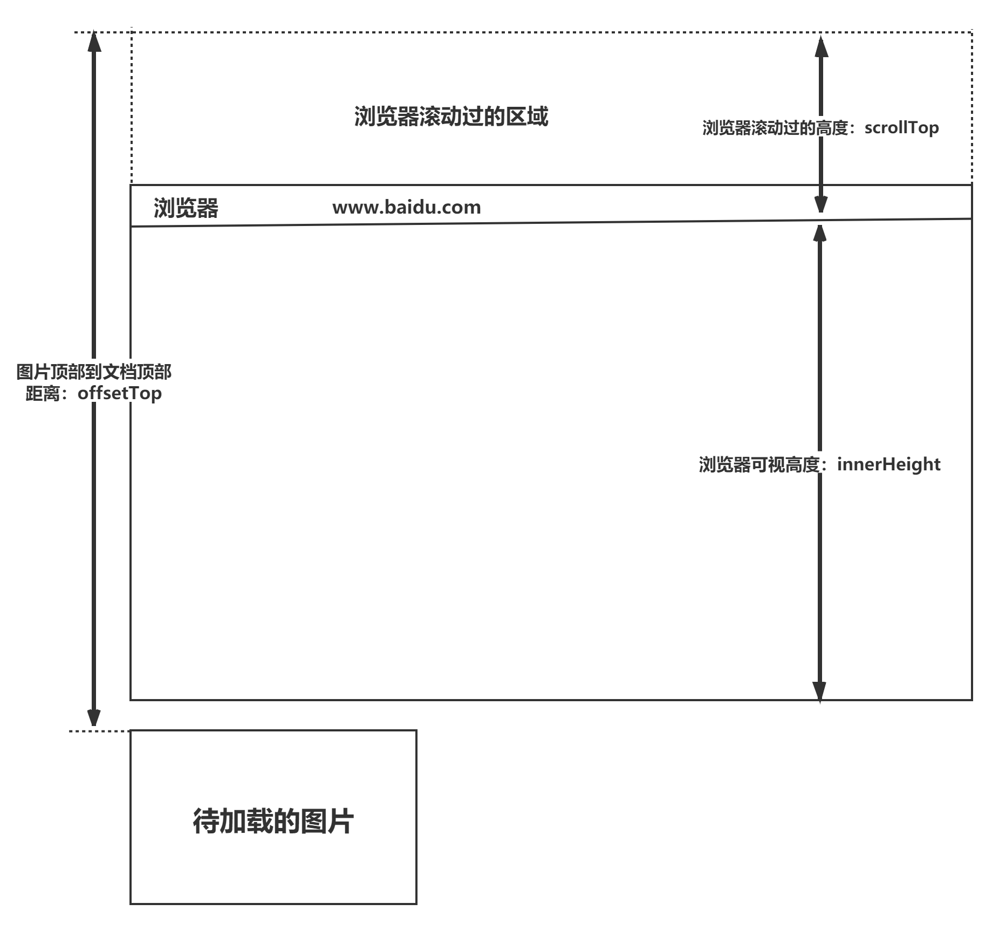
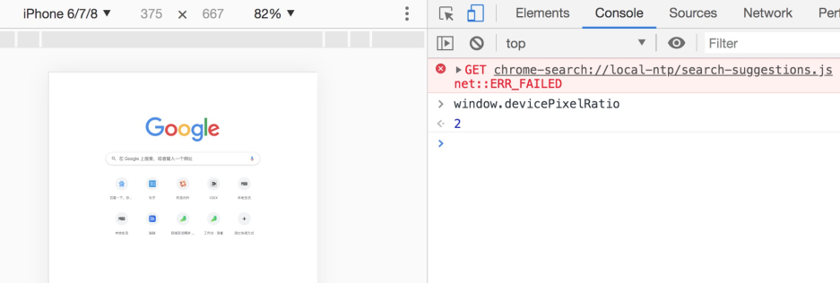

## 1. css 选择器及优先级



- 标签选择器、伪元素选择器：1；
- 类选择器、伪类选择器、属性选择器：10；
- id 选择器：100；
- 内联样式：1000；

## 2.display的block、inline、inline-blick

- **block：**会独占一行，多个元素会另起一行，可以设置width、height
- **inline：**元素不会独占一行，设置width、height属性无效。
- **inline-block：**元素不会独占一行，可设置width、height。

## 3.隐藏元素的方法有哪些？

- **display: none**：渲染树不会包含该渲染对象，因此该元素不会在页面中占据位置，也不会响应绑定的监听事件。
- **visibility: hidden**：元素在页面中仍占据空间，但是不会响应绑定的监听事件。
- **opacity: 0**：将元素的透明度设置为 0，以此来实现元素的隐藏。元素在页面中仍然占据空间，并且能够响应元素绑定的监听事件。
- **position: absolute**：通过使用绝对定位将元素移除可视区域内，以此来实现元素的隐藏。
- **z-index: 负值**：来使其他元素遮盖住该元素，以此来实现隐藏。
- **clip/clip-path** ：使用元素裁剪的方法来实现元素的隐藏，这种方法下，元素仍在页面中占据位置，但是不会响应绑定的监听事件。
- **transform: scale(0,0)**：将元素缩放为 0，来实现元素的隐藏。这种方法下，元素仍在页面中占据位置，但是不会响应绑定的监听事件。

## 4.对盒模型的理解

盒模型都是由四个部分组成的，分别是margin、border、padding和content。

标准盒模型和IE盒模型的区别在于设置width和height时，所对应的范围不同：

- 标准盒模型的width和height属性的范围只包含了content，
- IE盒模型的width和height属性的范围包含了border、padding和content。

可以通过修改元素的box-sizing属性来改变元素的盒模型：

- `box-sizing: content-box`表示标准盒模型（默认值）
- `box-sizing: border-box`表示IE盒模型（怪异盒模型）

## 5.为什么有时候⽤**translate**来改变位置⽽不是定位？ 

- 改变transform或opacity不会触发浏览器重新布局（reflow）或重绘（repaint），只会触发复合（compositions）。⽽改变绝对定位会触发重新布局，进⽽触发重绘和复合。
- transform使浏览器为元素创建⼀个 GPU 图层，但改变绝对定位会使⽤到 CPU。 因此translate()更⾼效，可以缩短平滑动画的绘制时间。

## 6.什么是物理像素，逻辑像素和像素密度，为什么在移动端开发时需要用到@3x, @2x这种图片？

- 物理像素，手机一造出来就已经确定，如inphone5的物理像素为640x1136px
- 逻辑像素，即设备像素，可以通过 window.screen.width/ window.screen.height 查看，iphone5逻辑像素为320px568px
- 640px/320px = 2 ,即像素密度为2
- 对于图片来说，为了保证其不失真，1 个图片像素至少要对应一个物理像素，假如原始图片是 500300 像素，那么在 3 倍屏上就要放一个 1500900 像素的图片才能保证 1 个物理像素至少对应一个图片像素，才能不失真。

## 7. 如何判断元素是否到达可是区域

- `window.innerHeight` 是浏览器可视区的高度；
- `document.body.scrollTop || document.documentElement.scrollTop` 是浏览器滚动的过的距离；
- `imgs.offsetTop` 是元素顶部距离文档顶部的高度（包括滚动条的距离）；
- 内容达到显示区域的：`img.offsetTop < window.innerHeight + document.body.scrollTop;`



## 8.常见的css布局单位

- 像素
- 百分比
- em和rem
- vw/vh

**vw/vh** 和百分比很类似，两者的区别：

- 百分比（`%`）：大部分相对于祖先元素，也有相对于自身的情况比如（border-radius、translate等)
- vw/vm：相对于视窗的尺寸

## 9.对BFC的理解，如何创建BFC

BFC是一个独立的布局环境，可以理解为一个容器，在这个容器中按照一定规则进行物品摆放，并且不会影响其它环境中的物品。如果一个元素符合触发BFC的条件，则BFC中的元素布局不受外部影响。

**创建BFC的条件：**

- 根元素：body；
- 元素设置浮动：float 除 none 以外的值；
- 元素设置绝对定位：position (absolute、fixed)；
- display 值为：inline-block、table-cell、table-caption、flex等；
- overflow 值为：hidden、auto、scroll；

**BFC的特点：**

- 垂直方向上，自上而下排列，和文档流的排列方式一致。
- 在BFC中上下相邻的两个容器的margin会重叠
- 计算BFC的高度时，需要计算浮动元素的高度
- BFC区域不会与浮动的容器发生重叠
- BFC是独立的容器，容器内部元素不会影响外部元素
- 每个元素的左margin值和容器的左border相接触

**BFC的作用：**

- **解决margin的重叠问题**：由于BFC是一个独立的区域，内部的元素和外部的元素互不影响，将两个元素变为两个BFC，就解决了margin重叠的问题。
- **解决高度塌陷的问题**：在对子元素设置浮动后，父元素会发生高度塌陷，也就是父元素的高度变为0。解决这个问题，只需要把父元素变成一个BFC。常用的办法是给父元素设置`overflow:hidden`。
- **创建自适应两栏布局**：可以用来创建自适应两栏布局：左边的宽度固定，右边的宽度自适应。

```
.left{
     width: 100px;
     height: 200px;
     background: red;
     float: left;
 }
 .right{
     height: 300px;
     background: blue;
     overflow: hidden;
 }
 
<div class="left"></div>
<div class="right"></div>
```

左侧设置`float:left`，右侧设置`overflow: hidden`。这样右边就触发了BFC，BFC的区域不会与浮动元素发生重叠，所以两侧就不会发生重叠，实现了自适应两栏布局。

## 10.position的属性有哪些，区别是什么

| 属性值   | 概述                                                         |
| -------- | ------------------------------------------------------------ |
| absolute | 生成绝对定位的元素，相对于static定位以外的一个父元素进行定位。元素的位置通过left、top、right、bottom属性进行规定。 |
| relative | 生成相对定位的元素，相对于其原来的位置进行定位。元素的位置通过left、top、right、bottom属性进行规定。 |
| fixed    | 生成绝对定位的元素，指定元素相对于屏幕视⼝（viewport）的位置来指定元素位置。元素的位置在屏幕滚动时不会改变，⽐如回到顶部的按钮⼀般都是⽤此定位⽅式。 |
| static   | 默认值，没有定位，元素出现在正常的文档流中，会忽略 top, bottom, left, right 或者 z-index 声明，块级元素从上往下纵向排布，⾏级元素从左向右排列。 |
| inherit  | 规定从父元素继承position属性的值                             |

## 11.如何解决 1px 问题

px 问题指的是：在一些 `Retina屏幕` 的机型上，移动端页面的 1px 会变得很粗，呈现出不止 1px 的效果。原因很简单——CSS 中的 1px 并不能和移动设备上的 1px 划等号。它们之间的比例关系有一个专门的属性来描述：

```
window.devicePixelRatio = 设备的物理像素 / CSS像素。
```

打开 Chrome 浏览器，启动移动端调试模式，在控制台去输出这个 `devicePixelRatio` 的值。这里选中 iPhone6/7/8 这系列的机型，输出的结果就是2：



这就意味着设置的 1px CSS 像素，在这个设备上实际会用 2 个物理像素单元来进行渲染，所以实际看到的一定会比 1px 粗一些。

**解决****1px 问题的三种思路：**

#### 思路一：直接写 0.5px

```
<div id="container" data-device={{window.devicePixelRatio}}></div>
```

然后就可以在 CSS 中用属性选择器来命中 devicePixelRatio 为某一值的情况，比如说这里尝试命中 devicePixelRatio 为2的情况：

```
#container[data-device="2"] {
  border:0.5px solid #333
}
```

#### 思路二：伪元素先放大后缩小

思路是**先放大、后缩小：在目标元素的后面追加一个 ::after 伪元素，让这个元素布局为 absolute 之后、整个伸展开铺在目标元素上，然后把它的宽和高都设置为目标元素的两倍，border值设为 1px。接着借助 CSS 动画特效中的放缩能力，把整个伪元素缩小为原来的 50%。此时，伪元素的宽高刚好可以和原有的目标元素对齐，而 border 也缩小为了 1px 的二分之一，间接地实现了 0.5px 的效果。**

```
#container[data-device="2"] {
    position: relative;
}
#container[data-device="2"]::after{
      position:absolute;
      top: 0;
      left: 0;
      width: 200%;
      height: 200%;
      content:"";
      transform: scale(0.5);
      transform-origin: left top;
      box-sizing: border-box;
      border: 1px solid #333;
    }
}
```

#### 思路三：viewport 缩放来解决

这个思路就是对 meta 标签里几个关键属性下手：

```html
<meta name="viewport" content="initial-scale=0.5, maximum-scale=0.5, minimum-scale=0.5, user-scalable=no">
```

这里针对像素比为2的页面，把整个页面缩放为了原来的1/2大小。这样，本来占用2个物理像素的 1px 样式，现在占用的就是标准的一个物理像素。根据像素比的不同，这个缩放比例可以被计算为不同的值，用 js 代码实现如下：

```javascript
const scale = 1 / window.devicePixelRatio;
// 这里 metaEl 指的是 meta 标签对应的 Dom
metaEl.setAttribute('content', `width=device-width,user-scalable=no,initial-scale=${scale},maximum-scale=${scale},minimum-scale=${scale}`);
```

这样解决了，但这样做的副作用也很大，整个页面被缩放了。这时 1px 已经被处理成物理像素大小，这样的大小在手机上显示边框很合适。但是，一些原本不需要被缩小的内容，比如文字、图片等，也被无差别缩小掉了。