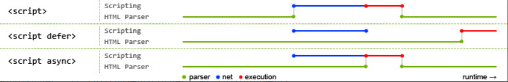

## 1.src 和 href 的区别

**src 用于替换当前元素， href 用于在当前文档和引用资源之间确立联系**。

- src
  - src 是 source 的缩写，指向外部资源的位置，指向的内容将会嵌入到文档中当前标签所在位置；在请求 src 资源时会将其指向的资源下载并应用到文档内，例如 js 脚本，img 图片和 frame 等元素。
  - **当浏览器解析到该元素时，会暂停其他资源的下载和处理，直到将该资源加载、编译、执行完毕**，图片和框架等元素也如此，类似于将所指向资源嵌入当前标签内。这也是为什么将js 脚本放在底部而不是头部。 
- href
  - 指向网络资源所在位置，建立和当前元素（锚点）或当前文档（链接）之间的链接。
  - 并行下载资源并且不会停止对当前文档的处理，这也是为什么建议使用 link 方式来加载 css，而不是使用@import 方式

## 2.对 html 语义化的理解

- 概念

  - 根据内容的结构化，选择适合的标签

- 优点

  - 对机器友好，更适合搜索引擎的爬虫爬取有效信息，利于SEO。
  - 对开发者友好，增加可读性，结构更加清晰，方便维护。

- 常见的语义化标签：

  ```
  <header></header>头部
  <nav></nav>导航栏
  <footer></footer> 底部
  <aside></aside>侧边栏
  <main></main>主要区域
  <article></article>主要内容
  <section></section>区块（有语义的div）
  ```

## 3. DOCTYPE(⽂档类型) 的作⽤

- **告诉浏览器（解析器）应该以什么样（html或xhtml）的文档类型定义来解析文档**
- **CSS1Compat：标准模式（Strick mode）**
- **BackCompat：怪异模式(混杂模式)(Quick mode)**

## 4.script标签中defer和async的区别



- 蓝色代表js脚本网络加载时间
- 红色代表脚本执行时间
- 绿色代表html解析

1. 没有 defer 或 async 属性
   - 根据src的规则，浏览器会立即加载+执行js资源，暂停其他资源的加载和处理，所以阻塞了html解析。
2. defer：延迟
   - js的加载与html的解析是并行的，但是js脚本不立刻执行，会等到html解析完成之后，DOMContentLoaded事件触发之前执行。
3. async：异步
   - js的加载与html的解析是并行的，然后立即执行js脚本。

## 5. 常用的meta标签

```
// 文档类型
<meta charset="UTF-8" >
// 关键词
<meta name="keywords" content="关键词" />
// 页面描述
<meta name="description" content="页面描述内容" />
// 页面重定向和刷新
<meta http-equiv="refresh" content="0;url=" />
// 视口
<meta name="viewport" content="width=device-width, initial-scale=1, maximum-scale=1">
```

- `width viewport` ：宽度(数值/device-width)
- `height viewport` ：高度(数值/device-height)
- `initial-scale` ：初始缩放比例
- `maximum-scale` ：最大缩放比例
- `minimum-scale` ：最小缩放比例
- `user-scalable` ：是否允许用户缩放(yes/no）

## 6. HTML5 有哪些更新？

1. 语义化标签

2. 媒体标签

   - video
   - audio

3. 表单

   - 表单类型

     - email ：能够验证当前输入的邮箱地址是否合法
     - url ： 验证URL
     - number ： 只能输入数字，其他输入不了，而且自带上下增大减小箭头，max属性可以设置为最大值，min可以设置为最小值，value为默认值。
     - search ： 输入框后面会给提供一个小叉，可以删除输入的内容，更加人性化。
     - range ： 可以提供给一个范围，其中可以设置max和min以及value，其中value属性可以设置为默认值
     - color ： 提供了一个颜色拾取器
     - time ： 时分秒
     - date ： 日期选择年月日
     - datatime ： 时间和日期(目前只有Safari支持)
     - datatime-local ：日期时间控件
     - week ：周控件
     - month：月控件

   - 表单属性

     - placeholder ：提示信息
     - autofocus ：自动获取焦点
     - autocomplete=“on” 或者 autocomplete=“off” 使用这个属性需要有两个前提：

     - - 表单必须提交过
       - 必须有name属性。

     - required：要求输入框不能为空，必须有值才能够提交。
     - pattern=" " 里面写入想要的正则模式，例如手机号patte="^(+86)?\d{10}$"
     - multiple：可以选择多个文件或者多个邮箱
     - form=" form表单的ID"

   - 表单事件

     - oninput 每当input里的输入框内容发生变化都会触发此事件。
     - oninvalid 当验证不通过时触发此事件。

4. 进度条、度量器

5. DOM 查询操作

   - document.querySelector()
   - document.querySelectorAll()

6. Web 存储

   - localStorage - 没有时间限制的数据存储
   - sessionStorage - 针对一个 session 的数据存储

7. 其他

   - 拖放
   - canvas

## 7.行内元素、块级元素

- 行内元素有：`a b span img input select strong`；
- 块级元素有：`div ul ol li dl dt dd h1 h2 h3 h4 h5 h6 p`；

## 8.**iframe 有那些优点和缺点？**

iframe 元素会创建包含另外一个文档的内联框架（即行内框架）。

**优点：**

- 用来加载速度较慢的内容（如广告）
- 可以使脚本可以并行下载
- 可以实现跨子域通信

**缺点：**

- iframe 会阻塞主页面的 onload 事件
- 无法被一些搜索引擎索识别
- 会产生很多页面，不容易管理