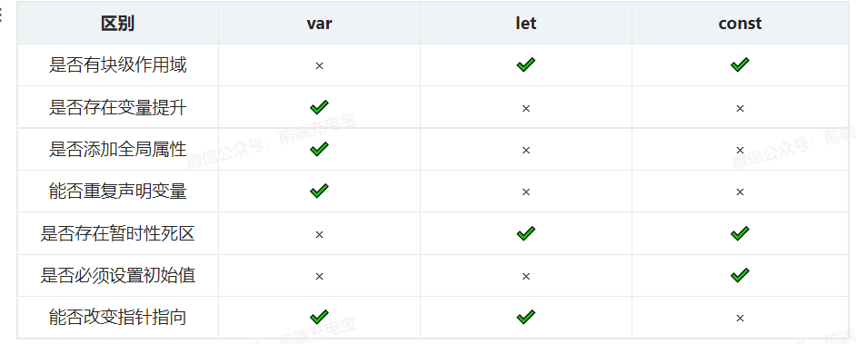
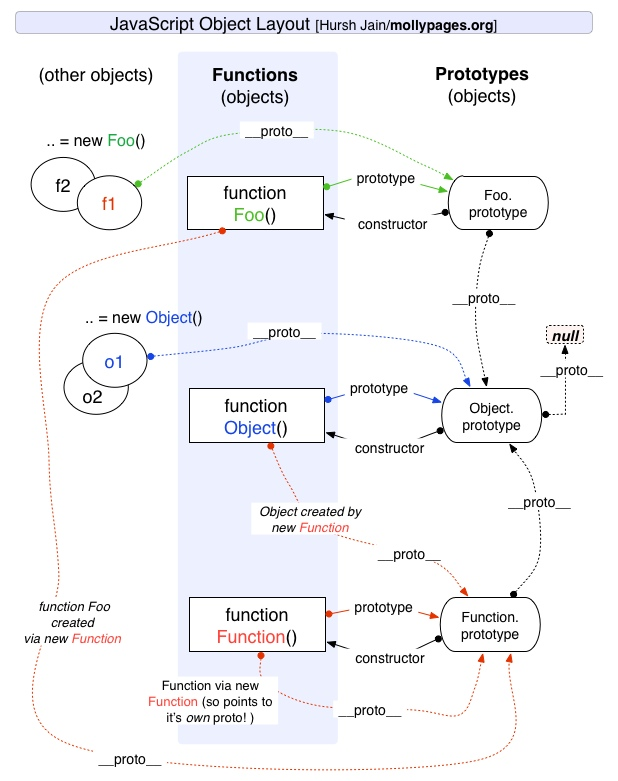

# 一、数据类型

## 1.数据类型

- 基本数据类型
  - Undefined
  - Null
  - Boolean
  - Number
  - String
  - Symbol
  - BigInt
- 引用数据类型
  - Function
  - Object
  - Array
- 两种类型的区别在与存储位置的不同
  - 原始类型直接存储在栈中，占据空间小，大小固定，属于被频繁使用的数据，所以放入栈中存储。
  - 引用类型存储在堆中，占据空间大，大小不固定。

## 2. 数据类型检测的方式有哪些

- typeof
- instanceof
- constructor
- Object.prototype.toString.call()

### 2.1 typeof

```
// typeof
console.log(typeof 2) // number
console.log(typeof true) // boolean
console.log(typeof 'str') // string
console.log(typeof undefined) // undefined
console.log(typeof Symbol(5)) // symbol
console.log(typeof BigInt(5)) // bigint
console.log(typeof function(){}) // function

console.log(typeof {}) //object
console.log(typeof []) //object
console.log(typeof null) //object
```

- 缺点：在判断 对象、数组、null时都是 object

### 2.2 instanceof

```
// instanceof
console.log(2 instanceof Number) // false
console.log([] instanceof Array) // true
console.log(function(){} instanceof Function) // true
console.log({} instanceof Object) // true
```

- instanceof 只能判断引用类型数据类型，而不能判断基本数据类型
- 其内部运行机制是判断在其原型链中能否找到该类型的原型
- 可以用来测试一个对象在其原型链中是否存在一个构造函数的prototype属性

### 2.3 constructor

```
console.log((2).constructor === Number) // true
console.log((true).constructor === Boolean) // true
console.log(('str').constructor === String) // true
console.log(([]).constructor === Array) // true
console.log((function(){}).constructor === Function) // true
console.log(({}).constructor === Object) // true
```

- constructor 有两个作用
  - 判断数据的类型
  - 对象实例通过constructor 对象访问它的构造函数
- 缺点：如果创建一个对象来改变它的原型，constructor则不能用来判断数据类型了

### 2.4 Object.prototype.toString.call()

```
const ObString = Object.prototype.toString
console.log(ObString.call(2)) // [object Number]
console.log(ObString.call(true)) // [object Boolean]
console.log(ObString.call('str')) // [object String]
console.log(ObString.call([])) // [object Array]
console.log(ObString.call(function(){})) // [object Function]
console.log(ObString.call({})) // [object Object]
console.log(ObString.call(undefined)) // [object Undefined]
console.log(ObString.call(null)) // [object Null]
```

同样是检测对象obj调用toString方法，obj.toString()的结果和Object.prototype.toString.call(obj)的结果不一样，这是为什么？

这是因为toString是Object的原型方法，而Array、function等**类型作为Object的实例，都重写了toString方法**。不同的对象类型调用toString方法时，根据原型链的知识，调用的是对应的重写之后的toString方法（function类型返回内容为函数体的字符串，Array类型返回元素组成的字符串…）。

## 3. 判断数组的方式有哪些？

```
console.log(Object.prototype.toString.call([]).slice(8,-1) === 'Array') // true
console.log([].__proto__ === Array.prototype) // true
console.log(Array.isArray([])) // true
console.log([] instanceof Array) // true
console.log(Array.prototype.isPrototypeOf([])) // true
```

## 4. null 和 undefined 的区别？

- 定义

  - null：空对象
  - undefined: 未定义

- 判断

  ```
  null == undefined // true
  null === undefined // false
  ```

## 5. typeof null 的结果为什么是object？

在 JavaScript 第一个版本中，所有值都存储在 32 位的单元中，每个单元包含一个小的 **类型标签(1-3 bits)** 以及当前要存储值的真实数据。类型标签存储在每个单元的低位中，共有五种数据类型

```
000: object   - 当前存储的数据指向一个对象。
  1: int      - 当前存储的数据是一个 31 位的有符号整数。
010: double   - 当前存储的数据指向一个双精度的浮点数。
100: string   - 当前存储的数据指向一个字符串。
110: boolean  - 当前存储的数据是布尔值。
```

- null 的值是机器码 NULL 指针(null 指针的值全是 0)
- 就是说null的类型标签也是000，和Object的类型标签一样，所以会被判定为Object。

## 6. instanceof 操作符的实现原理及实现

```
function myInstanceof (left, right) {
    // 获取对象的原型
    let proto = Object.getPrototypeOf(left)
    // 获取构造函数的 prototype 对象
    let prototype = right.prototype

    // 判断构造函数的 prototype 对象是否在对象的原型链上
    while (true) {
        if (!proto) return false
        if (proto === prototype) return true
        // 如果没有找到，就继续从其原型上找，Object.getPrototypeOf方法用来获取指定对象的原型
        proto = Object.getPrototypeOf(proto)
    }
}
console.log(myInstanceof(2, Number)) // true
console.log(myInstanceof([], Array)) // true
```

## 7.typeof NaN的结果是什么？

```
typeof NaN // 'number'
```

## 8. Object.is() 与比较操作符 “===” 或 “==”的区别？

- 使用双等号（==）进行相等判断时，如果两边的类型不一致，则会进行强制类型转化后再进行比较。
- 使用三等号（===）进行相等判断时，如果两边的类型不一致时，不会做强制类型准换，直接返回 false。
- 使用 Object.is 来进行相等判断时，一般情况下和三等号的判断相同，它处理了一些特殊的情况，比如 -0 和 +0 不再相等，两个 NaN 是相等的。

```
+0 === -0 // true
Object.is(+0, -0) // false
```

## 9.什么是 JavaScript 中包装类型？

```
const a = 'abc'
a.length; // 3
a.toUpperCase(); // "ABC"
Object(a) // String {"abc"}
Object(a).valueOf() // 'abc'
```

- 在 JavaScript 中，基本类型是没有属性和方法的，但是为了便于操作基本类型的值，在调用基本类型的属性或方法时 JavaScript 会在后台隐式地将基本类型的值转换为对象。
- 在访问 a.length 时，JavaScript 将`'abc'`在后台转换成`String('abc')`，然后再访问其`length`属性
- 可以使用`Object`函数显式地将基本类型转换为包装类型
- 可以使用`valueOf`方法将包装类型倒转成基本类型

## 10.object.assign和扩展运算法是深拷贝还是浅拷贝，两者区别

```
let outObj = {
    inObj: {a: 1, b: 2}
}
let newObj = {...outObj}
let newObjAs = Object.assign({}, outObj)
newObj.inObj.a = 2
newObjAs.inObj.b = 5
console.log(outObj) // {inObj: {a: 2, b: 5}}
```

- 两者都是浅拷贝
- Object.assign()方法接收的第一个参数作为目标对象，后面的所有参数作为源对象。然后把所有的源对象合并到目标对象中。它会修改了一个对象，因此会触发 ES6 setter。
- 扩展操作符（…）使用它时，数组或对象中的每一个值都会被拷贝到一个新的数组或对象中。它不复制继承的属性或类的属性，但是它会复制ES6的 symbols 属性。

## 11. 如何判断一个对象是空对象

```
// 1.使用 JSON.stringify 方法来判断
console.log(JSON.stringify({}) === '{}')
// Object.keys()
console.log(Object.keys({})) // []
console.log(Object.keys({}).length) // 0
```


# 二、ES6

## 12.let、const、var的区别



## 13. const 对象的属性可以修改吗

- const保证的并不是变量的值不能改，而是变量指向的那个内存地址不能改动。对于基本类型的数据（数值、字符串、布尔值），其值就保存在变量指向的那个内存地址，因此等同于常量。
- 但对于引用类型的数据（主要是对象和数组）来说，变量指向数据的内存地址，保存的只是一个指针，const只能保证这个指针是固定不变的，至于它指向的数据结构是不是可变的，就完全不能控制了。


## 14. 箭头函数与普通函数的区别

1. **箭头函数比普通函数更加简洁**

2. **箭头函数没有自己的this**

   箭头函数不会创建自己的this， 所以它没有自己的this，它只会在自己作用域的上一层继承this。所以箭头函数中this的指向在它在定义时已经确定了，之后不会改变。

3. **箭头函数继承来的this指向永远不会改变**

4. **call()、apply()、bind()等方法不能改变箭头函数中this的指向**

5. **箭头函数不能作为构造函数使用**

6. **箭头函数没有自己的arguments**

7. **箭头函数没有prototype**

8. **箭头函数没有自己的arguments**

```
var id = 'GLOBAL';
var obj = {
  id: 'OBJ',
  a: function(){
    console.log(this.id);
  },
  b: () => {
    console.log(this.id);
  }
};
obj.a();    // 'OBJ'
obj.b();    // 'GLOBAL'
new obj.a()  // undefined
new obj.b()  // Uncaught TypeError: obj.b is not a constructor
```

对象obj的方法b是使用箭头函数定义的，这个函数中的this就永远指向它定义时所处的全局执行环境中的this，即便这个函数是作为对象obj的方法调用，this依旧指向Window对象。需要注意，定义对象的大括号`{}`是无法形成一个单独的执行环境的，它依旧是处于全局执行环境中。

## 15.扩展运算符的作用及使用场景

### 15.1 对象扩展运算符

```
// 对象的扩展运算符
let bar = {
    a: 1,
    b: 2
}
console.log({...bar})
```

- 用于取出参数对象中的所有**可遍历属性**，拷贝到当前对象之中。

### 15.2 数组的扩展运算函数

```
// 数组的扩展运算符
const arr = [1,2,3]
console.log(...arr) // 1,2,3
```

- 可以将一个数组**转为用逗号分隔的参数序列**，且每次只能展开一层数组

```
// 作用——复制数组
const arrCopy = [...arr]
console.log(arrCopy) // [ 1, 2, 3 ]
// 作用——合并数组
const arr1 = ['one', 'two', ...arr]
console.log(arr1) // [ 'one', 'two', 1, 2, 3 ]
// 与解构赋值结合，用于生成数组
const [first, ...rest] = arr1
console.log(first) // one
console.log(rest) // [ 'two', 1, 2, 3 ]
```

## 16. Proxy 可以实现什么功能？

```
let p = new Proxy(target, handler)
```

```
/**
 * obj: 源对象
 * setBind: set回调
 * getLogger: get 回调
 */
let onWatch = (obj, setBind, getLogger) => {
    let handler = {
        set (target, property, value, receiver) {
            setBind(target, property, value, receiver)
            return Reflect.set(target, property, value)
        },
        get (target, property, receiver) {
            getLogger(target, property, receiver)
            return Reflect.get(target, property, receiver)
        }
    }
    return new Proxy(obj, handler)
}

let obj = {
    a: 1
}
let p = onWatch(
    obj,
    (target, property, value, receiver) => {
        console.log(target, property, value, receiver) // { a: 1 } a 2 { a: 1 }
    },
    (target, property, receiver) => {
       console.log(target, property, receiver) // { a: 2 } a { a: 2 }
    }
)

p.a = 2
p.a
```

## 17. 对象与数组的解构

```
// 数组解构
const [a, b, c] = [1, 2, 3]

// 对象解构
const stu = {
    name: 'well',
    age: 15
}
const { name } = stu
```

## 18. 对 rest 参数的理解

扩展运算符被用在函数形参上时，**它还可以把一个分离的参数序列整合成一个数组**

```
const mutiple = (...args) => {
    let result = 1
    for (let value of args) {
        result *= value
    }
    return result
}

console.log(mutiple(1,2,3,4)) // 24
```

# 三、this/call/apply/bind

## 19. 对this 对象的理解

- this 是执行上下文中的一个属性，它指向最后一次调用这个方法的对象。

- 在实际开发中，this 的指向可以通过四种调用模式来判断。

  1. 第一种是**函数调用模式**，当一个函数不是一个对象的属性时，直接作为函数来调用时，this 指向全局对象。
  2. 第二种是**方法调用模式**，如果一个函数作为一个对象的方法来调用时，this 指向这个对象。
  3. 第三种是**构造器调用模式**，如果一个函数用 new 调用时，函数执行前会新创建一个对象，this 指向这个新创建的对象。
  4. 第四种是 **apply 、 call 和 bind 调用模式**，这三个方法都可以显示的指定调用函数的 this 指向。

- apply、call、bind的区别？

  - apply、call不仅改变this指向，还可以接受参数。其中apply接收的是数组，call接受的非 数组。
  - bind 方法通过传入一个对象，返回一个 this 绑定了传入对象的新函数。这个函数的 this 指向除了使用 new 时会被改变，其他情况下都不会改变。

  ```
  global.name = 'liuguowei'
  global.age = 18
  
  // 函数调用模式
  const sayName = function () {
      return this.name
  }
  console.log('函数调用模式:', sayName()) // 函数调用模式: liuguowei
  
  // 方法调用模式
  const nameObj = {
      name: 'well',
      sayName () {
          return this.name
      }
  }
  console.log('方法调用模式:', nameObj.sayName()) // 方法调用模式: well
  
  // 构造器调用模式 
  function AgeFun (age) {
      this.age = age
      this.sayAge = function () {
          return this.age
      }
  } 
  const ageInstance = new AgeFun(25)
  console.log('构造器调用模式:', ageInstance.sayAge()) // 构造器调用模式: 25
  ```


## 20. apply、call、bind 

```
const foo = {
    a: 1,
    fn (x, y) {
        console.log(this.a, x, y)
    }
}

const obj = {
    a: 10
}

// apply
foo.fn.apply(obj, [2, 3]) // 10 2 3
// call
foo.fn.call(obj, 2, 3) // 10 2 3
// bind
foo.fn.bind(obj, 2, 3)() // 10 2 3
```

## 21. call 函数的实现及步骤

1. 判断调用对象是否为函数
2. 获取参数
3. 判断 context 是否传入，如果不传入则设置为 window
4. 将函数设为此对象的方法（把调用函数作为传入对象的属性）
5. 调用函数
6. 返回结果

```
Function.prototype.MyCall = function (context) {
    console.log('this>>>', this) // this>>> [Function: log]
    // 判断调用对象
    if (typeof this !== 'function') {
        console.error('type error')
    }
    // 获取参数
    const args = [...arguments].slice(1)
    let result = null
    // 判断 context 是否传入， 如果未传入则设置为window
    context = context || window
    // 将调用函数设为此对象的方法
    context.fn = this
    // 调用函数
    result = context.fn(...args)
    // 将属性删除
    delete context.fn
    return result
}

const foo = {
    a: 1,
    log (x, y) {
        console.log(this.a, x, y)
    }
}
const obj = {
    a: 10
}

foo.log.MyCall(obj, 5, 6) // 10, 5, 6
```

## 22. apply 函数的实现

```
Function.prototype.MyApply = function (context) {
    // 判断调用对象是否为函数
    if (typeof this !== 'function') {
        throw new TypeError('Error')
    }
    let result = null
    // 判断 context 是否传入，如果为传入则设置window
    context = context || window
    context.fn = this
    // 判断是否有传参
    if (arguments[1]) {
        result = context.fn(...arguments[1])
    } else {
        result = context.fn()
    }
    // 将属性删除
    delete context.fn
    return result
}

const foo = {
    a: 1,
    log (x, y) {
        console.log(this.a, x, y)
    }
}
const obj = {
    a: 10
}

foo.log.MyApply(obj, [5, 6]) // 10, 5, 6
```

## 23. bind 函数的实现及步骤

```
Function.prototype.myBind = function (context) {
    // 判断调用对象是否为函数
    if (typeof this !== 'function') {
        throw new TypeError('Error')
    }
    // 获取参数
    const args = [...arguments].slice(1)
    const fn = this
    return function Fn () {
        // 根据调用方式，传入不同绑定值
        return fn.apply(
            this instanceof Fn ? this : context,
            args.concat(...arguments)
        )
    }
}

const foo = {
    a: 1,
    log (x, y) {
        console.log(this.a, x, y)
    }
}
const obj = {
    a: 10
}

foo.log.myBind(obj, 5, 6)() // 10, 5, 6
```

# 四、原型与原型链

## 24.对原型链的理解

在JavaScript中是使用构造函数来新建一个对象的，每一个构造函数的内部都有一个 prototype 属性，它的属性值是一个对象，这个对象包含了可以由该构造函数的所有实例共享的属性和方法。当使用构造函数新建一个对象后，在这个对象的内部将包含一个指针，这个指针指向构造函数的 prototype 属性对应的值，在 ES5 中这个指针被称为对象的原型。一般来说不应该能够获取到这个值的，但是现在浏览器中都实现了 __proto__ 属性来访问这个属性，但是最好不要使用这个属性，因为它不是规范中规定的。ES5 中新增了一个 Object.getPrototypeOf() 方法，可以通过这个方法来获取对象的原型。

当访问一个对象的属性时，如果这个对象内部不存在这个属性，那么它就会去它的原型对象里找这个属性，这个原型对象又会有自己的原型，于是就这样一直找下去，也就是原型链的概念。原型链的尽头一般来说都是 Object.prototype 所以这就是新建的对象为什么能够使用 toString() 等方法的原因。



- 每个构造函数都有一个prototype属性，其指向对象的原型。
- 对象的原型包含了可以由该构造函数的所有实例共享的属性和方法。而且其还有一个constructor 属性，其指向对应的构造函数。
- 通过构造函数实例化一个对象后，这个对象包含 一个指针`__proto__:非标准，由浏览器实现`，指向构造函数的 prototype 属性对应的值，即对象的原型。
- 原型链的尽头一般来说都是 Object.prototype(对象)来获取。

```
<!DOCTYPE html>
<html lang="en">
<head>
    <meta charset="UTF-8">
    <meta http-equiv="X-UA-Compatible" content="IE=edge">
    <meta name="viewport" content="width=device-width, initial-scale=1.0">
    <title>Document</title>
</head>
<body>
    <script>
        function Person (age) {
            this.age = age
        }
        const well = new Person(18)
        /**
         * {constructor: ƒ}
            constructor: ƒ Person(age)
            [[Prototype]]: Object
         */
        console.log(Object.getPrototypeOf(well))
        /**
         * {constructor: ƒ}
            constructor: ƒ Person(age)
            [[Prototype]]: Object
         */
        console.log(well.__proto__)
        /**
         * {constructor: ƒ}
            constructor: ƒ Person(age)
            [[Prototype]]: Object
         */
        console.log(Person.prototype)
    </script>
</body>
</html>
```

## 25. 原型链指向

```
<!DOCTYPE html>
<html lang="en">
<head>
    <meta charset="UTF-8">
    <meta http-equiv="X-UA-Compatible" content="IE=edge">
    <meta name="viewport" content="width=device-width, initial-scale=1.0">
    <title>Document</title>
</head>
<body>
    <script>
        function Person(name) {
            this.name = name
        }
        const p = new Person('well')
        console.log('p.__proto__>>>', p.__proto__) // // Person.prototype
        console.log('p.__proto__.constructor>>>', p.__proto__.constructor) // f Person(name)
        console.log('Person.prototype.__proto__>>>', Person.prototype.__proto__) // Object.prototype
        console.log('p.__proto__.__proto__>>>', p.__proto__.__proto__) // // Object.prototype
        console.log('p.__proto__.constructor.prototype.__proto__>>>', p.__proto__.constructor.prototype.__proto__) // Object.prototype
        console.log('Person.prototype.constructor.prototype.__proto__>>>', Person.prototype.constructor.prototype.__proto__) // Object.prototype
        console.log('Person.prototype.constructor>>>', Person.prototype.constructor) // f Person(name)
    </script>
</body>
</html>
```

## 26.原型链的终点是什么？null

```
console.log(Object.prototype.__proto__) // 
```

## 27.如何获得对象非原型链上的属性？

**`hasOwnProperty()`** 方法会返回一个布尔值，指示对象自身属性中是否具有指定的属性（也就是，是否有指定的键）。

```
function iterate(obj) {
	const res = []
    for (let key in obj) {
    	if (obj.hasOwnProperty(key)) {
        	res.push(`${key}:${obj[key]}`)
         }
     }
     return res
}
function Person (name) {
	this.name = name
}
console.log(iterate(new Person('well'))) // ['name:well']
```

# 五、闭包、作用域链、执行上下文

## 28. 对闭包的理解

- **闭包是指有权访问另一个函数作用域中变量的函数**
- 闭包有两个常用的用途：
  - 闭包的第一个用途是使我们在函数外部能够访问到函数内部的变量。通过使用闭包，可以通过在外部调用闭包函数，从而在外部访问到函数内部的变量，可以使用这种方法来创建私有变量。
  - 闭包的另一个用途是使已经运行结束的函数上下文中的变量对象继续留在内存中，因为闭包函数保留了这个变量对象的引用，所以这个变量对象不会被回收。

```
const name = 'well'
const age = 25

function showName () {
    const name = 'liuguowei'
    return function () {
        return name
    } 
}
console.log(showName()()) // liuguowei

function myAge () {
    return age
}
function showAge (fn) {
    const age = 18
    return fn()
}
console.log(showAge(myAge)) // 25

```

## 29.对作用域、作用域链的理解

- 全局作用域
  - 最外层函数和最外层函数外面定义的变量拥有全局作用域
  - 所有未定义直接赋值的变量自动声明为全局作用域
  - 所有window对象的属性拥有全局作用域
  - 全局作用域有很大的弊端，过多的全局作用域变量会污染全局命名空间，容易引起命名冲突。
- 函数作用域
  - 函数作用域声明在函数内部的变零，一般只有固定的代码片段可以访问到
  - 作用域是分层的，内层作用域可以访问外层作用域，反之不行
- 块级作用域
  - 使用ES6中新增的let和const指令可以声明块级作用域，块级作用域可以在函数中创建也可以在一个代码块中的创建（由`{ }`包裹的代码片段）
  - let和const声明的变量不会有变量提升，也不可以重复声明
  - 在循环中比较适合绑定块级作用域，这样就可以把声明的计数器变量限制在循环内部。

## 30.对执行上下文的理解

- 执行上下文类型

  - **全局执行上下文**

    任何不在函数内部的都是全局执行上下文，它首先会创建一个全局的window对象，并且设置this的值等于这个全局对象，一个程序中只有一个全局执行上下文。

  - **函数执行上下文**

    当一个函数被调用时，就会为该函数创建一个新的执行上下文，函数的上下文可以有任意多个。

  - **eval函数执行上下文**

    执行在eval函数中的代码会有属于他自己的执行上下文，不过eval函数不常使用。

- 执行上下文栈

  - JavaScript引擎使用执行上下文栈来管理执行上下文
  - 当JavaScript执行代码时，首先遇到全局代码，会创建一个全局执行上下文并且压入执行栈中，每当遇到一个函数调用，就会为该函数创建一个新的执行上下文并压入栈顶，引擎会执行位于执行上下文栈顶的函数，当函数执行完成之后，执行上下文从栈中弹出，继续执行下一个上下文。当所有的代码都执行完毕之后，从栈中弹出全局执行上下文。

# 六、JavaScript 基础

## 31. new 操作符的实现原理

**new 操作符的执行过程**

- 首先创建一个新的空对象
- 设置原型，将对象的原型设置为函数的prototype 对象。（实例的原型执行构造函数的原型）
- 让函数的this指向这个对象，执行构造函数的代码（为这个新对象添加属性）
- 判断函数的返回值类型，如果是值类型，返回创建的对象。如果是引用类型，就返回这个引用类型的对象。

```
function objectFactory () {
    // 声明要创建的对象
    let newObject = null
    // 取出构造函数
    let constructor = Array.prototype.shift.call(arguments)
    console.log('constructor>>>', constructor) // constructor>>> [Function: Person]
    let result = null
    // 判断参数是否是函数
    if (typeof constructor !== 'function') {
        throw TypeError('error')
    }
    // 新建一个空对象，对象的原型为构造函数的 prototype 对象
    newObject = Object.create(constructor.prototype)
    console.log('newObject>>>', newObject) // newObject>>> Person {}
    // 将 this 指向新建对象，并指向函数
    result = constructor.apply(newObject, arguments)
    console.log('result>>>', result)
    console.log('newObject>>>', newObject) // newObject>>> Person { name: 'well', age: 18 }
    // 判断返回对象
    let flag = result && (typeof result === 'object' || typeof result === 'function')
    // 判断返回结果
    return flag ? result : newObject
}

function Person (name, age) {
    this.name = name
    this.age = age
}
const well = objectFactory(Person, 'well', 18)
console.log(well.name)
```

