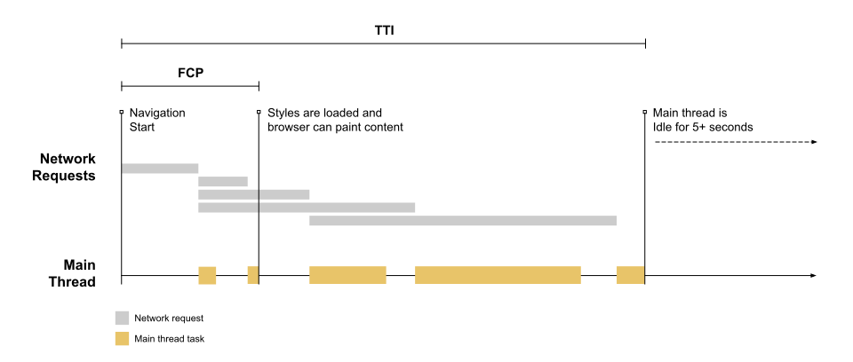

# 性能优化介绍

## 什么是性能

MDN上的web性能定义：web性能是网站或应用程序的客观度量和可感知的用户体验。

- 减少整体加载时间：减小文件体积、减少HTTP请求、使用预加载
- 使网站尽快可用：仅加载首屏内容，其他内容根据需要进行懒加载
- 平滑和交互性：使用css替代js动画、较少UI重绘
- 感知表现：你的用户可能不能做得更快，但你可以让用户感觉更快。耗时操作要给用户反馈，比如加载动画、进度条、骨架屏等提示信息
- 性能测定：性能指标、性能测试、性能监控持续优化

## 如何进行web性能优化

1. 首先需要了解性能指标——多块才算快？
2. 使用专业的工具可量化地评估出网站或应用的性能表现
3. 立足于网站页面响应的生命周期，分析出造成性能表现的原因
4. 进行技术改造，可行性分析等具体的优化实施
5. 迭代优化

### 性能指标

- RAIL 性能模型
- 基于用户体验的核心指标
- 新一代性能指标：Web Vitals

### 性能测量

- 浏览器DevTools调试工具
- 网络监控分析
- 性能监控分析
- 灯塔（Lighthouse）
- 网站整体质量评估，并给出优化建议
- WebPageTest
- 多测试地点
- 全面的性能报告

### 生命周期

### 优化方案

- 从请求发出到收到响应的优化：DNS查询、HTTP长连接、HTTP2、HTTP压缩、HTTP缓存
- 关键渲染路径优化，比如是否存在不必要的重绘和回流
- 加载过程的优化，比如延长加载，是否有不需要在首屏展示的非关键信息，占用了页面加载时间
- 资源优化，比如图片、视频等不同格式类型会有不同的使用场景，在使用过程中是否恰当
- 构建优化，比如压缩合并，基于 webpack 构建优化方案

# web 性能指标

## RAIL 性能模型

- 响应 Response:：应该尽可能快速的响应用户(感知延迟之前接收到操作的反馈)（100ms内）
  - 比如在点击按钮向后台发起某项业务处理请求时，首先反馈给用户开始处理的提示，然后在处理完成的回调后反馈完成的提示
- 动画 Animation：展示动画每一帧以16ms进行渲染，保持一致性避免卡顿
- 空闲 Idel：使用js主线程应把任务划分到执行时间小于50ms片段，这样可以释放线程进行用户交互
- 加载：应该小于5s的时间加载完成网站，并且可以进行交互

## 基于用户体验的性能指标

### FCP(First Contentful Paint) 首次内容绘制

浏览器首次绘制来自DOM的内容的时间，内容必须是文本、图片（包含背景图）、非白色的canvas或SVG，包括带有正在加载中的web字体的文本（下图二即是FCP）

#### 速度指标

| FCP时间（m） | 颜色编码     | FCP分数（HTTP存档百分位数） |
| ------------ | ------------ | --------------------------- |
| 0-2          | 绿色（快速） | 75-100                      |
| 2-4          | 橙色（中等） | 50-74                       |
| >4           | 红色（慢）   | 0-49                        |

#### 优化方案

https://web.dev/fcp/#how-to-improve-fcp

### LCP(Largest Contentful Paint) 最大内容绘制

可视区域中最大的内容元素（占用资源最大）呈现到屏幕上的时间，用以估算页面的主要内容对用户可见时间。

LCP考虑的元素

- Img
- Video 封面图
- 通过 url 函数加载背景图
- 文本节点或其他文本元素子级块级元素

- LCP随着加载是会变化的，图上绿色的就是LCP

#### 速度指标

| LCP时间（m） | 颜色编码     |
| ------------ | ------------ |
| 0-2          | 绿色（快速） |
| 2-4          | 橙色（中等） |
| >4           | 红色（慢）   |

#### 优化方案

https://web.dev/optimize-lcp/

### FID(First Input Delay) 首次输入延迟

从用户第一次与页面交互到浏览器能够响应交互（单击链接、按钮）等到浏览器实际能够响应交互的时间

输入延迟是因为浏览器的主线程在忙于其他事情，如解析和执行大量计算的JavaScript

第一次输入延迟通常发生在第一次内容绘制(FCP)和可持续交互时间(TTI)之间，因为页面已经呈现了一些内容，但还不能可靠交互

#### 速度指标

#### 优化方案

https://web.dev/fid/#how-to-imporve-fid

### TTI(Time to Interactive)完全达到可交互状态

第一次达到完全可交互状态，可以持续响应用户输入。完全达到可交互状态的时间点是在最后一个长任务完成的时间，并在随后的5s内网络和主线程是空闲的。

#### 速度指标

| TTI时间（m） | 颜色编码     |
| ------------ | ------------ |
| 0-3.8        | 绿色（快速） |
| 3.8-7.3      | 橙色（中等） |
| >7.3         | 红色（慢）   |

#### 优化方案

https://web.dev/tti/#how-to-improve-tti

### TBT(Total Block Time)总阻塞时间

度量了FCP和TTI之间的总时间，在该时间范围内，主线程被阻塞足够长的时间以防止输入响应。

我们说主线程“被阻止”是因为浏览器无法中断正在进行的任务，如果用户在较长的任务中间与页面进行交互，则浏览器必须等待任务完成才能响应。给定的长任务的阻止时间是其持续时间超过50ms，页面的总阻塞时间=FCP+TTI之间发生的每个长任务的阻塞时间的总和。

上方的时间轴上有五个任务，其中三个是长任务，因为这些任务的持续时间超过 50 毫秒。下图显示了各个长任务的阻塞时间：

因此，虽然在主线程上运行任务的总时间为 560 毫秒，但其中只有 345 毫秒被视为阻塞时间。

#### 速度指标

| TBT时间（ms） | 颜色编码     |
| ------------- | ------------ |
| 0-300         | 绿色（快速） |
| 300-600       | 橙色（中等） |
| >600          | 红色（慢）   |

#### 优化方案

https://web.dev/tbt/#how-to-improve-tbt

### **CLS(Cumulative Layout Shift) 累计布局偏移** 

 CLS会测量在页面整个生命周期中发生的每个意外的布局移位的所有单独布局移位分数的总和，它是一种保证页面的视觉稳定性，从而提高用户体验的指标方案。

页面内容的意外移动通常是由于异步加载资源或将DOM元素动态添加到现有内容上方的页面而发生的。可以使用加载占位符使布局不变。

#### 速度指标

| CLS      | 颜色编码     |
| -------- | ------------ |
| 0-0.1    | 绿色（快速） |
| 0.1-0.25 | 橙色（中等） |
| >0.25    | 红色（慢）   |

#### 优化方案

https://web.dev/cls/#how-to-improve-cls

### Speed Index 速度指数

页面可视区域中内容的填充速度的指标，可以通过计算页面可见区域内容显示的平均时间来衡量。

### 速度指标

| TBT时间（s） | 颜色编码     |
| ------------ | ------------ |
| 0-4.3        | 绿色（快速） |
| 4.3-5.8      | 橙色（中等） |
| >5.8         | 红色（慢）   |

## web Vitals

精简版性能指标，包括：

- 加载体验
- 交互性
- 页面内容的视觉稳定性

### core web Vitals 与 web Vitals

Core web Vitals 是应用所有web页面的子集，是其最重要的核心

- 加载性能（LCP）-显示最大内容元素所需的时间
- 交互性（FID）-首次输入延迟时间
- 视觉稳定性（CLS）-累积布局配置偏移 

### 测量Web Vitals

- 性能测试工具，比如Lighthouse
- 使用web-vitals库
- 使用浏览器插件Web Vitals

# web 性能测试

- Lighthouse 
- Performance
- Memory

# 网页生命周期

- 浏览器接收到 URL,到网络请求线程的开启
- 一个完整的 HTTP 请求的发出
- 服务器接收到请求并转到具体的处理后台
- 前后台之前的 HTTP 交互和涉及的缓存机制
- 浏览器接收到数据包后的关键渲染路径
- JS 引擎的解析过程

## 网络请求线程开启

浏览器会创建一个网络请求线程去下载所需的资源。

### 进程与线程

- 只要某个线程执行出错，将会导致进程崩溃
- 进程与进程之间相互隔离，保证了一个进程崩溃不影响另一个
- 线程之间共享所属进程数据
- 进程所占用的资源会在关闭后由操作系统回收

### 多进程浏览器

浏览器是多进程的，可以避免线程的崩溃影响进程

- GUI渲染进程
- js 引擎线程
- 事件触发线程
- 定时器触发线程
- 异步 http 线程

## 建立HTTP请求

主要工作分为两部分：DNS  解析和通信链路的建立

- 首先发起请求的客户端浏览器要明确知道所访问的服务器地址
- 然后建立通往该服务器地址的路径

### DNS 解析

1. 浏览器缓存=》浏览器自身DNS缓存=》hosts 文件（递归查询）
2. 本地域名=》根域名=》顶级域名=》权威域名（迭代查询）

### 网络模型

1. 应用层：负责应用程序提供接口，使其可以使用网络服务，HTTP位于该层
2. 表示层：负责数据的编码与解码，加密和解密，压缩与解压缩
3. 会话层：负责协调系统之间的通信过程
4. 传输层：负责端到端的建立，使报文能在端到端进行传输，TCP/UDP协议位于改层
5. 数据链路层：在不可靠的物理链路上提供可靠的数据传输服务。包括组帧、物理编址、流量控制、差错控制、接入控制
6. 物理层：定义网络物理拓扑、定义物理设备标准、比特的表示和信号传输模式

### TCP 连接

- TCP 三次握手
- TCP 四次挥手

## 前后端的交互

- 反向代理服务器
- 后端处理流程
- HTTP 相关协议特性
- 浏览器缓存

## 关键路径渲染

1. 解析文档，构建DOM树
2. 解析css，构建 CSSOM 对象模型
3. 渲染绘制：将上面两个对象模型合并为渲染树，该渲染树只包含渲染可见的节点
   1. 从所生成的DOM树根节点向下遍历每个节点，忽略所有不可见的节点
   2. 在CSSOM 中为每个可见的子节点找到对应规则应用
   3. 布局阶段：根据所得到的渲染树，计算他们在设备视图中的具体位置和大小，输出一个“盒模型”
   4. 绘制阶段：将每个节点的具体绘制方式转化为屏幕上的实际像素

# 优化总结

1. DNS解析：
   - 当用户在浏览器中输入URL时，浏览器首先会进行DNS解析，将域名转换为服务器的IP地址。
   - 优化方法：使用CDN（内容分发网络）来加速DNS解析过程，设置合理的DNS缓存时间。
2. 网络连接与传输：
   - 浏览器与服务器建立TCP连接，并通过HTTP请求获取页面资源。
   - 优化方法：使用HTTP/2或HTTP/3协议以实现多路复用、头部压缩和服务器推送等特性，减少网络延迟和提高传输效率。
3. 服务器响应：
   - 服务器接收到HTTP请求后，处理请求并返回相应的资源。
   - 优化方法：使用服务器端缓存和CDN来加速资源的响应，优化数据库查询和服务器代码以提高响应速度。
4. 页面构建：
   - 浏览器接收到服务器返回的HTML文件后，开始解析HTML结构，并构建DOM树。
   - 优化方法：减小HTML文件的大小，避免嵌套过深的标签结构，移除不必要的标签和属性。
5. 资源加载：
   - 浏览器解析HTML时，会遇到CSS和JavaScript文件，并开始下载这些文件。
   - 优化方法：压缩和合并CSS和JavaScript文件，使用异步加载或延迟加载技术，减少请求次数和文件大小。
6. 页面渲染：
   - 浏览器根据DOM树和CSS样式表计算布局，将页面元素绘制到屏幕上。
   - 优化方法：避免使用强制同步布局（如频繁的`offsetTop`、`offsetLeft`等），减少重绘和回流操作，使用CSS动画而不是JavaScript实现动画效果。
7. 首次内容绘制（First Contentful Paint）：
   - 首次内容绘制是浏览器渲染页面的过程中，第一次将内容绘制到屏幕上的时间点。
   - 优化方法：通过以上各个方面的优化，减少页面加载时间和资源大小，以加速首次内容绘制。
