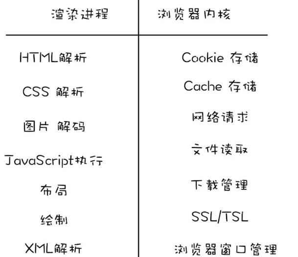

# 一、浏览器安全

## 1.什么是同源策略

同源指的是我们访问站点的：`协议`、`域名`、`端口号`必须一至，才叫`同源`。

浏览器默认同源之间的站点是可以相互访问资源和操作DOM的，而不同源之间想要互相访问资源或者操作DOM，那就需要加一些安全策略的限制，俗称同源策略**(浏览器自身的安全手段，服务器没有)**

同源策略主要限制了三个方面：

1. **DOM层面**：不同源站点之间不能相互访问和操作DOM
2. **数据层面**：不能获取不同源站点的Cookie、LocalStorage、indexDB等数据
3. **网络层面**：不能通过XMLHttpRequest向不同源站点发送请求

当然**同源策略限制也不是绝对隔离不同源的站点**，比如link、img、script标签都没有跨域限制，这让我们开发更灵活了，但是也同样带来了一些安全问题，也就是**浏览器网络安全**问题，最典型的就是XSS攻击和CSRF攻击

## 2.什么是XSS攻击？

1. 原理
   - XSS攻击是一种代码注入攻击，通过恶意注入脚本在浏览器运行，然后盗取用户信息**（注入代码—运行代码—盗取信息）**
   
2. 本质
   - 造成XSS攻击其实本质上还是**因为网站没有过滤恶意代码**，与正常代码混在一起之后，浏览器没有办法分辨哪些是可信的，然后导致恶意代码也被执行
   - 可能导致一下情况：
     - 页面数据或用户信息被窃取，如DOM、Cookie、LocalStorage
     - 修改DOM，比如伪造登录窗口或在页面生成浮窗广告
     - 监听用户行为，比如在登录或银行等站点用 addEventListener 监听键盘事件，窃取账号密码等信息
     - 流量被劫持向其他网站
   
3. XSS攻击类型：存储型、反射型、DOM型

   1. `存储型`：是在有发贴评论等带有数据保存功能的网站的input、textarea将恶意代码提交到网站数据库中，如`<script src="http://恶意网站"></script>` ，然后比如在显示评论的页面就会从数据获取，并直接执行这个script标签里的恶意代码

   2. `反射型`：是攻击者将恶意JS脚本作为用户发送给网站请求中的一部分，然后网站又把恶意脚本返回给用户，这时候就会在页面中被执行。比如打开包含带恶意脚本的链接，当打开后会向服务器请求后，服务器会获取URL中的数据然后拼接在HTML上返回，然后执行。它和存储型不同的是不会储存在服务器里
   
   3. `基于DOM型`：就是攻击者通过一些劫持手段，在页面资源传输过程中劫持并修改页面的数据，插入恶意代码
   
   
   
## 3. 怎样防范XSS攻击

   1. 对输入框的内容进行过滤或使用转义符进行转码
   
      
      
   2. 使用CSP，就是白名单，告诉浏览器哪些外部资源可以加载执行，让即使插入进来恶意代码的也不会执行，或者可以向哪些第三方站点提交数据。开启白名单的方式有两种：
   
      - 使用 meta 标签 `<meta http-equiv="Content-Security-Policy">`
      
      - 设置http头部的 `Content-Security-Policy`
      
      - ```
        <meta http-equiv="Content-Security-Policy" content="default-src 'self'; style-src 'self' 'unsafe-inline';script-src 'self' 'unsafe-eval' 'unsafe-inline';img-src  'self'  'unsafe-inline'  'unsafe-eval'  data:">
        ```
   
   3. 对一些敏感信息进行保护，在`Cookie`信息中添加`httpOnly`，告诉浏览器在保存Cookie，且不要对客户端脚本开放访问权限，然后就不能通过document.cookie获取cookie了

## 4.什么是CSRF 攻击

就是`跨站请求伪造攻击`，**主要就是利用用户的登录状态发起跨站请求**，比如邮箱里的乱七八糟的链接，打开链接的时候邮箱肯定是处于登录状态，然后黑客就可以用这个登录状态，伪造带有正确 Cookie 的 http 请求，直接绕过后台的登录验证，然后冒充用户执行一些操作。**（冒用信息）**

1. 发起CSRF攻击有三个必要条件：
   - 目标网站一定要有CSRF漏洞
   - 用户登录过目标网站，并且浏览器保存了登录状态
   - **需要用户主动打开第三方站点**
   
2. 本质
   
   - **本质是利用cookie在同源请求中携带发送给服务器的特点，来实现冒充用户**
   
   - **由于img、link、script等没有跨域限制，在Cookie 的 SameSite 属性为 lax（宽松）模式下，允许这些标签使用Cookie**
   
3. CSRF攻击的的三种类型：**GET类型，POST类型、链接型**

   - `自动发GET类型`：比如`img`或`iframe`标签等，当用户打开这个网站时会自动发起带Cookie的资源请求

   ```html
   
   复制代码
   ```

   样例：

   银行站点A：它以GET请求来完毕银行转账的操作，如：http://www.mybank.com/Transfer.php?toBankId=11&money=1000 

    危急站点B：它里面有一段HTML的代码例如以下：

   ```
   
   ```

   首先。你登录了银行站点A，然后訪问危急站点B，噢，这时你会发现你的银行账户少了1000块

    在訪问危急站点B的之前。你已经登录了银行站点A，而B中的 一个合法的请求，但这里被不法分子利用了）。所以你的浏览器会带上你的银行站点A的Cookie发出Get请求，去获取资源以GET的方式请求第三方资源。

   - `自动发POST类型`：比如整一个隐藏的`表单`，在用户进入页面的时候自动提交表单

     **例子：设定好表单的值，actions调用目标网站的更改信息接口，就可以改掉信息**
   
   ```html
   <form id="hack" action="https://恶意网址" method="post">
       ...
   </form>
   <script>document.getElementById('hack').submit()</script>
   复制代码
   ```

   - `诱导链接型`：就是诱导用户主动点击链接，比如`a标签`
   
   ```html
   <a href="https://恶意网址">点击领取大礼包</a>
   <a href="https://恶意网址">点击下载美女视频</a>
   ```


## 5.如何防范CSRF攻击

1. 在Cookie信息中添加 SameSite 属性，这个属性有三个值

   - **strict**：**严格模式**，完全禁止使用Cookie
   - **lax**：**宽松模式**，允许部分情况使用Cookie，`跨域的都行`，a标签跳转，link标签，GET提交表单
   - **none**：任何情况下都会发送Cookie，但必须同时设置Secure属性，意思是需要安全上下文，Cookie 只能通过https发送，否则无效

   Chrome 80之前默认值是none，之后是lax

   ```
   Set-Cookie: widget_session=123456; SameSite=None; Secure
   ```

2. 验证请求来源：服务器根据 http 请求头中的**origin** 或 **Referer** 判断属性是否为允许访问的站点，从而对请求进行过滤。优先判断 Origin，如果两个都不存在的话就直接阻止。

   - Referer：记录了请求是从哪个链接跳过来的并且包含了路径信息，也就是来源地址，所有请求都会有。不过这家伙不太可靠，所以后来又新增了Origin属性

   ```
   Referer: https://juejin.cn/editor/drafts/xxxx
   ```

   - origin：记录了域名信息，没有具体的URL路径，post请求才会有

   ```
   Origin: https://juejin.cn
   ```

3. Token 验证：服务器向用户返回一个随机数Token，再次请求时在请求头中以参数的形式添加入这个Token，然后服务器验证这个Token，如果没有或者内容不正确，就拒绝请求。缺点是

   - 每个请求都得添加比较繁琐
   - 单方面验证Cookie可能会被冒用，
   - 如果网站不止一台服务器，通过负载均衡转到了其他服务器的话，其他所有服务器中的Session中都得保留Token，不然就验证不了了

4. 双重验证Cookie：用攻击者只能利用Cookie，不能获取Cookie的特点，用户访问页面时，服务器向请求域名添加一个Cookie随机字符串，然后，用户再次请求时从Cookie中取出这个字符串，添加到URL参数中，然后服务器通过对Cookie中的数据和参数中的数据对比验证，不一样就拒绝请求。

   缺点是如果网站存在XSS漏洞，这法子就会失效，而且不能做到子域名的隔离
   
5. 使用 JWT(终极大招)

## 6.安全沙箱

- 如果我们下载了一个恶意程序，但是没有执行它，就不会有什么影响，浏览器也一样。
- 浏览器可以安全地下载各种网络资源，但是执行的时候就需要谨慎了。比如解析HTML、CSS、执行JS等操作，一不小心黑客就会利用这些操作对有漏洞的浏览器发起攻击
- **需要在渲染进程和操作系统之间建一堵墙，黑客最多能获取渲染进程的操作权限，隔离操作系统和渲染进程的就是安全沙箱**



**安全沙箱怎么影响各个模块的功能**

- 持久存储
  - 存储Cookie的读写，浏览器内核会维护一个存放所有Cookie的Cookie数据库，在渲染进程通过JS读取Cookie时，渲染进程会通过IPC将读取Cookie的信息发送给内核，浏览器内核读取Cookie之后再将内容通过IPC返回给渲染进程
  - 缓存文件的读写也是由浏览器内核实现
- 网络访问：渲染进程不能直接访问网络，也需要通过浏览器内核，而浏览器内核在处理URL请求之前，会检查渲染进程有没有权限请求该URL，比如有没有跨域
- 用户交互：
  - 输入时：操作系统会将输入事件传给浏览器内核，内核判断如果是地址栏输入事件就直接在内核处理，如果是页面里的就转发给渲染进程
  - 渲染时：渲染进程渲染出位图后，需要将生成好的位图发送给浏览器内核，再由内核将位图复制到屏幕上显示

## 7.中间人攻击

中间⼈ (Man-in-the-middle attack, MITM) 是指攻击者与通讯的两端分别创建独⽴的联系, 并交换其所收到的数据, 使通讯的两端认为他们正在通过⼀个私密的连接与对⽅直接对话, 但事实上整个会话都被攻击者完全控制。在中间⼈攻击中，攻击者可以拦截通讯双⽅的通话并插⼊新的内容。

攻击的过程如下：

- 客户端发送请求到服务端，请求被中间⼈截获 
- 服务器向客户端发送公钥 
- 中间⼈截获公钥，保留在⾃⼰⼿上。然后⾃⼰⽣成⼀个**伪造的**公钥，发给客户端 
- 客户端收到伪造的公钥后，⽣成加密hash值发给服务器 
- 中间⼈获得加密hash值，⽤⾃⼰的私钥解密获得真9秘钥,同时⽣成假的加密hash值，发给服务器 .
- 服务器⽤私钥解密获得假密钥,然后加密数据传输给客户端 

## 8.有哪些可能引起前端安全的问题？

- 跨站脚本 (Cross-Site Scripting, XSS): ⼀种代码注⼊⽅式, 为了与 CSS 区分所以被称作 XSS。早期常⻅于⽹络论坛, 起因是⽹站没有对⽤户的输⼊进⾏严格的限制, 使得攻击者可以将脚本上传到帖⼦让其他⼈浏览到有恶意脚本的⻚⾯, 其注⼊⽅式很简单包括但不限于 JavaScript / CSS / Flash 等； 
- iframe的滥⽤: iframe中的内容是由第三⽅来提供的，默认情况下他们不受控制，他们可以在iframe中运⾏JavaScirpt脚本、Flash插件、弹出对话框等等，这可能会破坏前端⽤户体验；
- 跨站点请求伪造（Cross-Site Request Forgeries，CSRF）: 指攻击者通过设置好的陷阱，强制对已完成认证的⽤户进⾏⾮预期的个⼈信息或设定信息等某些状态更新，属于被动攻击 
- 恶意第三⽅库: ⽆论是后端服务器应⽤还是前端应⽤开发，绝⼤多数时候都是在借助开发框架和各种类库进⾏快速开发，⼀旦第三⽅库被植⼊恶意代码很容易引起安全问题。

## 9.网络劫持有哪几种，如何防范？

1. DNS 劫持：(输⼊京东被强制跳转到淘宝这就属于dns劫持) 
   - DNS强制解析: 通过修改运营商的本地DNS记录，来引导⽤户流量到缓存服务器
   - 302跳转的⽅式: 通过监控⽹络出⼝的流量，分析判断哪些内容是可以进⾏劫持处理的,再对劫持的内存发起302跳转的回复，引导⽤户获取内容 
2. HTTP劫持：(访问⾕歌但是⼀直有贪玩蓝⽉的⼴告),由于http明⽂传输,运营商会修改你的http响应内容(即加⼴告) 

DNS劫持由于涉嫌违法，已经被监管起来，现在很少会有DNS劫持，⽽http劫持依然⾮常盛⾏，最有效的办法就是全站HTTPS，将HTTP加密，这使得运营商⽆法获取明⽂，就⽆法劫持你的响应内容。 
