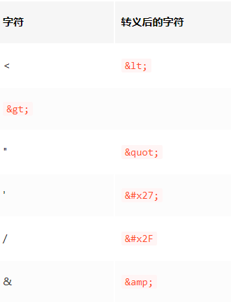

# 一、浏览器安全

## 1.什么是同源策略

同源指的是我们访问站点的：`协议`、`域名`、`端口号`必须一至，才叫`同源`。

浏览器默认同源之间的站点是可以相互访问资源和操作DOM的，而不同源之间想要互相访问资源或者操作DOM，那就需要加一些安全策略的限制，俗称同源策略**(浏览器自身的安全手段，服务器没有)**

同源策略主要限制了三个方面：

1. **DOM层面**：不同源站点之间不能相互访问和操作DOM
2. **数据层面**：不能获取不同源站点的Cookie、LocalStorage、indexDB等数据
3. **网络层面**：不能通过XMLHttpRequest向不同源站点发送请求

当然**同源策略限制也不是绝对隔离不同源的站点**，比如link、img、script标签都没有跨域限制，这让我们开发更灵活了，但是也同样带来了一些安全问题，也就是**浏览器网络安全**问题，最典型的就是XSS攻击和CSRF攻击

## 2.什么是XSS攻击？

1. 原理
   - XSS攻击是一种代码注入攻击，通过恶意注入脚本在浏览器运行，然后盗取用户信息**（注入代码—运行代码—盗取信息）**
   
2. 本质
   - 造成XSS攻击其实本质上还是**因为网站没有过滤恶意代码**，与正常代码混在一起之后，浏览器没有办法分辨哪些是可信的，然后导致恶意代码也被执行
   - 可能导致一下情况：
     - 页面数据或用户信息被窃取，如DOM、Cookie、LocalStorage
     - 修改DOM，比如伪造登录窗口或在页面生成浮窗广告
     - 监听用户行为，比如在登录或银行等站点用 addEventListener 监听键盘事件，窃取账号密码等信息
     - 流量被劫持向其他网站
   
3. XSS攻击类型：存储型、反射型、DOM型

   1. `存储型`：是在有发贴评论等带有数据保存功能的网站的input、textarea将恶意代码提交到网站数据库中，如`<script src="http://恶意网站"></script>` ，然后比如在显示评论的页面就会从数据获取，并直接执行这个script标签里的恶意代码

   2. `反射型`：是攻击者将恶意JS脚本作为用户发送给网站请求中的一部分，然后网站又把恶意脚本返回给用户，这时候就会在页面中被执行。比如打开包含带恶意脚本的链接，当打开后会向服务器请求后，服务器会获取URL中的数据然后拼接在HTML上返回，然后执行。它和存储型不同的是不会储存在服务器里
   
   3. `基于DOM型`：就是攻击者通过一些劫持手段，在页面资源传输过程中劫持并修改页面的数据，插入恶意代码
   
   
   
## 3. 怎样防范XSS攻击

   1. 对输入框的内容进行过滤或使用转义符进行转码
   
      
      
   2. 使用CSP，就是白名单，告诉浏览器哪些外部资源可以加载执行，让即使插入进来恶意代码的也不会执行，或者可以向哪些第三方站点提交数据。开启白名单的方式有两种：
   
      - 使用 meta 标签 `<meta http-equiv="Content-Security-Policy">`
       
      - 设置http头部的 `Content-Security-Policy`
       
      - ```
        <meta http-equiv="Content-Security-Policy" content="default-src 'self'; style-src 'self' 'unsafe-inline';script-src 'self' 'unsafe-eval' 'unsafe-inline';img-src  'self'  'unsafe-inline'  'unsafe-eval'  data:">
        ```
   
   3. 对一些敏感信息进行保护，在`Cookie`信息中添加`httpOnly`，告诉浏览器在保存Cookie，且不要对客户端脚本开放访问权限，然后就不能通过document.cookie获取cookie了

## 4.什么是CSRF 攻击

就是`跨站请求伪造攻击`，**主要就是利用用户的登录状态发起跨站请求**，比如邮箱里的乱七八糟的链接，打开链接的时候邮箱肯定是处于登录状态，然后黑客就可以用这个登录状态，伪造带有正确 Cookie 的 http 请求，直接绕过后台的登录验证，然后冒充用户执行一些操作。

1. 发起CSRF攻击有三个必要条件：
   - 目标网站一定要有CSRF漏洞
   - 用户登录过目标网站，并且浏览器保存了登录状态
   - **需要用户主动打开第三方站点**
   
2. 本质
   
   - **本质是利用cookie在同源请求中携带发送给服务器的特点，来实现冒充用户**
   
   - **由于img、link、script等没有跨域限制，在Cookie 的 SameSite 属性为 lax（宽松）模式下，允许这些标签使用Cookie**
   
3. CSRF攻击的的三种类型：**GET类型，POST类型、链接型**

   - `自动发GET类型`：比如`img`或`iframe`标签等，当用户打开这个网站时会自动发起带Cookie的资源请求

   ```html
   
   复制代码
   ```

   样例：

   银行站点A：它以GET请求来完毕银行转账的操作，如：http://www.mybank.com/Transfer.php?toBankId=11&money=1000 

    危急站点B：它里面有一段HTML的代码例如以下：

   ```
   
   ```

   首先。你登录了银行站点A，然后訪问危急站点B，噢，这时你会发现你的银行账户少了1000块

    在訪问危急站点B的之前。你已经登录了银行站点A，而B中的 一个合法的请求，但这里被不法分子利用了）。所以你的浏览器会带上你的银行站点A的Cookie发出Get请求，去获取资源以GET的方式请求第三方资源。

   - `自动发POST类型`：比如整一个隐藏的`表单`，在用户进入页面的时候自动提交表单

   ```html
   <form id="hack" action="https://恶意网址" method="post">
       ...
   </form>
   <script>document.getElementById('hack').submit()</script>
   复制代码
   ```

   - `诱导链接型`：就是诱导用户主动点击链接，比如`a标签`

   ```html
   <a href="https://恶意网址">点击领取大礼包</a>
   <a href="https://恶意网址">点击下载美女视频</a>
   ```


## 5.如何防范XSS攻击


