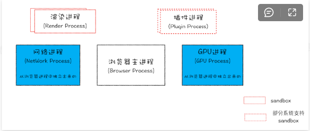
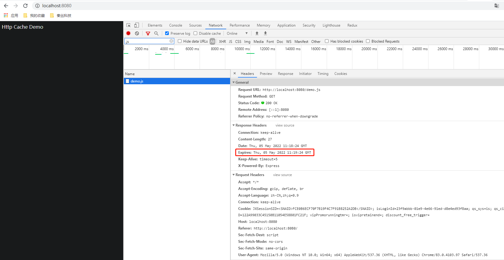
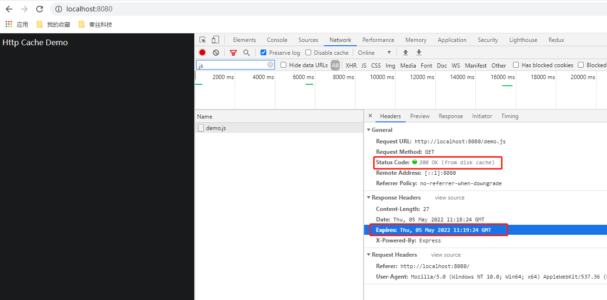
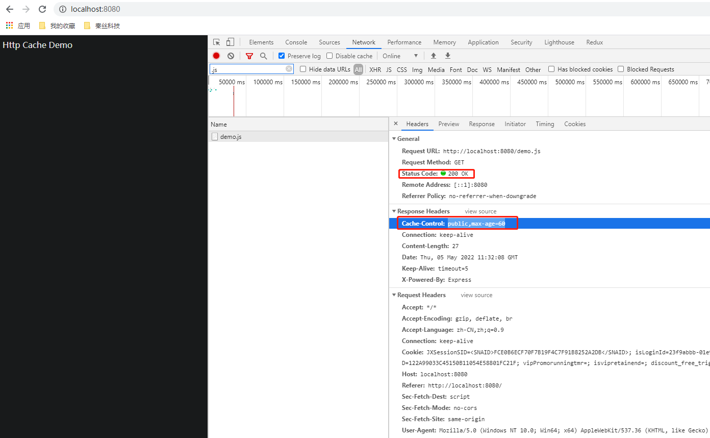
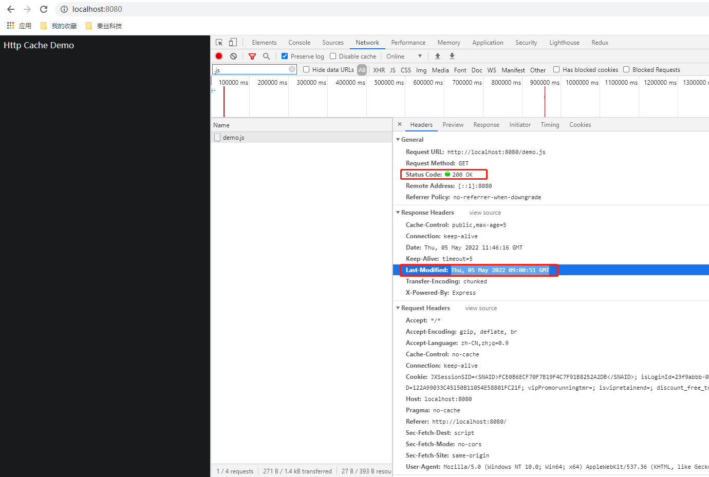
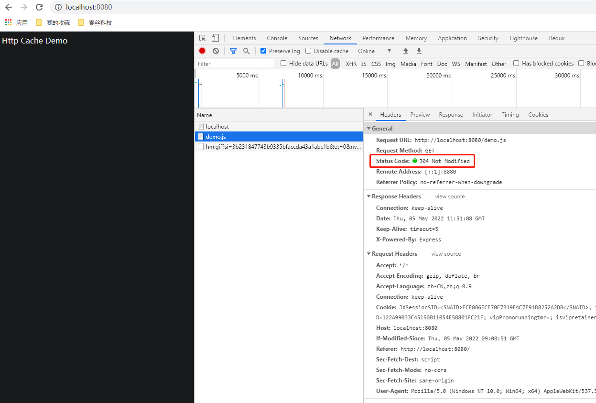
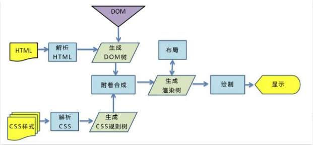
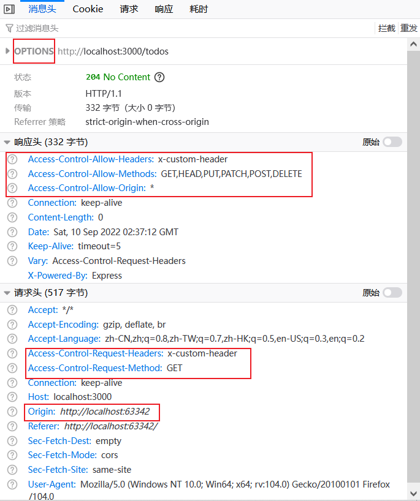
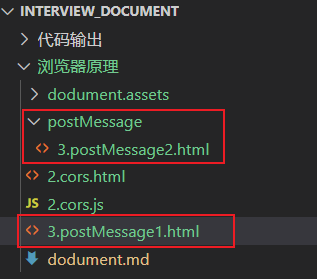
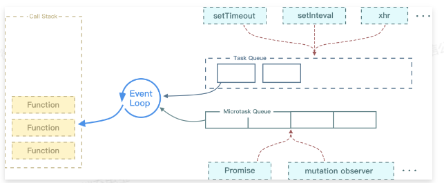

# 一、浏览器安全

## 1.什么是同源策略

同源指的是我们访问站点的：`协议`、`域名`、`端口号`必须一至，才叫`同源`。

浏览器默认同源之间的站点是可以相互访问资源和操作DOM的，而不同源之间想要互相访问资源或者操作DOM，那就需要加一些安全策略的限制，俗称同源策略**(浏览器自身的安全手段，服务器没有)**

同源策略主要限制了三个方面：

1. **DOM层面**：不同源站点之间不能相互访问和操作DOM
2. **数据层面**：不能获取不同源站点的Cookie、LocalStorage、indexDB等数据
3. **网络层面**：不能通过XMLHttpRequest向不同源站点发送请求

当然**同源策略限制也不是绝对隔离不同源的站点**，比如link、img、script标签都没有跨域限制，这让我们开发更灵活了，但是也同样带来了一些安全问题，也就是**浏览器网络安全**问题，最典型的就是XSS攻击和CSRF攻击

## 2.什么是XSS攻击？

1. 原理
   - XSS攻击是一种代码注入攻击，通过恶意注入脚本在浏览器运行，然后盗取用户信息**（注入代码—运行代码—盗取信息）**
   
2. 本质
   - 造成XSS攻击其实本质上还是**因为网站没有过滤恶意代码**，与正常代码混在一起之后，浏览器没有办法分辨哪些是可信的，然后导致恶意代码也被执行
   - 可能导致一下情况：
     - 页面数据或用户信息被窃取，如DOM、Cookie、LocalStorage
     - 修改DOM，比如伪造登录窗口或在页面生成浮窗广告
     - 监听用户行为，比如在登录或银行等站点用 addEventListener 监听键盘事件，窃取账号密码等信息
     - 流量被劫持向其他网站
   
3. XSS攻击类型：存储型、反射型、DOM型

   1. `存储型`：是在有发贴评论等带有数据保存功能的网站的input、textarea将恶意代码提交到网站数据库中，如`<script src="http://恶意网站"></script>` ，然后比如在显示评论的页面就会从数据获取，并直接执行这个script标签里的恶意代码

   2. `反射型`：是攻击者将恶意JS脚本作为用户发送给网站请求中的一部分，然后网站又把恶意脚本返回给用户，这时候就会在页面中被执行。比如打开包含带恶意脚本的链接，当打开后会向服务器请求后，服务器会获取URL中的数据然后拼接在HTML上返回，然后执行。它和存储型不同的是不会储存在服务器里
   
   3. `基于DOM型`：就是攻击者通过一些劫持手段，在页面资源传输过程中劫持并修改页面的数据，插入恶意代码
   
   
   
## 3. 怎样防范XSS攻击

   1. 对输入框的内容进行过滤或使用转义符进行转码
   
      
      
   2. 使用CSP，就是白名单，告诉浏览器哪些外部资源可以加载执行，让即使插入进来恶意代码的也不会执行，或者可以向哪些第三方站点提交数据。开启白名单的方式有两种：
   
      - 使用 meta 标签 `<meta http-equiv="Content-Security-Policy">`
      
      - 设置http头部的 `Content-Security-Policy`
      
      - ```
        <meta http-equiv="Content-Security-Policy" content="default-src 'self'; style-src 'self' 'unsafe-inline';script-src 'self' 'unsafe-eval' 'unsafe-inline';img-src  'self'  'unsafe-inline'  'unsafe-eval'  data:">
        ```
   
   3. 对一些敏感信息进行保护，在`Cookie`信息中添加`httpOnly`，告诉浏览器在保存Cookie，且不要对客户端脚本开放访问权限，然后就不能通过document.cookie获取cookie了

## 4.什么是CSRF 攻击

就是`跨站请求伪造攻击`，**主要就是利用用户的登录状态发起跨站请求**，比如邮箱里的乱七八糟的链接，打开链接的时候邮箱肯定是处于登录状态，然后黑客就可以用这个登录状态，伪造带有正确 Cookie 的 http 请求，直接绕过后台的登录验证，然后冒充用户执行一些操作。**（冒用信息）**

1. 发起CSRF攻击有三个必要条件：
   - 目标网站一定要有CSRF漏洞
   - 用户登录过目标网站，并且浏览器保存了登录状态
   - **需要用户主动打开第三方站点**
   
2. 本质
   
   - **本质是利用cookie在同源请求中携带发送给服务器的特点，来实现冒充用户**
   
   - **由于img、link、script等没有跨域限制，在Cookie 的 SameSite 属性为 lax（宽松）模式下，允许这些标签使用Cookie**
   
3. CSRF攻击的的三种类型：**GET类型，POST类型、链接型**

   - `自动发GET类型`：比如`img`或`iframe`标签等，当用户打开这个网站时会自动发起带Cookie的资源请求

   ```html
   
   复制代码
   ```

   样例：

   银行站点A：它以GET请求来完毕银行转账的操作，如：http://www.mybank.com/Transfer.php?toBankId=11&money=1000 

    危急站点B：它里面有一段HTML的代码例如以下：

   ```
   
   ```

   首先。你登录了银行站点A，然后訪问危急站点B，噢，这时你会发现你的银行账户少了1000块

    在訪问危急站点B的之前。你已经登录了银行站点A，而B中的 一个合法的请求，但这里被不法分子利用了）。所以你的浏览器会带上你的银行站点A的Cookie发出Get请求，去获取资源以GET的方式请求第三方资源。

   - `自动发POST类型`：比如整一个隐藏的`表单`，在用户进入页面的时候自动提交表单

     **例子：设定好表单的值，actions调用目标网站的更改信息接口，就可以改掉信息**
   
   ```html
   <form id="hack" action="https://恶意网址" method="post">
       ...
   </form>
   <script>document.getElementById('hack').submit()</script>
   复制代码
   ```

   - `诱导链接型`：就是诱导用户主动点击链接，比如`a标签`
   
   ```html
   <a href="https://恶意网址">点击领取大礼包</a>
   <a href="https://恶意网址">点击下载美女视频</a>
   ```


## 5.如何防范CSRF攻击

1. 在Cookie信息中添加 SameSite 属性，这个属性有三个值

   - **strict**：**严格模式**，完全禁止使用Cookie
   - **lax**：**宽松模式**，允许部分情况使用Cookie，`跨域的都行`，a标签跳转，link标签，GET提交表单
   - **none**：任何情况下都会发送Cookie，但必须同时设置Secure属性，意思是需要安全上下文，Cookie 只能通过https发送，否则无效

   Chrome 80之前默认值是none，之后是lax

   ```
   Set-Cookie: widget_session=123456; SameSite=None; Secure
   ```

2. 验证请求来源：服务器根据 http 请求头中的**origin** 或 **Referer** 判断属性是否为允许访问的站点，从而对请求进行过滤。优先判断 Origin，如果两个都不存在的话就直接阻止。

   - Referer：记录了请求是从哪个链接跳过来的并且包含了路径信息，也就是来源地址，所有请求都会有。不过这家伙不太可靠，所以后来又新增了Origin属性

   ```
   Referer: https://juejin.cn/editor/drafts/xxxx
   ```

   - origin：记录了域名信息，没有具体的URL路径，post请求才会有

   ```
   Origin: https://juejin.cn
   ```

3. Token 验证：服务器向用户返回一个随机数Token，再次请求时在请求头中以参数的形式添加入这个Token，然后服务器验证这个Token，如果没有或者内容不正确，就拒绝请求。缺点是

   - 每个请求都得添加比较繁琐
   - 单方面验证Cookie可能会被冒用，
   - 如果网站不止一台服务器，通过负载均衡转到了其他服务器的话，其他所有服务器中的Session中都得保留Token，不然就验证不了了

4. 双重验证Cookie：用攻击者只能利用Cookie，不能获取Cookie的特点，用户访问页面时，服务器向请求域名添加一个Cookie随机字符串，然后，用户再次请求时从Cookie中取出这个字符串，添加到URL参数中，然后服务器通过对Cookie中的数据和参数中的数据对比验证，不一样就拒绝请求。

   缺点是如果网站存在XSS漏洞，这法子就会失效，而且不能做到子域名的隔离
   
5. 使用 JWT(终极大招)

## 6.安全沙箱

- 如果我们下载了一个恶意程序，但是没有执行它，就不会有什么影响，浏览器也一样。
- 浏览器可以安全地下载各种网络资源，但是执行的时候就需要谨慎了。比如解析HTML、CSS、执行JS等操作，一不小心黑客就会利用这些操作对有漏洞的浏览器发起攻击
- **需要在渲染进程和操作系统之间建一堵墙，黑客最多能获取渲染进程的操作权限，隔离操作系统和渲染进程的就是安全沙箱**


**安全沙箱怎么影响各个模块的功能**

- 持久存储
  - 存储Cookie的读写，浏览器内核会维护一个存放所有Cookie的Cookie数据库，在渲染进程通过JS读取Cookie时，渲染进程会通过IPC将读取Cookie的信息发送给内核，浏览器内核读取Cookie之后再将内容通过IPC返回给渲染进程
  - 缓存文件的读写也是由浏览器内核实现
- 网络访问：渲染进程不能直接访问网络，也需要通过浏览器内核，而浏览器内核在处理URL请求之前，会检查渲染进程有没有权限请求该URL，比如有没有跨域
- 用户交互：
  - 输入时：操作系统会将输入事件传给浏览器内核，内核判断如果是地址栏输入事件就直接在内核处理，如果是页面里的就转发给渲染进程
  - 渲染时：渲染进程渲染出位图后，需要将生成好的位图发送给浏览器内核，再由内核将位图复制到屏幕上显示

## 7.中间人攻击

中间⼈ (Man-in-the-middle attack, MITM) 是指攻击者与通讯的两端分别创建独⽴的联系, 并交换其所收到的数据, 使通讯的两端认为他们正在通过⼀个私密的连接与对⽅直接对话, 但事实上整个会话都被攻击者完全控制。在中间⼈攻击中，攻击者可以拦截通讯双⽅的通话并插⼊新的内容。

攻击的过程如下：

- 客户端发送请求到服务端，请求被中间⼈截获 
- 服务器向客户端发送公钥 
- 中间⼈截获公钥，保留在⾃⼰⼿上。然后⾃⼰⽣成⼀个**伪造的**公钥，发给客户端 
- 客户端收到伪造的公钥后，⽣成加密hash值发给服务器 
- 中间⼈获得加密hash值，⽤⾃⼰的私钥解密获得真9秘钥,同时⽣成假的加密hash值，发给服务器 .
- 服务器⽤私钥解密获得假密钥,然后加密数据传输给客户端 

## 8.有哪些可能引起前端安全的问题？

- 跨站脚本 (Cross-Site Scripting, XSS): ⼀种代码注⼊⽅式, 为了与 CSS 区分所以被称作 XSS。早期常⻅于⽹络论坛, 起因是⽹站没有对⽤户的输⼊进⾏严格的限制, 使得攻击者可以将脚本上传到帖⼦让其他⼈浏览到有恶意脚本的⻚⾯, 其注⼊⽅式很简单包括但不限于 JavaScript / CSS / Flash 等； 
- iframe的滥⽤: iframe中的内容是由第三⽅来提供的，默认情况下他们不受控制，他们可以在iframe中运⾏JavaScirpt脚本、Flash插件、弹出对话框等等，这可能会破坏前端⽤户体验；
- 跨站点请求伪造（Cross-Site Request Forgeries，CSRF）: 指攻击者通过设置好的陷阱，强制对已完成认证的⽤户进⾏⾮预期的个⼈信息或设定信息等某些状态更新，属于被动攻击 
- 恶意第三⽅库: ⽆论是后端服务器应⽤还是前端应⽤开发，绝⼤多数时候都是在借助开发框架和各种类库进⾏快速开发，⼀旦第三⽅库被植⼊恶意代码很容易引起安全问题。

## 9.网络劫持有哪几种，如何防范？

1. DNS 劫持：(输⼊京东被强制跳转到淘宝这就属于dns劫持) 
   - DNS强制解析: 通过修改运营商的本地DNS记录，来引导⽤户流量到缓存服务器
   - 302跳转的⽅式: 通过监控⽹络出⼝的流量，分析判断哪些内容是可以进⾏劫持处理的,再对劫持的内存发起302跳转的回复，引导⽤户获取内容 
2. HTTP劫持：(访问⾕歌但是⼀直有贪玩蓝⽉的⼴告),由于http明⽂传输,运营商会修改你的http响应内容(即加⼴告) 

DNS劫持由于涉嫌违法，已经被监管起来，现在很少会有DNS劫持，⽽http劫持依然⾮常盛⾏，最有效的办法就是全站HTTPS，将HTTP加密，这使得运营商⽆法获取明⽂，就⽆法劫持你的响应内容。 

# 二、进程与线程

## 1.进程与线程的概念

启动一个程序的时候，操作系统会为该程序创建一块内存，用来存放代码、运行中的数据和一个执行任务的主线程，我们把这样的一个运行环境叫**进程**。

**进程是资源分配的最小单位，线程是CPU调度的最小单位。**

进程和线程之间的关系有以下四个特点：

**（1）进程中的任意一线程执行出错，都会导致整个进程的崩溃。**

**（2）线程之间共享进程中的数据。**

**（3）当一个进程关闭之后，操作系统会回收进程所占用的内存，**当一个进程退出时，操作系统会回收该进程所申请的所有资源；即使其中任意线程因为操作不当导致内存泄漏，当进程退出时，这些内存也会被正确回收。

**（4）进程之间的内容相互隔离。**进程隔离就是为了使操作系统中的进程互不干扰，每一个进程只能访问自己占有的数据，也就避免出现进程 A 写入数据到进程 B 的情况。正是因为进程之间的数据是严格隔离的，所以一个进程如果崩溃了，或者挂起了，是不会影响到其他进程的。如果进程之间需要进行数据的通信，这时候，就需要使用用于进程间通信的机制了。

## 2. Chrome 浏览器架构



- 一个浏览器**主进程**
- 一个**GPU进程**
- 一个**网络进程**
- 多个**渲染进程**
- 多个**插件进程**

这些进程的功能：

- **浏览器进程**：主要负责界面显示、用户交互、子进程管理，同时提供存储等功能。
- **渲染进程**：核心任务是将 HTML、CSS 和 JavaScript 转换为用户可以与之交互的网页，排版引擎 Blink 和 JavaScript 引擎 V8 都是运行在该进程中，默认情况下，Chrome 会为每个 Tab 标签创建一个渲染进程。出于安全考虑，渲染进程都是运行在沙箱模式下。
- **GPU 进程**：其实， GPU 的使用初衷是为了实现 3D CSS 的效果，只是随后网页、Chrome 的 UI 界面都选择采用 GPU 来绘制，这使得 GPU 成为浏览器普遍的需求。最后，Chrome 在其多进程架构上也引入了 GPU 进程。
- **网络进程**：主要负责页面的网络资源加载，之前是作为一个模块运行在浏览器进程里面的，直至最近才独立出来，成为一个单独的进程。
- **插件进程**：主要是负责插件的运行，因插件易崩溃，所以需要通过插件进程来隔离，以保证插件进程崩溃不会对浏览器和页面造成影响。

## 3.进程和线程的区别

- 资源：

  - 进程是cpu资源分配的最小单位（是能拥有资源和独立运行的最小单位）
  - 线程是cpu调度的最小单位（线程是建立在进程的基础上的一次程序运行单位，一个进程中可以有多个线程）。

- 通信：

  - 线程间可以通过直接共享同一进程中的资源
  - 进程通信需要借助 进程间通信

- 调度：
  - 进程切换比线程切换的开销要大
  - 线程是CPU调度的基本单位，线程的切换不会引起进程切换，但某个进程中的线程切换到另一个进程中的线程时，会引起进程切换。
- 系统开销
  - 进程：涉及当前执行进程 CPU 环境还有各种各样状态的保存及新调度进程状态的设置，开销大
  - 线程：需保存和设置少量寄存器内容，开销较小
## 4.浏览器渲染进程的线程有哪些？

1.  GUI 渲染线程
2.  JS 引擎线程
3. 事件触发线程
4. 定时器触发线程
5. 异步 http 请求线程

### 1.**GUI渲染线程**

负责渲染浏览器页面，解析HTML、CSS，构建DOM树、构建CSSOM树、构建渲染树和绘制页面；当界面需要**重绘**或由于某种操作引发**回流**时，该线程就会执行。

**注意**：GUI渲染线程和JS引擎线程是互斥的，当JS引擎执行时GUI线程会被挂起，GUI更新会被保存在一个队列中等到JS引擎空闲时立即被执行。

### 2.**JS引擎线程**

JS引擎线程也称为JS内核，负责处理Javascript脚本程序，解析Javascript脚本，运行代码；JS引擎线程一直等待着任务队列中任务的到来，然后加以处理，一个Tab页中无论什么时候都只有一个JS引擎线程在运行JS程序

**注意**：GUI渲染线程与JS引擎线程的互斥关系，所以如果JS执行的时间过长，会造成页面的渲染不连贯，导致页面渲染加载阻塞。

### 3.事件触发线程

属于浏览器而不是JS引擎，用来控制事件循环；当JS引擎执行代码块如setTimeOut时（也可是来自浏览器内核的其他线程,如鼠标点击、AJAX异步请求等），会将对应任务添加到事件触发线程中；当对应的事件符合触发条件被触发时，该线程会把事件添加到待处理队列的队尾，等待JS引擎的处理；

**注意**：由于JS的单线程关系，所以这些待处理队列中的事件都得排队等待JS引擎处理（当JS引擎空闲时才会去执行）；

### 4.定时器触发线程

setInterval与setTimeout所在线程；浏览器定时计数器并不是由JS引擎计数的，因为JS引擎是单线程的，如果处于阻塞线程状态就会影响记计时的准确性；因此使用单独线程来计时并触发定时器，计时完毕后，添加到事件队列中，等待JS引擎空闲后执行，所以定时器中的任务在设定的时间点不一定能够准时执行，定时器只是在指定时间点将任务添加到事件队列中；

### 5.**异步http请求线程**

- XMLHttpRequest连接后通过浏览器新开一个线程请求；
- 检测到状态变更时，如果设置有回调函数，异步线程就产生状态变更事件，将回调函数放入事件队列中，等待JS引擎空闲后执行；

# 三、http 缓存

## 1.http 缓存的分类

1. 强制缓存 

   缓存数据未失效的情况下，不需要再和服务器发生交互。

2. 协商缓存（对比缓存）

   需要进行比较是否使用缓存。

3. 对比

   两类缓存规则可以同时存在，强制缓存优先级高于协商缓存，也就是说，当执行强制缓存的规则时，如果缓存生效，直接使用缓存，不再执行协商缓存规则。

## 2.强制缓存

- Expires
- Cache-control
- Pragma

**缺点：**

每次都是根据时间来判断缓存是否过期，当到达过期时间后，如果文件没有改动，再次去获取文件就有点浪费服务器的资源。

### Expires

Expires的值是服务器告诉浏览器的缓存过期时间（值为GMT时间，即格林尼治时间），即下一次请求时，如果浏览器端的当前时间还没有到达过期时间，则直接使用缓存数据。

```
app.get('/demo.js', (req, res) => {
	let jsPath = path.resolve(__dirname, './static/js/demo.js');
	let cont = fs.readFileSync(jsPath);
	res.setHeader('Expires', getGLNZ()) //1分钟
	res.end(cont)
})
function getGLNZ() {
	return moment().utc().add(1, 'm').format('ddd, DD MMM YYYY HH:mm:ss') + ' GMT';
}
```

- 添加Expires响应头，由于是格林尼治时间，所以通过momentjs 转换

- 首次访问

  

- 不够一分钟，使用缓存（新开tab页验证）

  

- 超出一分钟，重新请求（新开tab页验证）

  

**存在的问题：**

- 由于浏览器时间和服务器时间不同步，如果浏览器设置了一个很后的时间，过期时间一直没有用
- 缓存过期后，不管文件有没有发生变化，服务器都会再次读取文件返回给浏览器
- Expires 是HTTP 1.0的东西，现在默认浏览器均默认使用HTTP 1.1，所以它的作用基本忽略

### Cache-control

```
res.setHeader('Cache-Control', 'public,max-age=120') //2分钟
```

- private: 客户端可以缓存
- public: 客户端和代理服务器都可缓存
- max-age=xxx: 缓存的内容将在 xxx 秒后失效
- no-cache: 需要使用对比缓存来验证缓存数据
- no-store: 所有内容都不会缓存，强制缓存，对比缓存都不会触发


针对浏览器和服务器时间不同步，加入了新的缓存方案；这次服务器不是直接告诉浏览器过期时间，而是告诉一个相对时间Cache-Control=10秒，意思是10秒内，直接使用浏览器缓存。

```
app.get('/demo.js', (req, res) => {
	let jsPath = path.resolve(__dirname, './static/js/demo.js');
	let cont = fs.readFileSync(jsPath);
	res.setHeader('Cache-Control', 'public,max-age=60') //1分钟
	res.end(cont)
})
```

- 首次访问

  

- 不够一分钟，使用缓存（新开tab页验证）

  

- 超出一分钟，重新请求（新开tab页验证）

  

### Progma

也是在http1.0时代，和Expires一样，然这两个字段早可抛弃，但为了做http协议的向下兼容，你还是可以看到很多网站依旧会带上这两个字段。

Pragma 只有一个属性值，就是 no-cache ，效果和 Cache-Control 中的 no-cache 一致，不使用强缓存，需要与服务器验证缓存是否新鲜，在 3 个头部属性中的优先级最高。

```
res.setHeader('Pragma', 'no-cache') //禁止缓存
```

## 3.协商缓存

- Last-Modified和If-Modified-Since
- ETag和If-None-Match


### Last-Modified和If-Modified-Since

为了节省服务器的资源，再次改进方案。浏览器和服务器协商，服务器每次返回文件的同时，告诉浏览器文件在服务器上最近的修改时间。请求过程如下：

- 浏览器请求静态资源demo.js
- 服务器读取磁盘文件demo.js，返给浏览器，同时带上文件上次修改时间 Last-Modified（GMT标准格式）
- 当浏览器上的缓存文件过期时，浏览器带上请求头**If-Modified-Since**（等于上一次请求的**Last-Modified**）请求服务器
- 服务器比较请求头里的**If-Modified-Since**和文件的上次修改时间。如果果一致就继续使用本地缓存（304），如果不一致就再次返回文件内容和Last-Modified。
- 循环请求。

```
app.get('/demo.js', (req, res) => {
	let jsPath = path.resolve(__dirname, './static/js/demo.js')
	let cont = fs.readFileSync(jsPath);
	let status = fs.statSync(jsPath)

	let lastModified = status.mtime.toUTCString() // 指示最后一次修改此文件的时间戳
	// 如果上次修改时间没有改变 —— 走缓存
	if (lastModified === req.headers['if-modified-since']) {
		res.writeHead(304, 'Not Modified')
		res.end()
	} else { // 更新上次修改时间
		res.setHeader('Cache-Control', 'public,max-age=5')
		res.setHeader('Last-Modified', lastModified)
		res.writeHead(200, 'OK')
		res.end(cont)
	}
})
```

- 首次访问

  

- 没有修改demo.js且大于5s后访问——使用缓存

  

- 修改 demo.js 且访问——重新请求

  

**缺点**

虽然这个方案比前面三个方案有了进一步的优化，浏览器检测文件是否有修改，如果没有变化就不再发送文件；但是还是有以下缺点：

- 由于Last-Modified修改时间是GMT时间，只能精确到秒，如果文件在1秒内有多次改动，服务器并不知道文件有改动，浏览器拿不到最新的文件
- 如果服务器上文件被多次修改了但是内容却没有发生改变，服务器需要再次重新返回文件

### ETag和If-None-Match

为了解决文件修改时间不精确带来的问题，服务器和浏览器再次协商，这次不返回时间，返回文件的唯一标识ETag。只有当文件内容改变时，ETag才改变。请求过程如下：

- 浏览器请求静态资源demo.js
- 服务器读取磁盘文件demo.js，返给浏览器，同时带上文件的唯一标识ETag
- 当浏览器上的缓存文件过期时，浏览器带上请求头**If-None-Match**（等于上一次请求的ETag）请求服务器
- 服务器比较请求头里的**If-None-Match**和文件的ETag。如果一致就继续使用本地缓存（304），如果不一致就再次返回文件内容和ETag
- 循环请求

```
app.get('/demo.js',(req, res)=>{
    let jsPath = path.resolve(__dirname,'./static/js/demo.js');
    let cont = fs.readFileSync(jsPath);
    let etag = md5(cont); // 生成唯一标识

	// 如果没有变更
    if(req.headers['if-none-match'] === etag){
        res.writeHead(304, 'Not Modified');
        res.end();
    } else { // 如果变更了，重新刷新唯一标识
        res.setHeader('ETag', etag);
        res.writeHead(200, 'OK');
        res.end(cont);
    }
})
```

- 首次访问

  

- 没有修改demo.js——使用缓存

  

- 修改demo.js——重新请求

  


## 4.优先级

Pragma > Cache-Control > Expires > ETag > Last-Modified

## 5.为什么需要浏览器缓存

所谓的**浏览器缓存**指的是浏览器将用户请求过的静态资源，存储到电脑本地磁盘中，当浏览器再次访问时，就可以直接从本地加载，不需要再去服务端请求了。

使用浏览器缓存，有以下优点：

- 减少了服务器的负担，提高了网站的性能
- 加快了客户端网页的加载速度
- 减少了多余网络数据传输

## 6.点击刷新按钮或者按 F5、按 Ctrl+F5 （强制刷新）、地址栏回车有什么区别？

- **点击刷新按钮或者按 F5：**浏览器直接对本地的缓存文件过期，但是会带上If-Modifed-Since，If-None-Match，这就意味着服务器会对文件检查新鲜度，返回结果可能是 304，也有可能是 200。
- **用户按 Ctrl+F5（强制刷新）：**浏览器不仅会对本地文件过期，而且不会带上 If-Modifed-Since，If-None-Match，相当于之前从来没有请求过，返回结果是 200。
- 地址栏回车： 浏览器发起请求，按照正常流程，本地检查是否过期，然后服务器检查新鲜度，最后返回内容。

# 四、浏览器渲染原理

## 1.浏览器的渲染过程

浏览器渲染主要有以下步骤：

- 首先解析收到的文档，根据文档定义构建一棵 DOM 树，DOM 树是由 DOM 元素及属性节点组成的。
- 然后对 CSS 进行解析，生成 CSSOM 规则树。
- 根据 DOM 树和 CSSOM 规则树构建渲染树。渲染树的节点被称为渲染对象，渲染对象是一个包含有颜色和大小等属性的矩形，渲染对象和 DOM 元素相对应，但这种对应关系不是一对一的，不可见的 DOM 元素不会被插入渲染树。还有一些 DOM元素对应几个可见对象，它们一般是一些具有复杂结构的元素，无法用一个矩形来描述。
- 当渲染对象被创建并添加到树中，它们并没有位置和大小，所以当浏览器生成渲染树以后，就会根据渲染树来进行布局（也可以叫做回流）。这一阶段浏览器要做的事情是要弄清楚各个节点在页面中的确切位置和大小。通常这一行为也被称为“自动重排”。
- 布局阶段结束后是绘制阶段，遍历渲染树并调用渲染对象的 paint 方法将它们的内容显示在屏幕上，绘制使用 UI 基础组件。



## 2.浏览器渲染优化

- JavaScript 层面
- CSS 层面
- DOM树、CSSOM树
- 减少回流（重排）与重绘

### 2.1 JavaScript 层面

**js 会阻塞HTML与CSS的解析**

- 尽量将JavaScript文件放在body的最后
- body中间尽量不要写`<script>`标签
- script 标签的引入资源方式有三种，有一种就是我们常用的直接引入，还有两种就是使用 async 属性和 defer 属性来异步引入，两者都是去异步加载外部的JS文件，不会阻塞DOM的解析（尽量使用异步加载）。三者的区别如下：
  - **script** 立即停止页面渲染去加载资源文件，当资源加载完毕后立即执行js代码，js代码执行完毕后继续渲染页面；
  - **async** 是在下载完成之后，立即异步加载，加载好后立即执行，多个带async属性的标签，不能保证加载的顺序；
  - **defer** 是在下载完成之后，立即异步加载。加载好后，如果 DOM 树还没构建好，则先等 DOM 树解析好再执行；如果DOM树已经准备好，则立即执行。多个带defer属性的标签，按照顺序执行。**（在DOMContentLoaded执行前）**

### 2.2 CSS 层面

使用CSS有三种方式：使用**link、@import、内联样式**，其中link和@import都是导入外部样式。它们之间的区别：

- **link**：浏览器会派发一个新的线程(HTTP线程)去加载资源文件，与此同时GUI渲染线程会继续向下渲染代码
- **@import**：GUI渲染线程会暂时停止渲染，去服务器加载资源文件，资源文件没有返回之前不会继续渲染(阻碍浏览器渲染)
- **style**：GUI直接渲染

### 2.3 DOM树、CSSOM树

- HTML文件的代码层级尽量不要太深
- 使用语义化的标签，来避免不标准语义化的特殊处理
- 减少CSS的代码的层级，因为选择器是**从右向左**进行解析的

### 2.4 减少回流与重绘

- 作DOM时，尽量在低层级的DOM节点进行操作
- 不要使用`table`布局， 一个小的改动可能会使整个`table`进行重新布局
- 不要频繁操作元素的样式，对于静态页面，可以修改类名，而不是样式。
- 使用absolute或者fixed，使元素脱离文档流，这样他们发生变化就不会影响其他元素
- 避免频繁操作DOM，可以创建一个文档片段`documentFragment`，在它上面应用所有DOM操作，最后再把它添加到文档中
- 将元素先设置`display: none`，操作结束后再把它显示出来。因为在display属性为none的元素上进行的DOM操作不会引发回流和重绘。
- 将DOM的多个读操作（或者写操作）放在一起，而不是读写操作穿插着写。这得益于**浏览器的渲染队列机制**。

浏览器针对页面的回流与重绘，进行了自身的优化——**渲染队列**

**浏览器会将所有的回流、重绘的操作放在一个队列中，当队列中的操作到了一定的数量或者到了一定的时间间隔，浏览器就会对队列进行批处理。这样就会让多次的回流、重绘变成一次回流重绘。**

将多个读操作（或者写操作）放在一起，就会等所有的读操作进入队列之后执行，这样，原本应该是触发多次回流，变成了只触发一次回流。

## 3.渲染过程中遇到 js 文件如何处理？

- JavaScript 的加载、解析与执行会阻塞文档的解析
- 在构建 DOM 时，HTML 解析器若遇到了 JavaScript，那么它会暂停文档的解析，将控制权移交给 JavaScript 引擎，等 JavaScript 引擎运行完毕，浏览器再从中断的地方恢复继续解析文档
- 所以建议把script标签放在body底部，或者给script添加defer或者async属性。

## 4.什么是文档的预解析

Webkit 和 Firefox 都做了这个优化，当执行 JavaScript 脚本时，另一个线程解析剩下的文档，并加载后面需要通过网络加载的资源。这种方式可以使资源并行加载从而使整体速度更快。需要注意的是，预解析并不改变 DOM 树，它将这个工作留给主解析过程，自己只解析外部资源的引用，比如外部脚本、样式表及图片。

## 5.什么情况会阻塞渲染？

- 首先渲染的前提是生成渲染树，所以 HTML 和 CSS 肯定会阻塞渲染。
- 当浏览器在解析到 script 标签时，会暂停构建 DOM，也会阻塞渲染。

# 五、浏览器本地存储

## 1.浏览器本地存储方式及使用场景

- Cookie
- localStorage
- sessionStorage

### 1.Cookie

- 由来：解决服务端是无法判断网络中的两个请求是否是同一用户发起的。
- 大小：4kb左右
- 特性：
  - Cookie一旦创建成功，名称就无法修改
  - Cookie是**无法跨域名**的，也就是说a域名和b域名下的cookie是无法共享的，这也是由Cookie的隐私安全性决定的，这样就能够阻止非法获取其他网站的Cookie
  - 每个域名下Cookie的数量不能超过20个，每个Cookie的大小不能超过4kb
  - **有安全问题**，如果Cookie被拦截了，那就可获得session的所有信息，即使加密也于事无补，无需知道cookie的意义，只要转发cookie就能达到目的
  - Cookie在请求一个新的页面的时候都会被发送过去
- 跨域共享Cookie的方法
  - 使用Nginx反向代理
  - 在一个站点登陆之后，往其他网站写Cookie。服务端的Session存储到一个节点，Cookie存储sessionId
- 使用场景
  - 最常见的使用场景就是Cookie和session结合使用，我们将sessionId存储到Cookie中，每次发请求都会携带这个sessionId，这样服务端就知道是谁发起的请求，从而响应相应的信息。
  - 可以用来统计页面的点击次数

### 2. LocalStorage

- 由来：存储信息较大，Cookie不能满足

- 优点：

  - 在大小方面，LocalStorage的大小一般为5MB，可以储存更多的信息
  - LocalStorage是持久储存，并不会随着页面的关闭而消失，除非主动清理，不然会永久存在
  - 仅储存在本地，不像Cookie那样每次HTTP请求都会被携带

- 缺点：

  - 存在浏览器兼容问题，IE8以下版本的浏览器不支持
  - 如果浏览器设置为隐私模式，那我们将无法读取到LocalStorage
  - LocalStorage受到同源策略的限制，即端口、协议、主机地址有任何一个不相同，都不会访问

- 常用API:

  ```
  // 保存数据到 localStorage
  localStorage.setItem('key', 'value');
  
  // 从 localStorage 获取数据
  let data = localStorage.getItem('key');
  
  // 从 localStorage 删除保存的数据
  localStorage.removeItem('key');
  
  // 从 localStorage 删除所有保存的数据
  localStorage.clear();
  
  // 获取某个索引的Key
  localStorage.key(index)
  ```

### 3. SessionStorage

SessionStorage和LocalStorage都是在HTML5才提出来的存储方案，SessionStorage 主要用于临时保存同一窗口(或标签页)的数据，刷新页面时不会删除，关闭窗口或标签页之后将会删除这些数据。

**SessionStorage**与**LocalStorage**对比：

- SessionStorage和LocalStorage都在**本地进行数据存储**；
- SessionStorage也有同源策略的限制，但是SessionStorage有一条更加严格的限制，SessionStorage**只有在同一浏览器的同一窗口下才能够共享**；
- LocalStorage和SessionStorage**都不能被爬虫爬取**；

**SessionStorage的常用API：**

```
// 保存数据到 sessionStorage
sessionStorage.setItem('key', 'value');

// 从 sessionStorage 获取数据
let data = sessionStorage.getItem('key');

// 从 sessionStorage 删除保存的数据
sessionStorage.removeItem('key');

// 从 sessionStorage 删除所有保存的数据
sessionStorage.clear();

// 获取某个索引的Key
sessionStorage.key(index)
```

## 2.Cookie有哪些字段，作用分别是什么

**Cookie由以下字段组成：**

- **Name**：cookie的名称
- **Value**：cookie的值，对于认证cookie，value值包括web服务器所提供的访问令牌；
- **Size**： cookie的大小
- **Path**：可以访问此cookie的页面路径。 比如domain是abc.com，path是`/test`，那么只有`/test`路径下的页面可以读取此cookie。
- **Secure**： 指定是否使用HTTPS安全协议发送Cookie。使用HTTPS安全协议，可以保护Cookie在浏览器和Web服务器间的传输过程中不被窃取和篡改。该方法也可用于Web站点的身份鉴别，即在HTTPS的连接建立阶段，浏览器会检查Web网站的SSL证书的有效性。但是基于兼容性的原因（比如有些网站使用自签署的证书）在检测到SSL证书无效时，浏览器并不会立即终止用户的连接请求，而是显示安全风险信息，用户仍可以选择继续访问该站点。
- **Domain**：可以访问该cookie的域名，Cookie 机制并未遵循严格的同源策略，允许一个子域可以设置或获取其父域的 Cookie。当需要实现单点登录方案时，Cookie 的上述特性非常有用，然而也增加了 Cookie受攻击的危险，比如攻击者可以借此发动会话定置攻击。因而，浏览器禁止在 Domain 属性中设置.org、.com 等通用顶级域名、以及在国家及地区顶级域下注册的二级域名，以减小攻击发生的范围。
- **HTTP**： 该字段包含`HTTPOnly` 属性 ，该属性用来设置cookie能否通过脚本来访问，默认为空，即可以通过脚本访问。在客户端是不能通过js代码去设置一个httpOnly类型的cookie的，这种类型的cookie只能通过服务端来设置。该属性用于防止客户端脚本通过`document.cookie`属性访问Cookie，有助于保护Cookie不被跨站脚本攻击窃取或篡改。但是，HTTPOnly的应用仍存在局限性，一些浏览器可以阻止客户端脚本对Cookie的读操作，但允许写操作；此外大多数浏览器仍允许通过XMLHTTP对象读取HTTP响应中的Set-Cookie头。
- **Expires/Max-size** ： 此cookie的超时时间。若设置其值为一个时间，那么当到达此时间后，此cookie失效。不设置的话默认值是Session，意思是cookie会和session一起失效。当浏览器关闭(不是浏览器标签页，而是整个浏览器) 后，此cookie失效。

**总结：**

服务器端可以使用 Set-Cookie 的响应头部来配置 cookie 信息。一条cookie 包括了5个属性值 expires、domain、path、secure、HttpOnly。其中 expires 指定了 cookie 失效的时间，domain 是域名、path是路径，domain 和 path 一起限制了 cookie 能够被哪些 url 访问。secure 规定了 cookie 只能在确保安全的情况下传输，HttpOnly 规定了这个 cookie 只能被服务器访问，不能使用 js 脚本访问。

## 3.Cookie、LocalStorage、SessionStorage区别

浏览器端常用的存储技术是 cookie 、localStorage 和 sessionStorage。

- **cookie：**其实最开始是服务器端用于记录用户状态的一种方式，由服务器设置，在客户端存储，然后每次发起同源请求时，发送给服务器端。cookie 最多能存储 4 k 数据，它的生存时间由 expires 属性指定，并且 cookie 只能被同源的页面访问共享。
- **sessionStorage：**html5 提供的一种浏览器本地存储的方法，它借鉴了服务器端 session 的概念，代表的是一次会话中所保存的数据。它一般能够存储 5M 或者更大的数据，它在当前窗口关闭后就失效了，并且 sessionStorage 只能被同一个窗口的同源页面所访问共享。
- **localStorage：**html5 提供的一种浏览器本地存储的方法，它一般也能够存储 5M 或者更大的数据。它和 sessionStorage 不同的是，除非手动删除它，否则它不会失效，并且 localStorage 也只能被同源页面所访问共享。

# 六、浏览器同源策略

## 1.什么是同源策略？

**同源策略：protocol（协议）、domain（域名）、port（端口）三者必须一致。**

**同源政策主要限制了三个方面：**

- 当前域下的 js 脚本不能够访问其他域下的 cookie、localStorage 和 indexDB。
- 当前域下的 js 脚本不能够操作访问操作其他域下的 DOM。
- 当前域下 ajax 无法发送跨域请求。

**同源策略的目的：**

同源政策的目的主要是为了保证用户的信息安全，它**只是对 js 脚本的一种限制**，并不是对浏览器的限制，对于一般的 img、或者script 脚本请求都不会有跨域的限制，这是因为这些操作都不会通过响应结果来进行可能出现安全问题的操作。

## 2.如何解决跨域问题？

1. CORS
2. JSONP
3. postMessage
4. nginx 代理
5. nodejs 中间件代理
6. document.domain
7. location.hash + iframe
8. window.name + iframe
9. WebSocket 协议跨域

### 2.1 CORS

下面是MDN对于CORS的定义：

跨域资源共享(CORS) 是一种机制，它使用额外的 HTTP 头来告诉浏览器  让运行在一个 origin (domain)上的Web应用被准许访问来自不同源服务器上的指定的资源。当一个资源从与该资源本身所在的服务器不同的域、协议或端口请求一个资源时，资源会发起一个跨域HTTP 请求。

CORS需要浏览器和服务器同时支持，整个CORS过程都是浏览器完成的，无需用户参与。因此实现**CORS的关键就是服务器，只要服务器实现了CORS请求**，就可以跨源通信了。

浏览器将CORS分为两类：

- 简单请求
- 非简单请求: **不会触发CORS预检请求**

#### **简单请求**

- 请求的方法是以下三种方法之一：
  - HEAD
  - GET
  - POST
- HTTP 的头信息不超出以下几种字段
  - Accept
  - Accept-Language
  - Content-Language
  - Last-Event-ID
  - Content-Type：只限于三个值application/x-www-form-urlencoded、multipart/form-data、text/plain

#### 简单请求过程

- 浏览器直接发出CORS请求，它会在请求的头信息中增加一个**Orign**字段，该字段用来说明本次请求来自哪个源（协议+端口+域名），服务器会根据这个值来决定是否同意这次请求。

- 如果Orign指定的域名在许可范围之内，服务器返回的响应就会多出以下信息头：

  ```
  Access-Control-Allow-Origin（访问控制允许源）: http://api.bob.com  // 和Orign一直
  Access-Control-Allow-Credentials（访问控制允许凭据）: true   // 表示是否允许发送Cookie
  Access-Control-Expose-Headers(访问控制公开标头): FooBar   // 指定返回其他字段的值
  Content-Type: text/html; charset=utf-8   // 表示文档类型
  ```

- 如果Orign指定的域名不在许可范围之内，**服务器会返回一个正常的HTTP回应，浏览器发现没有上面的Access-Control-Allow-Origin头部信息，就知道出错了**。这个错误无法通过状态码识别，因为返回的状态码可能是200。

**在简单请求中，在服务器内，至少需要设置字段：**`**Access-Control-Allow-Origin**`****

#### 非简单请求过程

**非简单请求会在正式通信前进行一次HTTP查询请求，称为预检请求**

浏览器会询问服务器，当前所在的网页是否在服务器允许访问的范围内，以及可以使用哪些HTTP请求方式和头信息字段，只有得到肯定的回复，才会进行正式的HTTP请求，否则就会报错。

##### 浏览器请求头部关键信息

- origin：请求来自哪个源
- **Access-Control-Request-Method(访问控制请方法)**：该字段是必须的，用来列出浏览器的CORS请求会用到哪些HTTP方法。
- **Access-Control-Request-Headers（访问控制请求头）**： 该字段是一个逗号分隔的字符串，指定浏览器CORS请求会额外发送的头信息字段。

##### 服务器接收

- 服务器在收到浏览器的预检请求之后，会根据头信息的三个字段来进行判断，如果返回的头信息在中有Access-Control-Allow-Origin这个字段就是允许跨域请求，如果没有，就是不同意这个预检请求，就会报错。

```
Access-Control-Allow-Origin: http://api.bob.com  // 允许跨域的源地址
Access-Control-Allow-Methods: GET, POST, PUT // 服务器支持的所有跨域请求的方法
Access-Control-Allow-Headers: X-Custom-Header  // 服务器支持的所有头信息字段
Access-Control-Allow-Credentials: true   // 表示是否允许发送Cookie
Access-Control-Max-Age: 1728000  // 用来指定本次预检请求的有效期，单位为秒
```

只要服务器通过了预检请求，在以后每次的CORS请求都会自带一个Origin头信息字段。服务器的回应，也都会有一个Access-Control-Allow-Origin头信息字段。

##### 至少需要设置以下字段

```
'Access-Control-Allow-Origin'  
'Access-Control-Allow-Methods'
'Access-Control-Allow-Headers'
```



##### **减少OPTIONS请求次数**

OPTIONS请求次数过多就会损耗页面加载的性能，降低用户体验度。所以尽量要减少OPTIONS请求次数，可以后端在请求的返回头部添加：Access-Control-Max-Age：number。它表示预检请求的返回结果可以被缓存多久，单位是秒。该字段只对完全一样的URL的缓存设置生效，所以设置了缓存时间，在这个时间范围内，再次发送请求就不需要进行预检请求了。

##### CORS中Cookie相关问题

在CORS请求中，如果想要传递Cookie，就要满足以下三个条件：

- **在请求中设置** `**withCredentials**`

  默认情况下在跨域请求，浏览器是不带 cookie 的。但是我们可以通过设置 withCredentials 来进行传递 cookie.

  ```
  // 原生 xml 的设置方式
  var xhr = new XMLHttpRequest();
  xhr.withCredentials = true;
  // axios 设置方式
  axios.defaults.withCredentials = true;
  ```

- **Access-Control-Allow-Credentials 设置为 true**

- **Access-Control-Allow-Origin 设置为非***

### 2.2 JSONP

#### 原理

利用script标签没有跨域限制，通过script标签src属性，，发送带有callback参数的GET请求，服务端将接口返回数据拼凑到callback函数中，返回给浏览器，浏览器解析执行，从而前端拿到callback函数返回的数据。

#### 实现

- 前端实现

  - 原生js

    ```
    <script>
            let script = document.createElement('script');
            script.type = 'text/javascript';
            // 传参一个回调函数名给后端，方便后端返回时执行这个在前端定义的回调函数
            script.src = 'http://localhost:8080/login?user=admin&callback=handleCallback';
            document.head.appendChild(script);
            // 回调执行函数
            function handleCallback(res) {
                alert(JSON.stringify(res));
            }
    </script>
    ```

  - Vue axios

    ```
    this.$http = axios;
    this.$http.jsonp('http://www.domain2.com:8080/login', {
        params: {},
        jsonp: 'handleCallback'
    }).then((res) => {
        console.log(res); 
    })
    ```

- 后端实现

  ```
  var querystring = require('querystring');
  var http = require('http');
  var server = http.createServer();
  server.on('request', function(req, res) {
      var params = querystring.parse(req.url.split('?')[1]);
      var fn = params.callback;
      // jsonp返回设置
      res.writeHead(200, { 'Content-Type': 'text/javascript' });
      res.write(fn + '(' + JSON.stringify(params) + ')');
      res.end();
  });
  server.listen('8080');
  console.log('Server is running at port 8080...');
  ```

  - Content-Type: text/javascript
  - res.write(执行callback函数)
#### 缺点

- 具有局限性， 仅支持get方法
- 不安全，可能会遭受XSS攻击

### 2.3 postMessage

postMessage是HTML5 XMLHttpRequest Level 2中的API，且是为数不多可以跨域操作的window属性之一，它可用于解决以下方面的问题：

- 页面和其打开的新窗口的数据传递
- 多窗口之间消息传递
- 页面与嵌套的iframe消息传递
- 上面三个场景的跨域数据传递

#### 使用方法

postMessage(data,origin)方法接受两个参数：

- **data**： html5规范支持任意基本类型或可复制的对象，但部分浏览器只支持字符串，所以传参时最好用JSON.stringify()序列化。
- **origin**： 协议+主机+端口号，也可以设置为"*"，表示可以传递给任意窗口，如果要指定和当前窗口同源的话设置为"/"。



- 浏览器原理/3.postMessage1.html

  ```
  <!DOCTYPE html>
  <html lang="en">
  <head>
      <meta charset="UTF-8">
      <meta http-equiv="X-UA-Compatible" content="IE=edge">
      <meta name="viewport" content="width=device-width, initial-scale=1.0">
      <title>Document</title>
  </head>
  <body>
      <div>我是postMessage1</div>
      <iframe id="iframe" src="http://127.0.0.1:8081/3.postMessage2.html" style="display:none;"></iframe>
      <script>       
          const iframe = document.getElementById('iframe');
          iframe.onload = function() {
              const data = {
                  name: 'aym'
              };
              // 向domain2传送跨域数据
              iframe.contentWindow.postMessage(JSON.stringify(data), 'http://127.0.0.1:8081/3.postMessage2.html');
          };
          // 接受domain2返回数据
          window.addEventListener('message', function(e) {
              alert('data from domain2 ---> ' + e.data);
          }, false);
      </script>
  </body>
  </html>
  ```

- 浏览器原理/postMessage/3.postMessage2.html

  ```
  <script>
          // 接收domain1的数据
          window.addEventListener('message', function(e) {
              alert('data from domain1 ---> ' + e.data);
              var data = JSON.parse(e.data);
              if (data) {
                  data.number = 16;
                  // 处理后再发回domain1
                  window.parent.postMessage(JSON.stringify(data), 'http://127.0.0.1:8080/3.postMessage1.html');
              }
          }, false);
  </script>
  ```

  

#### 实现过程

```
npm i -g http-server

PS E:\working\pic-go-drawing-bed\documents\interview_document\浏览器原理> http-server ./ -o

PS E:\working\pic-go-drawing-bed\documents\interview_document\浏览器原理\postMessage> http-server ./ -p 8081
```

### 2.4 nginx 代理跨域

nginx代理跨域，实质和CORS跨域原理一样，通过配置文件设置请求响应头Access-Control-Allow-Origin…等字段。

#### 配置解决iconfont跨域

浏览器跨域访问js、css、img等常规静态资源被同源策略许可，但iconfont字体文件(eot|otf|ttf|woff|svg)例外，此时可在nginx的静态资源服务器中加入以下配置。

```
location / {
  add_header Access-Control-Allow-Origin *;
}
```

#### 反向代理接口跨域

跨域问题：同源策略仅是针对浏览器的安全策略。服务器端调用HTTP接口只是使用HTTP协议，不需要同源策略，也就不存在跨域问题。

实现思路：通过Nginx配置一个代理服务器域名与domain1相同，端口不同）做跳板机，反向代理访问domain2接口，并且可以顺便修改cookie中domain信息，方便当前域cookie写入，实现跨域访问。

```
#proxy服务器
server {
    listen       81;
    server_name  www.domain1.com;
    location / {
        proxy_pass   http://www.domain2.com:8080;  #反向代理
        proxy_cookie_domain www.domain2.com www.domain1.com; #修改cookie里域名
        index  index.html index.htm;
        # 当用webpack-dev-server等中间件代理接口访问nignx时，此时无浏览器参与，故没有同源限制，下面的跨域配置可不启用
        add_header Access-Control-Allow-Origin http://www.domain1.com;  #当前端只跨域不带cookie时，可为*
        add_header Access-Control-Allow-Credentials true;
    }
}
```

### 2.5 nodejs中间件代理跨域

node中间件实现跨域代理，原理大致与nginx相同，都是通过启一个代理服务器，实现数据的转发，也可以通过设置cookieDomainRewrite参数修改响应头中cookie中域名，实现当前域的cookie写入，方便接口登录认证。

#### 非vue框架的跨域

使用node + express + http-proxy-middleware搭建一个proxy服务器。

- 前端代码

  ```
  var xhr = new XMLHttpRequest();
  // 前端开关：浏览器是否读写cookie
  xhr.withCredentials = true;
  // 访问http-proxy-middleware代理服务器
  xhr.open('get', 'http://www.domain1.com:3000/login?user=admin', true);
  xhr.send();
  ```

- 中间件服务器代码

  ```
  var express = require('express');
  var proxy = require('http-proxy-middleware');
  var app = express();
  app.use('/', proxy({
      // 代理跨域目标接口
      target: 'http://www.domain2.com:8080',
      changeOrigin: true,
      // 修改响应头信息，实现跨域并允许带cookie
      onProxyRes: function(proxyRes, req, res) {
          res.header('Access-Control-Allow-Origin', 'http://www.domain1.com');
          res.header('Access-Control-Allow-Credentials', 'true');
      },
      // 修改响应信息中的cookie域名
      cookieDomainRewrite: 'www.domain1.com'  // 可以为false，表示不修改
  }));
  app.listen(3000);
  console.log('Proxy server is listen at port 3000...');
  ```

#### **vue框架的跨域**

node + vue + webpack + webpack-dev-server搭建的项目，跨域请求接口，直接修改webpack.config.js配置。开发环境下，vue渲染服务和接口代理服务都是webpack-dev-server同一个，所以页面与代理接口之间不再跨域。

webpack.config.js部分配置：

```
module.exports = {
    entry: {},
    module: {},
    ...
    devServer: {
        historyApiFallback: true,
        proxy: [{
            context: '/login',
            target: 'http://www.domain2.com:8080',  // 代理跨域目标接口
            changeOrigin: true,
            secure: false,  // 当代理某些https服务报错时用
            cookieDomainRewrite: 'www.domain1.com'  // 可以为false，表示不修改
        }],
        noInfo: true
    }
}
```

# 七、浏览器事件机制

## 1.事件是什么？

事件是用户操作网页时发生的交互动作，比如 click/move， 事件除了用户触发的动作外，还可以是文档加载，窗口滚动和大小调整。事件被封装成一个 event 对象，包含了该事件发生时的所有相关信息（ event 的属性）以及可以对事件进行的操作（ event 的方法）。

## 2.事件模型

1. 事件捕获阶段：捕获指的是事件从 document 一直向下传播到目标元素，依次检查经过的节点是否绑定了事件监听函数，如果有则执行
2. 事件处理阶段:：事件处理阶段会首先执行目标元素绑定的监听事件
3. 冒泡阶段：冒泡指的是事件从目标元素冒泡到 document，依次检查经过的节点是否绑定了事件监听函数，如果有则执行

## 3.如何阻止事件冒泡

- 普通浏览器使用：event.stopPropagation() 
- IE浏览器使用：event.cancelBubble = true;

## 4.对事件委托的理解

### 事件委托的概念

事件委托本质上是利用了**浏览器事件冒泡**的机制。因为事件在冒泡过程中会上传到父节点，父节点可以通过事件对象获取到目标节点，因此可以把子节点的监听函数定义在父节点上，由父节点的监听函数统一处理多个子元素的事件，这种方式称为事件委托（事件代理）。

使用事件委托可以不必要为每一个子元素都绑定一个监听事件，这样减少了内存上的消耗。并且使用事件代理还可以实现事件的动态绑定，比如说新增了一个子节点，并不需要单独地为它添加一个监听事件，它绑定的事件会交给父元素中的监听函数来处理。

### 事件委托的特点

- 减少内存消耗

  如果有一个列表，列表之中有大量的列表项，需要在点击列表项的时候响应一个事件：

  ```
  <ul id="list">
    <li>item 1</li>
    <li>item 2</li>
    <li>item 3</li>
    ......
    <li>item n</li>
  </ul>
  ```

  如果给每个列表项一一都绑定一个函数，那对于内存消耗是非常大的，效率上需要消耗很多性能。因此，比较好的方法就是把这个点击事件绑定到他的父层，也就是 ul 上，然后在执行事件时再去匹配判断目标元素，所以事件委托可以减少大量的内存消耗，节约效率。

- 动态绑定事件

  给上述的例子中每个列表项都绑定事件，在很多时候，需要通过 AJAX 或者用户操作动态的增加或者去除列表项元素，那么在每一次改变的时候都需要重新给新增的元素绑定事件，给即将删去的元素解绑事件；如果用了事件委托就没有这种麻烦了，因为事件是绑定在父层的，和目标元素的增减是没有关系的，执行到目标元素是在真正响应执行事件函数的过程中去匹配的，所以使用事件在动态绑定事件的情况下是可以减少很多重复工作的。

  ```
  // 来实现把 #list 下的 li 元素的事件代理委托到它的父层元素也就是 #list 上：
  // 给父层元素绑定事件
  document.getElementById('list').addEventListener('click', function (e) {
    // 兼容性处理
    var event = e || window.event;
    var target = event.target || event.srcElement;
    // 判断是否匹配目标元素
    if (target.nodeName.toLocaleLowerCase === 'li') {
      console.log('the content is: ', target.innerHTML);
    }
  });
  ```

  在上述代码中， target 元素则是在 #list 元素之下具体被点击的元素，然后通过判断 target 的一些属性（比如：nodeName，id 等等）可以更精确地匹配到某一类 #list li 元素之上；

### 局限性

当然，事件委托也是有局限的。比如 focus、blur 之类的事件没有事件冒泡机制，所以无法实现事件委托；mousemove、mouseout 这样的事件，虽然有事件冒泡，但是只能不断通过位置去计算定位，对性能消耗高，因此也是不适合于事件委托的。

当然事件委托不是只有优点，它也是有**缺点**的，事件委托会影响页面性能，主要影响因素有：

- 元素中，绑定事件委托的次数；
- 点击的最底层元素，到绑定事件元素之间的`DOM`层数；

在必须使用事件委托的地方，可以进行如下的处理：

- 只在必须的地方，使用事件委托，比如：`ajax`的局部刷新区域
- 尽量的减少绑定的层级，不在`body`元素上，进行绑定
- 减少绑定的次数，如果可以，那么把多个事件的绑定，合并到一次事件委托中去，由这个事件委托的回调，来进行分发。

## 5.同步与异步的区别

- **同步**指的是当一个进程在执行某个请求时，如果这个请求需要等待一段时间才能返回，那么这个进程会一直等待下去，直到消息返回为止再继续向下执行。
- **异步**指的是当一个进程在执行某个请求时，如果这个请求需要等待一段时间才能返回，这个时候进程会继续往下执行，不会阻塞等待消息的返回，当消息返回时系统再通知进程进行处理。

## 6.对事件循环的理解

- 因为 js 是单线程运行的，在代码执行时，通过将不同函数的执行上下文压入执行栈中来保证代码的有序执行。
- 在执行同步代码时，如果遇到异步事件，js 引擎并不会一直等待其返回结果，而是会将这个事件挂起，继续执行执行栈中的其他任务。
- 当异步事件执行完毕后，再将异步事件对应的回调加入到一个任务队列中等待执行。
- 任务队列可以分为宏任务队列和微任务队列，当当前执行栈中的事件执行完毕后，js 引擎首先会判断微任务队列中是否有任务可以执行，如果有就将微任务队首的事件压入栈中执行。
- 当微任务队列中的任务都执行完成后再去执行宏任务队列中的任务。



Event Loop 执行顺序如下所示：

- 首先执行同步代码，这属于宏任务
- 当执行完所有同步代码后，执行栈为空，查询是否有异步代码需要执行
- 执行所有微任务
- 当执行完所有微任务后，如有必要会渲染页面
- 然后开始下一轮 Event Loop，执行宏任务中的异步代码

## 7.宏任务和微任务分别有哪些

- 微任务包括： promise 的回调、node 中的 process.nextTick 、对 Dom 变化监听的 MutationObserver。
- 宏任务包括： script 脚本的执行、setTimeout ，setInterval ，setImmediate 一类的定时事件，还有如 I/O 操作、UI 渲染等。

## 8.nodejs 下的事件循环


nodejs 中不止是宏任务队列与微任务队列，其分为上图六个任务队列，每一个队列里存放的都是回调函数。

### 队列说明

- timers：执行setTimeout 与 setInterval 回调
- pending callbacks：执行系统操作的回调，例如tcp、udp
- idle，prepare：只在系统内部进行使用
- poll：执行与I/O相关的回调，例如读取文件
- check: 执行setImmediate中的回调
- close callbacks：执行 close 事件的回调

### **nodejs 完整事件事件循环**

- 执行同步代码，将不同的任务添加至相应的队列
- 所有同步代码执行后会取执行满足条件微任务
- 所有微任务代码执行后会执行timer队列中满足的宏任务
- timer 中的所有宏任务执行完成后才会依次切换队列(**旧版本**)
- 注意：在完成队列切换之前会先清空微任务代码

```
Promise.resolve().then(() => {
    console.log('p1')
})

console.log('start')

process.nextTick(() => {
    console.log('tick')
})

setImmediate(() => {
    console.log('setImmediate')
})

setTimeout(() => {
    console.log('s1')
})

/* 
console.log('end')
start
end 
tick
p1  
s1  
setImmediate 
*/
```

- 执行同步任务，打印 start、end
- 同步任务执行完毕，执行满足条件的微任务队列：promise.then与process.nextTick
  - process.nextTick优先级高于promise.then
  - 打印 tick、p1
- 微任务执行完毕，执行timer的队列的宏任务setTimeout，打印s1
- 然后就是 setImmediate

### Nodejs 事件循环梳理

```
setTimeout(() => {
    console.log('s1')
    Promise.resolve().then(() => {
        console.log('p1')
    })
    process.nextTick(() => {
        console.log('t1')
    })
})

Promise.resolve().then(() => {
    console.log('p2')
})

console.log('start')

setTimeout(() => {
    console.log('s2')
    Promise.resolve().then(() => {
        console.log('p3')
    })
    process.nextTick(() => {
        console.log('t2')
    })
})

console.log('end')
/**
    start
    end
    p2 
    s1 
    t1 
    p1 
    s2 
    t2 
    p3 
*/
```

- 执行同步代码，打印start、end
- 同步代码执行完毕，执行微任务队列,打印 p2
- 微任务队列执行完毕，执行宏任务队列
  - 第一个setTimeout打印 s1
  - 同步代码执行完毕，执行微任务队列，process.nextTick优先级高于promise.then，打印 t1、p1
  - 第二个setTimeout打印 s2
  - 同步代码执行完毕，执行微任务队列，process.nextTick优先级高于promise.then，打印 t2、p2
- 旧版本的输出：start、end、p2、s1、s2、t1、t2、p1、p2
  - 原因：旧版本规则：timer 中的所有宏任务执行完成后才会依次切换队列

### nodejs 与 浏览器事件循环区别

- 微任务队列不同
  - 浏览器只有二个任务队列
  - nodejs 中有6个事件队列
- 微任务执行时机
  - 二者都会在同步代码执行完毕后执行微任务
  - 浏览器平台下每当一个宏任务执行完毕后就会清空微任务
  - nodejs平台在事件队列切换时才去清空微任务（旧版本）
- 微任务优先级
  - 浏览器事件循环中，微任务存放于事件队列中，先进先出
  - nodejs中process.nextTick 先于 promise.then

### nodejs 事件循环中的常见问题

```
/* setTimeout(() => {
    console.log('timeout')
})

setImmediate(() => {
    console.log('immediate')
}) */

/**
 * 有时候 immediate 先于 timeout，有时候又不是
 * setTimeout默认延时为0，延时不稳定，如果延时了 immediate 先进入宏任务队列，则先打印 immediate
 * 否则，先打印timeout
 */


const fs = require('fs')
fs.readFile('./index.html', () => {
    setTimeout(() => {
        console.log('timeout')
    })
    setImmediate(() => {
        console.log('immdieate')
    })
})

/**
 * readFile 属于io，其队列在poll，其回调执行完后进行队列切换到 check
 * immdieate 在 check队列，打印 immdieate
 * timeout 在 timer 队列，打印 timeout
 * 以上顺序是稳定的
 */
```

# 八、浏览器垃圾回收机制

## 1. V8的垃圾回收机制是怎样的

V8 实现了准确式 GC，GC 算法采用了分代式垃圾回收机制。因此，V8 将内存（堆）分为新生代和老生代两部分。

**（1）新生代算法**

新生代中的对象一般存活时间较短，使用 Scavenge GC 算法。


在新生代空间中，内存空间分为两部分，分别为 From 空间和 To 空间。在这两个空间中，必定有一个空间是使用的，另一个空间是空闲的。新分配的对象会被放入 From 空间中，当 From 空间被占满时，新生代 GC 就会启动了。算法会检查 From 空间中存活的对象并复制到 To 空间中，如果有失活的对象就会销毁。当复制完成后将 From 空间和 To 空间互换，这样 GC 就结束了。


**（2）老生代算法**

老生代中的对象一般存活时间较长且数量也多，使用了两个算法，分别是标记清除算法和标记压缩算法。


先来说下什么情况下对象会出现在老生代空间中：

- 新生代中的对象是否已经经历过一次 Scavenge 算法，如果经历过的话，会将对象从新生代空间移到老生代空间中。
- To 空间的对象占比大小超过 25 %。在这种情况下，为了不影响到内存分配，会将对象从新生代空间移到老生代空间中。


老生代中的空间很复杂，有如下几个空间

```javascript
enum AllocationSpace {
  // TODO(v8:7464): Actually map this space's memory as read-only.
  RO_SPACE,    // 不变的对象空间
  NEW_SPACE,   // 新生代用于 GC 复制算法的空间
  OLD_SPACE,   // 老生代常驻对象空间
  CODE_SPACE,  // 老生代代码对象空间
  MAP_SPACE,   // 老生代 map 对象
  LO_SPACE,    // 老生代大空间对象
  NEW_LO_SPACE,  // 新生代大空间对象
  FIRST_SPACE = RO_SPACE,
  LAST_SPACE = NEW_LO_SPACE,
  FIRST_GROWABLE_PAGED_SPACE = OLD_SPACE,
  LAST_GROWABLE_PAGED_SPACE = MAP_SPACE
};
```

在老生代中，以下情况会先启动标记清除算法：

- 某一个空间没有分块的时候
- 空间中被对象超过一定限制
- 空间不能保证新生代中的对象移动到老生代中


在这个阶段中，会遍历堆中所有的对象，然后标记活的对象，在标记完成后，销毁所有没有被标记的对象。在标记大型对内存时，可能需要几百毫秒才能完成一次标记。这就会导致一些性能上的问题。为了解决这个问题，2011 年，V8 从 stop-the-world 标记切换到增量标志。在增量标记期间，GC 将标记工作分解为更小的模块，可以让 JS 应用逻辑在模块间隙执行一会，从而不至于让应用出现停顿情况。但在 2018 年，GC 技术又有了一个重大突破，这项技术名为并发标记。该技术可以让 GC 扫描和标记对象时，同时允许 JS 运行。


清除对象后会造成堆内存出现碎片的情况，当碎片超过一定限制后会启动压缩算法。在压缩过程中，将活的对象向一端移动，直到所有对象都移动完成然后清理掉不需要的内存。

## 2.哪些操作会造成内存泄漏？

- 第一种情况是由于使用未声明的变量，而意外的创建了一个全局变量，而使这个变量一直留在内存中无法被回收。
- 第二种情况是设置了 setInterval 定时器，而忘记取消它，如果循环函数有对外部变量的引用的话，那么这个变量会被一直留在内存中，而无法被回收。
- 第三种情况是获取一个 DOM 元素的引用，而后面这个元素被删除，由于我们一直保留了对这个元素的引用，所以它也无法被回收。
- 第四种情况是不合理的使用闭包，从而导致某些变量一直被留在内存当中。
