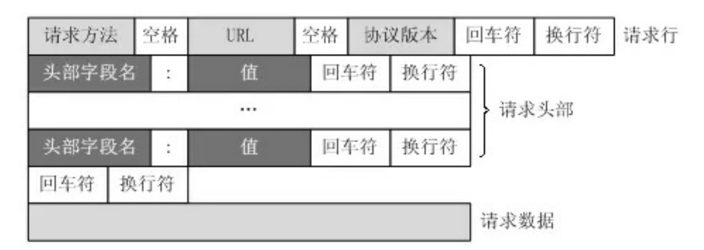
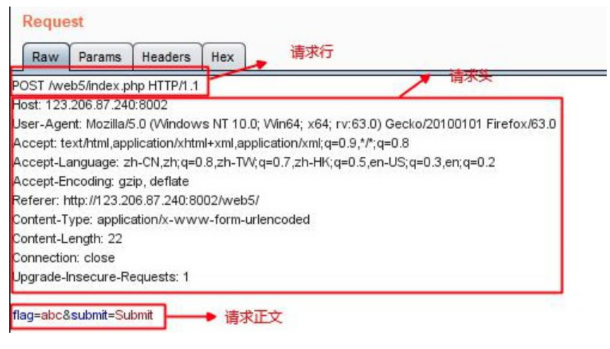

# 一、HTTP协议

## 1.HTTP请求报文结构

请求报文由四部分组成：

- 请求⾏ 
  - 请求方法字段
  - 请求URI
  - 协议版本
- 请求头部 
  - 由关键字/值对组成，每行一对。
  - User-Agent: 产生请求的浏览器类型
  - Accept：客户端可识别的内容类型列表
  - Host: 请求的主机名，允许多个域名同处一个IP地址，即虚拟主机。
- 空⾏
- 请求体 ：post、put等携带的数据

## 2.HTTP响应报文结构

- 响应行
  - 协议版本
  - 状态码
  - 状态码的原因短语
- 响应头
  - 由响应首部组成
  - Content-Type: text/html
- 空行
- 响应体:服务器的响应数据

## 3.常见的HTTP请求方法

- GET: 向服务器获取数据；
- POST：将实体提交到指定的资源，通常会造成服务器资源的修改；
- PUT：上传文件，更新数据；
- DELETE：删除服务器上的对象；
- HEAD：获取报文首部，与GET相比，不返回报文主体部分；
- OPTIONS：询问支持的请求方法，用来跨域请求；
- CONNECT：要求在与代理服务器通信时建立隧道，使用隧道进行TCP通信；
- TRACE: 回显服务器收到的请求，主要⽤于测试或诊断。

## 4.GET和POST的请求的区别 

- **应用场景：**GET 请求是一个幂等的请求，一般 Get 请求用于对服务器资源不会产生影响的场景，比如说请求一个网页的资源。而 Post 不是一个幂等的请求，一般用于对服务器资源会产生影响的情景，比如注册用户这一类的操作。
- **是否缓存：**因为两者应用场景不同，浏览器一般会对 Get 请求缓存，但很少对 Post 请求缓存。
- **发送的报文格式：**Get 请求的报文中实体部分为空，Post 请求的报文中实体部分一般为向服务器发送的数据。
- **安全性：**Get 请求可以将请求的参数放入 url 中向服务器发送，这样的做法相对于 Post 请求来说是不太安全的，因为请求的 url 会被保留在历史记录中。
- **请求长度：**浏览器由于对 url 长度的限制，所以会影响 get 请求发送数据时的长度。这个限制是浏览器规定的，并不是 RFC 规定的。
- **参数类型：**post 的参数传递支持更多的数据类型。

## 5.POST 和 PUT 请求的区别？

- PUT请求是向服务器端发送数据，从而修改数据的内容，但是不会增加数据的种类等，也就是说无论进行多少次PUT操作，其结果并没有不同。（可以理解为时**更新数据**）
- POST请求是向服务器端发送数据，该请求会改变数据的种类等资源，它会创建新的内容。（可以理解为是**创建数据**）

## 6.常见的HTTP请求头和响应头

**HTTP Request Header 常见的请求头：**

- Accept:浏览器能够处理的内容类型
- Accept-Charset:浏览器能够显示的字符集
- Accept-Encoding：浏览器能够处理的压缩编码
- Accept-Language：浏览器当前设置的语言
- Connection：浏览器与服务器之间连接的类型
- Cookie：当前页面设置的任何Cookie
- Host：发出请求的页面所在的域
- Referer：发出请求的页面的URL
- User-Agent：浏览器的用户代理字符串

**HTTP Responses Header 常见的响应头：**

- Date：表示消息发送的时间，时间的描述格式由rfc822定义
- server:服务器名称
- Connection：浏览器与服务器之间连接的类型
- Cache-Control：控制HTTP缓存
- content-type:表示后面的文档属于什么MIME类型

常见的 Content-Type 属性值有以下四种：

（1）application/x-www-form-urlencoded：浏览器的原生 form 表单，如果不设置 enctype 属性，那么最终就会以 application/x-www-form-urlencoded 方式提交数据。该种方式提交的数据放在 body 里面，数据按照 key1=val1&key2=val2 的方式进行编码，key 和 val 都进行了 URL转码。

（2）multipart/form-data：该种方式也是一个常见的 POST 提交方式，通常表单上传文件时使用该种方式。

（3）application/json：服务器消息主体是序列化后的 JSON 字符串。

（4）text/xml：该种方式主要用来提交 XML 格式的数据。