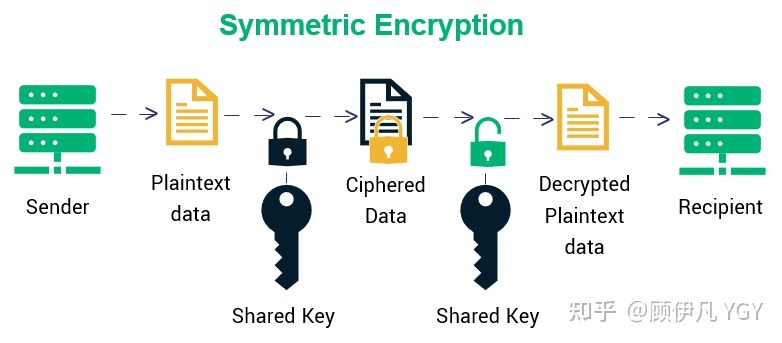
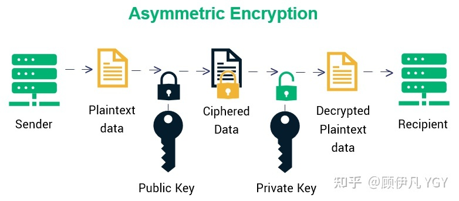
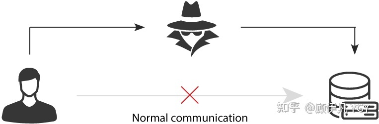
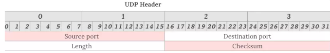
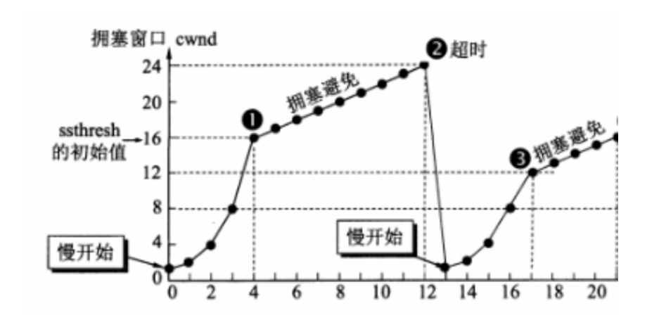
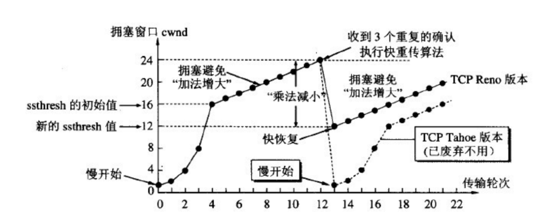
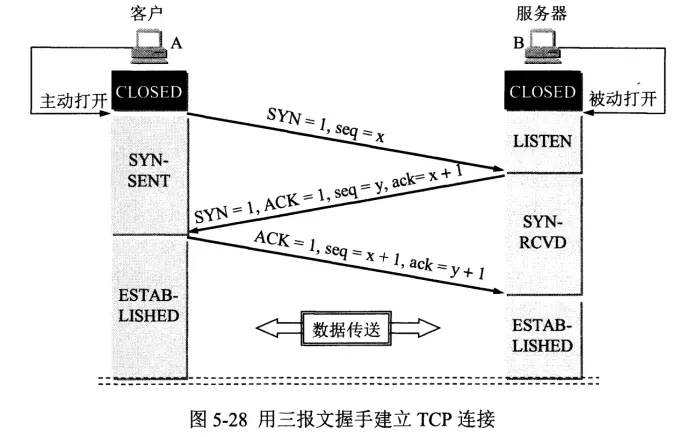
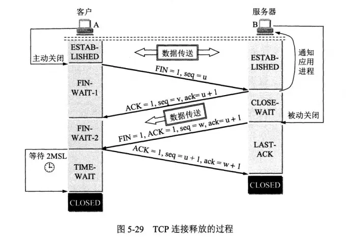

# 一、DNS

## 1.DNS 协议的概念

**概念**:DNS是域名系统(Domain Name System)的缩写，提供的是一种主机名到IP地址的转换服务，就是我们常说的域名系统。它是一个由分层的DNS服务器组成的分布式数据库，是定义了主机如何查询这个分布式数据库的方式的应用层协议。能够使人更方便的访问互联网，而不用去记住能够被机器直接读取的IP数串。

**作用**:将域名解析为IP地址，客户端向DNS服务器(DNS服务器有自己的IP地址)发送域名查询请求，DNS服务器告知客户机Web服务器的IP地址。

## 2.DNS同时使用TCP和UDP协议

 **DNS占用53号端口，同时使用TCP和UDP协议。**

1. 在区域传输的时候使用TCP协议
   - 辅域名服务器会定时(一般3小时)向主域名服务器进行查询以便了解数据是否有变动。如有变动，会执行一次区域传送，进行数据同步。
   - 区域传送使用TCP而不是UDP，因为数据同步传送的数据量比一个请求应答的数据量要多得多。
2. 在域名解析的时候使用UDP协议
   - 客户端向DNS服务器查询域名，一般返回的内容都不超过512字节，用UDP传输即可。不用经过三次握手，这样DNS服务器负载更低，响应更快。理论上说，客户端也可以指定向DNS服务器查询时用TCP，但事实上，很多DNS服务器进行配置的时候，仅支持UDP查询包。

## 3.DNS完整的查询过程

**DNS服务器解析域名的过程：**

1. 首先在**浏览器缓存**中查找对应的**IP地址**，如果查找到直接返回，若找不到继续下一步
2. 将请求发送给**本地DNS服务器**，在本地域名服务器缓存中查询，如果查找到，就直接将查找结果返回，若找不到继续下一步
3. 本地DNS服务器向**根域名服务器**发送请求，根域名服务器会返回一个所查询域的顶级域名服务器地址
4. 本地DNS服务器向**顶级域名服务器**发送请求，接受请求的服务器查询自己的缓存，如果有记录，就返回查询结果，如果没有就返回相关的下一级的权威域名服务器的地址
5. 本地DNS服务器向**权威域名服务器**发送请求，域名服务器返回对应的结果
6. 本地DNS服务器将返回结果保存在缓存中，便于下次使用
7. 本地DNS服务器将返回结果返回给浏览器

## 4.迭代查询与递归查询

- 递归查询指的是查询请求发出后，域名服务器代为向下一级域名服务器发出请求,最后向用户返回查询的最终结果。使用递归查询，用户只需要发出一次查询请求。
- 迭代查询指的是查询请求后，域名服务器返回单次查询的结果。下一级的查询由用户自己请求。使用迭代查询，用户需要发出多次的查询请求。

## 5.DNS记录和报文

DNS服务器中以资源记录的形式存储信息，每一个DNS响应报文一般包含多条资源记录。一条资源记录的具体的格式为
(Name，Value，Type，TTL)
其中TTL是资源记录的生存时间，它定义了资源记录能够被其他的 DNS服务器缓存多长时间。
常用的一共有四种Type 的值，分别是A、NS、CNAME和MX，不同Type的值，对应资源记录代表的意义不同。

1. 如果Type = A，则Name是主机名，Value是主机名对应的IP地址。因此，一条记录为A的资源记录，提供了标准的主机名到IP地址的映射。
2.  如果Type = NS，则Name是个域名，Value是负责该域名的DNS服务器的主机名。这个记录主要用于DNS链式查询时，返回下一级需要查询的 DNS服务器的信息。
3. 如果 Type = CNAME，则Name为别名，Value为该主机的规范主机名。该条记录用于向查询的主机返回一个主机名对应的规范主机名，从而告诉查询主机去查询这个主机名的IP地址。主机别名主要是为了通过给一些复杂的主机名提供一个便于记忆的简单的别名。
   4.如果Type = MX，则Name为一个邮件服务器的别名，Value为邮件服务器的规范。

# 二、网络模型

## 1.OSI七层模型

1. 应用层

   0SI参考模型中最靠近用户的一层，是为计算机用户提供应用接口，也为用户直接提供各种网络服务。我们常见应用层的网络服务协议有:**HTTP ,HTTPS,FTP，POP3、SMTP**等。

   - 在客户端与服务器中经常会有数据的请求，这个时候就是会用到 **http(hyper text transfer protocol)(超文本传输协议)**或者**https** ,在后端设计数据接口时，我们常常使用到这个协议。
   - **FTP**是文件传输协议，在开发过程中，个人并没有涉及到，但是我想，在一些资源网站，比如百度网盘`迅雷应该是基于此协议的。
   - **SMTP**是simple mail transfer protocol(简单邮件传输协议)。在一个项目中，在用户邮箱验证码登录的功能时，使用到了这个协议。

2. 表示层

   表示层提供各种用于应用层数据的编码和转换功能,确保一个系统的应用层发送的数据能被另一个系统的应用层识别。如果必要，该层可提供一种标准表示形式，用于将计算机内部的多种数据格式转换成通信中采用的标准表示形式。数据压缩和加密也是表示层可提供的转换功能之一。
   例如，**IBM**主机使用**EBCDIC**编码，而大部分**PC**机使用的是**ASCII** 码。在这种情况下，便需要表示层来完成这种转换。如果您想要用尽量少的词语来记住这第6层，那就是“一种通用的数据格式”。
   在项目开发中，为了方便数据传输，可以使用base64对数据进行编解码。如果按功能来划分，base64应该是工作在表示层。

3. 会话层

   会话层就是负责建立、管理和终止表示层实体之间的通信会话。该层的通信由不同设备中的应用程序之间的服务请求和响应组成。

4. 传输层

   传输层建立了主机端到端的链接，传输层的作用是**为上层协议提供端到端的可靠和透明的数据传输服务，包括处理差错控制和流量控制等问题**。该层向高层屏蔽了下层数据通信的细节，使高层用户看到的只是在两个传输实体间的一条主机到主机的、可由用户控制和设定的、可靠的数据通路。我们通常说的，**TCP、UDP**就是在这一层。端口号既是这里的“端”。

5. 网络层

   本层通过**IP寻址**来建立两个节点之间的连接，为源端的运输层送来的分组，选择合适的路由和交换节点，正确无误地按照地址传送给目的端的运输层。就是通常说的工P层。这一层就是我们经常说的IP协议层。IP协议是Internet 的基础。我们可以这样理解，**网络层规定了数据包的传输路线，而传输层则规定了数据包的传输方式**。

6. 数据链路层

   将比特组合成字节,再将字节组合成帧,使用链路层地址(以太网使用MAC地址)来访问介质,并进行差错检测。
   网络层与数据链路层的对比，通过上面的描述，我们或许可以这样理解，网络层是规划了数据包的传输路线，而数据链路层就是传输路线。不过，**在数据链路层上还增加了差错控制的功能**。

7. 物理层

   实际最终信号的传输是通过物理层实现的。通过物理介质传输比特流。规定了电平、速度和电缆针脚。常用设备有(各种物理设备）集线器、中继器、调制解调器、网线、双绞线、同轴电缆。这些都是物理层的传输介质。

**OSI七层模型通信特点:对等通信**

对等通信，为了使数据分组从源传送到目的地，源端OSI模型的每一层都必须与目的端的对等层进行通信，这种通信方式称为对等层通信。在每一层通信过程中，使用本层自己协议进行通信。

## 2.TCP/IP五层协议

TCP/IP五层协议和OSI七层协议对应的关系如下

- **应用层(application layer)**:直接为应用进程提供服务。应用层协议定义的是应用进程间通讯和交互的规则，不同的应用有着不同的应用层协议，如HTTP协议(万维网服务)、FTP协议(文件传输)、SMTP协议(电子邮件)、DNS(域名查询)等。
- **传输层(transport layer)**:有时也译为运输层，它负责为两台主机中的进程提供通信服务。该层主要有以下两种协议:
  - 传输控制协议(Transmission Control Protocol，TCP):提供面向连接的、可靠的数据传输服务，数据传输的基本单位是报文段(segment) ;
  - 用户数据报协议(User Datagram Protocol，UDP):提供无连接的、尽最大努力的数据传输服务，但不保证数据传输的可靠性，数据传输的基本单位是用户数据报。
- **网络层(internet layer)**:有时也译为网际层，它负责为两台主机提供通信服务，并通过选择合适的路由将数据传递到目标主机。
- **数据链路层(data link layer)**:负责将网络层交下来的IP数据报封装成帧，并在链路的两个相邻节点间传送帧，每一帧都包含数据和必要的控制信息(如同步信息、地址信息、差错控制等)。
- **物理层(physical Layer)**:确保数据可以在各种物理媒介上进行传输，为数据的传输提供可靠的环境。

**每一层都对应着不同的设备**

**每一层实现的协议各不相同**

同样，TCP/IP五层协议的通信方式也是对等通信:

**各层传输单位**

应用层：报文

传输层：报文段

网络层：IP数据报/分组

数据链路层：帧

物理层：比特流

# 三、HTTP

## 1.HTTP概述

HTTP是超文本传输协议，它定义了客户端和服务器之间交换报文的格式和方式，默认使用80端口。它使用TCP作为传输层协议，保证了数据传输的可靠性。

1. HTTP优点
   - 支持客户端/服务器模式
   - **简单快速**:客户向服务器请求服务时，只需传送请求方法和路径。由于HTTP协议简单，使得HTTP服务器的程序规模小，因而通信速度很快。
   - **无连接**:无连接的含义是限制每次链接只处理一个请求。服务器处理完客户的请求，并收到客户的应答后，即断开链接，采用这种方式可以节省传输时间。
   - **无状态**: HTTP协议是无状态协议，这里的状态是指通信过程的上下文信息。缺少状态意味着如果后续处理需要前面的信息，则它必须重传，这样可能会导致每次连接传送的数据量增大。另一方面，在服务器不需要先前信息时它的应答就比较快。
   - **灵活**:HTTP允许传输任意类型的数据对象。正在传输的类型由Content-Type加以标记。
2. HTTP缺点
   - **无状态**:HTTP是一个无状态的协议，HTTP服务器不会保存关于客户的任何信息。
   - **明文传输**:协议中的报文使用的是文本形式，这就直接暴露给外界，不安全。
   - **不安全**
     - 通信使用明文(不加密)，内容可能会被窃听
     - 不验证通信方的身份，因此有可能遭遇伪装无法证明
     - 报文的完整性，所以有可能已遭篡改

## 2.HTTP性能

HTTP协议是基于**TCP/IP**，并且使用了**请求-应答的通信模式**，所以性能的关键就在这两点里。

### 1.长连接

HTTP协议有两种连接模式，一种是持续连接，一种是非连续连接。

- 非持续连接指的是服务器必须为每一个请求的对象建立和维护一个全新的连接。
- 持续连接下，TCP连接默认不关闭，可以被多个请求复用。采用持续连接的好处是可以避免每次建立TCP连接三次握手时所花费的时间。

对于不同版本的才有不同的连接方式：

- 在HTTP/1.0每发起一个请求，都要新建一次TCP连接（三次握手)，而且是**串行请求**，做了无畏的TCP连接建立和断开，**增加了通信开销**。该版本使用的非持续的连接，但是可以在请求时，加上 Connection: keep-a live来要求服务器不要关闭TCP连接。

- 在HTTP/1.1提出了**长连接**的通信方式，也叫持久连接。这种方式的好处在于减少了TCP连接的重复建立和断开所造成的额外开销，减轻了服务器端的负载。该版本及以后版本默认采用的是持续的连接。目前对于同一个域，大多数浏览器支持同时建立6个持久连接。

  

### 2.管道网络传输

HTTP/1.1采用了长连接的方式，这使得管道(pipeline)网络传输成为了可能。

管道(pipeline)网络传输是指:可以在同一个TCP连接里面，客户端可以发起多个请求，只要第一个请求发出去了，不必等其回来，就可以发第二个请求出去，可以减少整体的响应时间。但是服务器还是按照顺序回应请求。要是前面的回应特别慢，后面就会有许多请求排队等着。这称为**队头堵塞**。

### 3.队头堵塞

HTTP传输的报文必须是一发—收，但是，里面的任务被放在一个任务队列中串行执行，一旦队首的请求处理太慢，就会阻塞后面请求的处理。这就是HTTP队头阻塞问题。

**对头堵塞的解决方案：**

1. 并发连接:对于一个域名允许分配多个长连接，那么相当于增加了任务队列，不至于一个队伍的任务阻塞其它所有任务。
2. 域名分片:将域名分出很多二级域名，它们都指向同样的一台服务器，能够并发的长连接数变多，解决了队头阻塞的问题。

## 3.HTTP请求报文与响应报文

### 1.请求报文

请求报文由四部分组成：

- 请求⾏ 
  - 请求方法字段
  - 请求URI
  - 协议版本
- 请求头部 
  - 由关键字/值对组成，每行一对。
  - User-Agent: 产生请求的浏览器类型
  - Accept：客户端可识别的内容类型列表
  - Host: 请求的主机名，允许多个域名同处一个IP地址，即虚拟主机。
- 空⾏
- 请求体 ：post、put等携带的数据

### 2.请求方法字段

- GET: 向服务器获取数据；
- POST：将实体提交到指定的资源，通常会造成服务器资源的修改；
- PUT：上传文件，更新数据；
- DELETE：删除服务器上的对象；
- HEAD：获取报文首部，与GET相比，不返回报文主体部分；
- OPTIONS：询问支持的请求方法，用来跨域请求；
- CONNECT：要求在与代理服务器通信时建立隧道，使用隧道进行TCP通信；
- TRACE: 回显服务器收到的请求，主要⽤于测试或诊断。

### 3.响应报文

- 响应行
  - 协议版本
  - 状态码
  - 状态码的原因短语
- 响应头
  - 由响应首部组成
  - Content-Type: text/html
- 空行
- 响应体:服务器的响应数据

## 4. HTTP 协议版本

### 1.HTTP1.0

- 非持续连接
- 串行请求

在HTTP/1.0每发起一个请求，都要新建一次TCP连接（三次握手)，而且是**串行请求**，做了无畏的TCP连接建立和断开，**增加了通信开销**。该版本使用的非持续的连接，但是可以在请求时，加上 Connection: keep-a live来要求服务器不要关闭TCP连接。

### 2.HTTP 1.1

HTTP 1.1版本较之前的1.o版本又有了更大的更新，它进一步完善了HTTP协议，现在仍然有在使用，它主要有以下更新:

#### 持久连接（长连接）

该版本之前的版本所建立的都是短连接，该版本引入了持久连接的概念，就是TCP连接默认是不关闭的，**建立一个TCP连接，就可以发送多个请求**，减少了建立和关闭连接的消耗和延迟。
在请求头设置一个非标准的Connection字段: **Connection: keep-alive**就可以进行长连接，这个字段要求服务器不要关闭TCP连接，服务器同样会回应这个字段。如果想要关闭TCP连接，就要在请求中设置字段:Connection: false

#### 管道机制

该版本还引入了管道机制，即在一个TCP连接里，客户端可以同时发送多个请求，不需要等收到上一个请求回应，就可以发送新的请求，但是请求的响应还是按照请求发送的顺序返回的，这样就进一步提高了HTTP协议的效率

#### 分块传输编码

分块传输编码:在HTTP1.0版本中，如果在服务器端遇到较为耗费时间的操作，那么需要等到这一操作全部完成后，才会向客户端发送数据，这段等待时间很影响性能和客户体验。多以使用**分块传输编码**，只要请求或者回应的头部信息有Transfer-Encoding字段:**Transfer-Encoding: chunked**，就表明回应将由数量未定的数据块组成。每个非空的数据块之前，会有一个16进制的数值，表示这个块的长度。最后是一个大小为0的块，就表示本次回应的数据发送完了

#### 新的请求方法

PUT、PATCH、HEAD、OPTIONS、DELETE

#### 加入了缓存机制

- 强缓存
- 协商缓存

#### 请求头加入Host字段

客户端请求的头部信息加入了Host字段，用来指定服务器的域名，这样就可以区分同一个物理主机中的不同虚拟主机的域名

#### HTTP1.1存在的问题—队头堵塞

HTTP/1.1默认使用了持久连接，多个请求可以复用同一个TCP连接，但是在同一个TCP连接里面，数据请求的通信次序是固定的。服务器只有处理完一个请求的响应后，才会进行下一个请求的处理，如果前面请求的响应特别慢的话，就会造成许多请求排队等待的情况，这种情况被称为“队头堵塞”。队头阻塞会导致持久连接在达到最大数量时，剩余的资源需要等待其他资源请求完成后才能发起请求。

### 3.HTTP 2.0

#### 理解概念

- **流(stream)** :已建立连接上的双向字节流。
- **消息**:与逻辑消息对应的完整的一系列数据帧。
- **帧(frame)** : HTTP2.0通信的最小单位，每个帧包含帧头部，至少也**会标识出当前帧所属的流(stream id)**。

#### 二进制协议

HTTP/2是一个二进制协议。在HTTP/1.1版中，报文的头信息必须是文本(ASCIl编码)，数据体可以是文本，也可以是二进制。HTTP/2则是一个彻底的二进制协议，头信息和数据体都是二进制，并且统称为"帧"，可以分为头信息帧和数据帧。帧的概念是它实现多路复用的基础。

#### 多路复用

HTTP/2 实现了多路复用，HTTP/2仍然复用TCP连接，但是在一个连接里，客户端和服务器都可以同时发送多个请求或回应，而且不用按照顺序——发送，这样就避免了"队头堵塞"的问题。

**数据流**

HTTP/2使用了数据流的概念，因为HTTP/2的数据包是不按顺序发送的，同一个连接里面连续的数据包，可能属于不同的请求。因此，必须要对数据包做标记，指出它属于哪个请求(流)。HTTP/2将每个请求或回应的所有数据包，称为一个数据流。每个数据流都有一个独一无二的编号。数据包发送的时候，都必须标记数据流ID，用来区分它属于哪个数据流。

#### 头信息压缩

HTTP/2实现了头信息压缩，由于HTTP 1.1协议不带有状态，每次请求都必须附上所有信息。所以，请求的很多字段都是重复的，比如Cookie和User Agent，一模一样的内容，每次请求都必须附带，这会浪费很多带宽，也影响速度。HTTP/2对这一点做了优化，引入了头信息压缩机制。一方面，头信息使用gzip或compress 压缩后再发送;另一方面，客户端和服务器同时维护一张头信息表，所有字段都会存入这个表，生成一个索引号，以后就不发送同样字段了，只发送索引号，这样就能提高速度了。

#### 服务器推送

HTTP/2允许服务器未经请求，主动向客户端发送资源，这叫做服务器推送。使用服务器推送，提前给客户端推送必要的资源，这样就可以相对减少一些延迟时间。这里需要注意的是 http2下服务器主动推送的是静态资源，和 WebSocket以及使用SSE等方式向客户端发送即时数据的推送是不同的。

#### HTTP2.0缺点—TCP队头阻塞

因为HTTP/2使用了多路复用，一般来说**同一域名下只需要使用一个TCP连接**。由于多个数据流使用同一个TCP连接，遵守同一个流量状态控制和拥塞控制。只要一个数据流遭遇到拥塞，剩下的数据流就没法发出去，这样就导致了后面的所有数据都会被阻塞。HTTP/2出现的这个问题是由于其使用TCP协议的问题，与它本身的实现其实并没有多大关系。

### 4.从HTTP 1.0 到 HTTP 2.0

#### 队头阻塞

从HTTP/1.1 开始，就存在着对头阻塞的问题。

**HTTP/2解决了HTTP的队头阻塞问题，但是并没有解决TCP队头阻塞问题！**

HTTP/1.1 相比较于 HTTP/1.0来说，最主要的改进就是引入了持久连接（keep-alive）

**所谓的持久连接就是：在一个TCP连接上可以传送多个HTTP请求和响应，减少了建立和关闭连接的消耗和延迟。**

引入了持久连接之后，在性能方面，HTTP协议有了明显的提升。

HTTP/1.1允许在持久连接上使用请求管道，是相对于持久连接的又一性能优化。

所谓请求管道，就是在HTTP响应到达之前，可以将多条请求放入队列，当第一条HTTP请求通过网络流向服务器时，第二条和第三条请求也可以开始发送了。在高时延网络条件下，这样做可以降低网络的环回时间，提高性能。

**但是，对于管道连接还是有一定的限制和要求的，其中一个比较关键的就是服务端必须按照与请求相同的顺序回送HTTP响应。**

这也就意味着，如果一个响应返回发生了延迟，那么其后续的响应都会被延迟，直到队头的响应送达。这就是所谓的**HTTP队头阻塞**。

但是HTTP队头阻塞的问题在HTTP/2中得到了有效的解决。**HTTP/2废弃了管道化的方式**，而是创新性的引入了帧、消息和数据流等概念。**客户端和服务器可以把 HTTP 消息分解为互不依赖的帧，然后乱序发送，最后再在另一端把它们重新组合起来。**

**因为没有顺序了，所以就不需要阻塞了，就有效的解决了HTTP对头阻塞的问题。**

但是，HTTP/2仍然会存在对头阻塞的问题，那是因为HTTP/2其实还是依赖TCP协议实现的。

TCP传输过程中会把数据拆分为一个个**按照顺序**排列的数据包，这些数据包通过网络传输到了接收端，接收端再**按照顺序**将这些数据包组合成原始数据，这样就完成了数据传输。

但是如果其中的某一个数据包没有按照顺序到达，接收端会一直保持连接等待数据包返回，这时候就会阻塞后续请求。这就发生了**TCP队头阻塞**。

HTTP/1.1的管道化持久连接也是使得同一个TCP链接可以被多个HTTP使用，但是HTTP/1.1中规定一个域名可以有6个TCP连接。而HTTP/2中，同一个域名只是用一个TCP连接。

所以，**在HTTP/2中，TCP对头阻塞造成的影响会更大**，因为HTTP/2的多路复用技术使得多个请求其实是基于同一个TCP连接的，那如果某一个请求造成了TCP队头阻塞，那么多个请求都会受到影响。

### 4.HTTP 3.0

HTTP/3基于UDP协议实现了类似于TCP的多路复用数据流、传输可靠性等功能，这套功能被称为QUIC协议。

1．流量控制、传输可靠性功能:QUIC在UDP的基础上增加了一层来保证数据传输可靠性，它提供了数据包重传、拥塞控制、以及其他一些TCP中的特性。

2．集成TLS加密功能:目前QUIC使用TLS1.3，减少了握手所花费的RTT数。

3．多路复用:同一物理连接上可以有多个独立的逻辑数据流，实现了数据流的单独传输，解决了TCP的队头阻塞问题。

# 四、HTTPS

## 1.什么是HTTPS协议？

超文本传输安全协议(Hypertext Transfer ProtocolSecure，简称:HTTPS)是一种通过计算机网络进行安全通信的传输协议。HTTPS经由HTTP进行通信，但利用SSL/TLS来加密数据包。HTTPS开发的主要目的，是提供对网站服务器的身份认证，保护交换数据的隐私与完整性。

HTTP协议采用**明文传输**信息，存在**信息窃听**、**信息篡改**和**信息劫持**的风险，而协议TLS/SSL具有**身份验证**、**信息加密**和**完整性校验**的功能，可以避免此类问题发生。
安全层的主要职责就是**对发起的HTTP请求的数据进行加密操作**和对**接收到的HTTP的内容进行解密操作**。

## 2.TLS/SSL的工作原理

**TLS/SSL**全称安全传输层协议(Transport Layer Security)，是介于TCP和HTTP之间的一层安全协议，不影响原有的TCP协议和HTTP协议，所以使用HTTPS基本上不需要对HTTP页面进行太多的改造。
TLS/SSL的功能实现主要依赖三类基本算法:**散列函数hash、对称加密、非对称加密**。这三类算法的作用如下:

- 基于散列函数验证信息的完整性
- 对称加密算法采用协商的秘钥对数据加密。
- 非对称加密实现身份认证和秘钥协商

### 1.散列函数hash

常见的散列函数有MD5、SHA1、SHA256。该函数的特点是单向不可逆，对输入数据非常敏感，输出的长度固定，任何数据的修改都会改变散列函数的结果，可以用于防止信息篡改并验证数据的完整性。
**特点**:在信息传输过程中，散列函数不能完全实现信息防篡改，由于传输是明文传输，中间人可以修改信息后重新计算信息的摘要，所以需要对传输的信息和信息摘要进行加密。

### 2.对称加密

对称加密的方法是，双方使用同一个秘钥对数据进行加密和解密。但是对称加密的存在一个问题，就是如何保证秘钥传输的安全性，因为秘钥还是会通过网络传输的，一旦秘钥被其他人获取到，那么整个加密过程就毫无作用了。这就要用到非对称加密的方法。

常见的对称加密算法有AES-CBC、DES、3DES、AES-GCM等。相同的秘钥可以用于信息的加密和解密。掌握秘钥才能获取信息，防止信息窃听，其通讯方式是一对一。

**特点**:对称加密的优势就是信息传输使用一对一，需要共享相同的密码，密码的安全是保证信息安全的基础，服务器和N个客户端通信，需要维持N个密码记录且不能修改密码。

### 3.非对称加密

非对称加密的方法是，我们拥有两个秘钥，一个是公钥，一个是私钥。公钥是公开的，私钥是保密的。用私钥加密的数据，只有对应的公钥才能解密，用公钥加密的数据，只有对应的私钥才能解密。我们可以将公钥公布出去，任何想和我们通信的客户，都可以使用我们提供的公钥对数据进行加密，这样我们就可以使用私钥进行解密，这样就能保证数据的安全了。但是非对称加密有一个缺点就是加密的过程很慢，因此如果每次通信都使用非对称加密的方式的话，反而会造成等待时间过长的问题。

常见的非对称加密算法有RSA、ECC、DH等。秘钥成对出现，一般称为公钥(公开)和私钥（保密）。公钥加密的信息只有私钥可以解开，私钥加密的信息只能公钥解开，因此掌握公钥的不同客户端之间不能相互解密信息，只能和服务器进行加密通信，服务器可以实现一对多的的通信，客户端也可以用来验证掌握私钥的服务器的身份。

特点:非对称加密的特点就是信息一对多，服务器只需要维持一个私钥就可以和多个客户端进行通信，但服务器发出的信息能够被所有的客户端解密，且该算法的计算复杂，加密的速度慢。

## 3.数字证书

现在的方法也不一定是安全的，因为我们没有办法确定我们得到的公钥就一定是安全的公钥。可能存在一个中间人，截取了对方发给我们的公钥，然后将他自己的公钥发送给我们，当我们使用他的公钥加密后发送的信息，就可以被他用自己的私钥解密。然后他伪装成我们以同样的方法向对方发送信息，这样我们的信息就被窃取了，然而我们自己还不知道。
为了解决这样的问题，我们可以使用数字证书的方式，首先我们使用一种 Hash算法来对我们的公钥和其他信息进行加密生成一个信息摘要，然后让有公信力的认证中心(简称CA）用它的私钥对消息摘要加密，形成签名。最后将原始的信息和签名合在一起，称为数字证书。当接收方收到数字证书的时候，先根据原始信息使用同样的 Hash 算法生成一个摘要，然后使用公证处的公钥来对数字证书中的摘要进行解密，最后将解密的摘要和我们生成的摘要进行对比，就能发现我们得到的信息是否被更改了。这个方法最要的是认证中心的可靠性，一般浏览器里会内置一些顶层的认证中心的证书，相当于我们自动信任了他们，只有这样我们才能保证数据的安全。

## 4.HTTPS通信过程

HTTPS的通信过程如下:

- 第一步，客户端向服务器发起请求，请求中包含使用的协议版本号、生成的一个随机数、以及客户端支持的加密方法。
- 第二步，服务器端接收到请求后，确认双方使用的加密方法、并给出服务器的证书、以及一个服务器生成的随机数。
- 第三步，客户端确认服务器证书有效后，生成一个新的随机数，并使用数字证书中的公钥，加密这个随机数，然后发给服务器。并且还会提供一个前面所有内容的hash的值，用来供服务器检验。
- 第四步，服务器使用自己的私钥，来解密客户端发送过来的随机数。并提供前面所有内容的 hash值来供客户端检验。
- 第五步，客户端和服务器端根据约定的加密方法使用前面的三个随机数，生成对话秘钥，以后的对话过程都使用这个秘钥来加密信息。

## 5.HTTPS的特点

HTTPS的**优点**如下:

- 使用HTTPS协议可以认证用户和服务器，确保数据发送到正确的客户端和服务器

- 使用HTTPS协议可以进行加密传输、身份认证，通信更加安全，防止数据在传输过程中被窃取、修改，确保数据安全性。

- HTTPS是现行架构下最安全的解决方案，虽然不是绝对的安全，但是大幅增加了中间人攻击的成本

HTTPS的**缺点**如下:

- HTTPS需要做服务器和客户端双方的加密个解密处理，耗费更多服务器资源，过程复杂
- HTTPS协议握手阶段比较费时，增加页面的加载时间
- SSL证书是收费的，功能越强大的证书费用越高
- HTTPS连接服务器端资源占用高很多，支持访客稍多的网站需要投入更大的成本
- SSL证书需要绑定IP，不能再同一个IP上绑定多个域名

## 6.HTTP和HTTPS协议的区别

HTTP和HTTPS协议的主要区别如下:

- HTTPS协议需要CA证书，费用较高;HTTP协议不需要
- HTTP协议是超文本传输协议，信息是明文传输的，HTTPS则是具有安全性的SSL加密传输协议
- 使用不同的连接方式，端口也不同，HTTP协议端口是80，HTTPS的协议端口是443。
- HTTP协议连接很简单，是无状态的;HTTPS协议是有SSL和HTTP协议构建的可进行加密传输、身份认证的网络协议，比HTTP更加安全

# 五、彻底搞懂HTTPS的加密原理

## 1.为什么需要加密？

因为http的内容是明文传输的，明文数据会经过中间代理服务器、路由器、wifi热点、通信服务运营商等多个物理节点，如果信息在传输过程中被劫持，传输的内容就完全暴露了。劫持者还可以篡改传输的信息且不被双方察觉，这就是`中间人攻击`。所以我们才需要对信息进行加密。最容易理解的就是`对称加密` 

## 2.什么是对称加密

简单说就是有一个密钥，它可以加密一段信息，也可以对加密后的信息进行解密，和我们日常生活中用的钥匙作用差不多。

## 3.用对称加密可行吗？

**如果通信双方都各自持有同一个密钥，且没有别人知道，这两方的通信安全当然是可以被保证的（除非密钥被破解）。**

然而最大的问题就是**这个密钥怎么让传输的双方知晓，同时不被别人知道**。如果由服务器生成一个密钥并传输给浏览器，那在这个传输过程中密钥被别人劫持到手了怎么办？之后他就能用密钥解开双方传输的任何内容了，所以这么做当然不行。

换种思路？试想一下，如果浏览器内部就预存了网站A的密钥，且可以确保除了浏览器和网站A，不会有任何外人知道该密钥，那理论上用对称加密是可以的，这样浏览器只要预存好世界上所有HTTPS网站的密钥就行了！这么做显然不现实。
怎么办？所以我们就需要`非对称加密` 。

## 4.**什么是非对称加密？**

简单说就是有两把密钥，通常一把叫做公钥、一把叫私钥，用公钥加密的内容必须用私钥才能解开，同样，私钥加密的内容只有公钥能解开。

## 5.用非对称加密可行吗？

鉴于非对称加密的机制，我们可能会有这种思路：服务器先把公钥以明文方式传输给浏览器，之后浏览器向服务器传数据前都先用这个公钥加密好再传，这条数据的安全似乎可以保障了！**因为只有服务器有相应的私钥能解开公钥加密的数据**。

然而反过来**由服务器到浏览器的这条路怎么保障安全？**如果服务器用它的私钥加密数据传给浏览器，那么浏览器用公钥可以解密它，而这个公钥是一开始通过明文传输给浏览器的，若这个公钥被中间人劫持到了，那他也能用该公钥解密服务器传来的信息了。所以**目前似乎只能保证由浏览器向服务器传输数据的安全性**（其实仍有漏洞，下文会说），那利用这点你能想到什么解决方案吗？

## 6.**改良的非对称加密方案，似乎可以？**

我们已经理解通过一组公钥私钥，可以保证单个方向传输的安全性，那用两组公钥私钥，是否就能保证双向传输都安全了？请看下面的过程：

1. 某网站服务器拥有公钥A与对应的私钥A’；浏览器拥有公钥B与对应的私钥B’。
2. 浏览器把公钥B明文传输给服务器。
3. 服务器把公钥A明文给传输浏览器。
4. 之后浏览器向服务器传输的内容都用公钥A加密，服务器收到后用私钥A’解密。由于只有服务器拥有私钥A’，所以能保证这条数据的安全。
5. 同理，服务器向浏览器传输的内容都用公钥B加密，浏览器收到后用私钥B’解密。同上也可以保证这条数据的安全。

的确可以！抛开这里面仍有的漏洞不谈（下文会讲），HTTPS的加密却没使用这种方案，为什么？很重要的原因是非对称加密算法非常耗时，而对称加密快很多。那我们能不能运用非对称加密的特性解决前面提到的对称加密的漏洞？

## 7.**非对称加密+对称加密？**

1. 某网站拥有用于非对称加密的公钥A、私钥A’。
2. 浏览器向网站服务器请求，服务器把公钥A明文给传输浏览器。
3. 浏览器随机生成一个用于对称加密的密钥X，用公钥A加密后传给服务器。
4. 服务器拿到后用私钥A’解密得到密钥X。
5. 这样双方就都拥有密钥X了，且别人无法知道它。之后双方所有数据都通过密钥X加密解密即可。

完美！HTTPS基本就是采用了这种方案。完美？还是有漏洞的。

## 8.**中间人攻击**

如果在数据传输过程中，中间人劫持到了数据，此时他的确无法得到浏览器生成的密钥X，这个密钥本身被公钥A加密了，只有服务器才有私钥A’解开它，然而中间人却完全不需要拿到私钥A’就能干坏事了。请看：

1. 某网站有用于非对称加密的公钥A、私钥A’。
2. 浏览器向网站服务器请求，服务器把公钥A明文给传输浏览器。
3. **中间人劫持到公钥A，保存下来，把数据包中的公钥A替换成自己伪造的公钥B（它当然也拥有公钥B对应的私钥B’）**。
4. 浏览器生成一个用于对称加密的密钥X，用**公钥B**（浏览器无法得知公钥被替换了）加密后传给服务器。
5. **中间人劫持后用私钥B’解密得到密钥X，再用公钥A加密后传给服务器**。
6. 服务器拿到后用私钥A’解密得到密钥X。

这样在双方都不会发现异常的情况下，中间人通过一套“狸猫换太子”的操作，掉包了服务器传来的公钥，进而得到了密钥X。**根本原因是浏览器无法确认收到的公钥是不是网站自己的，**因为公钥本身是明文传输的，难道还得对公钥的传输进行加密？这似乎变成鸡生蛋、蛋生鸡的问题了。解法是什么？

## 9.**如何证明浏览器收到的公钥一定是该网站的公钥？**

其实所有证明的源头都是一条或多条不证自明的“公理”（可以回想一下数学上公理），由它推导出一切。比如现实生活中，若想证明某身份证号一定是小明的，可以看他身份证，而身份证是由政府作证的，这里的“公理”就是“政府机构可信”，这也是社会正常运作的前提。

那能不能类似地有个机构充当互联网世界的“公理”呢？让它作为一切证明的源头，给网站颁发一个“身份证”？

它就是**CA机构**，它是如今互联网世界正常运作的前提，而CA机构颁发的“身份证”就是**数字证书**。

## 10.**数字证书**

网站在使用HTTPS前，需要向**CA机构**申领一份**数字证书**，数字证书里含有证书持有者信息、公钥信息等。服务器把证书传输给浏览器，浏览器从证书里获取公钥就行了，证书就如身份证，证明“该公钥对应该网站”。而这里又有一个显而易见的问题，“**证书本身的传输过程中，如何防止被篡改”**？即如何证明证书本身的真实性？身份证运用了一些防伪技术，而数字证书怎么防伪呢？解决这个问题我们就接近胜利了！

## 11.**如何放防止数字证书被篡改？**

我们把证书原本的内容生成一份“签名”，比对证书内容和签名是否一致就能判别是否被篡改。这就是数字证书的“防伪技术”，这里的“签名”就叫`数字签名`

## 12.数字签名

这部分内容建议看下图并结合后面的文字理解，图中左侧是数字签名的制作过程，右侧是验证过程：

数字签名的制作过程：

1. CA机构拥有非对称加密的私钥和公钥。
2. CA机构对证书明文数据T进行hash。
3. 对hash后的值用私钥加密，得到数字签名S。

明文和数字签名共同组成了数字证书，这样一份数字证书就可以颁发给网站了。
那浏览器拿到服务器传来的数字证书后，如何验证它是不是真的？（有没有被篡改、掉包）

浏览器验证过程：

1. 拿到证书，得到明文T，签名S。
2. 用CA机构的公钥对S解密（由于是浏览器信任的机构，所以浏览器保有它的公钥。详情见下文），得到S’。
3. 用证书里指明的hash算法对明文T进行hash得到T’。
4. 显然通过以上步骤，T’应当等于S‘，除非明文或签名被篡改。所以此时比较S’是否等于T’，等于则表明证书可信。

为何么这样可以保证证书可信呢？我们来仔细想一下。

## 13.**中间人有可能篡改该证书吗？**

假设中间人篡改了证书的原文，由于他没有CA机构的私钥，所以无法得到此时加密后签名，无法相应地篡改签名。浏览器收到该证书后会发现原文和签名解密后的值不一致，则说明证书已被篡改，证书不可信，从而终止向服务器传输信息，防止信息泄露给中间人。

既然不可能篡改，那整个证书被掉包呢？

## 14.**中间人有可能把证书掉包吗？**

假设有另一个网站B也拿到了CA机构认证的证书，它想劫持网站A的信息。于是它成为中间人拦截到了A传给浏览器的证书，然后替换成自己的证书，传给浏览器，之后浏览器就会错误地拿到B的证书里的公钥了，这确实会导致上文“中间人攻击”那里提到的漏洞？

其实这并不会发生，因为证书里包含了网站A的信息，包括域名，浏览器把证书里的域名与自己请求的域名比对一下就知道有没有被掉包了。

## **为什么制作数字签名时需要hash一次？**

我初识HTTPS的时候就有这个疑问，因为似乎那里的hash有点多余，把hash过程去掉也能保证证书没有被篡改。

最显然的是性能问题，前面我们已经说了非对称加密效率较差，证书信息一般较长，比较耗时。而hash后得到的是固定长度的信息（比如用md5算法hash后可以得到固定的128位的值），这样加解密就快很多。

当然也有安全上的原因，这部分内容相对深一些，感兴趣的可以看这篇解答：[crypto.stackexchange.com/a/12780](https://link.zhihu.com/?target=https%3A//link.juejin.im/%3Ftarget%3Dhttps%3A%2F%2Fcrypto.stackexchange.com%2Fa%2F12780)

# 六、TCP 与 UDP

## 1.TCP 和 UDP 的概念及特点

TCP和UDP都是传输层协议，他们都属于TCP/IP协议族:

### 1.UDP

UDP的全称是用户数据报协议，在网络中它与TCP协议一样用于处理数据包，是一种无连接的协议。在OSI模型中，在传输层，处于IP协议的上一层。UDP有不提供数据包分组、组装和不能对数据包进行排序的缺点，也就是说，当报文发送之后，是无法得知其是否安全完整到达的。

它有以下几个特点：

#### 1.面向无连接

首先UDP是不需要和TCP一样在发送数据前进行三次握手建立连接的，想发数据就可以开始发送了。并且也只是数据报文的搬运工，不会对数据报文进行任何拆分和拼接操作。

具体来说就是:

- 在发送端，应用层将数据传递给传输层的UDP协议，UDP只会给数据增加一个**UDP头标识**下是UDP协议，然后就传递给网络层了
- 在接收端，网络层将数据传递给传输层，UDP只去除IP报文头就传递给应用层，不会任何拼接操作

#### 2.有单播，多播，广播的功能

UDP不止支持一对一的传输方式，同样支持一对多，多对多，多对一的方式，也就是说UDP提供了单播，多播，广播的功能。

#### 3.UDP是面向报文的

发送方的UDP对应用程序交下来的报文，在添加首部后就向下交付IP层。UDP对应用层交下来的报文，既不合并，也不拆分，而是保留这些报文的边界。因此，应用程序必须选择合适大小的报文

#### 4.不可靠性

首先不可靠性体现在无连接上，通信都不需要建立连接，想发就发，这样的情况肯定不可靠。
并且收到什么数据就传递什么数据，并且也不会备份数据，发送数据也不会关心对方是否已经正确接收到数据了。
再者网络环境时好时坏，但是UDP因为没有**拥塞控制**，一直会以恒定的速度发送数据。即使网络条件不好，也不会对发送速率进行调整。这样实现的弊端就是在网络条件不好的情况下可能会导致丢包，但是优点也很明显，在某些实时性要求高的场景（比如电话会议）就需要使用UDP而不是 TCP。

#### 5.头部开销小，传输数据报文时是很高效的

UDP头部包含了以下几个数据:

- 两个十六位的端口号，分别为源端口(可选字段)和目标端口

- 整个数据报文的长度

- 整个数据报文的检验和（IPv4可选字段)，该字段用于发现头部信息和数据中的错误

因此UDP的头部开销小，只有八字节，相比TCP的至少二十字节要少得多，在传输数据报文时是很高效的

### 2.UDP

TCP的全称是传输控制协议是一种面向连接的、可靠的、基于字节流的传输层通信协议。TCP是面向连接的、可靠的流协议。流就是指不间断的数据结构。

它有以下几个特点：

#### 1.面向连接

面向连接，是指发送数据之前必须在两端建立连接。建立连接的方法是“三次握手”，这样能建立可靠的连接。建立连接，是为数据的可靠传输打下了基础。

#### 2.仅支持单播传输

每条TCP传输连接只能有两个端点，只能进行点对点的数据传输，不支持多播和广播传输方式。

#### 3.面向字节流

TCP不像UDP一样那样一个个报文独立地传输，而是在不保留报文边界的情况下以字节流方式进行传输。

#### 4.可靠传输

**对于可靠传输，判断丢包、误码靠的是TCP的段编号以及确认号**。TCP为了保证报文传输的可靠，就给每个包一个序号，同时序号也保证了传送到接收端实体的包的按序接收。然后接收端实体对已成功收到的字节发回一个相应的确认(ACK);如果发送端实体在合理的往返时延(RTT)内未收到确认，那么对应的数据（假设丢失了)将会被重传。

#### 5.提供拥塞控制

当网络出现拥塞的时候，TCP能够减小向网络注入数据的速率和数量，缓解拥塞。

#### 6.提供全双工通信

TCP允许通信双方的应用程序在任何时候都能发送数据，因为TCP连接的两端都设有缓存，用来临时存放双向通信的数据。当然，TCP可以立即发送一个数据段，也可以缓存一段时间以便一次发送更多的数据段（最大的数据段大小取决于MSS)

## 2.TCP 和 UDP的区别

|              |                    UDP                     |                        TCP                         |
| :----------: | :----------------------------------------: | :------------------------------------------------: |
|   是否连接   |                   无连接                   |                      面向连接                      |
|   是否可靠   |    不可靠传输，不使用流量控制和拥塞控制    | 可靠传输(数据顺序和正确性)，使用流量控制和拥塞控制 |
| 连接对象个数 | 支持一对一，一对多，多对一和多对多交互通信 |                  只能是一对一通信                  |
|   传输方式   |                  面向报文                  |                     面向字节流                     |
|   首部开销   |            首部开销小，仅8字节             |             首部最小20字节，最大60字节             |
|   适用场景   | 适用于实时应用(IP电话、视频会议、直播等）  |       适用于要求可靠传输的应用，例如文件传输       |

## 3.TCP 和 UDP 的使用场景

**TCP应用场景**:效率要求相对低，但对准确性要求相对高的场景。因为传输中需要对数据确认、重发、排序等操作，相比之下效率没有UDP高。例如:文件传输（准确高要求高、但是速度可以相对慢)、接受邮件、远程登录。

**UDP应用场景**:效率要求相对高，对准确性要求相对低的场景。例如:QQ聊天、在线视频、网络语音电话（即时通讯，速度要求高，但是出现偶尔断续不是太大问题，并且此处完全不可以使用重发机制)、广播通信(广播、多播)。

## 4.UDP 协议为什么不可靠

UDP在传输数据之前不需要先建立连接，远地主机的运输层在接收到UDP报文后，不需要确认，提供不可靠交付。总结就以下四点:

- 不保证消息交付:不确认，不重传，无超时
- 不保证交付顺序:不设置包序号，不重排，不会发生队首阻塞
- 不跟踪连接状态:不必建立连接或重启状态机
- 不进行拥塞控制:不内置客户端或网络反馈机制

## 5.TCP 的重传机制

由于TCP的下层网络（网络层)可能出现丢失、重复或失序的情况，TCP协议提供可靠数据传输服务。为保证数据传输的正确性，TCP会重传其认为已丢失(包括报文中的比特错误)的包。TCP使用两套独立的机制来完成重传，一是**基于时间**，二是**基于确认信息**。

TCP在发送一个数据之后，就开启一个定时器，若是在这个时间内没有收到发送数据的ACK确认报文，则对该报文进行重传，在达到一定次数还没有成功时放弃并发送一个复位信号。

## 6.TCP 的拥塞控制机制

TCP的拥塞控制机制主要是以下四种机制:·

- 慢启动（慢开始)
- 拥塞避免
- 快速重传
- 快速恢复

### 1.慢启动（慢开始）

- 在开始发送的时候设置cwnd = 1 (cwnd指的是拥塞窗口)
- 思路:开始的时候不要发送大量数据，而是先测试一下网络的拥塞程度，由小到大增加拥塞窗口的大小。
- 为了防止cwnd增长过大引起网络拥塞，设置一个慢开始门限(ssthresh状态变量)
  - 当cnwd < ssthresh，使用慢开始算法
  - 当cnwd = ssthresh，既可使用慢开始算法，也可以使用拥塞避免算法。
  - 当cnwd > ssthresh，使用拥塞避免算法

### 2.拥塞避免

- 拥塞避免未必能够完全避免拥塞，是说在拥塞避免阶段将拥塞窗口控制为按线性增长，使网络不容易出现阻塞。
- 思路:让拥塞窗口cwnd缓慢的增大，即每经过一个返回时间RTT就把发送方的拥塞控制窗口加—
- 无论是在慢开始阶段还是在拥塞避免阶段，只要发送方判断网络出现拥塞，就把慢开始门限设置为出现拥塞时的发送窗口大小的一半。然后把拥塞窗口设置为1，执行慢开始算法。如图所示:

其中，判断网络出现拥塞的根据就是没有收到确认，虽然没有收到确认可能是其他原因的分组丢失，但是因为无法判定，所以都当做拥塞来处理。

### 3.快速重传

- 快重传要求接收方在收到一个失序的报文段后就立即发出重复确认(为的是使发送方及早知道有报文段没有到达对方)。快重传算法规定，发送方只要连续收到三个重复确认就立即重传对方尚未收到的报文段，而不必继续等待设置的重传计时器时间到期。
- 由于不需要等待设置的重传计时器到期，能尽早重传未被确认的报文段，能提高整个网络的吞吐量

### 4.快速恢复

- 当发送方连续收到三个重复确认时，就执行“乘法减小”算法，把ssthresh门限减半。但是接下去并不执行慢开始算法。
- 考虑到如果网络出现拥塞的话就不会收到好几个重复的确认，所以发送方现在认为网络可能没有出现拥塞。所以此时不执行慢开始算法，而是将cwnd设置为ssthresh的大小，然后执行拥塞避免算法。

## 7.TCP的流量控制机制

一般来说，流量控制就是为了让发送方发送数据的速度不要太快，要让接收方来得及接收。
TCP采用大小可变的**滑动窗口**进行流量控制，窗口大小的单位是字节。这里说的窗口大小其实就是每次传输几个数据。

- 当一个连接建立时，连接的每一端分配一个缓冲区来保存输入的数据，并将缓冲区的大小发送给另一端。
- 当数据到达时，接收方发送确认，其中包含了自己剩余的缓冲区大小。(剩余的缓冲区空间的大小被称为窗口，指出窗口大小的通知称为窗口通告。接收方在发送的每一确认中都含有一个窗口通告。
- 如果接收方应用程序读数据的速度能够与数据到达的速度一样快，接收方将在每一确认中发送一个正的窗口通告。
- 如果发送方操作的速度快于接收方，接收到的数据最终将充满接收方的缓冲区，导致接收方通告一个零窗口。发送方收到一个零窗口通告时，必须停止发送，直到接收方重新通告一个正的窗口。

## 8.TCP的可靠运输机制

TCP的可靠运输机制是基于连续ARQ协议和滑动窗口协议的。

TCP协议在发送方维持了一个发送窗口，发送窗口以前的报文段是已经发送并确认了的报文段，发送窗口中包含了已经发送但未确认的报文段和允许发送但还未发送的报文段，发送窗口以后的报文段是缓存中还不允许发送的报文段。当发送方向接收方发送报文时，会依次发送窗口内的所有报文段，并且设置一个定时器，这个定时器可以理解为是最早发送但未收到确认的报文段。如果在定时器的时间内收到某一个报文段的确认回答，则滑动窗口，将窗口的首部向后滑动到确认报文段的后一个位置，此时如果还有已发送但没有确认的报文段，则重新设置定时器，如果没有了则关闭定时器。如果定时器超时，则重新发送所有已经发送但还未收到确认的报文段，并将超时的间隔设置为以前的两倍。当发送方收到接收方的三个冗余的确认应答后，这是一种指示，说明该报文段以后的报文段很有可能发生丢失了，那么发送方会启用快速重传的机制，就是当前定时器结束前，发送所有的已发送但确认的报文段。

接收方使用的是累计确认的机制，对于所有按序到达的报文段，接收方返回一个报文段的肯定回答。如果收到了一个乱序的报文段，那么接方会直接丢弃，并返回一个最近的按序到达的报文段的肯定回答。使用累计确认保证了返回的确认号之前的报文段都已经按序到达了，所以发送窗口可以移动到已确认报文段的后面。

发送窗口的大小是变化的，它是由接收窗口剩余大小和网络中拥塞程度来决定的，TCP就是通过控制发送窗口的长度来控制报文段的发送速率。

但是TCP协议并不完全和滑动窗口协议相同，因为许多的TCP实现会将失序的报文段给缓存起来，并且发生重传时，只会重传一个报文段，因此TCP协议的可靠传输机制更像是窗口滑动协议和选择重传协议的一个混合体。

## 9.TCP的三次握手和四次挥手

### 1.三次握手

三次握手(Three-way Handshake)其实就是指建立一个TCP连接时，需要客户端和服务器总共发送3个包。进行三次握手的主要作用就是为了确认双方的接收能力和发送能力是否正常、指定自己的初始化序列号为后面的可靠性传送做准备。实质上其实就是连接服务器指定端口，建立TCP连接，并同步连接双方的序列号和确认号，交换TCP窗口大小信息。
刚开始客户端处于Closed的状态，服务端处于Listen状态。

- 第一次握手:客户端给服务端发一个SYN报文，并指明客户端的初始化序列号ISN，此时客户端处于SYN_SEND状态。

首部的同步位SYN=1，初始序号seq=x，SYN=1的报文段不能携带数据，但要消耗掉一个序号。

- 第二次握手:服务器收到客户端的SYN报文之后，会以自己的SYN报文作为应答，并且也是指定了自己的初始化序列号ISN。同时会把客户端的ISN +1作为ACK的值，表示自己已经收到了客户端的SYN，此时服务器处于SYN_REVD 的状态。

在确认报文段中SYN=1，ACK=1，确认号ack=x+1，初始序号seq=y

- ·第三次握手:客户端收到SYN报文之后，会发送一个ACK报文，当然，也是一样把服务器的ISN +1作为ACK的值，表示已经收到了服务端的SYN报文，此时客户端处于ESTABLISHED 状态。服务器收到ACK报文之后，也处于ESTABLISHED状态，此时，双方已建立起了连接。

确认报文段ACK=1，确认号ack=y+1，序号seq=x+1 (初始为seq=x，第二个报文段所以要+1)，ACK报文段可以携带数据，不携带数据则不消耗序号。

### 2.那为什么要三次握手呢？两次不行吗？

- 为了鸣认双万的接收能刀和友送能刀都止常

- 如果是用两次握手，则会出现下面这种情况:

如客户端发出连接请求，但因连接请求报文丢失而未收到确认，于是客户端再重传一次连接请求。后来收到了确认，建立了连接。数据传输完毕后，就释放了连接，客户端共发出了两个连接请求报文段，其中第一个丢失，第二个到达了服务端，但是第一个丢失的报文段只是在某些网络结点长时间滞留了，延误到连接释放以后的某个时间才到达服务端，此时服务端误认为客户端又发出一次新的连接请求，于是就向客户端发出确认报文段，同意建立连接，不采用三次握手，只要服务端发出确认，就建立新的连接了，此时客户端忽略服务端发来的确认，也不发送数据，则服务端一致等待客户端发送数据，浪费资源。

### 3.三次握手总结

**简单来说就是以下三步：**

- **第一次握手**:客户端向服务端发送连接请求报文段。该报文段中包含自身的数据通讯初始序号。请求发送后，客户端便进入SYN-SENT状态。
- **第二次握手**:服务端收到连接请求报文段后，如果同意连接，则会发送一个应答，该应答中也会包含自身的数据通讯初始序号，发送完成后便进入SYN-RECEIVED状态。
- **第三次握手**:当客户端收到连接同意的应答后，还要向服务端发送一个确认报文。客户端发完这个报文段后便进入ESTABLISHED 状态，服务端收到这个应答后也进入ESTABLISHED状态，此时连接建立成功。

TCP三次握手的建立连接的过程就是相互确认初始序号的过程，告诉对方，什么样序号的报文段能够被正确接收。第三次握手的作用是客户端对服务器端的初始序号的确认。如果只使用两次握手，那么服务器就没有办法知道自己的序号是否已被确认。同时这样也是为了防止失效的请求报文段被服务器接收，而出现错误的情况。

### 4.四次挥手

刚开始双方都处于ESTABLISHED状态，假如是客户端先发起关闭请求。四次挥手的过程如下:

- 第一次挥手:客户端会发送一个FIN报文，报文中会指定一个序列号。此时客户端处于FIN_WAIT1状态。

即发出连接释放报文段(FIN=1，序号seq=u)，并停止再发送数据，主动关闭TCP连接，进入FIN_WAIT1 (终止等待1)状态，等待服务端的确认。

- 第二次挥手:服务端收到FIN之后，会发送ACK报文，且把客户端的序列号值+1作为ACK报文的序列号值，表明已经收到客户端的报文了，此时服务端处于CLOSE_WAIT 状态。

即服务端收到连接释放报文段后即发出确认报文段(ACK=1，确认号ack=u+1，序号seq=v)，服务端进入CLOSE_WAIT(关闭等待）状态，此时的TCP处于半关闭状态，客户端到服务端的连接释放。客户端收到服务端的确认后，进入FIN_WAIT2(终止等待2）状态，等待服务端发出的连接释放报文段。

- **第三次挥手**:如果服务端也想断开连接了，和客户端的第一次挥手一样，发给FIN报文，且指定一个序列号。此时服务端处于LAST_ACK的状态。

即服务端没有要向客户端发出的数据，服务端发出连接释放报文段(FIN=1，ACK=1,序号seq=w，确认号ack=u+1)，服务端进入LAST_ACK (最后确认）状态，等待客户端的确认。

- 第四次挥手:客户端收到FIN之后，一样发送一个ACK报文作为应答，且把服务端的序列号值+1作为自己 ACK报文的序列号值，此时客户端处于TIME_WAIT状态。需要过一阵子以确保服务端收到自己的ACK报文之后才会进入CLOSED状态，服务端收到ACK报文之后，就处于关闭连接了，处于CLOSED状态。

即客户端收到服务端的连接释放报文段后，对此发出确认报文段(ACK=1,seq=u+1,ack=w+1)，客户端进入TIME_WAIT(时间等待）状态。此时TCP未释放掉，需要经过时间等待计时器设置的时间2MSL后，客户端才进入CLOSED状态。

### 5.那为什么需要四次挥手呢？

因为当服务端收到客户端的SYN连接请求报文后，可以直接发送SYN+ACK报文。其中ACK报文是用来应答的，SYN报文是用来同步的。但是关闭连接时，当服务端收到FIN报文时，很可能并不会立即关闭SOCKET，所以只能先回复一个ACK报文，告诉客户端，“你发的FIN报文我收到了”。只有等到我服务端所有的报文都发送完了，我才能发送FIN报文，因此不能一起发送，故需要四次挥手。

### 6.四次挥手总结

- **第一次挥手**:若客户端认为数据发送完成，则它需要向服务端发送连接释放请求。
- **第二次挥手**:服务端收到连接释放请求后，会告诉应用层要释放TCP链接。然后会发送ACK包，并进入CLOSE_WAIT 状态，此时表明客户端到服务端的连接已经释放，不再接收客户端发的数据了。但是因为TCP连接是双向的，所以服务端仍l旧可以发送数据给客户端。
- **第三次挥手**:服务端如果此时还有没发完的数据会继续发送，完毕后会向客户端发送连接释放请求，然后服务端便进入LAST-ACK状态。
- **第四次挥手**:客户端收到释放请求后，向服务端发送确认应答，此时客户端进入TIME-WAIT 状态。该状态会持续2MSL(最大段生存期，指报文段在网络中生存的时间，超时会被抛弃)时间，若该时间段内没有服务端的重发请求的话，就进入CLOSED状态。当服务端收到确认应答后，也便进入CLOSED状态。

TCP使用四次挥手的原因是因为TCP的连接是全双工的，所以需要双方分别释放到对方的连接，单独一方的连接释放，只代表不能再向对方发送数据，连接处于的是半释放的状态。

最后一次挥手中，客户端会等待一段时间再关闭的原因，是为了防止发送给服务器的确认报文段丢失或者出错，从而导致服务器端不能正常关闭。
