## 1. nodejs 架构

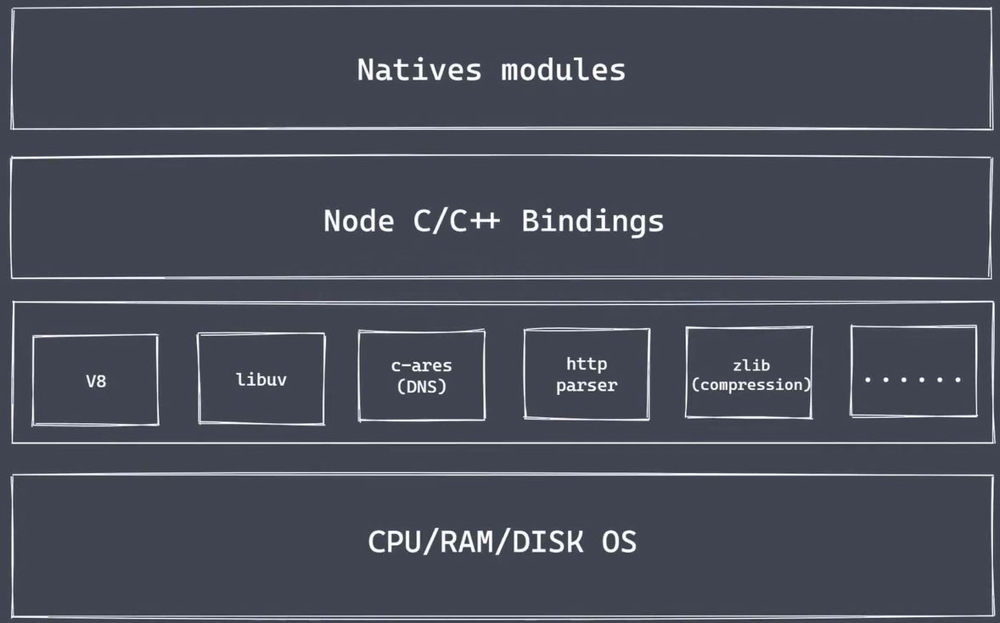

### 1.1 Natives modules

- 当前层内容由 JS 实现
- 提供应用程序可直接调用库，例如fs、path、http
- js 语言无法直接操作底层硬件设置

### 1.2 Builtin modules "胶水层"

- 充当桥梁使node核心模块获取技术支持完成更底层操作
- 在图中即 Node C/C++ Bindings

### 1.3 底层

- V8: 执行 JS 代码，提供桥梁接口
- Libuv: 事件循环、事件队列、异步IO
- 第三方模块：zlib、http、c-ares等

## 2. nodejs 异步IO

### 2.1 同步与异步


### 2.2 阻塞IO 与非阻塞IO

- 阻塞IO

  - 轮询：重复调用IO操作，判断IO是否结束
  - read、select、poll、kqueue、event port

- 非阻塞IO

  - 期望实现无需主动判断的非阻塞IO
  - nodejs 非阻塞IO由libuv实现

  

- node 实现异步IO

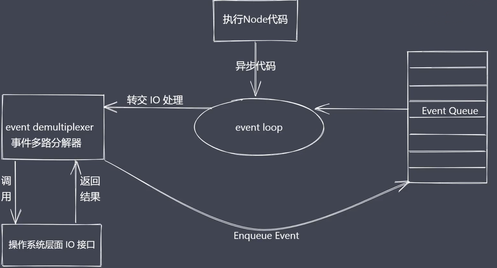

### 2.3 总结

- IO 是应用程序的瓶颈所在
- 异步IO提高性能无需原地等待结果返回
- IO操作属于操作系统级别，平台都有对应实现
- nodejs 单线程配合事件循环架构及libuv实现了异步

## 3. 事件驱动架构


```
const EventEmitter = require('events')

const myEvent = new EventEmitter()

myEvent.on('event1', () => {
    console.log('event1执行了')
})

myEvent.emit('event1')
```

## 4. nodejs 单线程

- 单线程如何实现高并发？
  - 异步非阻塞IO配合事件回调通知
  - 单线程：nodejs 主线程是单线程
- 劣势
  - cpu密集型过多占用cpu，无法体现多核cpu优势
  - 解决方案：class集群

```
const http = require('http')

function sleepTime(time) {
    const sleep = Date.now() + time * 1000
    while(Date.now() < sleep) {}
    return
}
sleepTime(4)
const server = http.createServer((req, res) => {
    res.end('server start...')
})

server.listen(8080, () => {
    console.log('服务启动了') // 在4秒后打印
})
```

## 5. 应用场景

- IO 密集型高并发请求

  - 作为中间层

  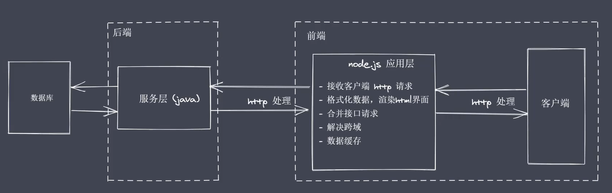

  - 操作数据库提供API服务
  - 实时聊天应用程序

- 更加适合IO密集型高并发请求

- 前端工程化

## 6. 实现API服务

- 安装typescript

```
npm i typescript -g
```

- 初始化typescript配置文件

```
tsc --init

// tsconfig.json
{
  "compilerOptions": {
    /* Visit https://aka.ms/tsconfig.json to read more about this file */
    /* Basic Options */
    // "incremental": true,                   /* Enable incremental compilation */
    "target": "es5", /* Specify ECMAScript target version: 'ES3' (default), 'ES5', 'ES2015', 'ES2016', 'ES2017', 'ES2018', 'ES2019', 'ES2020', or 'ESNEXT'. */
    "module": "commonjs", /* Specify module code generation: 'none', 'commonjs', 'amd', 'system', 'umd', 'es2015', 'es2020', or 'ESNext'. */
    // "lib": [],                             /* Specify library files to be included in the compilation. */
    // "allowJs": true,                       /* Allow javascript files to be compiled. */
    // "checkJs": true,                       /* Report errors in .js files. */
    // "jsx": "preserve",                     /* Specify JSX code generation: 'preserve', 'react-native', or 'react'. */
    // "declaration": true,                   /* Generates corresponding '.d.ts' file. */
    // "declarationMap": true,                /* Generates a sourcemap for each corresponding '.d.ts' file. */
    // "sourceMap": true,                     /* Generates corresponding '.map' file. */
    // "outFile": "./",                       /* Concatenate and emit output to single file. */
    // "outDir": "./",                        /* Redirect output structure to the directory. */
    // "rootDir": "./",                       /* Specify the root directory of input files. Use to control the output directory structure with --outDir. */
    // "composite": true,                     /* Enable project compilation */
    // "tsBuildInfoFile": "./",               /* Specify file to store incremental compilation information */
    // "removeComments": true,                /* Do not emit comments to output. */
    // "noEmit": true,                        /* Do not emit outputs. */
    // "importHelpers": true,                 /* Import emit helpers from 'tslib'. */
    // "downlevelIteration": true,            /* Provide full support for iterables in 'for-of', spread, and destructuring when targeting 'ES5' or 'ES3'. */
    // "isolatedModules": true,               /* Transpile each file as a separate module (similar to 'ts.transpileModule'). */
    /* Strict Type-Checking Options */
    "strict": true, /* Enable all strict type-checking options. */
    // "noImplicitAny": true,                 /* Raise error on expressions and declarations with an implied 'any' type. */
    // "strictNullChecks": true,              /* Enable strict null checks. */
    // "strictFunctionTypes": true,           /* Enable strict checking of function types. */
    // "strictBindCallApply": true,           /* Enable strict 'bind', 'call', and 'apply' methods on functions. */
    // "strictPropertyInitialization": true,  /* Enable strict checking of property initialization in classes. */
    // "noImplicitThis": true,                /* Raise error on 'this' expressions with an implied 'any' type. */
    // "alwaysStrict": true,                  /* Parse in strict mode and emit "use strict" for each source file. */
    /* Additional Checks */
    // "noUnusedLocals": true,                /* Report errors on unused locals. */
    // "noUnusedParameters": true,            /* Report errors on unused parameters. */
    // "noImplicitReturns": true,             /* Report error when not all code paths in function return a value. */
    // "noFallthroughCasesInSwitch": true,    /* Report errors for fallthrough cases in switch statement. */
    /* Module Resolution Options */
    // "moduleResolution": "node",            /* Specify module resolution strategy: 'node' (Node.js) or 'classic' (TypeScript pre-1.6). */
    // "baseUrl": "./",                       /* Base directory to resolve non-absolute module names. */
    // "paths": {},                           /* A series of entries which re-map imports to lookup locations relative to the 'baseUrl'. */
    // "rootDirs": [],                        /* List of root folders whose combined content represents the structure of the project at runtime. */
    // "typeRoots": [],                       /* List of folders to include type definitions from. */
    // "types": [],                           /* Type declaration files to be included in compilation. */
    // "allowSyntheticDefaultImports": true,  /* Allow default imports from modules with no default export. This does not affect code emit, just typechecking. */
    "esModuleInterop": true, /* Enables emit interoperability between CommonJS and ES Modules via creation of namespace objects for all imports. Implies 'allowSyntheticDefaultImports'. */
    // "preserveSymlinks": true,              /* Do not resolve the real path of symlinks. */
    // "allowUmdGlobalAccess": true,          /* Allow accessing UMD globals from modules. */
    "resolveJsonModule": true,
    /* Source Map Options */
    // "sourceRoot": "",                      /* Specify the location where debugger should locate TypeScript files instead of source locations. */
    // "mapRoot": "",                         /* Specify the location where debugger should locate map files instead of generated locations. */
    // "inlineSourceMap": true,               /* Emit a single file with source maps instead of having a separate file. */
    // "inlineSources": true,                 /* Emit the source alongside the sourcemaps within a single file; requires '--inlineSourceMap' or '--sourceMap' to be set. */
    /* Experimental Options */
    // "experimentalDecorators": true,        /* Enables experimental support for ES7 decorators. */
    // "emitDecoratorMetadata": true,         /* Enables experimental support for emitting type metadata for decorators. */
    /* Advanced Options */
    "skipLibCheck": true, /* Skip type checking of declaration files. */
    "forceConsistentCasingInFileNames": true /* Disallow inconsistently-cased references to the same file. */
  }
}
```

- 安装ts-node

  - 作用：无需转换为js，可直接运行ts

  ```
  npm i ts-node -g
  ```

  [ts-node的坑]: https://zhuanlan.zhihu.com/p/270592378

  - ts-node ***.ts

- express安装、es模块导入express

  ```
  npm i express -S
  npm i @types/express -D
  ```

- ts 导入 json
  - 修改tsconfig.json里的 resolveJsonModule

## 7. 全局对象

- Global 的根本作用就是作为属主
- 全局对象可以看作是全局变量的属主

### 7.1 常见全局变量

- __filename: 返回正在执行脚本文件的绝对路径
- __dirname: 返回正在执行脚本所在目录
- timer类函数： 执行顺序与事件循环间的关系
- process： 提供与当前进程互动的接口
- require：实现模块的加载
- module、exports：处理模块的导出

```
console.log(global)
```

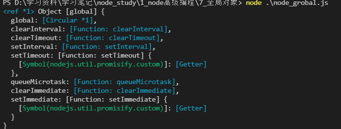

```
console.log(__filename) // D:\学习资料\学习笔记\node_study\1_node高级编程\7_全局对象\node_grobal.js
console.log(__dirname) // D:\学习资料\学习笔记\node_study\1_node高级编程\7_全局对象

console.log(this) // {}
// 默认情况 this 是空对象，和global 并不是一样的
console.log(this == global) // false
```

### 7.2 全局变量 process

- 获取进程信息
- 执行进程操作

```
// 1.资源信息： cpu  内存
console.log(process.memoryUsage())
/**
 * {
  rss: 19582976,     
  heapTotal: 4481024,
  heapUsed: 2856584,
  external: 938610,  
  arrayBuffers: 9898 
}
 */

console.log(process.cpuUsage()) // { user: 78000, system: 15000 }

// 2.运行环境: 运行目录、node环境、cpu架构、用户环境、系统平台
console.log(process.cwd()) // D:\学习资料\学习笔记\node_study\1_node高级编程\7_全局对象
console.log(process.version)  // v14.8.2
console.log(process.versions)
/**
 * {
  node: '14.18.2',
  v8: '8.4.371.23-node.85',
  uv: '1.42.0',
  zlib: '1.2.11',
  brotli: '1.0.9',
  ares: '1.18.1',
  modules: '83',
  nghttp2: '1.42.0',
  napi: '8',
  llhttp: '2.1.4',
  openssl: '1.1.1l',
  cldr: '39.0',
  icu: '69.1',
  tz: '2021a',
  unicode: '13.0'
}
 */

console.log(process.arch) // x64
console.log(process.env.NODE_ENV) // 环境参数
console.log(process.env.path) // 环境变量
console.log(process.env.USERPROFILE) // C:\Users\way liu 管理员目录
console.log(process.platform) // win32 平台

// 3.运行状态： 启动参数、运行时间
console.log(process.argv)
/**
 * 默认存在两项参数
 * [
    'C:\\Program Files\\nodejs\\node.exe',
    'D:\\学习资料\\学习笔记\\node_study\\1_node高级编程\\7_全局对象\\process.js'
    ]
 */
console.log(process.uptime()) // 0.1322332 运行时间

//4.事件
process.on('ext', (code) => {
    console.log('exit' + code)
}) 
process.on('beforeExit', (code) => {
    console.log('before exit' + code)
})
console.log('代码执行完了')
/**
 * 代码执行完了
 * before exit0
 */
 
// 手动退出
process.exit()
```

- 资源信息
- 运行环境
- 运行状态
- 事件

### 7.3 cross-env

```
npm install cross-env
```

```
// package.json

{
  "name": "realword-api-express",
  "version": "1.0.0",
  "description": "",
  "main": "index.js",
  "scripts": {
    "start": "cross-env PORT=8080 nodemon app.js"
  },
  "keywords": [],
  "author": "",
  "license": "ISC"
}
```

## 8. 核心模块-path

- path.basename():获取路径中的基础名称
- path.dirname(): 获取路径目录名（路径）
- path.extname(): 获取路径的扩展名
- path.parse(): 解析路径
- path.format(): 序列化路径
- path.isAbsolute(): 判断参数是否为绝对路径
- path.join(): 拼接路径
- path.normalize(): 规范化路径
- path.resolve(): 获取绝对路径

```
const path = require('path')

// 1. 获取路径中的基础名称
/**
 * 返回的是接收路径的最后一部分：可能是文件或目录
 * 第二个参数标识扩展名，如果没有设置或者没有匹配上则返回完整的文件名称带后缀
 * 处理目录路径如果结尾处有路径分隔符，则会被忽略
 */

console.log(path.basename(__filename)) // path.js
console.log(path.basename(__filename, '.js'))
console.log(path.basename(__filename, '.css')) // path
console.log(path.basename('/a/b/c')) // c
console.log(path.basename('/a/b/c/')) // c


// 2. 获取路径目录名（路径）
/**
 * 返回路径中最后一个部分的上一次目录所在路径
 */
console.log(path.dirname(__filename)) // D:\学习资料\学习笔记\node_study\1_node高级编程\8_path模块
console.log(path.dirname('/a/b/c')) // /a/b
console.log(path.dirname('/a/b/c/')) // /a/b

// 3. 获取路径的扩展名
/**
 * 返回相应文件名最后一个 . 后面的部分（后缀）
 * 
 */
console.log(path.extname(__filename)) // .js
console.log(path.extname('/a/b/index.html.css')) // .css
console.log(path.extname('/a/b/index.css.')) // .

// 4.解析路径
const obj = path.parse('/a/b/c/index.html')
console.log(obj)
/**
 * {
  root: '/',
  dir: '/a/b/c',
  base: 'index.html',
  ext: '.html',
  name: 'index'
}
 */
 
// 5.序列化路径
console.log(path.format(obj)) // /a/b/c\index.html

// 6.判断当前路径是否为绝对路径
console.log(path.isAbsolute('foo')) // false
console.log(path.isAbsolute('/foo')) // true

// 7.拼接路径
console.log(path.join('a/b', 'c', 'index.html')) // a\b\c\index.html
console.log(path.join('a/b', 'c', '../','index.html')) // a\b\index.html

// 8. 规范化路径
console.log(path.normalize('a/b/c/d')) // a\b\c\d
console.log(path.normalize('a///b/c../d')) // a\b\c..\d
console.log(path.normalize('a//\b/c\\/d'))  // a\c\d(有转义字符的情况)

// 9. 获取绝对路径
/**
 * resolve([from], to)
 * 即把to拼接在from后面
 */
console.log(path.resolve()) // D:\学习资料\学习笔记\node_study\1_node高级编程\8_path模块
console.log(path.resolve('a', 'b')) // D:\学习资料\学习笔记\node_study\1_node高级编程\8_path模块\a\b(这里的两个参数都属于to)
console.log(path.resolve('/a', 'b')) // D:\a\b （a:from, b:to）
console.log(path.resolve('a', '/b')) // D:\b ('/b': from, a：不要)
console.log(path.resolve('/a', '/b')) // D:\b ('/b': from, /a：不要)
```

## 9. 全局变量Buffer（缓冲区）

### 9.1 什么是Buffer

- Nodejs平台下JavaScript可实现IO
- IO 行为操作的就是二进制数据
- Stream 流操作配合管道实现数据分段传输
- 数据的端到端传输会有生产者和消费者，如果生产者和消费者速率不匹配，就会产生等待
- 产生等待时数据存放在哪？——Buffer


**总结**

- 无需require的一个全局变量
- 实现nodejs平台下的二进制数据操作
- 不占据V8堆内存大小的内存空间
- 内存的使用由node控制，由v8的GC来回收
- 一般配合Stream流使用，充当数据缓冲区


### 9.2 创建Buffer

- alloc：创建指定字节大小的buffer
- allocUnsafe: 创建指定大小的buffer（不安全）
- from： 接收数据，创建buffer

**创建时即指定了长度，后续不能改变空间大小，这是和js数组不同的**

```
// alloc()
const b1 = Buffer.alloc(10)
console.log(b1) // <Buffer 00 00 00 00 00 00 00 00 00 00>

// allocUnsafe()
const b2 = Buffer.allocUnsafe(10)
console.log(b2) // <Buffer 00 00 00 00 00 00 00 00 90 33>

// from
const b3 = Buffer.from('1')
const b4 = Buffer.from('中')
const b5 = Buffer.from('中', 'utf-8')
console.log(b3) // <Buffer 31>
console.log(b4) // <Buffer e4 b8 ad>
console.log(b5) // <Buffer e4 b8 ad>
// 16进制，默认第二个参数编码格式utf-8,中文占3个字节
const b6 = Buffer.from([1, 2, '中'])
console.log(b6) // <Buffer 01 02 00> (数组中不能直接传入中文，需传入进制)
const b7 = Buffer.from([0xe4, 0xb8, 0xad]) // 0x: 16进制
console.log(b7.toString()) // 中

// 内存是否共享(创建了新的空间，不共享)
const b8 = Buffer.alloc(3)
const b9 = Buffer.from(b8)
b8[0] = 1
console.log(b8) // <Buffer 01 00 00>
console.log(b9) // <Buffer 01 00 00>
```

### 9.3 Buffer 实例方法

- fill： 使用数据填充 buffer
- write：向buffer中写入数据
- toString: 从buffer中提取数据
- slice：截取 buffer
- indexOf: 在buffer 中查找数据
- copy：拷贝 buffer 中的数据

```
// fill
let buf1 = Buffer.alloc(6)
let buf2 = Buffer.alloc(6)
let buf3 = Buffer.alloc(6)
buf1.fill('1234')
console.log(buf1) // <Buffer 31 32 33 34 31 32> 会重复写入
buf2.fill('123', 1)
console.log(buf2)  // <Buffer 00 31 32 33 31 32>
console.log(buf2.toString()) // 12312 从下标1开始
buf3.fill('123',1,2)
console.log(buf3) // <Buffer 00 31 00 00 00 00>
console.log(buf3.toString()) // 1 从下标1开始到下标2结束
/**
 * 1. 会重复写入
 * 2. startIndx
 * 3. endIndex
 */
console.log('----------write-------')
// write
let buf4 = Buffer.alloc(6)
let buf5 = Buffer.alloc(6)
let buf6 = Buffer.alloc(6)
buf4.write('123') // <Buffer 31 32 33 00 00 00> 不重复写入
console.log(buf4)
buf5.write('123', 1)
console.log(buf5) // <Buffer 00 31 32 33 00 00> 从下标1开始
buf6.write('123', 1, 2)
console.log(buf6) // <Buffer 00 31 32 00 00 00> 从下标1开始长度为2
/**
 * 1. 不重复写入
 * 2. startIndex
 * 3. length
 */

console.log('---------toString---------')

// toString
const buf7 = Buffer.from('abcdefg')
console.log(buf7) // <Buffer 61 62 63 64 65 66 67>
console.log(buf7.toString('utf-8', 4, 6)) // ef

console.log('----------slice----------')

// slice
const buf8 = Buffer.from('刘国威呀')
console.log(buf8) // <Buffer e5 88 98 e5 9b bd e5 a8 81 e5 91 80> 一个中文三字节
let result = buf8.slice(3,9) // 下标3开始9结束
console.log(result.toString())  // 国威

console.log('------indexOf---------')
buf9 = Buffer.from('weiwellweiweiweiwei')
console.log(buf9.indexOf('wei')) // 0
console.log(buf9.indexOf('wei', 1)) // 偏移量为1, 即从下标1开始匹配
console.log(buf9.indexOf('sdfas')) // -1

console.log('---------copy-------')
// copy
let buf10 = Buffer.alloc(6)
let buf11 = Buffer.from('国威')
let buf12 = Buffer.alloc(6)
let buf13 = Buffer.alloc(6)
let buf14 = Buffer.alloc(6)
buf11.copy(buf10) // 把buf11拷贝到buf10 (from copy to)
buf11.copy(buf12, 3)
buf11.copy(buf13, 3, 3)
buf11.copy(buf14, 0, 0, 6)
console.log(buf10.toString()) // 国威
console.log(buf11.toString()) // 国威
console.log(buf12.toString()) // 国
console.log(buf13.toString()) // 威
console.log(buf14.toString()) // 国威
/**
 * 1. from copy to
 * 2. from startIndex
 * 3. to startIndex
 * 4. to endIndex
 */

```

### 9.4 Buffer 静态方法

- concat：将多个buffer拼接成一个新的buffer
- isBuffer：判断当前数据是否为buffer

```
// concat
let b1 = Buffer.from('独孤')
let b2 = Buffer.from('国威')

let b3 = Buffer.concat([b1, b2])
let b4 = Buffer.concat([b1, b2], 9)
console.log(b3.toString()) // 独孤国威
console.log(b4.toString()) // 独孤国
/**
 * 1.buffer数组
 * 2. maxLength
 */

console.log('------isBuffer------')
console.log(Buffer.isBuffer(b1)) // true
console.log(Buffer.isBuffer('ABC')) // false
```

### 9.5 实现Buffer-split操作

```
ArrayBuffer.prototype.split = function (sep) {
    let len = Buffer.from(sep).length
    let ret = []
    let start = 0
    let offSet = 0
    while(offSet = this.indexOf(sep) !== -1) {
        ret.push(this.slice(start, offSet))
        start = offset + len // 长度加上偏移量即是下一个开始位置
    } 
    ret.push(this.slice(start)) // 处理关键字在数组的最后一个
    return ret
}

let buf = 'lgw 吃馒头，吃面条，我吃所有'
let bufArr = buf.split('吃')
console.log(bufArr) // [ 'lgw ', '馒头，', '面条，我', '所有' ]
```

## 10. 核心模块-FS

### 10.1 FS基础

- FS 基本操作类

- FS 常用API

- 前置知识

  - 权限位：用户对于文件所具备的操作权限

    - r：读-八进制:4
    - w：写-八进制:2
    - x：执行-八进制:1
    - 0：不具备该权限

  - 操作系统用户分类

    - 文件的所有者
    - 文件的所属组
    - 其他用户

    

    ```
    -rw-r--r-- 1 way liu 197121       3336 12月 16  2019  unintall.log
    drwxr-xr-x 1 way liu 197121          0 12月 23 23:06  Users/
    ```

    - 以第二行为例：
      - 第一个d代表是文件夹，第一行的-代表是文件
      - 然后每三个代表权限：所有者：rwx、所属组：-xr、其他用户：r-x

  - 标识符：nodejs 中 flag表示对文件操作方式

    - r：表示可读
    - w：表示可写
    - s：表示同步
    - +：表示执行相反操作
    - x：表示排他操作
    - a：表示追加操作

  - 文件描述符

    - fd 就是被操作系统分配给被打开文件的标识
    - fs.open 打开就可以得到fd
    - fd是从3开始的，0、1、2已被占用


### 10.2 文件操作 API

- readFile：从指定文件中读取数据
- writeFile：向指定文件中写入数据
- appendFile：追加的方式向指定文件中写入数据
- copyFile：将某个文件中的数据拷贝至另一文件
- watchFile：对指定文件进行监控

```
const fs = require('fs')
const path = require('path')

// readFile
fs.readFile(path.resolve('data.txt'), 'utf-8', (err, data) => {
    console.log(err) // null
    if(!null) {
        console.log(data) // hello node.js
    }
})

// writeFile
/* fs.writeFile('data.txt', 'hello node.js', (err) => {
    if(!err) {
        fs.readFile('data.txt', 'utf-8', (err,data) => {
            console.log(data) // hello node.js
        })
    }
}) */
fs.writeFile('data.txt', '123', {
    mode: 438,
    flag: 'r+',
    encoding: 'utf-8'
}, (err) => {
    if(!err) {
        fs.readFile('data.txt', 'utf-8', (err,data) => {
            console.log(data) //123lo node.js
        })
    }
})
/**
 * w+: 清空再写入
 */

// appendFile 追加写入
fs.appendFile('data.txt', '刘国威', (err) => {
    console.log('写入成功')
})

// copyFile
fs.copyFile('data.txt', 'test.txt', () => [
    console.log('拷贝成功')
])

// watchFile
fs.watchFile('data.txt', {interval: 20}, (curr, prev) => {
    console.log(curr)
    console.log(prev)
    /**
     * Stats {
            dev: 917648021,
            mode: 33206,
            nlink: 1,
            uid: 0,
            gid: 0,
            rdev: 0,
            blksize: 4096,
            ino: 1970324837166384,
            size: 67,
            blocks: 0,
            atimeMs: 1641732905251.5007,    
            mtimeMs: 1641732905244.5203,    
            ctimeMs: 1641732905244.5203,    
            birthtimeMs: 1641723746551.9575,
            atime: 2022-01-09T12:55:05.252Z,
            mtime: 2022-01-09T12:55:05.245Z,
            ctime: 2022-01-09T12:55:05.245Z,
            birthtime: 2022-01-09T10:22:26.552Z
        }
     */
    // 如果文件发生了更改
    if(curr.mtime !== prev.mtime) {
        console.log('文件被修改了')
        fs.unwatchFile('data.txt')
    }
})
```

### 10.3 md转html实现

```
npm i marked -S
npm i browser-sync -S
```

```
// 2.md转html.JS
const fs = require('fs')
const path = require('path')
const marked = require('marked')
const browserSync = require('browser-sync')

/**
 * 01 读取 md 和 css 内容
 * 02 将上述读取出来的内容替换占位符，生成一个最终需要展的 Html 字符串 
 * 03 将上述的 Html 字符写入到指定的 Html 文件中
 * 04 监听 md 文档内容的变经，然后更新 html 内容 
 * 05 使用 browser-sync 来实时显示 Html 内容
 */

let mdPath = path.join(__dirname, process.argv[2])
let cssPath = path.resolve('github.css')
let htmlPath = mdPath.replace(path.extname(mdPath), '.html')

fs.watchFile(mdPath, (curr, prev) => {
  if (curr.mtime !== prev.mtime) {
    fs.readFile(mdPath, 'utf-8', (err, data) => {
      // 将 md--》html
      let htmlStr = marked(data)
      fs.readFile(cssPath, 'utf-8', (err, data) => {
        let retHtml = temp.replace('{{content}}', htmlStr).replace('{{style}}', data)
        // 将上述的内容写入到指定的 html 文件中，用于在浏览器里进行展示
        fs.writeFile(htmlPath, retHtml, (err) => {
          console.log('html 生成成功了')
        })
      })
    })
  }
})

browserSync.init({
  browser: '',
  server: __dirname,
  watch: true,
  index: path.basename(htmlPath)
})

const temp = `
    <!DOCTYPE html>
    <html lang="en">
    <head>
        <meta charset="UTF-8">
        <title></title>
        <style>
            .markdown-body {
                box-sizing: border-box;
                min-width: 200px;
                max-width: 1000px;
                margin: 0 auto;
                padding: 45px;
            }
            @media (max-width: 750px) {
                .markdown-body {
                    padding: 15px;
                }
            }
            {{style}}
        </style>
    </head>
    <body>
        <div class="markdown-body">
            {{content}}
        </div>
    </body>
    </html>
`
```

```
node .\2.md转html.js index.md 
```

- process.argv[2] ==> index.md

### 10.4 文件打开与关闭

- fs.open()
- fs.close()

```
const fs = require('fs')
const path = require('path')

fs.open(path.resolve('data.txt'), 'r', (err, fd) => {
    console.log(fd) // 3
    fs.close(fd,  err => {
        console.log('关闭成功')
    })
})
```

### 10.5 大文件读写操作

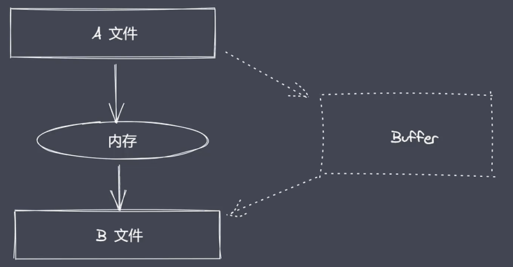

- readFile、writeFile适合小文件的操作
- read、write、open、close配合Buffer适合于大文件的操作
- 使用内存的方式可能导致内存的溢出，故大文件用Buffer作为中转

```
// data.txt
1234567890
```

```
const fs = require('fs')

// read: 所谓的读操作就是将数据从磁盘文件中写入到 buffer 中
let buf = Buffer.alloc(10)

fs.open('data.txt', 'r', (err, fd) => {
    console.log(fd) // 3
    fs.read(fd, buf, 1, 4, 1, (err, readBytes, data) => {
        console.log(readBytes) // 4
        console.log(data) // <Buffer 00 32 33 34 35 00 00 00 00 00>
        console.log(data.toString()) // 2345
    })
})
/**
 * fd 定位当前被打开的文件
 * buf 用于表示当前缓冲区
 * offset 表示从 buf 的哪个位置开始执行写入
 * length 表示当前写入的长度
 * position 表示当前从文件的哪个位置开始读取
 */

buf2 = Buffer.from('1234567890')
fs.open('b.txt', 'w', (err, fd) => {
    fs.write(fd, buf2, 2, 4, 0, (err, written, buffer) => {
        console.log('written:  ', written) // 4
        fs.close(fd)
    })
})
// b.txt 3456
```

### 10.6 文件拷贝自定义实现

```
const fs = require('fs')

/**
 * 1. 打开 a 文件， 利用 read 将数据保存到 buffer 暂存起来
 * 2. 打开 b 文件， 利用write 将 buffer 中数据写入到 b 文件
 */

let buf = Buffer.alloc(10)
const BUFFER_SIZE = buf.length
let readOffset = 0

fs.open('a.txt', 'r', (err, rfd) => {
    fs.open('b.txt', 'w', (err, wfd) => {
        function next() {
            fs.read(rfd, buf, 0, BUFFER_SIZE, readOffset, (err, readBytes) => {
                // 如果条件成立则已经读取完毕
                if(!readBytes) {
                    fs.close(rfd, () => {})
                    fs.close(wfd, () => {})
                    console.log('拷贝完成')
                    return
                }
                readOffset += readBytes
                fs.write(wfd, buf, 0, readBytes, (err, written) => {
                    next()
                })
            })
        }
        next()
    })
})
```

### 10.7 目录操作API

- access：判断文件或目录是否具有操作权限
- stat：获取目录及文件信息
- mkdir：创建目录
- rmdir：删除目录
- readdir：读取目录中内容
- unlink：删除指定文件

```
const fs = require('fs')

// access
fs.access('a.txt', (err) => {
    if(err) {
        console.log(err)
    } else {
        console.log('有操作权限')
    }
})

// stat
fs.stat('a.txt', (err, statObj) => {
    console.log(statObj)
    console.log(statObj.isFile())
    console.log(statObj.isDirectory())
})
/**
     * Stats {
        dev: 917648021,
        mode: 33206,
        nlink: 1,
        uid: 0,
        gid: 0,
        rdev: 0,
        blksize: 4096,
        ino: 2251799813930871,
        size: 16,
        blocks: 0,
        atimeMs: 1641742731245.7615,    
        mtimeMs: 1641742727141.708,     
        ctimeMs: 1641742727141.708,     
        birthtimeMs: 1641742720466.0496,
        atime: 2022-01-09T15:38:51.246Z,
        mtime: 2022-01-09T15:38:47.142Z,
        ctime: 2022-01-09T15:38:47.142Z,
        birthtime: 2022-01-09T15:38:40.466Z
    }
 */

// mkdir
const path = require('path')
fs.mkdir('newDir', (err) => {
    if(!err) {
        console.log('创建成功')
    } else {
        console.log(err)
    }
})
// 实现递归创建
fs.mkdir('a/b/c', {recursive: true},(err) => {
    if(!err) {
        console.log('创建成功')
    } else {
        console.log(err)
    }
})
/**
 * 需要保证父级目录是存在的，即只会创建basename
 * {recursive: true} 递归创建不需要保证父级存在
 */

// rmdir
fs.rmdir('a/b/c', (err) => {
    if(!err) {
        console.log('删除成功')
    } else {
        console.log(err)
    }
})
// 递归删除
fs.rmdir('a/b/c', {recursive: true}, (err) => {
    if(!err) {
        console.log('删除成功')
    } else {
        console.log(err)
    }
})
/**
 * 只会删除basename部分，即c
 * {recursive: true} 递归删除
 */

// readdir
fs.readdir(__dirname, (err, files) => {
    console.log(files)
})
/**
 * [
    '1.文件操作api.js',
    '2.md转html.js',
    '3.文件打开与关闭.js',
    '4.大文件操作.js',
    '5.文件拷贝自定义实现.js',
    '6.目录操作API.js',
    'a',
    'a.txt',
    'b.txt',
    'data.txt',
    'github.css',
    'index.md',
    'newDir',
    'package-lock.json',
    'test.txt'
    ]
 */

// unlink
fs.unlink(path.resolve('unlink.txt'), (err) => {
    if(!err) {
        console.log('unlink删除成功')
    }
})
```

### 10.8 目录递归创建之同步实现

- path.sep 文件分隔符

```
const path = require('path')
const fs = require('fs')

function makeDirSync (dirPath) {
    console.log(path.sep) // \
    let items = dirPath.split(path.sep)
    console.log(items) // [ 'a', 'b', 'c' ]
    for(let i=1; i<= items.length; i++) {
        let dir = items.slice(0, i).join(path.sep)
        try {
            fs.accessSync(dir)
        } catch (err) {
            fs.mkdirSync(dir)
        }
    }
}


makeDirSync('a\\b\\c')
```

### 10.9 目录递归创建之异步实现

```
const fs = require('fs')
const path = require('path')

// function mkDir (dirPath, cb) {
//     let parts = dirPath.split('/')
//     let index = 1
//     function next () {
//         if(index > parts.length) return cb && cb()

//         let current = parts.slice(0, index++).join('/')
//         fs.access(current, (err) => {
//             if (err) {
//                 fs.mkdir(current, next)
//             } else {
//                 next()
//             }
//         })
//     }
//     next()
// }

const { promisify } = require('util')

const access = promisify(fs.access)
const mkdir = promisify(fs.mkdir)

async function mkDir(dirPath, cb) {
    let parts = dirPath.split('/')
    for(let index = 1; index <= parts.length; index++) {
        let current = parts.slice(0, index).join('/')
        try {
            await access(current)
        } catch (error) {
            await mkdir(current)
        }
    }
    cb && cb()
}

// mkDir('a/b/c')
mkDir('a/b/c', () => {
    console.log('创建成功')
})
```

### 10.10 目录递归删除异步实现

```
/**
 * 1. 判断当前传入的路径是否为一个文件，直接删除当前文件即可
 * 2.如果传入的是一个目录，则继续读取目录中的内容，然后再执行删除操作
 */

const fs = require('fs')
const path  = require('path')

function rmdir(dirPath, cb) {
    // 判断当前 dirpath 的类型
    fs.stat(dirPath, (err, statObj) => {
        if (statObj.isDirectory()) {
            // 目录 ==> 继续读取
            fs.readdir(dirPath, (err, files) => {
                let dirs = files.map(item => {
                    return path.join(dirPath, item) // 要删除文件夹拼接上子文件夹
                })
                let index = 0
                function next() {
                    // 如果没有子文件夹的话则直接删除
                    if(index == dirs.length) return fs.rmdir(dirPath, cb)
                    
                    let current = dirs[index++]
                    rmdir(current, next)
                }
                next()
            })
        } else {
            // 文件 ==> 直接删除
            fs.unlink(dirPath, cb)
        }
    })    
}


rmdir('newDir', () => {
    console.log('删除成功')
})
```

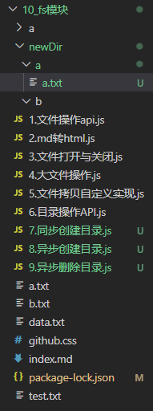

## 11. 模块化

### 11.1 模块化发展历程

**传统开发常见问题**

- 命名冲突和污染

- 代码冗余，无效请求多
- 文件间的依赖关系复杂
- 早期 javas 语言层面没有模块化规范
- 早期：利用函数、对象、自执行函数实现

**常见模块化规范**

- Commonjs 规范
  - 加载同步执行，不适合在浏览器使用

- AMD 规范
- CMD 规范
- ES modules 规范

### 11.2 CommonJS 规范

- 模块引用
- 模块定义
- 模块标识

**Nodejs 与 CommonJS**

- 任意一个文件就是一模块，具有独立作用域
- 使用 requrie 导入其他模块
- 将模块 ID 传入 require 实现目标模块定位

**module 属性**

- 任意 js 文件就是一个模块，可以直接使用module属性
- id：返回模块标识符，一般是一个绝对路径
- filename：返回文件模块的绝对路径
- loaded：返回布尔值，标识模块是否完成加载
- parent：返回对象存放调用当前模块的模块
- children：返回数组，存放当前模块调用的其它模块
- exports：返回当前模块需要暴露的内容
- paths：返回数组，存放不同目录下的 node_modules 位置

**module.exports 与 exports**

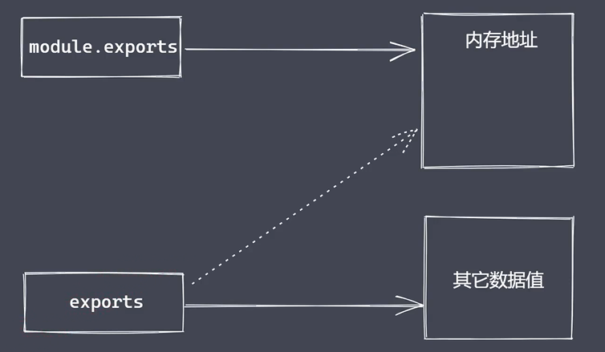

- 不可以直接给exports赋值，因为会切断其与module.exports的引用

**require**

- 基本功能是读入并且执行一个模块文件
- resolve：返回模块文件绝对路径
- extensions：依据不同后缀名执行解析操作
- main：返回住模块对象

**总结**

- CommonJS 规范起初为了弥补 JS 语言模块化缺陷
- CommonJS 规范是语言层面的规范，当前主要用于 nodejs
- CommonJS 规范规定模块化分为引入、定义、标识符三个部分
- Module 在任意模块中可直接使用包含模块信息
- Require 接收标识符，加载目标模块
- Exports 与 module.exports 都能导出模块数据
- CommonJS 规范定义模块的加载是同步完成的

### 11.3 Node.js 与 CommonJS

- 使用 module.exports 与 require 实现模块导入与导出
- module 属性及其常见信息获取
- exports 导出数据及其与 module.exports 区别
- CommonJS 规范下的模块同步加载

```
// m.js
//  一、 模块的导入与导出
/* const age = 18
const addFun = (x, y) => {
    return x+y
}

module.exports = {
    age: age,
    addFun: addFun
} */

// 二、 module

// console.log(module)

/* <ref *1> Module {
  id: 'D:\\学习资料\\学习笔记\\node_study\\1_node高级编程\\11_模块化\\m.js',
  path: 'D:\\学习资料\\学习笔记\\node_study\\1_node高级编程\\11_模块化',
  exports: {},
  parent: Module {
    id: '.',
    path: 'D:\\学习资料\\学习笔记\\node_study\\1_node高级编程\\11_模块化',
    exports: {},
    parent: null,
    filename: 'D:\\学习资料\\学习笔记\\node_study\\1_node高级编程\\11_模块化\\1.commonjs_node.js',
    loaded: false,
    children: [ [Circular *1] ],
    paths: [
      'D:\\学习资料\\学习笔记\\node_study\\1_node高级编程\\11_模块化\\node_modules',
      'D:\\学习资料\\学习笔记\\node_study\\1_node高级编程\\node_modules',
      'D:\\学习资料\\学习笔记\\node_study\\node_modules',
      'D:\\学习资料\\学习笔记\\node_modules',
      'D:\\学习资料\\node_modules',
      'D:\\node_modules'
    ]
  },
  filename: 'D:\\学习资料\\学习笔记\\node_study\\1_node高级编程\\11_模块化\\m.js',
  loaded: false,
  children: [],
  paths: [
    'D:\\学习资料\\学习笔记\\node_study\\1_node高级编程\\11_模块化\\node_modules',
    'D:\\学习资料\\学习笔记\\node_study\\1_node高级编程\\node_modules',
    'D:\\学习资料\\学习笔记\\node_study\\node_modules',
    'D:\\学习资料\\学习笔记\\node_modules',
    'D:\\学习资料\\node_modules',
    'D:\\node_modules'
  ]
} */

// 三、 exports
// exports.name = 'liuguowei'

// 四、同步加载
/* let name = 'liuguowei'
let iTime = new Date()
while(new Date() - iTime < 4000) {} // 延时四秒
module.exports = name
console.log('m.js 被加载导入了') */

// 五、require.main
console.log(require.main === module)
```

```
// 1.1.commonjs_node.js

// 一、导入
/* let obj = require('./m')

console.log(obj) // { age: 18, addFun: [Function: addFun] } */

// 二、module
// let obj = require('./m')

// 三、exports
/* let obj = require('./m')
console.log(obj) // { name: 'liuguowei' } */

// 四、同步加载
/* require('./m')

console.log('hello world') */

/**
 * 打印：
 * m.js 被加载导入了
 * hello world
 */

// 五、 require.main
require('./m')
console.log(require.main === module)

/**
 * false
 * true
 * 解析：m.js 中require.main 执行 其parent，即 1.commonjs_node.js，所以非主模块
 * 
 */
```

### 11.4 模块分类及加载流程

#### 11.4.1 模块分类

- 内置模块
- 文件模块

#### 11.4.2  模块加载速度

- 核心模块：Node 源码编译时写入到二进制文件中
- 文件模块：代码运行时，动态加载

#### 11.4.3 加载流程

- 路径分析：依据标识符确定模块位置
  - 将当前标识符转为绝对路径找到目标模块
- 文件定位：确定目标模块中具体的文件及文件类型
- 编译执行：采用对应的方式完成文件的编译执行
  - 按照路径找到具体的文件后按文件类型选择对应的处理方式，完成编译执行，返回一个可用的exports对象

##### 11.4.3.1 路径分析

- 路径标识符
- 非路径标识符
  - 常见于核心模块或第三方模块

**模块路径**

```
console.log(module.paths)

/**
 * [    
    'D:\\学习资料\\学习笔记\\node_study\\1_node高级编程\\11_模块化\\node_modules',
    'D:\\学习资料\\学习笔记\\node_study\\1_node高级编程\\node_modules',
    'D:\\学习资料\\学习笔记\\node_study\\node_modules',
    'D:\\学习资料\\学习笔记\\node_modules',
    'D:\\学习资料\\node_modules',
    'D:\\node_modules'
    ]
 */
```

- 从当前文件父级到项目所在盘符根结束
- 使用 require 加载目标模块时会遍历数组中目录
- 如果没有找到目标模块时会抛出错误

##### 11.4.3.2 文件定位

- 项目下存在 m1.js 模块， 导入时使用 require('m1')

- m1.js => m1.json => m1.node

- 如果没有找到则任务自己拿到一个目录，把目录作为一个包来处理

- 查找 package.json文件，使用JSON.parse()解析

  ```
  {
    "name": "Desktop",
    "version": "1.0.0",
    "description": "",
    "main": "index.js",
    "scripts": {
      "test": "echo \"Error: no test specified\" && exit 1"
    },
    "keywords": [],
    "author": "",
    "license": "ISC"
  }
  ```

- main.js => main.json => main.node

- 将 index 作为目标模块中的具体文件名称

- 遍历模块目录重复以上步骤

##### 11.4.3.3 编译执行

- 将某个具体类型的文件按照相应的方式进行编译和执行
- 创建新对象，按路径载入，完成编译执行
- js 文件的编译执行
  - 使用 fs 模块同步读入目标文件内容
  - 对内容进行语法包装，生成可执行 js 函数
  - 调用函数时传入 exports、module、require 等属性值
- json 文件编译执行
  - 将读取到的内容通过JSON.parse()进行解析

#### 11.4.4 缓存优先原则

- 提高模块加载速度
- 当前模块不存在，则经历一次完整加载流程
- 模块加载完成后，使用路径作为索引进行缓存

#### 11.4.5 小结

- 路径分析：确定目标模块位置
- 文件定位i：确定目标模块中的具体文件
- 编译执行：对模块内容进行编译，返回可用 exports 对象

### 11.5 模块加载源码分析

```
// launch.json
{
    "version": "0.2.0",
    "configurations": [
        {
            "type": "pwa-node",
            "request": "launch",
            "name": "Launch Program",
            "skipFiles": [
                
            ],
            "program": "${workspaceFolder}\\11_模块化\\2.require-load.js"
        }
    ]
}
```

- 去除 skipFile 即可调试源码

```
// 02m.js
module.exports = 'liuguowei'

// 2.require-load.js

const obj = require('./02m')
```

#### 11.5.1 mod.require

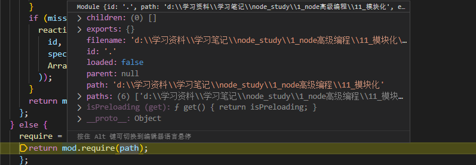

- mod.require中mod

```
filename: 'd:\\学习资料\\学习笔记\\node_study\\1_node高级编程\\11_模块化\\2.require-load.js
```

- path参数：./02m

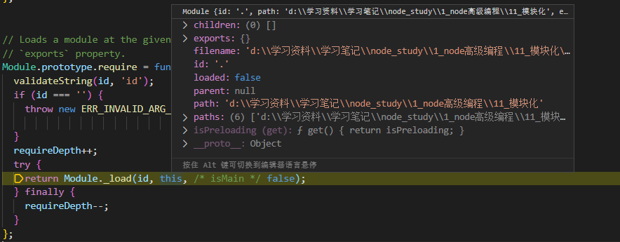

- Module.prototype.require
- 调用 Module._load( )
- id: './02m' 
- this

```
paths:(6) ['d:\\学习资料\\学习笔记\\node_study\\1_node高级编程\\11_模块化\\node_modules', 'd:\\学习资料\\学习笔记\\node_study\\1_node高级编程\\node_modules', 'd:\\学习资料\\学习笔记\\node_study\\node_modules', 'd:\\学习资料\\学习笔记\\node_modules', 'd:\\学习资料\\node_modules', 'd:\\node_modules']
path:'d:\\学习资料\\学习笔记\\node_study\\1_node高级编程\\11_模块化'
parent:null
loaded:false
id:'.'
filename:'d:\\学习资料\\学习笔记\\node_study\\1_node高级编程\\11_模块化\\2.require-load.js'
exports:{}
children:(0) []
```

#### 11.5.2 Module._load

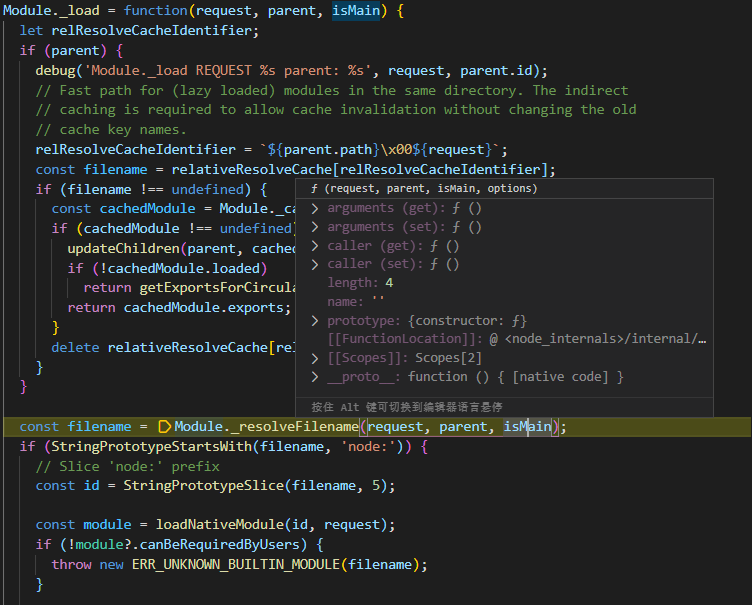

- 调用Module._resolveFilename()

- request: 同上id

- parent：同上 this，即执行的 2.require-load.js 的module

- 得到的filename ==》 绝对路径

  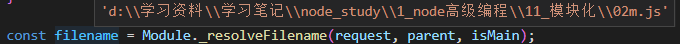

-  new Module

  ```
  const module = cachedModule || new Module(filename, parent);
  
  function Module(id = '', parent) {
    this.id = id;
    this.path = path.dirname(id);
    this.exports = {};
    this.parent = parent;
    updateChildren(parent, this, false);
    this.filename = null;
    this.loaded = false;
    this.children = [];
  }
  ```

  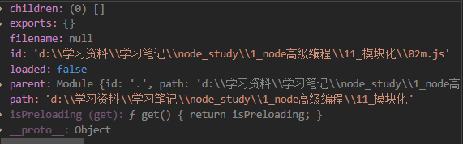

​        module 内容入上图

- 调用 module.load(filename) ==> 上面已经有module与filename内容

#### 11.5.3 Module.prototype.load

```
...
Module._extensions[extension](this, filename); 
```

- 此时 extension 恰好是 .js

```
// Module._extensions['.js']
Module._extensions['.js'] = function(module, filename) {
  ...
  const cached = cjsParseCache.get(module);
  let content;
  // 如果缓存了则取缓存的
  if (cached && cached.source) {
    content = cached.source;
    cached.source = undefined;
  } else {
   // 没有缓存则通过readFileSync 读取此文件
    content = fs.readFileSync(filename, 'utf8');
  }
  module._compile(content, filename);
};
```


- 上图即为content 内容
- 调用 module._compile(content, filename); 

#### 11.5.4 Module.prototype._compile

- 作业： 把 content 包装成可执行的 js

```
Module.prototype._compile = function(content, filename) {
...
const compiledWrapper = wrapSafe(filename, content, this);
```

- compiledWrapper

  ```
  ƒ (exports, require, module, __filename, __dirname) {\nmodule.exports = 'liuguowei'\n}
  ```

### 11.6 内置模块之 vm

- 作用： 创建独立运行的沙箱模块

```
const fs = require('fs')
const vm = require('vm')

let content = fs.readFileSync('test.txt', 'utf-8')
// let age = 24
// eval
/**
 * 和外部同名变量会冲突
 */
// eval(content)

// new Function
// let fn = new Function('age', "return age + 1")
// console.log(fn(age))

/**
 * 优先本模块的，如果没有的化则是引入的
 */
vm.runInThisContext(content)
console.log(age) 
```

### 11.7 模块加载模拟实现

**核心逻辑**

- 路径分析
- 缓存优化
- 文件定位
- 编译执行

```
const fs = require('fs')
const path = require('path')
const vm = require('vm')

function Module(id) {
    this.id = id
    this.exports = {}
}
Module.wrapper = [
    "(function(exports, require, module, __filename, __dirname) {",
    "})"
]
Module._extensions = {
    '.js'(module) {
        // 读取
        let content = fs.readFileSync(module.id, 'utf-8')
        // 包装
        content = Module.wrapper[0] + content + Module.wrapper[1]
        // VM
        let compileFn = vm.runInThisContext(content)
        // 准备参数的值
        let exports = module.exports
        let dirname = path.dirname(module.id)
        let filename = module.id
        // 调用
        compileFn.call(exports, exports, myRequire, module, filename, dirname)
    },
    '.json'(module) {
        // 读取
        let content = JSON.parse(fs.readFileSync(module.id, 'utf-8'))
        module.exports = content
    }
}
Module._resolveFilename = function(filename) {
    // 利用 path 将 filename 转为绝对路径
    let absPath = path.resolve(__dirname, filename)
    // 判断当前路径对应的内容是否存在
    if(fs.existsSync(absPath)) {
        // 如果条件成立则说明 absPath 对应的内容是存在的
        return absPath
    } else {
        // 文件定位
        let suffix = Object.keys(Module._extensions)
        for(let i=0; i<suffix.length; i++) {
            let newPath = absPath + suffix[i]
            if(fs.existsSync(newPath)) {
                return newPath
            }
        }
    }
    throw new Error(`${filename} is not exist`)
}
Module._cache = {}

Module.prototype.load = function() {
    let extname = path.extname(this.id)
    Module._extensions[extname](this)
}

function myRequire(filename) {
    // 1.绝对路径
    let mPath = Module._resolveFilename(filename)
    
    // 2.缓存优先
    let cacheModule = Module._cache[mPath]
    if (cacheModule) return cacheModule.exports

    // 3. 创建空对象加载模块
    let module = new Module(mPath)

    //4. 缓存已加载过的模块
    Module._cache[mPath] = module

    // 5. 执行加载（编译执行）
    module.load()

    // 6. 返回数据
    return module.exports
}

let obj = myRequire('v')
console.log(obj) // 周杰伦
```

## 12. 事件模块

### 12.1 事件模块基础

#### 12.1.1 events 与 EventEmitter

- nodejs 是基于事件驱动的异步操作架构，内置 events 模块
- events 模块提供了 EventEmitter 类
- nodejs 中很多内置核心模块继承了 EventEmitter

#### 12.1.2 EventEmitter 常见API

- on: 添加当事件被触发时调用的回调函数
- emit：c触发事件，按照注册的顺序同步调用每个事件监听器
- once：添加当事件在注册之后首次被触发时调用的回调函数
- off：移除特定的监听器

```
const EventEmitter = require('events')

const ev = new EventEmitter()

/* // on
ev.on('事件1', () => {
    console.log('事件1执行了')
})
ev.on('事件1', () => {
    console.log('事件1执行了')
})
// emit
ev.emit('事件1')
ev.emit('事件1') */
/* 
每一次都会触发这个监听事件的全部监听
事件1执行了
事件1执行了
事件1执行了
事件1执行了
*/


// once
/* ev.once('事件1', () => {
    console.log('事件1执行了')
})
ev.once('事件1', () => {
    console.log('事件1执行了---2')
})
ev.emit('事件1')
ev.emit('事件1') */
/**
只会执行一次
事件1执行了
事件1执行了---2
*/

// off
/* let cbFn = (a,b) => {
	console.log(a)
	console.log(b)
}
ev.on('事件1', cbFn)
ev.emit('事件1',1,2,3)
ev.off('事件1', cbFn)
ev.emit('事件1',1,2,3) */

ev.on('事件1', function() {
	console.log(this)
})
ev.emit('事件1')
```

### 12.2 发布订阅


**发布订阅要素**

- 缓存队列，存放订阅者信息
- 具有增加、删除订阅的能力
- 状态改变时通知所有订阅者的执行监听

**与观察者模式的区别**

- 发布订阅存在调度中心
- 状态发生改变时，发布订阅无需主动通知

```
class PubSub {
    constructor() {
        // 缓存队列
        this._events = {}
    }
    // 注册
    subscribe(event, callback) {
        if (this._events[event]) {
            // 如果当前event存在，所以我们只需要往后添加当前次监听操作
            this._events[event].push(callback)
        } else {
            // 之前没有订阅过此事件
            this._events[event] = [callback]
        }
    }
    // 发布
    public(event, ...args) {
        const items = this._events[event]
        if(items && items.length) {
            items.forEach(function(callback) {
                callback.call(this,...args)
            })
        }
    }
}
/**
 * 注册：每个事件的回调函数放在一个数组中
 * 发布：拿到对象中对应的事件，执行他们的事件
 */

let ps = new PubSub()
ps.subscribe('事件1', () => {
    console.log('事件1执行了')
})
ps.subscribe('事件1', () => {
    console.log('事件1执行了----2')
})
ps.public('事件1')
ps.public('事件1')
/**
 * 事件1执行了
    事件1执行了----2
    事件1执行了     
    事件1执行了----2
 */

```

### 12.3 EventEmitter 源码调试

```
const EventEmitter = require('events')

const ev = new EventEmitter()
console.log(ev)

ev.on('事件1', () => {
    console.log('事件1执行了-----1')
})
console.log(ev)
ev.on('事件1', () => {
    console.log('事件1执行了-----2')
})

ev.emit('事件1')
```

```
// launch.json
{
    // 使用 IntelliSense 了解相关属性。 
    // 悬停以查看现有属性的描述。
    // 欲了解更多信息，请访问: https://go.microsoft.com/fwlink/?linkid=830387
    "version": "0.2.0",
    "configurations": [
        {
            "type": "pwa-node",
            "request": "launch",
            "name": "Launch Program",
            "skipFiles": [
                
            ],
            "program": "${workspaceFolder}\\12_事件模块\\3.EventEmitter-source-code.js"
        }
    ]
}
```

- const ev = new EventEmitter()
  - 创建一个空对象，对象里的events属性维护了事件队列
- ev.on
  - 往事件队列中缓存事件名和相应回调方法
- ev.emit
  - 取出事件队列中对应时间名的回调函数执行

### 12.4 模拟 EventEmitter

```
function MyEvent() {
    // 准备一个数据结构用于缓存订阅者信息
    this._events = Object.create(null)
}

MyEvent.prototype.on = function(type, callback) {
    // 判断当前次事件是否已经存在，然后再决定如何做缓存
    if(this._events[type]) {
        this._events[type].push(callback)
    } else {
        this._events[type] = [callback]
    }
}

MyEvent.prototype.emit = function(type, ...args) {
    if(this._events && this._events[type].length) {
        this._events[type].forEach(callback => {
            callback.call(this, ...args)
        });
    }
}

MyEvent.prototype.off = function(type, callback) {
    // 判断当前 type 事件监听是否存在，如果存在则取消指定的监听
    if(this._events && this._events[type]) {
        this._events[type] = this._events[type].filter(item => {
            return item !== callback && item.link !== callback
        })
    }
}

MyEvent.prototype.once = function(type, callback) {
    let foo = function(...args) {
        callback.call(this, ...args)
        this.off(type, foo)
    }
    foo.link = callback
    this.on(type, foo)
}


let ev = new MyEvent()
let fn = function(...data) {
    console.log('事件1执行了', data)
}
/* ev.on('事件1', fn)
ev.on('事件1', fn)
ev.emit('事件1', 1 ,2 ,3)
ev.off('事件1', fn)
ev.emit('事件1') */

ev.once('事件1', fn)
ev.off('事件1', fn)
ev.emit('事件1', '前')
ev.emit('事件1', '后')
```

## 13.事件循环

### 13.1 浏览器中的事件循环

#### 13.1.1 完整事件循环执行顺序

1. 从上至下执行所有的同步代码
2. 执行代码过程中将遇到的宏任务与微任务添加只相应的任务队列中
3. 同步代码执行完毕后，执行满足条件的微任务回调
4. 微任务队列执行完毕后执行所有满足需求的宏任务回调
5. 每执行一个宏任务之后就会立刻检查微任务队列，并执行微任务队列中所有的微任务

#### 13.1.2 宏任务与微任务

- 宏任务  
  - script(整体代码)
  - setTimeout
  - setInterval
  - I/O
  - UI交互事件
  - postMessage
  - MessageChannel
  - setImmediate(Node.js 环境)
- 微任务
  - Promise.then
  - Object.observe
  - MutationObserver
  - process.nextTick(Node.js 环境)

```
setTimeout(() => {
    console.log('s1')
    Promise.resolve().then(() => {
        console.log('p2')
    })
    Promise.resolve().then(() => {
        console.log('p3')
    })
})

Promise.resolve().then(() => {
    console.log('p1')
    setTimeout(() => {
        console.log('s2')
    })
    setTimeout(() => {
        console.log('s3')
    })
})
```

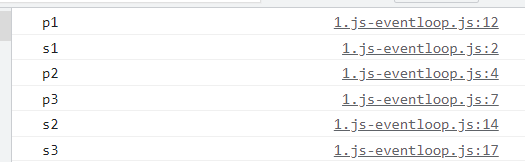

- script 是一个宏任务，执行完毕，清理其微任务，打印p1
- 第一个定时器是一个宏任务，同步执行打印s1,清理其微任务打印p2、p3
- 第二个定时器是一个宏任务，同步执行打印s2
- 第三个定时器是一个宏任务，同步执行打印s3

### 13.2 nodejs下的事件循环

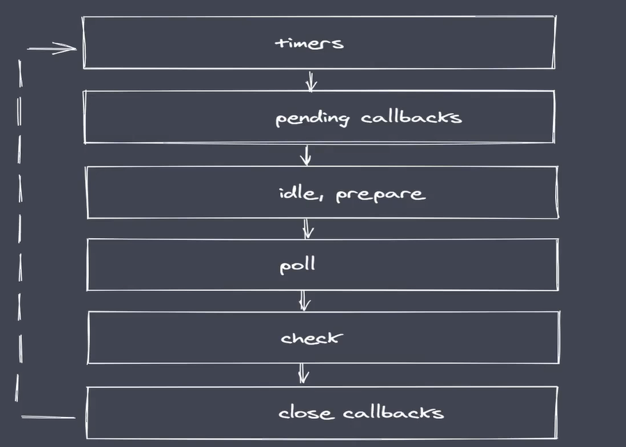

nodejs 中不止是宏任务队列与微任务队列，其分为上图六个任务队列，每一个队列里存放的都是回调函数。

#### 13.2.1 队列说明

- timers：执行setTimeout 与 setInterval 回调
- pending callbacks：执行系统操作的回调，例如tcp、udp
- idle，prepare：只在系统内部进行使用
- poll：执行与I/O相关的回调，例如读取文件
- check: 执行setImmediate中的回调
- close callbacks：执行 close 事件的回调

**nodejs 完整事件事件循环**

- 执行同步代码，将不同的任务添加至相应的队列
- 所有同步代码执行后会取执行满足条件微任务
- 所有微任务代码执行后会执行timer队列中满足的宏任务
- timer 中的所有宏任务执行完成后才会依次切换队列(**旧版本**)
- 注意：在完成队列切换之前会先清空微任务代码

```
Promise.resolve().then(() => {
    console.log('p1')
})

console.log('start')

process.nextTick(() => {
    console.log('tick')
})

setImmediate(() => {
    console.log('setImmediate')
})

setTimeout(() => {
    console.log('s1')
})

/* 
console.log('end')
start
end 
tick
p1  
s1  
setImmediate 
*/
```

- 执行同步任务，打印 start、end
- 同步任务执行完毕，执行满足条件的微任务队列：promise.then与process.nextTick
  - process.nextTick优先级高于promise.then
  - 打印 tick、p1
- 微任务执行完毕，执行timer的队列的宏任务setTimeout，打印s1
- 然后就是 setImmediate

#### 13.2.2 Nodejs 事件循环梳理

```
setTimeout(() => {
    console.log('s1')
    Promise.resolve().then(() => {
        console.log('p1')
    })
    process.nextTick(() => {
        console.log('t1')
    })
})

Promise.resolve().then(() => {
    console.log('p2')
})

console.log('start')

setTimeout(() => {
    console.log('s2')
    Promise.resolve().then(() => {
        console.log('p3')
    })
    process.nextTick(() => {
        console.log('t2')
    })
})

console.log('end')
/**
    start
    end
    p2 
    s1 
    t1 
    p1 
    s2 
    t2 
    p3 
*/
```

- 执行同步代码，打印start、end
- 同步代码执行完毕，执行微任务队列,打印 p2
- 微任务队列执行完毕，执行宏任务队列
  - 第一个setTimeout打印 s1
  - 同步代码执行完毕，执行微任务队列，process.nextTick优先级高于promise.then，打印 t1、p1
  - 第二个setTimeout打印 s2
  - 同步代码执行完毕，执行微任务队列，process.nextTick优先级高于promise.then，打印 t2、p2
- 旧版本的输出：start、end、p2、s1、s2、t1、t2、p1、p2
  - 原因：旧版本规则：timer 中的所有宏任务执行完成后才会依次切换队列

#### 13.2.3 nodejs 与 浏览器事件循环区别

- 微任务队列不同
  - 浏览器只有二个任务队列
  - nodejs 中有6个事件队列
- 微任务执行时机
  - 二者都会在同步代码执行完毕后执行微任务
  - 浏览器平台下每当一个宏任务执行完毕后就会清空微任务
  - nodejs平台在事件队列切换时才去清空微任务（旧版本）
- 微任务优先级
  - 浏览器事件循环中，微任务存放于事件队列中，先进先出
  - nodejs中process.nextTick 先于 promise.then

#### 13.2.4 nodejs 事件循环中的常见问题

```
/* setTimeout(() => {
    console.log('timeout')
})

setImmediate(() => {
    console.log('immediate')
}) */

/**
 * 有时候 immediate 先于 timeout，有时候又不是
 * setTimeout默认延时为0，延时不稳定，如果延时了 immediate 先进入宏任务队列，则先打印 immediate
 * 否则，先打印timeout
 */


const fs = require('fs')
fs.readFile('./index.html', () => {
    setTimeout(() => {
        console.log('timeout')
    })
    setImmediate(() => {
        console.log('immdieate')
    })
})

/**
 * readFile 属于io，其队列在poll，其回调执行完后进行队列切换到 check
 * immdieate 在 check队列，打印 immdieate
 * timeout 在 timer 队列，打印 timeout
 * 以上顺序是稳定的
 */
```

## 14. 核心模块-stream

### 14.1 stream 基础

- 文件操作系统和网络模块实现了流接口
- 流就是处理流式数据的抽象接口

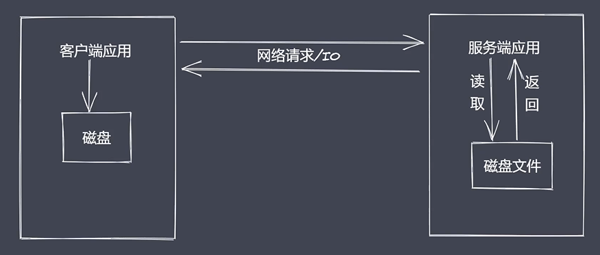

#### 14.1.1 常见问题

- 同步读取资源文件，用户需要等待数据读取完成
- 资源文件最终一次性加载至内存，开销较大


#### 14.1.2 流处理的优势

- 时间效率：流的分段处理可以同时操作多个数据 chunk
- 空间效率：同一时间流无须占据大内存空间
- 使用方便：流配合管理，扩展程序变得简单

#### 14.1.3 Node.js 中流的分类

- Readable: 可读流，能够实现数据的读取
- Writeable: 可写流，能够实现数据的写操作
- Duplex: 双工流，既可读又可写
- Transform: 转换流，可读可写，还能实现数据转换

#### 14.1.4 Node.js 流特点

- Stream 模块实现了四个具体的抽象
- 所有流都继承自 EventEmitter

```
const fs = require('fs')

let rs = fs.createReadStream('./test.txt')
let ws = fs.createWriteStream('./test1.txt')

rs.pipe(ws)
```

### 14.2 stream 之可读流

- 生产供程序消费数据的流
- 在nodejs中最常见的方式是读取其它文件或读取网络请求内容

#### 14.2.1 自定义可读流

- 继承 stream 里的 Readable
- 重写 _read 方法调用push 产出数据

**自定义可读流问题**

- 底层数据读取完成后如何处理？
  - 给push传递一个null
- 消费者如何获取可读流中的数据？
  - readable 事件
  - data 事件

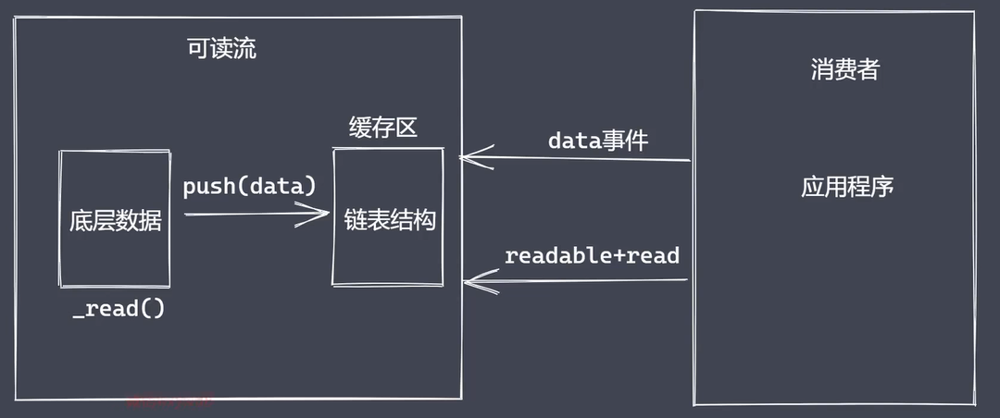

**消费数据**

- readable 事件：当流中存在可读取数据时触发

- data 事件：当流中数据块传给消费者后触发

```
const { Readable } = require('stream')

// 模拟底层数据
let source = ['liuguowei', '18', 'student']

// 自定义继承 Readable
class MyReadable extends Readable {
    constructor(source) {
        super()
        this.source = source
    }
    _read() {
        let data = this.source.shift() || null
        this.push(data)
    }
}

// 实例化
let myReadable = new MyReadable(source)

/* myReadable.on('readable', () => {
    let data = null
    while((data = myReadable.read()) !== null) {
        console.log(data.toString())
        // liuguowei18
        // student
    }
}) */


myReadable.on('data', (chunk) => {
    console.log(chunk.toString())
    // liuguowei
    // 18     
    // student
})
```

### 14.3 stream 之可写流

#### 14.3.1 自定义可写流

- 继承 stream 模块的 Writeable
- 重写 _write 方法，调用 write 执行写入

**可写流事件**

- pipe事件：可读流调用 pipe() 方法时触发
- unpipe事件：可读流调用 unpipe() 方法时触发
- drink、end、finish、error

```
const { Writable } = require('stream')

class MyWritable extends Writable {
    constructor() {
        super()
    }
    _write(chunk, en, done) {
        process.stdout.write(chunk.toString() + '<-----')
        process.nextTick(done)
    }
}

let myWritable = new MyWritable()

myWritable.write('刘国威', 'utf-8', () => {
    console.log('end')
})
```

### 14.4 stream 之双工和转换流

- Node.js 中 stream 是流操作的抽象接口集合
- 可读、可写、双工、转换是单一抽象具体实现
- Duplex 是双工流，既能生产又能消费

#### 14.4.1 自定义双工流

- 继承 Duplex 类
- 重写_read 方法，调用 push 生产数据
- Treansorm 也是双工流，可读可写，还能实现类型转换

```
let { Duplex } = require('stream')

class MyDuplex extends Duplex {
    constructor(source) {
        super()
        this.source = source
    }
    _read() {
        let data = this.source.shift() || null
        this.push(data)
    }
    _write(chunk, en, next) {
        process.stdout.write(chunk)
        process.nextTick(next)
    }
}

let source = ['a', 'b', 'c']
let myDuplex = new MyDuplex(source)

/* myDuplex.on('data', chunk => {
    console.log(chunk.toString())
    // a
    // b
    // c
}) */

myDuplex.write('刘国威', () => {
    console.log('end')
})
```

#### 14.4.2 自定义转换流

- 继承 Transform 类
- 重写 _transform 方法，调用 push 和 callback
- 重写 _flush 方法，处理剩余数据

```
const { Transform } = require('stream')

class MyTransform extends Transform {
    constructor() {
        super()
    }
    _transform(chunk, en, cb) {
        this.push(chunk.toString().toUpperCase())
        cb(null)
    }
}

let t = new MyTransform()
t.write('a')
t.on('data', chunk => {
    console.log(chunk.toString()) // A
})
```

### 14.5 文件可读流

- data 事件
- readable 事件

```
// text3.txt
0123456789
```

```
const fs = require('fs')

let rs = fs.createReadStream('text3.txt', {
    flags: 'r',
    encoding: null, // null 不指定默认buffer
    fd: null, // 文件标志符
    mode: 438, // 权限位
    autoClose: true, // 自动关闭
    start: 0, // 读取起始位置
    // end: 3, // 读取结束位置
    highWaterMark: 2 // (水位线)底层存储的数据
})

/* rs.on('data', chunk => {
    console.log(chunk.toString())
    // 由于水位线是2，则每次输出两个
    // 01
    // 23
    // 45
    // 67
    // 89
}) */

/* rs.on('data', chunk => {
    console.log(chunk.toString())
    // 调用 passe()手动暂停
    // 调用 resume()手动继续
    rs.pause()
    setTimeout(() => {
        rs.resume()
    }, 1000)
}) */

/* rs.on('readable', () => {
    let data
    while((data = rs.read()) !== null) {
        console.log(data.toString())
        // 01
        // 23
        // 45
        // 67
        // 89
    }
}) */

rs.on('readable', () => {
    let data
    while((data = rs.read(1)) !== null) {
        console.log(data.toString(), '----', rs._readableState.length)
    }
    // read()加参数指定每次读取的长度，每次读取为1，水位线为2
    // 0 ---- 1
    // 1 ---- 0
    // 2 ---- 1
    // 3 ---- 0
    // 4 ---- 1
    // 5 ---- 0
    // 6 ---- 1
    // 7 ---- 0
    // 8 ---- 1
    // 9 ---- 0
})
```

### 14.6 文件可读流事件与应用

**顺序：**

- open
- data
- end
- close
- error（错误）

```
const fs = require('fs')

let rs = fs.createReadStream('text3.txt', {
    flags: 'r',
    encoding: null, // null 不指定默认buffer
    fd: null, // 文件标志符
    mode: 438, // 权限位
    autoClose: true, // 自动关闭
    start: 0, // 读取起始位置
    // end: 3, // 读取结束位置
    highWaterMark: 2 // (水位线)底层存储的数据(字节)
})

rs.on('open', fd => {
    console.log(fd, '文件打开了')
})

let bufferArr = []
rs.on('data', (chunk) => {
    bufferArr.push(chunk)
})

rs.on('end', () => {
    console.log(Buffer.concat(bufferArr).toString())
    console.log('当数据被清空之后')
})

rs.on('close', () => {
    console.log('文件关闭了')
})

rs.on('error', () => {
    console.log('出错了')
})

// 3 文件打开了
// 0123456789      
// 当数据被清空之后
// 文件关闭了
```

### 14.7 文件可写流

```
const fs = require('fs')

const ws = fs.createWriteStream('text4.txt', {
    flags: 'w',
    mode: 438,
    fd: null,
    encoding: 'utf-8',
    start: 0,
    highWaterMark: 3
})
/**
 * fs 的可写流只能用字符串或者buffer
 */
ws.write('nihaoya', () => {
    console.log('ok1')
})

let buf = Buffer.from('abc')
ws.write(buf, () => {
    console.log('ok2')
})

ws.on('open', (fd) => {
    console.log('open')
})

// close 在数据写入操作全部完成之后再执行
ws.on('close', () => {
    console.log('文件关闭了')
})

// end 执行之后意味着数据写入操作完成，这时才触发close
ws.end('123456')

ws.on('error', err => {
    console.log(err)
})

/* open
ok1       
ok2       
文件关闭了 */

// text4.txt  nihaoyaabc123456
```

- write回调写入的顺序与书写顺序一致
- 必须手动触发end事件才会触发close，可读流会自动关闭

### 14.8 write 执行流程

```
const fs = require('fs')

let ws = fs.createWriteStream('text5.txt', {
    highWaterMark: 3 // 水位线（3个字节）
})

let flag = ws.write('1')
console.log(flag) // true

flag = ws.write('2')
console.log(flag) // true

// 超过等于了水位线，则返回fasle
// 如果 flag 为 false 并不是说明当前数据不能被执行写入
flag = ws.write('3')
console.log(flag) // false

// 如果达到水位线则触发drain事件
ws.on('drain', () => {
    console.log('drain 事件被触发了')
})
```

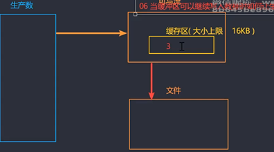

- 第一次调用write方法是将数据直接写入到文件中
- 第二次开始 write 方法是将数据写入至缓存中
- 生产速度和消费速度是不一样的，一般情况下生产速度要比消费速度快很多
- 当falg为false，并不意味着当前次的数据不能被写入了，但是我们应该告知数据的生产者，当前的消费速度已经跟不上生产速度了，所以这个时候，一般我们会将可读流的模块修改为暂停模式
- 当数据生产者暂停之后，消费者会慢慢的消费它内部缓存中的数据，直到可以再次被执行写入操作
- 当缓冲区可以继续写入数据我们如何让生产者直到？drain 事件

### 14.9 控制写入速度

**drain 事件主要作用是控制速度，指定 highWaterMark 配合 write 的返回值进行使用**

```
/**
 * 需求： "我是刘国威" 写入指定文件
 */

// 一次性写入
/* let fs = require('fs')
let ws = fs.createWriteStream('text6.txt')
ws.write('我是刘国威') // 瞬间写入我是刘国威 */

// 分批写入
let fs = require('fs')
let ws = fs.createWriteStream('text6.txt', {
    highWaterMark: 3 // 水位线（3个字节）
})

let soruce = "我是刘国威".split('')
let num = 0
let flag

function executeWrite() {
    flag = true
    while(num !== 4 && flag) {
        flag = ws.write(soruce[num])
        num++
    }
}
executeWrite()

ws.on('drain', () => {
    // 当 write 返回了false， drain 触发
    console.log('drain 执行了')
    // 由于每个中文3个字节，这里会返回4个false，执行3次写入
    executeWrite()
    // drain 执行了
    // drain 执行了
    // drain 执行了
    // drain 执行了
}) 
```

### 14.10 背压机制


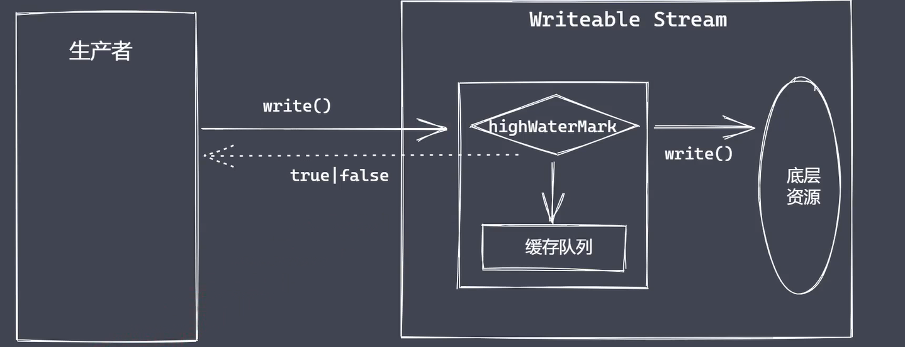

```
let fs = require('fs')

let rs = fs.createReadStream('text7.txt', {
    highWaterMark: 6
})

let ws = fs.createWriteStream('text8.txt', {
    highWaterMark: 1
})

let flag = true
rs.on('data', (chunk) => {
    flag = ws.write(chunk, () => {
        console.log('写完了')
    })
    if(!flag) {
        // 暂停模式
        rs.pause()
    }
})
ws.on('drain', () => {
    // 流动模式
    rs.resume()
})

// rs.pipe(ws)
```

- 模拟了pipe的作用

### 14.11 模拟文件的可读流

```
const fs = require('fs')
const EventEmitter = require('events')

class MyFileReadStream extends EventEmitter{
  constructor(path, options = {}) {
    super()
    this.path = path
    this.flags = options.flags || "r"
    this.mode = options.mode || 438
    this.autoClose = options.autoClose || true 
    this.start = options.start || 0
    this.end = options.end 
    this.highWaterMark = options.highWaterMark || 64 * 1024 
    this.readOffset = 0

    this.open()

    this.on('newListener', (type) => {
      if (type === 'data') {
        this.read()
      }
    })
  }
  open() {
    // 原生 open 方法来打开指定位置上的文件
    fs.open(this.path, this.flags, this.mode, (err, fd) => {
      if (err) {
        this.emit('error', err)
      }
      this.fd = fd
      this.emit('open', fd)
    })
  }
  read() {
    if (typeof this.fd !== 'number') {
      return this.once('open', this.read)
    }

    let buf = Buffer.alloc(this.highWaterMark)

    let howMuchToRead
    /* if (this.end) {
      howMuchToRead = Math.min(this.end - this.readOffset + 1, this.highWaterMark)
    } else {
      howMuchToRead = this.highWaterMark
    } */

    howMuchToRead = this.end ? Math.min(this.end - this.readOffset + 1, this.highWaterMark) : this.highWaterMark

    fs.read(this.fd, buf, 0, howMuchToRead, this.readOffset, (err, readBytes) => {
      if (readBytes) {
        this.readOffset += readBytes
        this.emit('data', buf.slice(0, readBytes))
        this.read()
      } else {
        this.emit('end')
        this.close()
      }
    })
  }
  close() {
    fs.close(this.fd, () => {
      this.emit('close')
    })
  }
}

let rs = new MyFileReadStream('test.txt', {
  end: 7,
  highWaterMark: 3
})

rs.on('data', (chunk) => {
  console.log(chunk)
})
```

### 14.12单链表实现

```
class Node{
  constructor(element, next) {
    this.element = element
    this.next = next
  }
}

class LinkedList{
  constructor(head, size) {
    this.head = null 
    this.size = 0
  }
  _getNode(index) {
    if (index < 0 || index >= this.size) {
      throw new Error('越界了')
    }
    let currentNode = this.head
    for (let i = 0; i < index; i++) {
      currentNode = currentNode.next
    }
    return currentNode
  }
  add(index, element) {
    if (arguments.length == 1) {
      element = index
      index = this.size
    }
    if (index < 0 || index > this.size) {
      throw new Error('cross the border')
    }
    if (index == 0) {
      let head = this.head // 保存原有 head 的指向
      this.head = new Node(element, head)
    } else {
      let prevNode = this._getNode(index - 1)
      prevNode.next = new Node(element, prevNode.next)
    }
    this.size++
  }

  remove(index) {
    let rmNode = null 
    if (index == 0) {
      rmNode = this.head 
      if (!rmNode) {
        return undefined
      }
      this.head = rmNode.next
    } else {
      let prevNode = this._getNode(index -1)
      rmNode = prevNode.next
      prevNode.next = rmNode.next
    }
    this.size--
    return rmNode
  }
  set(index, element) {
    let node = this._getNode(index)
    node.element = element
  }
  get(index) {
    return this._getNode(index)
  }
  clear() {
    this.head = null 
    this.size = 0 
  }
}

class Queue{
  constructor() {
    this.linkedList = new LinkedList()
  }
  enQueue(data) {
    this.linkedList.add(data)
  }
  deQueue() {
    return this.linkedList.remove(0)
  }
}

const q = new Queue()

q.enQueue('node1')
q.enQueue('node2')

let a = q.deQueue()
a = q.deQueue()
a = q.deQueue()

console.log(a)
```

### 14.13 模拟文件可写流

```
const fs = require('fs')
const EventsEmitter = require('events')
const Queue = require('./linkedlist')

class MyWriteStream extends EventsEmitter{
  constructor(path, options={}) {
    super()
    this.path = path
    this.flags = options.flags || 'w'
    this.mode = options.mode || 438
    this.autoClose = options.autoClose || true 
    this.start = options.start || 0
    this.encoding = options.encoding || 'utf8'
    this.highWaterMark = options.highWaterMark || 16*1024

    this.open()

    this.writeoffset = this.start 
    this.writing = false 
    this.writeLen = 0
    this.needDrain = false 
    this.cache = new Queue()
  }
  open() {
    // 原生 fs.open 
    fs.open(this.path, this.flags, (err, fd) => {
      if (err) {
        this.emit('error', err)
      }
      // 正常打开文件
      this.fd = fd 
      this.emit('open', fd)
    })
  }
  write(chunk, encoding, cb) {
    chunk = Buffer.isBuffer(chunk) ? chunk : Buffer.from(chunk)

    this.writeLen += chunk.length
    let flag = this.writeLen < this.highWaterMark
    this.needDrain = !flag

    if (this.writing) {
      // 当前正在执行写入，所以内容应该排队
      this.cache.enQueue({chunk, encoding, cb})
    } else {
      this.writing = true
      // 当前不是正在写入那么就执行写入
      this._write(chunk, encoding, () => {
        cb()
        // 清空排队的内容
        this._clearBuffer()
      })
    }
    return flag
  }
  _write(chunk, encoding, cb) {
    if (typeof this.fd !== 'number') {
      return this.once('open', ()=>{return this._write(chunk, encoding, cb)})
    }
    fs.write(this.fd, chunk, this.start, chunk.length, this.writeoffset, (err, written) => {
      this.writeoffset += written
      this.writeLen -= written

      cb && cb()
    })
  }
  _clearBuffer() {
    let data = this.cache.deQueue()
    if (data) {
      this._write(data.element.chunk, data.element.encoding, ()=>{
        data.element.cb && data.element.cb()
        this._clearBuffer()
      })
    } else {
      if (this.needDrain) {
        this.needDrain = false 
        this.emit('drain')
      }
    }
  }
}

const ws = new MyWriteStream('./f9.txt', {})

ws.on('open', (fd) => {
  console.log('open---->', fd)
})

let flag = ws.write('1', 'utf8', () => {
  console.log('ok1')
})

flag = ws.write('10', 'utf8', () => {
  console.log('ok1')
})

flag = ws.write('拉勾教育', 'utf8', () => {
  console.log('ok3')
})

ws.on('drain', () => {
  console.log('drain')
})
```

### 14.14 pipe方法使用

```
const fs = require('fs')

const rs = fs.createReadStream('./text9.txt', {
    highWaterMark: 4
})

const ws = fs.createWriteStream('./text10.txt', {
    highWaterMark: 1
})

rs.pipe(ws)
```
