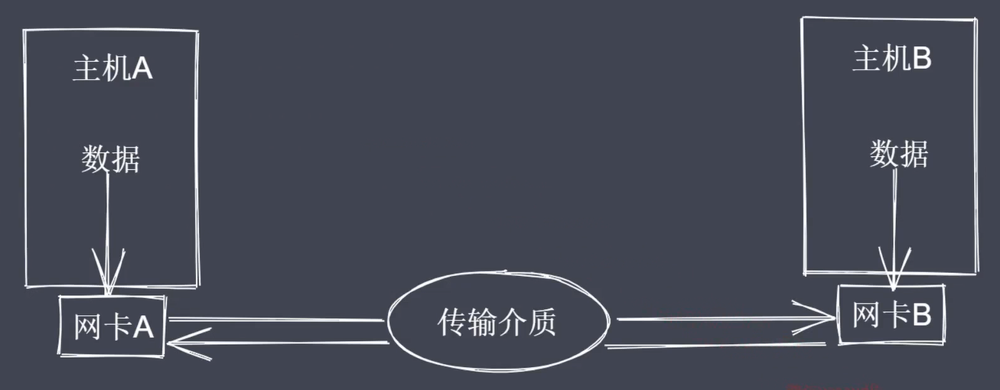
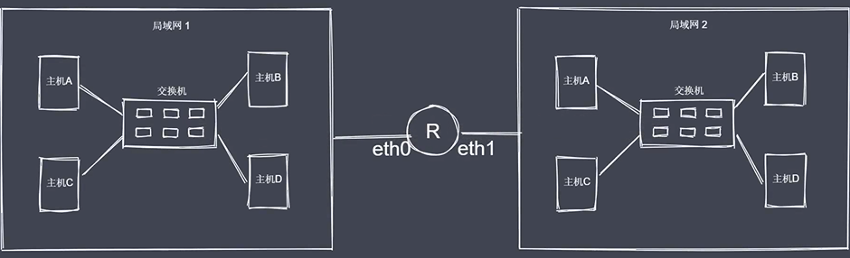
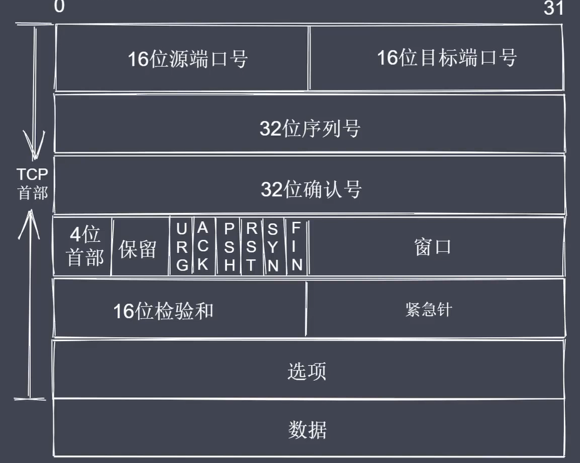
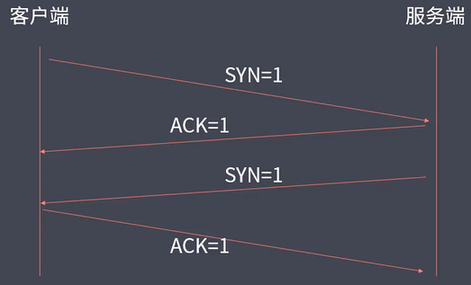
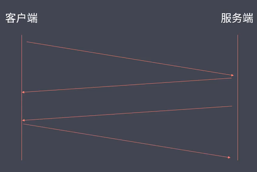
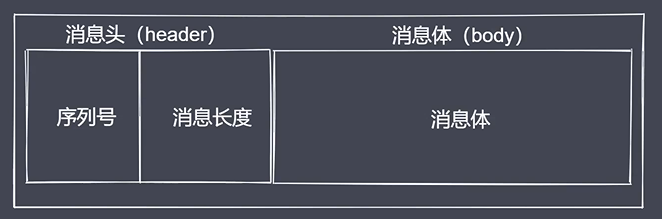
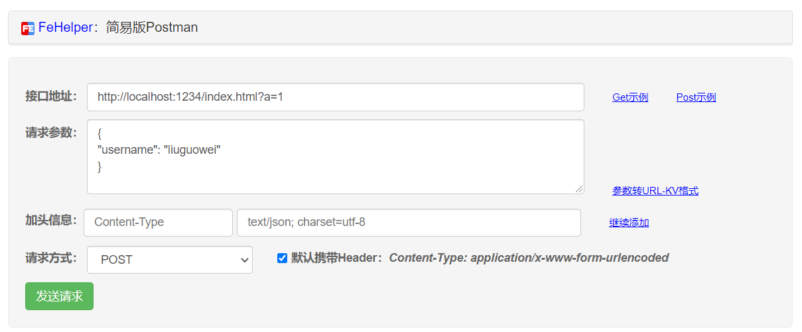
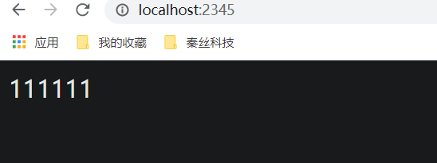

## 1. 通信基本原理

**通信必要条件**

- 主机之间需要有传输介质
- 主机上必须有网卡设备
- 主机之间需要有协商网络速率



## 2.网络通讯方式

- 交换机通讯
- 路由器通讯



## 3.网络层次模型

**OSI 七层模型**

1. 应用层：用户与网络的接口
2. 表示层：数据加密、转换、压缩
3. 会话层：控制网络连接建立与终止
4. 传输层：控制数据传输可靠性
5. 网络层：确定目标网络
6. 数据链路层：确定目标主机
7. 物理层：各种物理设备与标准


**TCP/IP 五层模型**

1. 应用层
2. 传输层
3. 网络层
4. 数据链路层
5. 物理层

## 4.数据封装与封装

1. 应用层—— data
2. 传输层——目标端口 | 源端口 | data
3. 网络层——目标IP | 源IP | 目标端口 | 源端口 | data
4. 数据链路层——目标Mac | 源Mac | 目标IP | 源IP | 目标端口 | 源端口 | data
5. 物理层——10001010（二进制数据）

## 5.TCP三次握手与四次挥手

**TCP 协议**

- TCP 属于传输层协议
- TCP 是面向连接的协议
- TCP 用于处理实时通信



**常见控制字段**

- SYN=1 表示请求建立连接
- FIN=1 表示请求断开连接
- ACK=1 表示数据信息确认

**三次握手**



**四次挥手**



- 客户端发送断开请求给服务端
- 服务端回复消息确认
- 服务端回复断开连接请求给客户端
- 客户端回复消息确认

**TCP 协议总结**

- TCP 处于传输层，基于端口，面向连接
- 主机之间要想通信需要先建立双向数据通道
- TCP 的握手和挥手本质上都是四次

## 6.创建TCP通信

**通信过程**

- 创建服务器：接收和回写客户端数据
- 创建客户端：发送和接收服务端数据
- 数据传输：内置服务事件和方法读写数据

**通信事件&方法**

- listening 事件：调用server.listen 方法之后触发
- connection 事件：新的连接建立时触发
- close 事件：当server关闭时触发
- error 事件：当错误出现的时候触发
- data 事件：当接收到数据时触发该事件
- write方法：在socket 上发送数据，默认时UTF8编码
- end 操作：当socket的一端发送FIN包时触发，结束可读端

```
// 1.server.js
const net = require('net')

// 创建服务端实例
const server = net.createServer()

const PORT = 1234
const HOST = 'localhost'

server.listen(PORT, HOST)

server.on('listening', () => {
    console.log(`服务端已经开启在 ${HOST} : ${PORT}`)
})

// 接收消息 回写消息
server.on('connection', (socket) => {
    socket.on('data', chunk => {
        const msg = chunk.toString()
        console.log(msg)
        
        // 回数据
        socket.write(Buffer.from('您好' + msg))
    })
})

server.on('close', () => {
    console.log('服务端关闭了')
})
```

```
// 2.client.js
const net = require('net')

const client = net.createConnection({
    port: 1234,
    host: 'localhost'
})

client.on('connect', () => {
    client.write('刘国威')
})

client.on('data', chunk => {
    console.log(chunk.toString())
})

client.on('error', err => {
    console.log(err)
})

client.on('close', () => {
    console.log('客户端断开连接')
})
```

## 7. TCP 粘包及解决

```
// 3.client-粘包及解决.js
const net = require('net')

const client = net.createConnection({
    port: 1234,
    host: 'localhost'
})

client.on('connect', () => {
    client.write('刘国威1')
    client.write('刘国威2')
    client.write('刘国威3')
    client.write('刘国威4')
})

client.on('data', chunk => {
    console.log(chunk.toString())
})

client.on('error', err => {
    console.log(err)
})

client.on('close', () => {
    console.log('客户端断开连接')
})
```

打印：您好刘国威1刘国威2刘国威3刘国威4

```
const net = require('net')

const client = net.createConnection({
    port: 1234,
    host: 'localhost'
})

let dataArr = [
    '刘国威2',
    '刘国威3',
    '刘国威4',
    '刘国威5'
]

client.on('connect', () => {
    client.write('刘国威1')
    for(let i=0; i<dataArr.length; i++) {
        (function(val, index) {
            setTimeout(() => {
                client.write(val)
            }, 1000 * (index + 1))
        })(dataArr[i], i)
    }
})

client.on('data', chunk => {
    console.log(chunk.toString())
})

client.on('error', err => {
    console.log(err)
})

client.on('close', () => {
    console.log('客户端断开连接')
})
```

- 您好刘国威1
- 您好刘国威2
- 您好刘国威3
- 您好刘国威4
- 您好刘国威5

## 8.封包拆包实现



**数据传输过程**

- 进行数据编码，获取二进制数据包
- 按规则拆解数据，获取指定长度的数据

**Buffer 数据读写**

- writeInt16BE: 将value 从指定位置写入
- readInt16BE: 从指定位置开始读取数据

```
class MyTransformCode{
  constructor() {
    this.packageHeaderLen = 4
    this.serialNum = 0
    this.serialLen = 2
  }

  // 编码
  encode(data, serialNum) {
    const body = Buffer.from(data)

    // 01 先按照指定的长度来申请一片内存空间做为 header 来使用
    const headerBuf = Buffer.alloc(this.packageHeaderLen)

    // 02 
    headerBuf.writeInt16BE(serialNum || this.serialNum)

    headerBuf.writeInt16BE(body.length, this.serialLen) // 偏移

    if (serialNum == undefined) {
      this.serialNum++
    }

    return Buffer.concat([headerBuf, body])
  }

  // 解码
  decode(buffer) {
    const headerBuf = buffer.slice(0, this.packageHeaderLen)
    const bodyBuf = buffer.slice(this.packageHeaderLen)

    return {
      serialNum: headerBuf.readInt16BE(),
      bodyLength: headerBuf.readInt16BE(this.serialLen),
      body: bodyBuf.toString()
    }
  }

  // 获取包长度的方法
  getPackageLen(buffer) {
    if (buffer.length < this.packageHeaderLen) {
      return 0
    } else {
      return this.packageHeaderLen + buffer.readInt16BE(this.serialLen)
    }
  }
}

module.exports = MyTransformCode
```

```
// test.js
const MyTransform = require('./myTransform.js')

let ts = new MyTransform()

let str1 = '拉勾教育'

console.log(Buffer.from(str1)) // <Buffer e6 8b 89 e5 8b be e6 95 99 e8 82 b2>
console.log(ts.encode(str1, 1)) // <Buffer 00 01 00 0c e6 8b 89 e5 8b be e6 95 99 e8 82 b2>

let encodeBuf = ts.encode(str1, 1)

let a = ts.decode(encodeBuf)
console.log(a) // { serialNum: 1, bodyLength: 12, body: '拉勾教育' }

let len = ts.getPackageLen(encodeBuf)
console.log(len) // 16
```

## 9.封包解决粘包

```
// 4.client-封包解决粘包.js
const net = require('net')
const MyTransform = require('./myTransform.js')

let overageBuffer = null 
let ts = new MyTransform()

const client = net.createConnection({
  host: 'localhost', 
  port: 1234
})

client.write(ts.encode('拉勾教育1'))
client.write(ts.encode('拉勾教育2'))
client.write(ts.encode('拉勾教育3'))
client.write(ts.encode('拉勾教育4'))
client.write(ts.encode('拉勾教育5'))

client.on('data', (chunk) => {
  if (overageBuffer) {
    chunk = Buffer.concat([overageBuffer, chunk])
  }
  let packageLen = 0
  while(packageLen = ts.getPackageLen(chunk)) {
    const packageCon = chunk.slice(0, packageLen)
    chunk = chunk.slice(packageLen)

    const ret = ts.decode(packageCon)
    console.log(ret)
  }
  overageBuffer = chunk
})
```

```
// 5.server.js-风暴解决粘包.js
const net = require('net')
const MyTransform = require('./myTransform.js')

const server = net.createServer()

let overageBuffer = null
let ts = new MyTransform()

server.listen('1234', 'localhost')

server.on('listening', () => {
  console.log('服务端运行在 localhost:1234')
})

server.on('connection', (socket) => {
  socket.on('data', (chunk) => {
    if (overageBuffer) {
      chunk = Buffer.concat([overageBuffer, chunk])
    }
    let packageLen = 0
    while(packageLen = ts.getPackageLen(chunk)) {
      const packageCon = chunk.slice(0, packageLen)
      chunk = chunk.slice(packageLen)

      const ret = ts.decode(packageCon)
      console.log(ret)

      socket.write(ts.encode(ret.body, ret.serialNum))
    }
    overageBuffer = chunk
  })
})
```

## 10.http协议

```
const net = require('net')

// 创建服务端
let server = net.createServer()
server.listen(1234, () => {
  console.log('服务端启动了....')
})

server.on('connection', (socket) => {
  socket.on('data', (data) => {
    console.log(data.toString())
    // 在浏览器访问后，获取data信息
  })
  socket.end('test http request')
})
```

```
const http = require('http')

// 创建服务端
let server = http.createServer((req, res) => {
  // 针对于请求和响应完成各自的操作
  console.log('1111')
})
server.listen(1234, () => {
  console.log('server is running......')
})
```

## 11.获取http请求信息

```
const http = require('http')
const url = require('url')

const server = http.createServer((req, res) => {
  // console.log('请求进来了')

  // 请求路径
  let {pathname, query} = url.parse(req.url, true)
  console.log(pathname, '----', query)

  // 请求方式
  console.log(req.method)

  // 版本号
  // console.log(req.httpVersion)

  // 请求头
  // console.log(req.headers)

  // 请求体数据获取
  let arr = []
  req.on('data', (data) => {
    arr.push(data)
  })
  req.on('end', () => {
    console.log(Buffer.concat(arr).toString())
  })

})
server.listen(1234, () => {
  console.log('server is start......')
})
```

```
/index.html ---- [Object: null prototype] { a: '1' }
POST
username=liuguowei
```



## 12. 设置 http 响应

```
const http = require('http')

const server = http.createServer((req, res) => {
  console.log('有请求进来了')

  // res
  // res.write('ok')
  // res.end()
  // res.end('test ok')
  res.statusCode = 302
  res.setHeader('Content-type', 'text/html;charset=utf-8')
  res.end('拉勾教育')
})

server.listen(1234, () => {
  console.log('server is start.....')
})
```

## 13.代理客户端

```
// server
const http = require('http')
const url = require('url')
const querystring = require('querystring')

const server = http.createServer((req, res) => {
  // console.log('请求进行来了')
  let {pathname, query} = url.parse(req.url)
  console.log(pathname, '----', query)

  // post
  let arr = []
  req.on('data', (data) => {
    arr.push(data)
  })
  req.on('end', () => {
    let obj = Buffer.concat(arr).toString()
    // console.log(Buffer.concat(arr).toString())
    // console.log(req.headers['content-type'])
    if (req.headers['content-type'] == 'application/json') {
      let a = JSON.parse(obj)
      a.add = '互联网人的大学'
      res.end(JSON.stringify(a))
    }else if(req.headers['content-type'] == 'application/x-www-form-urlencoded') {
      let ret = querystring.parse(obj)
      res.end(JSON.stringify(ret))
    }
  })
})
server.listen(1234, () => {
  console.log('server is running')
})
```

```
// client
const http = require('http')

// http.get({
//   host: 'localhost', 
//   port: 1234, 
//   path: '/?a=1'
// }, (res) => {
  
// })

let options = {
  host: 'localhost', 
  port: 1234, 
  path: '/?a=1', 
  method: 'POST', 
  headers:{
    // 'Content-type': 'application/json'
    'Content-type': 'application/x-www-form-urlencoded'
  }
}

let req = http.request(options, (res) => {
  let arr = []
  res.on('data', (data) => {
    arr.push(data)
  })
  res.on('end', () => {
    console.log(Buffer.concat(arr).toString())
  })
})
// req.end('拉勾教育')
// req.end('{"name":"lg"}')
req.end('a=1&b=2')
```

## 14. 代理客户端解决跨域

```
// server.js
const http = require('http')

const server = http.createServer((req, res) => {
  // console.log('请求进来了')
  let arr = []
  req.on('data', (data) => {
    arr.push(data)
  })
  req.on('end', () => {
    console.log(Buffer.concat(arr).toString()) // 拉钩教育
    res.end('111111')
  })
})
server.listen(1234, () => {
  console.log('外部服务端启动了')
})
```

```
// client.js
const http = require('http')

let options = {
  host: 'localhost', 
  port: 1234, 
  path: '/',
  method: 'POST'
}

let server = http.createServer((request, response) => {
  let req = http.request(options, (res) => {
    let arr = []
    res.on('data', (data) => {
      arr.push(data)
    })
    res.on('end', () => {
      // console.log(Buffer.concat(arr).toString())
      let ret = Buffer.concat(arr).toString()
      console.log(ret) // 111111
      response.setHeader('Content-type', 'text/html;charset=utf-8')
      response.end(ret)
    })
  })
  
  req.end('拉勾教育')
})

server.listen(2345, () => {
  console.log('本地的服务端启动了')
})
```



## 15. http 静态服务

```
const http = require('http')
const url = require('url')
const path = require('path')
const fs = require('fs')
const mime = require('mime')

const server = http.createServer((req, res) => {
  // console.log('请求进来了')
  // 1 路径处理
  let {pathname, query} = url.parse(req.url)
  pathname = decodeURIComponent(pathname)
  let absPath = path.join(__dirname, pathname)
  // console.log(absPath)
  // 2 目标资源状态处理
  fs.stat(absPath, (err, statObj) => {
    if(err) {
      res.statusCode = 404
      res.end('Not Found')
      return
    }
    if (statObj.isFile()) {
      // 此时说明路径对应的目标是一个文件，可以直接读取然后回写
      fs.readFile(absPath, (err, data) => {
        res.setHeader('Content-type', mime.getType(absPath) + ';charset=utf-8')
        res.end(data)
      })
    } else {
      fs.readFile(path.join(absPath, 'index.html'), (err, data) => {
        res.setHeader('Content-type', mime.getType(absPath) + ';charset=utf-8')
        res.end(data)
      })
    }
  })
})
server.listen(1234, () => {
  console.log('server is start.....')
})
```

- url 路径处理
- 第三方工具包 mine 判断类型，设置响应头

## 16. 命令行 web 服务

### 16.1 lgserve 命令行配置

**npm 映射全局**

```
// package.json
{
  "name": "myServe",
  "version": "1.0.0",
  "description": "",
  "main": "main.js",
  "bin": {
    "myServe": "bin/www.js"
  },
  "scripts": {
    "test": "echo \"Error: no test specified\" && exit 1"
  },
  "keywords": [],
  "author": "",
  "license": "ISC"
}
```

```
npm link

// bin/www.js
console.log('执行了') // 执行了
// 命令行
myServe
```

**使用commander 实现命令行配置**

```
// www.js
#! /usr/bin/env node

const {program} = require('commander')

// console.log('执行了')
// program.option('-p --port', 'set server port')

// 配置信息
let options = {
  '-p --port <dir>': {
    'description': 'init server port',
    'example': 'lgserve -p 3306'
  },
  '-d --directory <dir>': {
    'description': 'init server directory',
    'example': 'lgserve -d c:'
  }
}

function formatConfig (configs, cb) {
  Object.entries(configs).forEach(([key, val]) => {
    cb(key, val)
  })
}

formatConfig(options, (cmd, val) => {
  program.option(cmd, val.description)
})

program.on('--help', () => {
  console.log('Examples: ')
  formatConfig(options, (cmd, val) => {
    console.log(val.example)
  })
})

program.name('lgserve')
let version = require('../package.json').version
program.version(version)

let cmdConfig = program.parse(process.argv)
console.log(cmdConfig)

let Server = require('../main.js')
new Server(cmdConfig).start()
```

```
PS D:\学习资料\学习笔记\node_study\2_通信\lgserve> lgserve -h
Usage: lgserve [options]

Options:
  -p --port <dir>       init server port
  -d --directory <dir>  init server directory
  -V, --version         output the version number
  -h, --help            display help for command
Examples: 
lgserve -p 3306
lgserve -d c:

--------------------------------------------------------------

PS D:\学习资料\学习笔记\node_study\2_通信\lgserve> lgserve -p 1234 -d d:    
<ref *1> Command {
  _events: [Object: null prototype] {
    'option:port': [Function (anonymous)],
    'option:directory': [Function (anonymous)],
    '--help': [Function (anonymous)],
    'option:version': [Function (anonymous)]
  },
  _eventsCount: 4,
  _maxListeners: undefined,
  commands: [],
  options: [
    Option {
      flags: '-p --port <dir>',
      required: true,
      optional: false,
      variadic: false,
      mandatory: false,
      short: '-p',
      long: '--port',
      negate: false,
      description: 'init server port',
      defaultValue: undefined
    },
    Option {
      flags: '-d --directory <dir>',
      required: true,
      optional: false,
      variadic: false,
      mandatory: false,
      short: '-d',
      long: '--directory',
      negate: false,
      description: 'init server directory',
      defaultValue: undefined
    },
    Option {
      flags: '-V, --version',
      required: false,
      optional: false,
      variadic: false,
      mandatory: false,
      short: '-V',
      long: '--version',
      negate: false,
      description: 'output the version number',
      defaultValue: undefined
    }
  ],
  parent: null,
  _allowUnknownOption: false,
  _args: [],
  rawArgs: [
    'C:\\Program Files\\nodejs\\node.exe',
    'C:\\Program Files\\nodejs\\node_modules\\lgserve\\bin\\www.js',
    '-p',
    '1234',
    '-d',
    'd:'
  ],
  _scriptPath: 'C:\\Program Files\\nodejs\\node_modules\\lgserve\\bin\\www.js',  _name: 'lgserve',
  _optionValues: {},
  _storeOptionsAsProperties: true,
  _storeOptionsAsPropertiesCalled: false,
  _passCommandToAction: true,
  _actionResults: [],
  _actionHandler: null,
  _executableHandler: false,
  _executableFile: null,
  _defaultCommandName: null,
  _exitCallback: null,
  _aliases: [],
  _hidden: false,
  _helpFlags: '-h, --help',
  _helpDescription: 'display help for command',
  _helpShortFlag: '-h',
  _helpLongFlag: '--help',
  _hasImplicitHelpCommand: 0,
  _helpCommandName: 'help',
  _helpCommandnameAndArgs: 'help [command]',
  _helpCommandDescription: 'display help for command',
  program: [Circular *1],
  Command: [class Command extends EventEmitter],
  Option: [class Option],
  CommanderError: [class CommanderError extends Error],
  _version: '1.0.0',
  _versionOptionName: 'version',
  port: '1234',
  directory: 'd:',
  args: [],
  [Symbol(kCapture)]: false
}
```

- 几个 Option
- prot: '1234'
- directory: 'd:'

### 16.2 开启服务器

```
// main.js
const http = require('http')
const url = require('url')
const path = require('path')
const fs = require('fs').promises
const {createReadStream} = require('fs')
const mime = require('mime')
const ejs = require('ejs')
const {promisify} = require('util')

function mergeConfig (config) {
  return{
    port: 1234, 
    directory: process.cwd(),
    ...config
  }
}

class Server{
  constructor(config) {
    this.config = mergeConfig(config)
    // console.log(this.config)
  }
  start() {
    let server = http.createServer(this.serveHandle.bind(this))
    server.listen(this.config.port, () => {
      console.log('服务端已经启动了.......')
    })
  }
  async serveHandle(req, res) {
    let {pathname} = url.parse(req.url)
    pathname = decodeURIComponent(pathname)
    let abspath = path.join(this.config.directory, pathname)
    // console.log(abspath)
    try {
      let statObj = await fs.stat(abspath)
      if (statObj.isFile()) {
        this.fileHandle(req, res, abspath)
      } else {
        let dirs = await fs.readdir(abspath)
        dirs = dirs.map((item) => {
          return{
            path: path.join(pathname, item),
            dirs: item
          }
        })
        // console.log(dirs)
        let renderFile = promisify(ejs.renderFile)

        let parentpath = path.dirname(pathname)

        let ret = await renderFile(path.resolve(__dirname, 'template.html'), {
          arr: dirs,
          parent: pathname == '/' ? false : true,
          parentpath: parentpath,
          title: path.basename(abspath)
        })
        res.end(ret)
      }
    } catch (err) {
      this.errorHandle(req, res, err)
    }
  }
  errorHandle(req, res, err) {
    console.log(err)
    res.statusCode = 404
    res.setHeader('Content-type', 'text/html;charset=utf-8')
    res.end('Not Found')
  }
  fileHandle(req, res, abspath) {
    res.statusCode = 200
    res.setHeader('Content-type', mime.getType(abspath) + ';charset=utf-8')
    createReadStream(abspath).pipe(res)
  }
}

module.exports = Server
```

- 区分文件夹与文件，两种不同逻辑处理
- 使用ejsm模板引擎展示

```
// template.html
<!DOCTYPE html>
<html lang="en">
<head>
  <meta charset="UTF-8">
  <meta name="viewport" content="width=device-width, initial-scale=1.0">
  <title>Document</title>
  <style>
    *{
      list-style: none;
    }
  </style>
</head>
<body>
  <h3>IndexOf <%=title%></h3>
  <ul>
    <%if(parent) {%>
      <li><a href="<%=parentpath%>">上一层</a></li>
    <%}%>
    
    <%for(let i = 0; i < arr.length; i++) {%>
      <li><a href="<%=arr[i].path%>"><%=arr[i].dirs%></a></li>
    <%}%>
  </ul>
</body>
</html>
```

