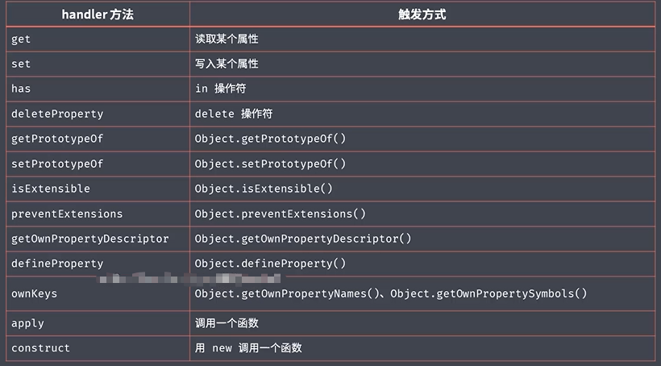

## 1. let

```
if (true) {
    // console.log(foo) // 报错
    let foo = 'well'
}
```

## 2. const

- const = let + 衡量
- 不是不给修改，而是不可以改变内存指向

```
const obj = {
    name: 'well'
}

obj.name = 'liuguowei'
obj = {} // 报错
```

## 3.数组的解构

- 按下标解构
- 剩余成员
- 默认值

```
const arr = [100, 200, 300]

const one = arr[0]
const two = arr[1]
const three = arr[2]

// 根据数组下标解构
const [ONE, TWO, THREE] = arr
console.log(ONE, TWO, THREE) // 100 200 300 

// 解构数组剩余成员，只可以用在末尾
const [foo, ...rest] = arr
console.log(foo, rest) // 100 [ 200, 300 ]

// 没有提取到，取到默认值
const [first, second, third, four=400] = arr
console.log(four) // 400
```

## 4.对象的解构

- 按照属性名 解构
- 变量名冲突，可重新命名
- 添加默认值

```
const obj = {
    name: 'well',
    age: 18
}

// 按属性名匹配
const { name } = obj
console.log(name) // well

// 如果存在变量冲突，则可解构后使用另一个变量名称接收
// 默认值使用=
const age = 20
const {age: AGE = 88} = obj
console.log(AGE) // 18

```

## 5.字符串的扩展方法

- startsWith
- endsWith
- includes

```
const message = 'Error: foo is not defined.'

console.log(message.startsWith('Error')) // true
console.log(message.endsWith('.')) // true
console.log(message.includes('foo')) // true
```

## 6.参数默认值

```
/* function foo (enable) {
    enable = enable === undefined ? true : enable
    console.log(enable)
} */

function foo (enable=true) {
    console.log(enable)
}
foo()
```

## 7.剩余参数

- arguments
- 剩余参数

```
function foo () {
    console.log(arguments) // 伪数组
    // [Arguments] { '0': 1, '1': 2, '2': 3, '3': 4 }
    console.log(arguments[0]) // 1
}

function face (first, ...args) {
    console.log(args) // [ 2, 3, 4 ]
} 

foo(1,2,3,4)
face(1,2,3,4)
```

## 8.展开数组

- 以前的做法
- 展开数组

```
const arr = [1, 2, 3]

// log 方法是console 对象调用的，把log指向 console
console.log.apply(console, arr) // 123

console.log(...arr) // 123
```

## 9. 箭头函数

- 没有this机制，不会改变this的指向
- 箭头函数不会创建自己的`this,它只会从自己的作用域链的上一层继承this`

```
<!DOCTYPE html>
<html lang="en">

<head>
   <meta charset="UTF-8">
   <meta http-equiv="X-UA-Compatible" content="IE=edge">
   <meta name="viewport" content="width=device-width, initial-scale=1.0">
   <title>Document</title>
   <script>


      const age = 18

      const A = {
         age: 18,
         sayHello: () => {
            console.log(this.age) // undefined
            console.log(this.name) // window 
            console.log(this === window) // true
         },
         sayHi: function () {
            console.log(this.age) // 18
         }
      }
      A.sayHello()
      A.sayHi()
   </script>
</head>

<body>

</body>

</html>
```

## 10. 对象字面量增强

```
const bar = 'well'

const obj = {
    foo: 123,
    // bar: bar,
    bar,
    method1: function() {
        console.log(123)
    },
    method2() {
        console.log(123)
    },
    [bar]: 'liuguowei'
}

console.log(obj[bar]) // liuguowei
```

## 11. 对象扩展方法

- Object.assign(target, source)

  - 将多个源对象(source)中属性复制到一个目标对象(target)中
  - 如果有相同的属性，source 覆盖 target的（优先级：从右往左）

  ```
  const source1 = {
      a: 's1a',
      b: 's1b'
  }
  const source2 = {
      a: 's2a',
      b: 's2b',
      c: 's2c'
  }
  
  const target = {
      a: 'ta',
      c: 'tc'
  }
  
  // const result = Object.assign(target, source2, source1)
  // console.log(result) // { a: 's1a', c: 's2c', b: 's1b' }
  
  const result = Object.assign(target, source1, source2)
  console.log(result) // { a: 's2a', c: 's2c', b: 's2b' }
  console.log(result ===  target) // true
  ```

## 12. proxy

```
const person = {
    name: 'well',
    age: 18
}

const personProxy = new Proxy(person, {
    get (target, property) {
        return property in target ? target[property] : 'undefined'
    },
    set (target, property, value) {
        target[property] = value
        console.log(target) // { name: 'well', age: 18, sex: 1 }
    }
})

console.log(personProxy.name) // well
personProxy.sex = 1

// 重写数组方法
const list = []

const listProxy = new Proxy(list, {
    set (target, property, value) {
        console.log(target, property, value) // [ 100 ] length 1
        target[property] = value
        return true
    }
})
listProxy.push(100)
```

**对比Object.defineProperty()**

- 更多的操作方法
- 重写数组方法
- defineProperty 需要对对象的每个属性定义监听



## 13. Reflect

- 统一的操作对象API
- Reflect 内部封装了一系列对对象的底层操作
- Reflect 成员方法就是 Proxy 处理对象的默认实现（方法名称也一样）

```
const obj = {
    foo: 123,
    bar: 456
}

const proxy = new Proxy(obj, {
    get(target, property) {
        return Reflect.get(target, property) // 默认
    }
})

const user = {
    name: 'well',
    age: 18
}

/* console.log('name' in user)
console.log(delete user['age'])
console.log(Object.keys(user)) */
console.log(Reflect.has(user, 'name')) // true
console.log(Reflect.deleteProperty(user, 'age')) // true
console.log(Reflect.ownKeys(user)) // [ 'name' ]
```

## 14. class 类

- function 与 class
- 实例方法 与 静态方法
  - 实例方法： 通过实例去调用
  - 静态方法：直接通过类本身去调用
- 类的继承 extends

```
/* function Person(name) {
    this.name = name
    this.speak = function() {
        return this.name
    }
}
Person.prototype.say = function () {
    return this.name
}
const person = new Person('liuguowei')
person.name = 'well'
console.log(person.speak())// well
console.log(person.say()) // well
 */

class Person {
    constructor(name) {
        this.name = name
    }
    say () {
        return this.name
    }
    // 静态方法， this 指向 类本身
    static create(name) {
        return new Person(name)
    }
}
const p = new Person('well')
console.log(p.say())
const tom = Person.create('tom')
console.log(tom.say()) // tom

// 继承
class Student extends Person {
    constructor (name, number) {
        super(name)
        this.number = number
    }
    hello() {
        return super.say()
    }
}
const s = new Student('jack', 100)
console.log(s.hello()) // jack
```

## 15. Set 数据结构

```
const s = new Set()

// 链式调用
s.add(1).add(2).add(3)
// 遍历
s.forEach( i => console.log(i))
for (let i of s) {
    console.log(i)
}
// size
console.log(s.size) // 3
// has
console.log(s.has(100)) // false
// delete
s.delete(3)
console.log(s) // Set(2) { 1, 2 }
// clear
s.clear() // Set(0) {} 
console.log(s)

// 数组去重
const arr = [1,1,2,3,2]
const result = [...new Set(arr)]
console.log(result) // [ 1, 2, 3 ] 
```

## 16. Map 数据结构

- 键值对集合，用于映射两个任意类型数据

```
const m = new Map()
const tom = { name: 'tom'}

m.set(tom, 90)
console.log(m)
console.log(m.get(tom))
console.log(m.has(tom))
console.log(m.delete(tom))
m.clear()
console.log(m)
```

## 17.Symbol

```
/* // shared.js
const cache = {}
// a.js
cache['foo'] = 1
// b.js
cache['foo'] = 2
 */

// Symbol
const obj = {}
obj[Symbol('foo')] = '123'
obj[Symbol('foo')] = '456'
console.log(obj) // { [Symbol(foo)]: '123', [Symbol(foo)]: '456' }
console.log(obj[Symbol('foo')] === obj[Symbol('foo')]) // true
console.log(Symbol('foo') === Symbol('foo')) // false
```

## 18.for ... of 循环

- 作为遍历所有数据结构的统一方法
- 遍历的是value，可以 break 中断
- 也可以遍历类数组，如arguments,set,map

```
const arr =  [1, 2, 3, 4, 5]

for (const item of arr) {
    if (item > 2) {
        break
    }
    console.log(item) // 1 2
}

const m = new Map()
m.set('foo', 123)
m.set('bar', 456)

for (const [key, value] of m) {
    console.log(key, value)
}
```

## 19. 可迭代接口（iterable）

- 实现 iterable 接口 是 for ... of 的前提
- 原型链上存在属性 Symbol.iterator

```
const arr =  ['foo', 'bar']

const iterator = arr[Symbol.iterator]()
console.log(iterator.next()) // { value: 'foo', done: false }
console.log(iterator.next()) // { value: 'bar', done: false }   
console.log(iterator.next()) // { value: undefined, done: true }
```

