### http 缓存的分类

1. 强制缓存 

   缓存数据未失效的情况下，不需要再和服务器发生交互。

2. 协商缓存（对比缓存）

   需要进行比较是否使用缓存。

3. 对比

   两类缓存规则可以同时存在，强制缓存优先级高于协商缓存，也就是说，当执行强制缓存的规则时，如果缓存生效，直接使用缓存，不再执行协商缓存规则。

### 强制缓存

- Expires
- Cache-control
- Pragma

**缺点：**

每次都是根据时间来判断缓存是否过期，当到达过期时间后，如果文件没有改动，再次去获取文件就有点浪费服务器的资源。

#### Expires

Expires的值是服务器告诉浏览器的缓存过期时间（值为GMT时间，即格林尼治时间），即下一次请求时，如果浏览器端的当前时间还没有到达过期时间，则直接使用缓存数据。

```
app.get('/demo.js', (req, res) => {
	let jsPath = path.resolve(__dirname, './static/js/demo.js');
	let cont = fs.readFileSync(jsPath);
	res.setHeader('Expires', getGLNZ()) //1分钟
	res.end(cont)
})
function getGLNZ() {
	return moment().utc().add(1, 'm').format('ddd, DD MMM YYYY HH:mm:ss') + ' GMT';
}
```

- 添加Expires响应头，由于是格林尼治时间，所以通过momentjs 转换

- 首次访问

  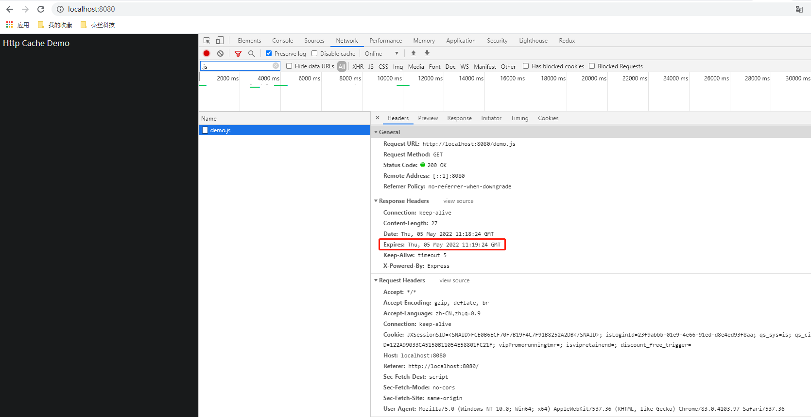

- 不够一分钟，使用缓存（新开tab页验证）

  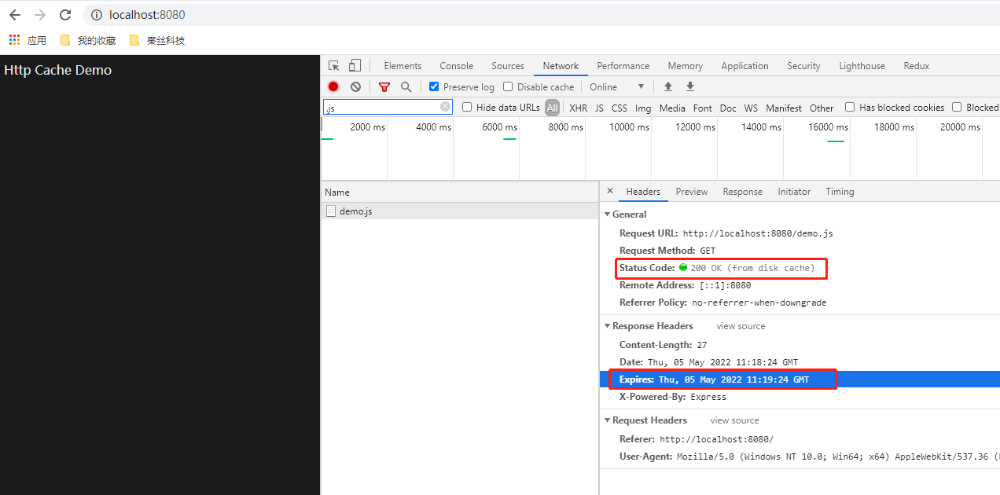

- 超出一分钟，重新请求（新开tab页验证）

  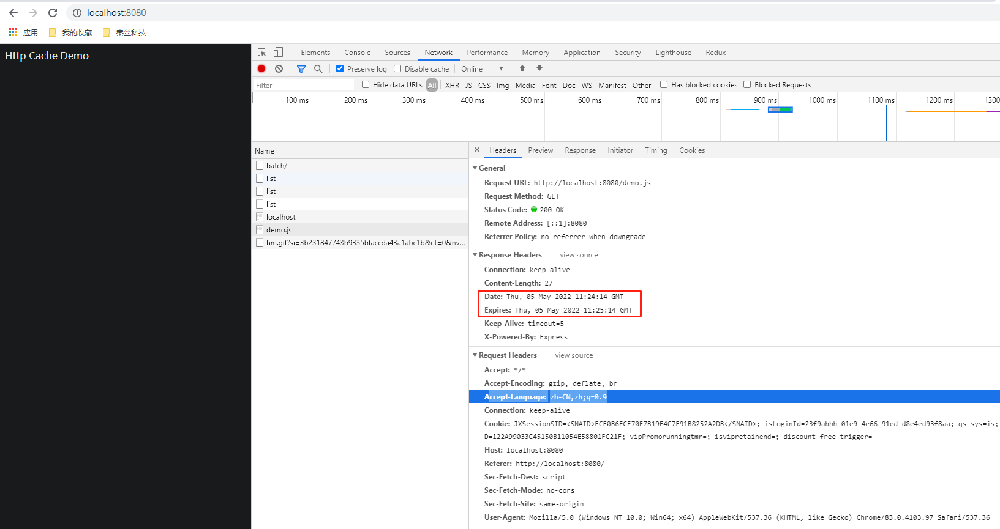

**存在的问题：**

- 由于浏览器时间和服务器时间不同步，如果浏览器设置了一个很后的时间，过期时间一直没有用
- 缓存过期后，不管文件有没有发生变化，服务器都会再次读取文件返回给浏览器
- Expires 是HTTP 1.0的东西，现在默认浏览器均默认使用HTTP 1.1，所以它的作用基本忽略

#### Cache-control

```
res.setHeader('Cache-Control', 'public,max-age=120') //2分钟
```

- private: 客户端可以缓存
- public: 客户端和代理服务器都可缓存
- max-age=xxx: 缓存的内容将在 xxx 秒后失效
- no-cache: 需要使用对比缓存来验证缓存数据
- no-store: 所有内容都不会缓存，强制缓存，对比缓存都不会触发


针对浏览器和服务器时间不同步，加入了新的缓存方案；这次服务器不是直接告诉浏览器过期时间，而是告诉一个相对时间Cache-Control=10秒，意思是10秒内，直接使用浏览器缓存。

```
app.get('/demo.js', (req, res) => {
	let jsPath = path.resolve(__dirname, './static/js/demo.js');
	let cont = fs.readFileSync(jsPath);
	res.setHeader('Cache-Control', 'public,max-age=60') //1分钟
	res.end(cont)
})
```

- 首次访问

  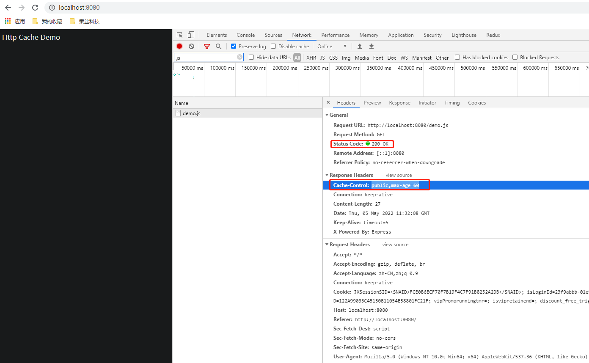

- 不够一分钟，使用缓存（新开tab页验证）

  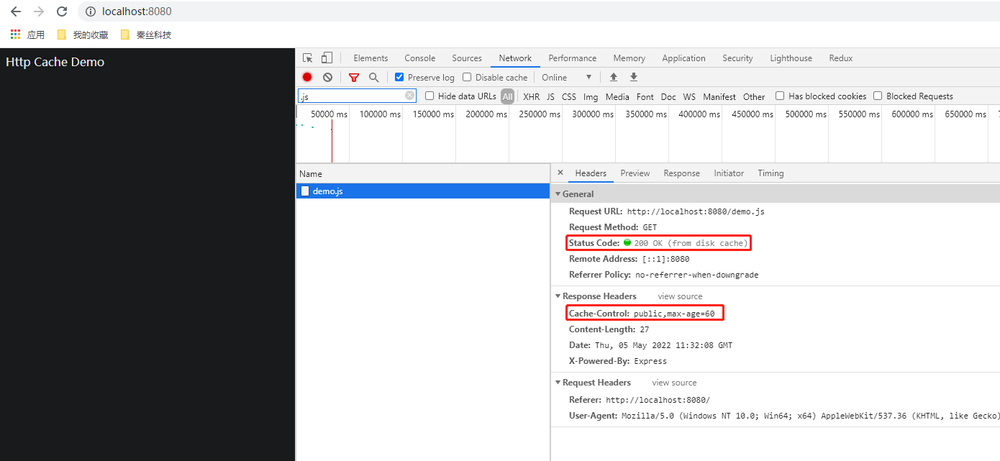

- 超出一分钟，重新请求（新开tab页验证）

  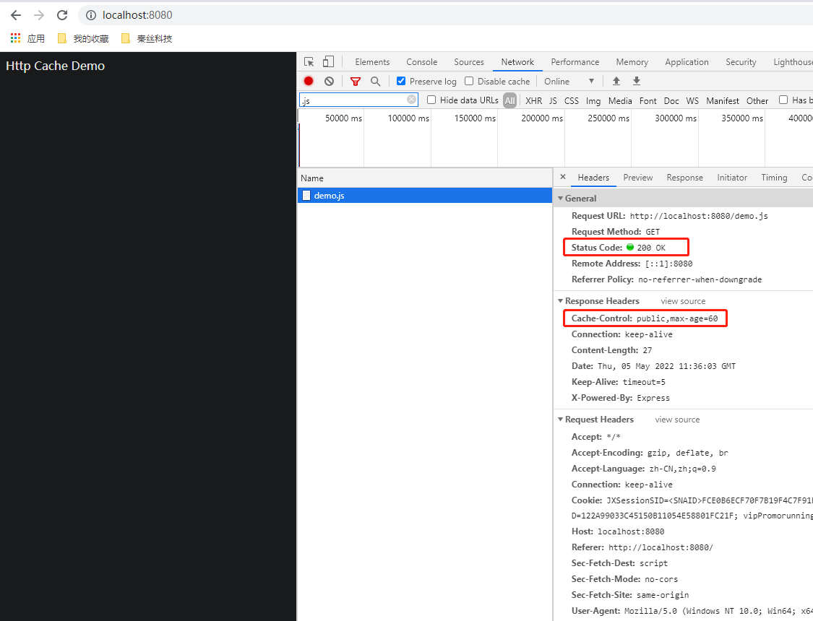

#### Progma

也是在http1.0时代，和Expires一样，然这两个字段早可抛弃，但为了做http协议的向下兼容，你还是可以看到很多网站依旧会带上这两个字段。

Pragma 只有一个属性值，就是 no-cache ，效果和 Cache-Control 中的 no-cache 一致，不使用强缓存，需要与服务器验证缓存是否新鲜，在 3 个头部属性中的优先级最高。

```
res.setHeader('Pragma', 'no-cache') //禁止缓存
```

### 协商缓存

- Last-Modified和If-Modified-Since
- ETag和If-None-Match

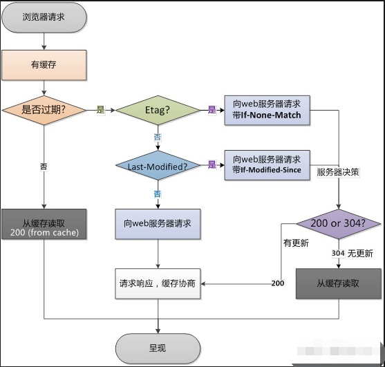

#### Last-Modified和If-Modified-Since

为了节省服务器的资源，再次改进方案。浏览器和服务器协商，服务器每次返回文件的同时，告诉浏览器文件在服务器上最近的修改时间。请求过程如下：

- 浏览器请求静态资源demo.js
- 服务器读取磁盘文件demo.js，返给浏览器，同时带上文件上次修改时间 Last-Modified（GMT标准格式）
- 当浏览器上的缓存文件过期时，浏览器带上请求头**If-Modified-Since**（等于上一次请求的**Last-Modified**）请求服务器
- 服务器比较请求头里的**If-Modified-Since**和文件的上次修改时间。如果果一致就继续使用本地缓存（304），如果不一致就再次返回文件内容和Last-Modified。
- 循环请求。

```
app.get('/demo.js', (req, res) => {
	let jsPath = path.resolve(__dirname, './static/js/demo.js')
	let cont = fs.readFileSync(jsPath);
	let status = fs.statSync(jsPath)

	let lastModified = status.mtime.toUTCString() // 指示最后一次修改此文件的时间戳
	// 如果上次修改时间没有改变 —— 走缓存
	if (lastModified === req.headers['if-modified-since']) {
		res.writeHead(304, 'Not Modified')
		res.end()
	} else { // 更新上次修改时间
		res.setHeader('Cache-Control', 'public,max-age=5')
		res.setHeader('Last-Modified', lastModified)
		res.writeHead(200, 'OK')
		res.end(cont)
	}
})
```

- 首次访问

  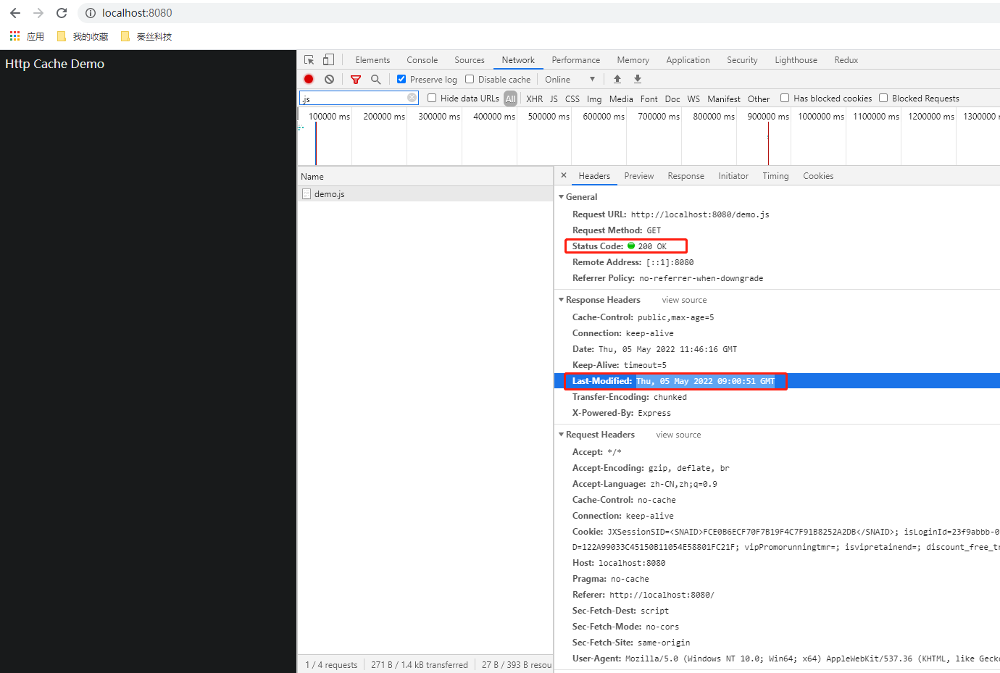

- 没有修改demo.js且大于5s后访问——使用缓存

  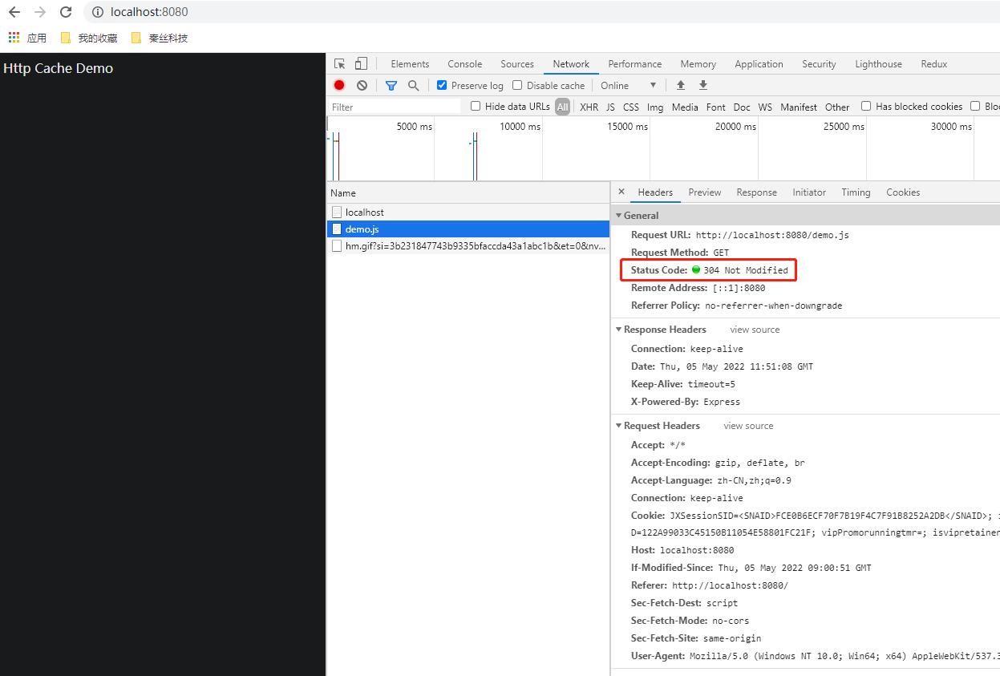

- 修改 demo.js 且访问——重新请求

  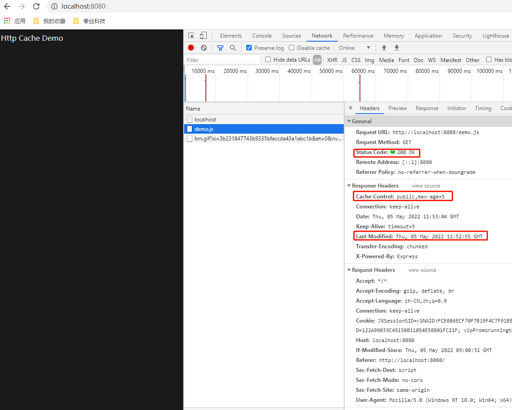

**缺点**

虽然这个方案比前面三个方案有了进一步的优化，浏览器检测文件是否有修改，如果没有变化就不再发送文件；但是还是有以下缺点：

- 由于Last-Modified修改时间是GMT时间，只能精确到秒，如果文件在1秒内有多次改动，服务器并不知道文件有改动，浏览器拿不到最新的文件
- 如果服务器上文件被多次修改了但是内容却没有发生改变，服务器需要再次重新返回文件

#### ETag和If-None-Match

为了解决文件修改时间不精确带来的问题，服务器和浏览器再次协商，这次不返回时间，返回文件的唯一标识ETag。只有当文件内容改变时，ETag才改变。请求过程如下：

- 浏览器请求静态资源demo.js
- 服务器读取磁盘文件demo.js，返给浏览器，同时带上文件的唯一标识ETag
- 当浏览器上的缓存文件过期时，浏览器带上请求头**If-None-Match**（等于上一次请求的ETag）请求服务器
- 服务器比较请求头里的**If-None-Match**和文件的ETag。如果一致就继续使用本地缓存（304），如果不一致就再次返回文件内容和ETag
- 循环请求

```
app.get('/demo.js',(req, res)=>{
    let jsPath = path.resolve(__dirname,'./static/js/demo.js');
    let cont = fs.readFileSync(jsPath);
    let etag = md5(cont); // 生成唯一标识

	// 如果没有变更
    if(req.headers['if-none-match'] === etag){
        res.writeHead(304, 'Not Modified');
        res.end();
    } else { // 如果变更了，重新刷新唯一标识
        res.setHeader('ETag', etag);
        res.writeHead(200, 'OK');
        res.end(cont);
    }
})
```

- 首次访问

  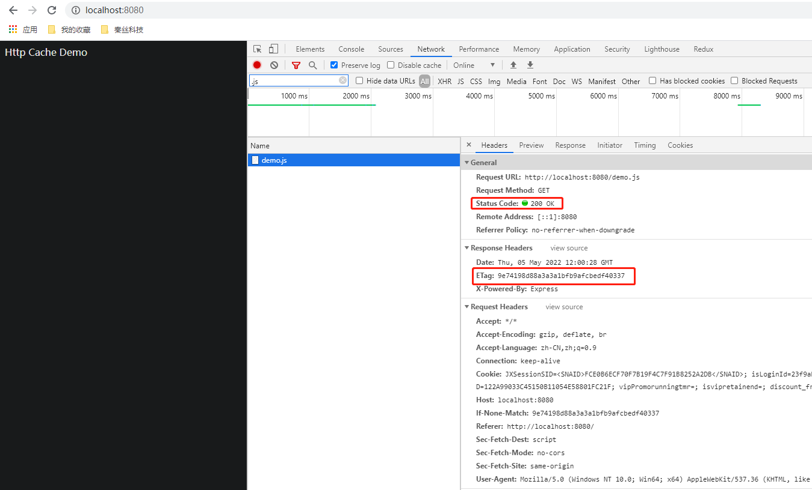

- 没有修改demo.js——使用缓存

  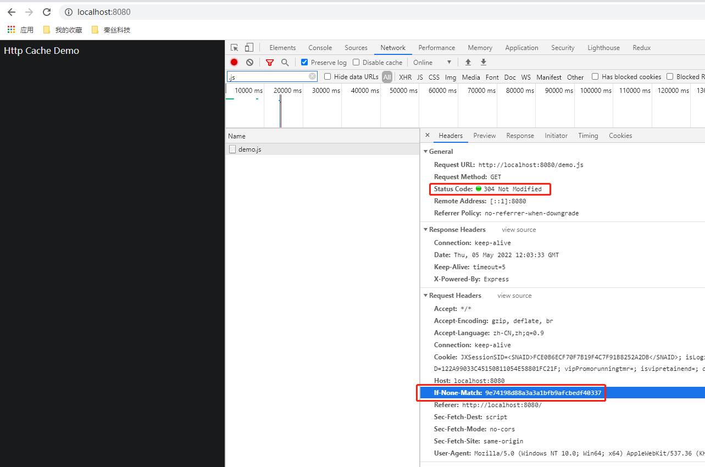

- 修改demo.js——重新请求

  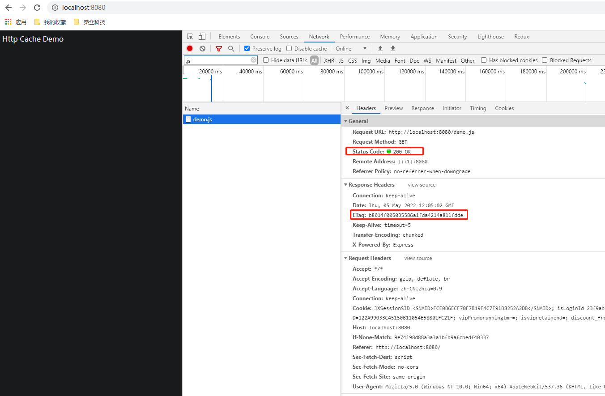


### 优先级

Pragma > Cache-Control > Expires > ETag > Last-Modified

### 关于浏览器刷新

强制刷新：ctrl + f5 或ctrl + 点击刷新，则会带上

- Cache-Control: no-cache
- Pragma: no-cache

