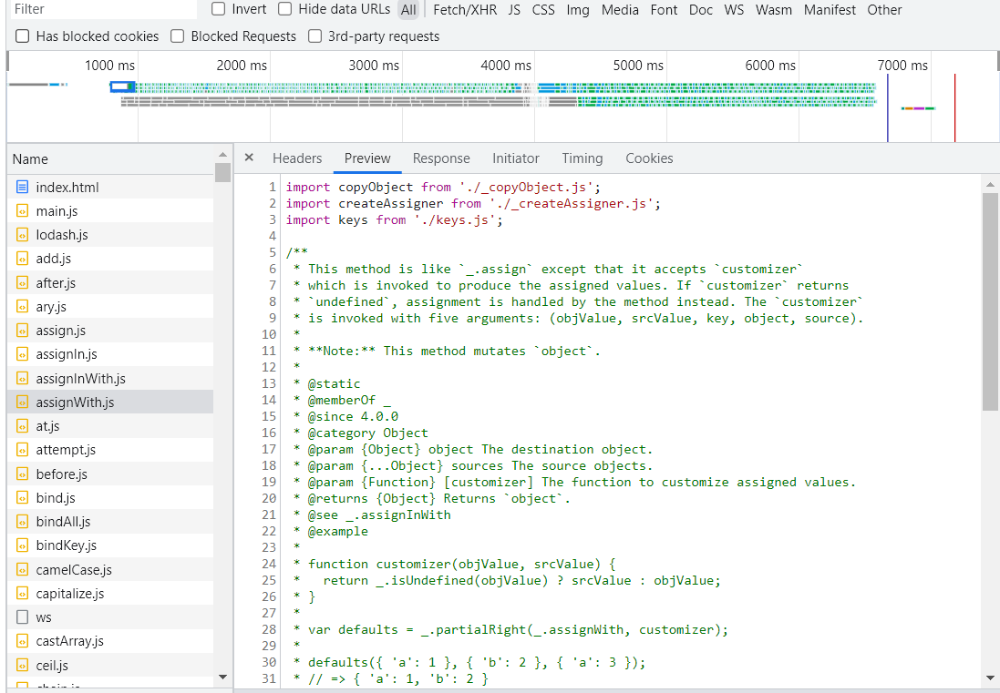
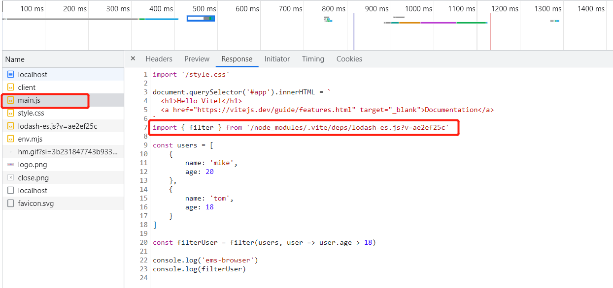

## 1.概念及设计思想

- Vite 由两部分组成：

  - 一个开发服务，服务于开发环境，ESM + HMR
  - 一套构建指令，服务于生产环境，用Rollup打包
- Vite 将模块区分为依赖和源码两类，提升开发服务启动实践

  - 依赖：在开发时不会变动的纯 JavaScript，Vite 会使用 esbuild 预构建依赖
  - 源码：通常为JSX,CSS,或者 Vue SFC 等，时长会被编辑，需要转换，基于路由拆分
- Vite 以原生ESM 方式提供源码，让浏览器接管打包工作

## 2. esm 加载对比

### 2.1 esm-browser

- index.html

  ```
  <!DOCTYPE html>
  <html lang="en">
  <head>
      <meta charset="UTF-8">
      <meta http-equiv="X-UA-Compatible" content="IE=edge">
      <meta name="viewport" content="width=device-width, initial-scale=1.0">
      <title>esm-browser</title>
      <script src="main.js" type="module"></script>
  </head>
  <body>
      
  </body>
  </html>
  ```

- main.js

  ```
  import { filter } from './node_modules/lodash-es/lodash.js'
  
  const users = [
      {
          name: 'mike',
          age: 20
      },
      {
          name: 'tom',
          age: 18
      }
  ]
  
  const filterUser = filter(users, user => user.age > 18)
  
  console.log('ems-browser')
  console.log(filterUser)
  ```

- 浏览器打开

  

### 2.2 esm-vite

```
npm init vite@latest
```

选择原生模板：vanilla

- index.html

  ```
  <!DOCTYPE html>
  <html lang="en">
    <head>
      <meta charset="UTF-8" />
      <link rel="icon" type="image/svg+xml" href="favicon.svg" />
      <meta name="viewport" content="width=device-width, initial-scale=1.0" />
      <title>Vite App</title>
    </head>
    <body>
      <div id="app"></div>
      <script type="module" src="/main.js"></script>
    </body>
  </html>
  
  ```

- main.js

  ```
  import './style.css'
  
  document.querySelector('#app').innerHTML = `
    <h1>Hello Vite!</h1>
    <a href="https://vitejs.dev/guide/features.html" target="_blank">Documentation</a>
  `
  import { filter } from 'lodash-es'
  
  const users = [
      {
          name: 'mike',
          age: 20
      },
      {
          name: 'tom',
          age: 18
      }
  ]
  
  const filterUser = filter(users, user => user.age > 18)
  
  console.log('ems-browser')
  console.log(filterUser)
  ```

- 请求情况

  

