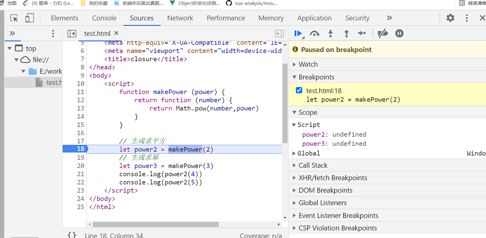
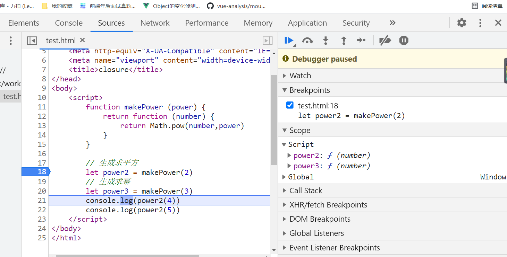
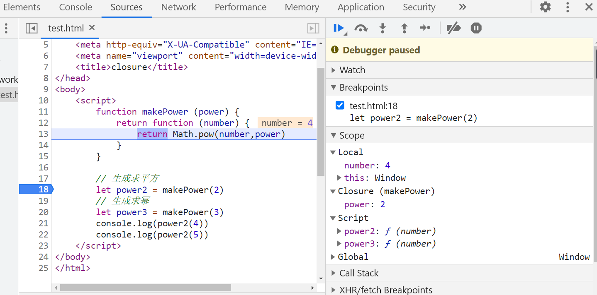

## 函数式编程

### 1-1 大纲

- 为什么要学习函数编程以及什么是函数式编程
- 函数式编程的特性（纯函数、柯里化、函数组合等）
- 函数式编程的应用场景
- 函数式编程库 Lodash

### 1-2 为什么要学习函数式编程

- 函数式编程随着React 的流行受到越来越多的关注
- Vue 3 也开始拥抱函数式编程
- 函数式编程可以抛弃 this
- 打包过程中可以更好的利用 tree shaking 过滤无用代码
- 方便测试，方便并行处理
- 有很多库可以帮助我们进行函数式开发  ：lodash、underscore、ramda

### 1-3 什么是函数式编程

函数式编程（Function Programming,FP）,FP是编程范式之一，我们常听说的编程范式还有面向过程编程、面向对象编程。

- 面向过程：按照步骤来实现
- 面向对象：把现实世界中的事物抽象成程序世界中的类和对象，通过封装、继承和多态来演示事物间的联系
- 函数式编程：把现实世界中事物和事物之前的**联系**抽象到程序世界（对运算过程进行抽象）
  - 函数式编程中指的不是程序中的函数（方法），而是数学中的映射关系，如y=sin(x)，x和y的关系
  - 相同的输入始终得到相同的输出（纯函数）
  - 函数式编程用来描述数据(函数)之间的映射。

```
// 非函数式编程
let num1 = 2
let num2 = 3
let sum = num1+ num2

// 函数式编程
function add (n1,n2) {
    return n1+n2
}
let sum = add(num1,num2)
```

### 1-4 函数是一等公民

- 函数可以存储在变量中
- 函数可以作为参数
- 函数作为返回值

在JavaScript中`函数就是一个普通的对象`（可以通过 new Function()），可以把函数存储到变量/数组中，还可以作为另一个函数的参数或返回值，甚至程序运行时通过 new Function('alert(1)')

```
// 把函数赋值给变量
let fn = function () {
    console.log('Hello First-class Function')
}
fn()

// 一个示例 
const BlogController = {
    index (post) { return Views.index(post)},
    show (post) { return Views.show(post)}
}
// BlogController对象的index()方法调用了另一个方法（Views.index()），并返回结果
//  优化 (把一个方法赋值给另一个方法)
const BlogController = {
    index: Views.index,
    show: Views.show
}
```

### 1-5 高阶函数

- 可以把函数作为参数传递给另一个函数
- 可以把函数作为另一个函数的返回结果

#### 1-5-1 函数作为参数

```
// 高阶函数-函数作为参数 (模拟foreach)
function forEach (arr,fn) {
    for (let i=0; i<arr.length; i++) {
        fn(arr[i])
    }
}

// 测试
let arr = [1,3,4,7,8]
forEach(arr, function (item) {
    console.log(item) // 1 3 4 7 8
})

// 手写简易版 foreach
Array.prototype.MyForeach = function(fn) {
    for (let i=0; i<this.length; i++) {
        fn(this[i])
    }
}
arr.MyForeach((item) => console.log(item)) // 1 3 4 7 8

// 高阶函数-函数作为参数 (模拟filter)
function filter (array,fn) {
    let results = []
    for (let i=0; i<array.length; i++) {
        if (fn(array[i])) {
            results.push(array[i])
        }
    }
    return results
}

// 测试
let arr = [1,3,4,7,8]
let result = filter(arr,function(item) {
    return item % 2 === 0
})
console.log(result) // [4,8]
```

#### 1-5-2 函数作为返回值

```
function makeFn () {
    let msg = 'Hello function'
    return function () {
        console.log(msg)
    }
}

const fn = makeFn()
fn() // Hello function
makeFn()() // Hello function

// 模拟once，只执行一次

function once (fn) {
    let done = false
    return function () {
        if(!done) {
            done = true
            return fn.apply(this,arguments)
        }
    }
}

let money = 5
let pay = once(function (money){
    console.log(`支付:${money}RMB`)
})
pay(money)  // 支付:5RMB
pay(money)  
pay(money)
```

#### 1-5-3 使用高阶函数的意义

- 高阶函数是用来抽象通用的问题
- 抽象可以帮我们屏蔽细节，只需要关注目标

#### 1-5-4 常用的高阶函数

forEach、map、filter、every、some、find/findIndex、reduce、sort

```
// 模拟常用的高阶函数 map、every、some

// map
const map = function(arr,fn) {
    let result = []
    for(let val of arr) {
        result.push(fn(val))
    }
    return result
}
// 测试
let arr = [1,2,3,4]
let mapResult = map(arr,(v) => v*v)
console.log(mapResult) // [ 1, 4, 9, 16 ]

// ervery
const every = function(arr,fn) {
    let result = true
    for (let val of arr) {
        result = fn(val)
        if (!result) {
            break
        }
    }
    return result
}
// 测试
let arr = [11,12,14]
let ereryResult = every(arr, v=> v>10)
console.log(ereryResult) // true

// some
const some = ((arr,fn) => {
    let result = false
    for (let val of arr) {
        result = fn(val)
        if (result) {
            break
        }
    }
    return result
})
// 测试
let arr = [1,3,4,9,5]
let someResult = some(arr,v => v%2 === 0)
console.log(someResult)
```

- 把函数作为参数，可以使我们的函数变得更加灵活
- 上面模拟的foreach是对循环的抽象，filter是对查找数组元素的抽象等等。

### 1-6 闭包

#### 1-6-1 闭包概念

- 闭包（Closure)：函数和其周围的状态（词法环境）的引用捆绑在一起形成的闭包
  - **可以在另一个作用域中调用一个函数的内部函数并访问到该函数的作用域中的成员**

```
// 函数作为返回值
function makeFn () {
    let msg = 'Hello function'
    return function () {
        console.log(msg)
    }
}

const fn = makeFn()
fn() // Hello function
```

- const fn = makeFn():当调用完makeFn()，会返回一个函数`return function () {console.log(msg)}`, fn则引用了makeFn()返回的函数。即外部对函数内部的成员有引用。
- 当外部对函数内部的成员有引用，此时被引用的成员内存不能被释放
- fn(): 当调用 fn 时，即调用makeFn()的内部函数`function () {console.log(msg)}`,内部函数访问到变量 msg， msg不能释放。

**闭包核心作用**

- 把函数makeFn()内部成员 msg 的作用范围延长了。（正常情况下msg会随makeFn()执行完毕出栈释放）

**闭包的本质**

- 函数在执行的时候，会放到一个执行栈上（入栈），当函数执行完毕后会从执行栈上移除（出栈）。
- 但是堆上的作用域成员因为被外部引用不能释放，因此内部函数依然可以访问到外部函数的成员。

#### 1-6-2 闭包案例

```
<!DOCTYPE html>
<html lang="en">
<head>
    <meta charset="UTF-8">
    <meta http-equiv="X-UA-Compatible" content="IE=edge">
    <meta name="viewport" content="width=device-width, initial-scale=1.0">
    <title>closure</title>
</head>
<body>
    <script>
        function makePower (power) {
            return function (number) {
                return Math.pow(number,power)
            }
        }
        // 生成求平方
        let power2 = makePower(2)
        // 生成求幂
        let power3 = makePower(3)
        console.log(power2(4))
        console.log(power2(5))
    </script>
</body>
</html>
```



- 刚开始断点，Scope（作用域）下的Script：power2、power3都为undefined



- 执行完 `let power3 = makePower(3)`后执行`console.log(power2(4))`,变量power2和power3是函数



- 执行打印代码，执行power2(4)，右侧生成闭包

### 1-7 纯函数

#### 1-7-1 概念

- 纯函数：相同的输入永远会得到相同的输出，而且没有任何可观察的副作用。
- lodash：一个纯函数功能库，提供了对数组、数字、对象、字符串、函数等操作的一些方法
- slice：纯函数，返回数组中的指定部分，不会改变原数组
- splice:非纯函数，对数组进行操作返回该数组，会改变原数组

#### 1-7-2 Lodash

`npm i lodash`

```
// 引入 lodash
const _ = require('lodash')

const arr = ['jack','tom','lucy','well']

console.log(_.first(arr)) // jack
console.log(_.last(arr))  // well
console.log(_.toUpper(arr))  // JACK,TOM,LUCY,WELL
console.log(_.reverse(arr)) // [ 'well', 'lucy', 'tom', 'jack' ]
const r  = _.each(arr, (item, index) => {
    console.log(item,index) // well 0 lucy 1 tom 2 jack 3
})
console.log(r) // [ 'well', 'lucy', 'tom', 'jack' ]
```

####  1-7-3 纯函数的好处

- 可缓存
  - 因为纯函数对相同的输入始终有相同的结果，所以可以把纯函数的结果缓存起来

```
// lodash 的缓存

// 引入 lodash
const _ = require('lodash')
function getArea (r) {
    console.log(r)
    return Math.PI * r * r
}
let getAreaWithMemory = _.memoize(getArea)
console.log(getAreaWithMemory(4))
console.log(getAreaWithMemory(4))
console.log(getAreaWithMemory(4))
// 输出
//4
//50.26548245743669
//50.26548245743669
//50.26548245743669
// 解析：4 只打印一次，证明缓存了

// 模拟 memoize 的实现
function memoize (f) {
    let cache = {}
    return function() {
        console.log(arguments)  //[Arguments] { '0': 4 }
        let key = JSON.stringify(arguments) // 把参数转为字符串 
        console.log(key) // {"0":4}
        cache[key] = cache[key] || f.apply(f,arguments)
        console.log(cache) // { '{"0":4}': 50.26548245743669 }
        return cache[key]
    }
}
let getAreaWithMemory = memoize(getArea)
console.log(getAreaWithMemory(4))
console.log(getAreaWithMemory(4))
console.log(getAreaWithMemory(4))
```

- 可测试
  - 纯函数让测试更方便
- 并行处理
  - 再多线程下并行操作共享的内存数据很可能会出现意外情况
  - 纯函数不需要访问共享内存数据，所以在并行环境下可以任意运行纯函数(Web Worker)

#### 1-7-4 副作用

- 纯函数：对于相同的输入永远会得到相同的输出，而且没有任何可观察的副作用

```
// 非纯函数
let mini = 18
function checkAge (age) {
    return age >= mini
}

// 纯函数
function checkAge (age) {
    let mini = 18
    return age >= mini
}
```

- 上面代码第一个非纯函数是因为全局变量 mini 的干扰，导致相同的输入可能得不到相同的输出。
- 副作用来源：
  - 配置文件
  - 数据库
  - 获取用户的输入

### 1-8 柯里化（Haskell Brooks Curry）

#### 1-8-1 概念

```
// 纯函数
// function checkAge (min, age) {
//     return age >= mini
// }

// 柯里化
function checkAge (min) {
    return function (age) {
        return age>=min
    }
}
// es6 写法
//let checkAge = min => (age => age >= min)

let checkAge18 = checkAge(18)
console.log(checkAge18(20)) // true
console.log(checkAge18(15)) // false
```

- 柯里化
  - 当一个函数有多个参数的时候先传递一部分参数调用它（这部分参数以后永远不变）
  - 然后返回一个新的函数接受剩余的参数，返回结果

#### 1-8-2 Lodash 中的柯里化

- _.curry(func)
  - 功能：创建一个函数，该函数接受一个或多个 func 的参数，如果 func 所需要的参数都被提供则执行 func 并返回执行的结果，否则继续返回该函数并等待接收剩余的参数
  - 参数：需要柯里化的函数
  - 返回值： 柯里化后的函数

```
const _ = require('lodash')

function getSum (a,b,c) {
    return a+b+c
}

 const curried = _.curry(getSum)

 console.log(curried(1,2,3)) // 6
 console.log(curried(1)(2)(3)) // 6
 console.log(curried(1,2)(3)) // 6
```

#### 1-8-3 柯里化案例

```
const _ = require('lodash')

const match = _.curry(function (reg, str) {
    return str.match(reg)
})

const haveSpace = match(/\s+/g)
const haveNumber = match(/\d+/g)
console.log(haveSpace('helloworld')) // null
console.log(haveNumber('123abc')) // ['123' ]

const filter = _.curry(function(func, array) {
    return array.filter(func)
})
console.log(filter(haveSpace, ['Join JSON', 'WELL'])) //[ 'Join JSON' ]
const filterSpace = filter(haveSpace)
console.log(filterSpace(['Join JSON', 'WELL'])) //[ 'Join JSON' ]
```

#### 1-8-4 柯里化原理模拟

```
function curry (func) {
    return function curriedFn(...args) { // 使用剩余参数接收实参
        //  如果实参小于形参，递归执行
        if (args.length < func.length) {
            return function () {
                // argument 是再次调用的实参，需转换为数组然后拼接之前转为参数
                return curriedFn(...args.concat(Array.from(arguments)))
            }
        }
        // 如果实参等于形参直接执行
        return func(...args)
    }
}

function getSum (a,b,c) {
    return a+b+c
}

const curried = curry(getSum)

console.log(curried(1,2,3)) // 6
console.log(curried(1)(2)(3)) // 6
console.log(curried(1,2)(3)) // 6
```

- 判断实参与形参
- 递归拼接参数返回函数

#### 1-8-5 总结

- 柯里化可以让我们给一个函数传递较少的参数得到一个已经记住了某些固定参数的函数
- 这是一种对函数的’缓存‘
- 让函数变得更灵活，让函数得粒度更小
- 可以把多元函数转换成一元函数，可以组合使用函数产生强大的功能


### 1-9 函数组合

#### 1-9-1 概念

- 纯函数和柯里化很容易写出洋葱代码h(g(f(x)))
  - 如获取数组最后一个元素再转换成大写字母:`_.toUpper(_.first(_.reverse(array)))`
- 函数组合可以让我们把细粒度的函数重新组合生成一个新的函数

```
function compose (f,g) {
    return function (value) {
        return f(g(value))
    }
}

function reverse (arr) {
    return arr.reverse()
}
function first (arr) {
    return arr[0]
}

const last = compose(first,reverse)
console.log(last([1,2,4,6]))
```

#### 1-9-2 Lodash 中的组合函数

- lodash 中组合函数 flow() 或者 flowRight()，他们都可以组合多个函数
- flow() 是从左到右运行
- flowRight() 是从右到左运行，使用的更多一些

```
const _ = require('lodash')

const reverse = arr => arr.reverse()
const first = arr => arr[0]
const toUpper = s => s.toUpperCase()

const f = _.flowRight(toUpper,first,reverse)
console.log(f(['one','two','three'])) // THREE
```

#### 1-9-3 组合函数原理模拟

```
reduce(function(previousValue, currentValue, currentIndex, array) { /* ... */ })
```

callbackFn

- `previousValue`：上一次调用 `callbackFn` 时的返回值。在第一次调用时，若指定了初始值 `initialValue`，其值则为`initialValue`，否则为数组索引为 0 的元素 `array[0]`。
- `currentValue`：数组中正在处理的元素。在第一次调用时，若指定了初始值 `initialValue`，其值则为数组索引为 0 的元素 `array[0]`，否则为 `array[1]`。
- `currentIndex`：数组中正在处理的元素的索引。若指定了初始值 `initialValue`，则起始索引号为 0，否则从索引 1 起始。
- `array`：用于遍历的数组。

`initialValue` 可选

  作为第一次调用 `callback` 函数时参数 *previousValue* 的值。若指定了初始值 `initialValue`，则 `currentValue` 则将使用数组第一个元素；否则 `previousValue` 将使用数组第一个元素，而 `currentValue` 将使用数组第二个元素。

```
function compose(...args) {
    return function(value) {
        // reduce:对数组中的每一个元素执行提供的函数，并汇总成单个结果
        return args.reverse().reduce(function(acc,fn) {
            return fn(acc)
        },value) // 把value作为acc的初始值
    }
}

const reverse = arr => arr.reverse()
const first = arr => arr[0]
const toUpper = s => s.toUpperCase()

const f = compose(toUpper,first,reverse)
console.log(f(['one','two','three'])) // THREE

```

#### 1-9-4 函数组合——组合律

- 函数的组合要满足组合律

```
const _ = require('lodash')

const f = _.flowRight(_.toUpper,_.first,_.reverse)
const f2 = _.flowRight(_.flowRight(_.toUpper,_.first),_.reverse)
const f3 = _.flowRight(_.toUpper,_.flowRight(_.first,_.reverse))
console.log(f(['one','two','three'])) // THREE
console.log(f2(['one','two','three'])) // THREE
console.log(f3(['one','two','three'])) // THREE
```

#### 1-9-5 调试

```
const _ = require('lodash')

const log = v => {
    console.log(v)
    return v
}

// _.spilt()
const split = _.curry((sep,str) => _.split(str, sep))

// _.toLower()
const join = _.curry((sep,arr) => _.join(arr,sep))
// _.map()
const map = _.curry((fn, arr) => _.map(arr,fn))
const f = _.flowRight(join('-'), log, map(_.toLower), split(' '))
console.log(f('NEVER SAY DIE'))
// 输出 通过log查看打印
//[ 'never', 'say', 'die' ] log内容
// never-say-die

// 使用 trace 查看打印
const f = _.flowRight(join('-'), trace('log之后'), map(_.toLower), trace('log之前'), split(' '))
console.log(f('NEVER SAY DIE'))
//log之前 [ 'NEVER', 'SAY', 'DIE' ]
//log之后 [ 'never', 'say', 'die' ]
//never-say-die
```

### 1-10 Lodash 的 fp 模块

#### 1-10-1 fp 模块

在使用函数组合解决问题时，使用到 lodash 中提供的一些方法，如果这些方法有多个参数，需要对这些方法进行柯里化操作，像上面那样再封装一次，麻烦。

- lodash/fp
  - lodash 的 fp 模块提供了实用的对函数式编程友好的方法
  - 提供了不可变 自动柯里化 函数优先 数据滞后 的方法

```
const _ = require('lodash')
const fp = require('lodash/fp')

console.log(_.map(['a','b','c'],_.toUpper)) //[ 'A', 'B', 'C' ]
console.log(fp.map(fp.toUpper,['a','b','c'])) //[ 'A', 'B', 'C' ]
```

```
const fp = require('lodash/fp')

const f =fp.flowRight(fp.join('-'),fp.map(fp.toLower),fp.split(' '))

console.log(f('NEVER SAY DIE')) // never-say-die
```

#### 1-10-2 fp 模块中 map 方法的区别

```
console.log(_.map(['23','8','10'],parseInt)) // [ 23, NaN, 2 ]
// parseInt('23', 0, array)
// parseInt('8', 1, array) 进制不能为1， NaN
// parseInt('10', 2, array) 10的2进制 2
```

- 第一个参数：字符串
- 第二个参数：进制
- 第三个参数 ：数组
- 进制： 2-36， 0的话10进行

```
const fp = require('lodash/fp')

console.log(fp.map(parseInt,['23','8','10'])) // 23 8 10
```

### 1-11 Point Free

#### 1-11-1 概念

point Free:我们可以把数据处理的过程定义成与数据无关的合成运算，不需要用到代表数据的那个参数，只要把简单的运算步骤合成到一起，在使用这种模式之前我们需要定义一些负责的基本运算函数。

- 不需要指明处理的数据
- 只需要合成运算过程
- 需要定义一些辅助的基本运算函数

```
// 非 point free
function f (world) {
    return world.toLowerCase().replace(/\s+/g,'_')
}

console.log(f('Hello   world'))
```


```
// point free
// Hello   world => hello_world
const fp = require('lodash/fp')

const f = fp.flowRight(fp.replace(/\s+/g,'_'),fp.toLower)
console.log(f('Hello   world'))
```

#### 1-11-2 案例

```
// 把一个字符串中的首字母提取并转换成大写，使用. 作为分隔符
// world wild web => W. W. W

const fp = require('lodash/fp')
const firstLetterToUpper = fp.flowRight(fp.join('. '),fp.map(fp.first),fp.map(fp.toUpper),fp.split(' '))

console.log(firstLetterToUpper('world wild web'))

// 上面调用了两次 map，可以优化:函数组合
const firstLetterToUpper = fp.flowRight(fp.join('. '),fp.map(fp.flowRight(fp.first, fp.toUpper)),fp.split(' '))
```

### 1-12 Functor(函子)

#### 1-12-1 概念

- 为什么要学函子
  - 到目前位置还没有学习到在函数式编程中如何把副作用控制在可控范围内、异常处理、异步操作等
- 什么是 Functor
  - 容器：包含值和值的变形关系（这个变形关系就是函数）
  - 函子：是一个特殊的容器，通过一个普通的对象来实现，该对象具有 map 方法， map 方法可以运行一个函数对值进行处理（变形关系）

```
// Functor 函子
class Container {
    constructor (value) {
        this._value = value
    }

    map (fn) {
        return new Container(fn(this._value))
    }
}

let r = new Container(5)
    .map(x => x + 1)
    .map(x => x * x)

console.log(r) // Container { _value: 36 }
```

升级版写法：去除 new 写法

```
// Functor 函子
class Container {
    static of (value) {  // 静态方法 of
        return new Container(value)
    }
    constructor (value) {
        this._value = value
    }
    map (fn) {
        return Container.of(fn(this._value))
    }
}

let r = Container.of(5)
    .map(x => x + 1)
    .map(x => x * x)

console.log(r)
```

#### 1-12-2 总结

- 函数式编程的运算不直接操作值，而是由函子完成
- 函子就是一个实现了 map 契约的对象
- 我们可以把函子想像成一个盒子，这个盒子封装了一个值
- 想要处理盒子中的值，我们需要给盒子的 map 方法传递一个处理值得函数(纯函数),由这个函数对值进行处理
- 最终 map 方法返回一个包含新值得盒子(函子)

```
// Functor 函子
class Container {
    static of (value) {  // 静态方法 of
        return new Container(value)
    }
    constructor (value) {
        this._value = value
    }
    map (fn) {
        return Container.of(fn(this._value))
    }
}

let r = Container.of(null)
    .map(x => x.toUpperCase())

console.log(r) // 出错，异常
```

- 副作用出现：.map()里面得函数变得不纯了
- 需要新得函子处理空值问题

#### 1-12-3 MayBe 函子

```
// MayBe  函子
class MayBe {
    static of (value) {
        return new MayBe(value)
    }
    constructor (value) {
        this._value = value
    }
    
    map (fn) {
        return this.isNothing() ? MayBe.of(null) : MayBe.of(fn(this._value))
    }
    isNothing () {
        return this._value === null || this._value === undefined
    }
}

let r = MayBe.of('hello world')
        .map(x => x.toUpperCase())

console.log(r) // MayBe { _value: 'HELLO WORLD' }
```

缺点演示：

```
let r = MayBe.of('hello world')
        .map(x => x.toUpperCase())
        .map(x => null)
        .map(x => x.split(' '))

console.log(r) // MayBe { _value: null }
```

- 多次调用map得时候，哪一次出现了空值不明确

#### 1-12-4 Either 函子

```
// Either 函子

class Left {
    static of (value) {
        return new Left(value)
    }
    constructor(value) {
        this._value = value
    }
    map (fn) {
        return this
    }
}

class Right {
    static of (value) {
        return new Right(value)
    }
    constructor(value) {
        this._value = value
    }
    map (fn) {
        return Right.of(fn(this._value))
    }
}

let r1 = Right.of(12)
        .map(x => x+2)
let r2 = Left.of(12)
        .map(x => x+2)

console.log(r1) //Right { _value: 14 }
console.log(r2) //Left { _value: 12 }

function parseJSON (str) {
    try {
        return Right.of(JSON.parse(str))
    } catch (e) {
        return Left.of({ error: e.message})
    }
}

let r3 = parseJSON('{name: zs}')
let r4 = parseJSON('{ "name": "well"}')
        .map(x =>x.name.toUpperCase())
console.log(r3) // Left { _value: { error: 'Unexpected token n in JSON at position 1' } }
console.log(r4) // Right { _value: 'WELL' }
```

#### 1-12-5 IO 函子

- IO 函子中的 _value 是一个函数，这里把函数作为值来处理
- IO 函子可以把不纯的动作存储到_value中，延迟执行这个不纯的操作（惰性执行），包装当前的操作
- 把不纯的操作交给调用者来处理

```
const fp = require('lodash/fp')

class IO {
    static of (value) {
        return new IO(function(){
            return value
        })
    }
    constructor (fn) {
        this._value = fn
    }
    map (fn) {
        return new IO(fp.flowRight(fn, this._value))
    }
}

// 使用
let r = IO.of(process).map(p => p.execPath)
console.log(r)
console.log(r._value)
// 输出
//IO { _value: [Function (anonymous)] }
//[Function (anonymous)]
```

- map中传入的参数可能不是纯的操作，但是IO返回的结果永远都是一个纯的操作（永远返回IO 函子）

#### 1-12-6 folktale

- 函子不仅可以控制副作用，进行处理异常，还可以处理异步任务，因为异步任务可能出现回调地狱
- 异步任务的实现过于复杂，使用 folktale 中的 Task 演示
- folktale 一个标准的函数式编程库
  - 和lodash、ramda不同的是，没有提供很多功能函数
  - 只提供了一些函数式处理的操作，例如：copose.curry等，一些函子:Task、Either、MayBe
- npm i folktale

```
const { compose, curry } = require('folktale/core/lambda')
const { toUpper, first} = require('lodash/fp')

let f = curry(2, (x, y) => {
    return x+y
})

let f2 = compose(toUpper,first)
console.log(f(1,2)) // 3  
console.log(f(1)(2)) // 3
console.log(f2(['one','two']))  // ONE
```

#### 1-12-7 Task 函子

```
// Task 处理异步任务
const fs = require('fs')
const {task} = require('folktale/concurrency/task')
const {split, find } = require('lodash/fp')

function readFile (fileName) {
    return task(resolver => {
        fs.readFile(fileName, 'utf-8', (err, data) => {
            if (err) resolver.reject(err)
            resolver.resolve(data)
        })
    })
}

readFile('package.json')
    .map(split('\n'))
    .map(find(x => x.includes('version')))
    .run()
    .listen({
        onRejected: err => {
            console.log(err)
        },
        onResolved: value => {
            console.log(value)
        }
    })
    // "version": "1.0.0",
```

#### 1-12-8  Pointed 函子

- pointed 函子是实现了 of 静态方法的函子
- of 方法是为了避免使用 new 来创建对象，更深层的含义是 of 方法用来把值放到上下文 Context(把值放到容器中，使用map来处理值)

```
class Container{
	static of (value) {
		return new Container(value)
	}
	...
}

Container.of(2)
	.map(x => x+2)
```

#### 1-12-9 Monad(单子)

##### 1-12-9-1 IO 函子的问题

```
const fs = require('fs')
const fp = require('lodash/fp')

class IO {
    static of (value) {
        return new IO(function () {
            return value
        })
    }
    constructor (fn) {
        this._value = fn
    }
    map (fn) {
        return new IO(fp.flowRight(fn,this._value))
    }
}

let readFile = function (fileName) {
    return new IO(function () {
        return fs.readFileSync(fileName, 'utf-8')
    })
}

let print = function (x) {
    return new IO(function() {
        console.log(x)
        return x
    })
}

let cat = fp.flowRight(print,readFile)
// IO(IO(x))
let r = cat('package.json')._value()._value()
console.log(r)
```

// 输出

```
{
  "name": "test",
  "version": "1.0.0",
  "description": "",
  "main": "index.js",
  "scripts": {
    "test": "echo \"Error: no test specified\" && exit 1"
  },
  "keywords": [],
  "author": "",
  "license": "ISC",
  "dependencies": {
    "folktale": "^2.3.2",
    "lodash": "^4.17.21"
  }
}
```

##### 1-12-9-2 Monad 函子

- Monad 函数是可以变扁的 Pointed 函子，IO(IO(x))
- 一个函子如果具有 join() 和 of 连个方法并遵守一些定律就是 Monad

```
const fs = require('fs')
const fp = require('lodash/fp')

class IO {
    static of (value) {
        return new IO(function () {
            return value
        })
    }
    constructor (fn) {
        this._value = fn
    }
    map (fn) {
        return new IO(fp.flowRight(fn,this._value))
    }
    join() {
        return this._value()
    }
    flatMap(fn) {
        return this.map(fn).join()
    }
}

let readFile = function (fileName) {
    return new IO(function () {
        return fs.readFileSync(fileName, 'utf-8')
    })
}

let print = function (x) {
    return new IO(function() {
        console.log(x)
        return x
    })
}

let r = readFile('package.json')
        .flatMap(print)
        .join()
console.log(r)
```


