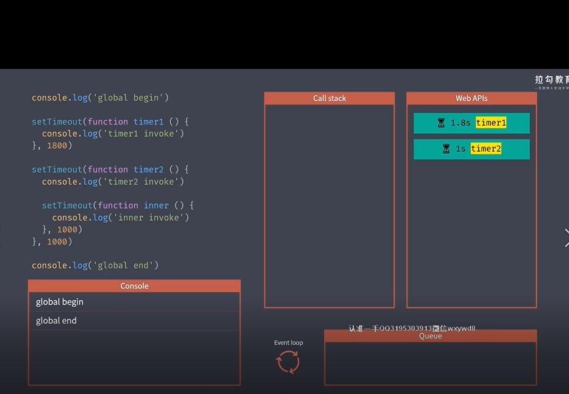
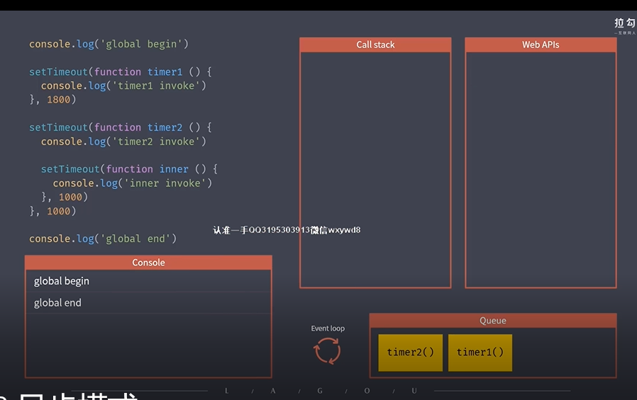
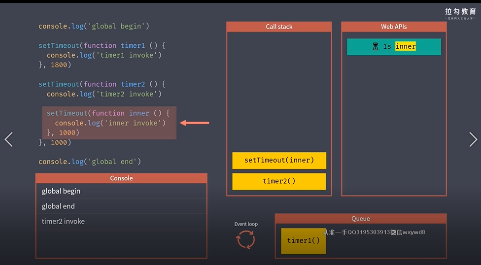
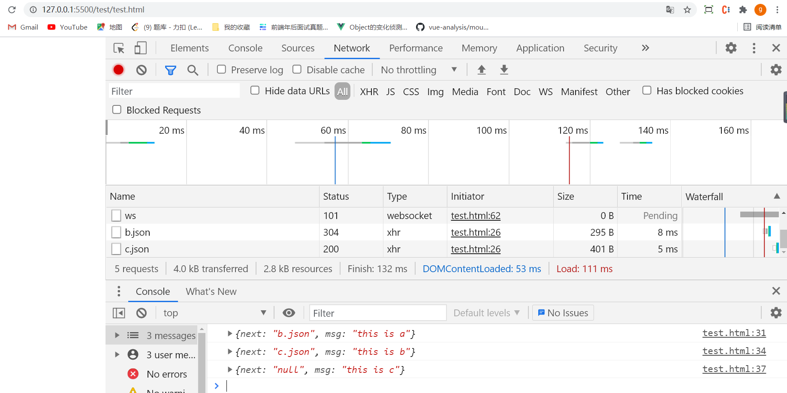
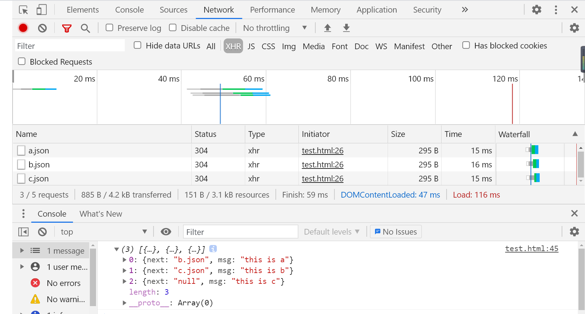

### 1 概述

**采用单线程模式工作的原因**

运行在浏览器端的脚本语言，目的实现页面的交互，而实现动态交互的核心是DOM操作，就决定了必须使用单线程，否则出现很复杂的线程同步问题。

**大纲**

- 同步模式与异步模式
- 事件循环与消息队列
- 异步编程的集中方式
- Promise 异步方案、宏任务/微任务队列
- Generator 异步方案、Async/Await 语法糖

### 2 同步模式

即排队执行方式：等待上一个任务执行的结束才开始下一任务。

缺点：其中某个任务执行时间过长会导致阻塞，导致页面卡顿。必须有异步模式解决程序中不可避免的操作，如ajax。

### 3 异步模式

- 开启过后就立即执行下一任务，后续逻辑一般会通过回调函数的方式定义。

```
console.log('global begin');

setTimeout(function timer1 () {
    console.log('timer1 invoke');
},1800)

setTimeout(function timer2 () {
    console.log('timer2 invoke');
    setTimeout(function inner () {
        console.log('inner invoke')
    },1000)
},1000)


console.log('global end');
```

- global begin
- global end
- timer2 invoke
- timer1 invoke
- inner invoke

1.  输出`global begin`   => `global end`,调用栈已经为空。得到回调函数在 Web APIs : timer1(1.8s) 、timer2(1s)



2. 1s后 timer2进入任务队列，1.8后timer1进入任务队列



3. 执行栈为空，取任务队列 timer2进入执行栈，执行栈得到回调函数在 Web APIs：inner（1+1=2s）后加入任务队列



4.然后就是取任务队列 time1 ,再然后取 inner。

### 4 回调函数

- 所有异步编程的根基都是回调函数
- 回调函数可以理解为一件你想要做的事情

### 5 Promise

- Promise =》 Fullfilled =》 onFulfilled ，承诺做某件事情成功(Fulfilled)，执行回调（onFufilled）
- Promise =》 Rejected=》 onRejected，承诺做某件事情失败(Rejected)，执行回调（onRejected）

#### 5-1 基本用法

**承诺达成**

```
//  Promise 基本示例

const promise = new Promise(function (resolve, reject) {
    // 这里用于“兑现”承诺
    // ...
    resolve(100) // 承诺达成，把状态由pending =》 fullFilled
})

// 通过then()方法定义 fullFilled 的回调函数(onFufilled)和 rejected 的回调函数(onRejected)
promise.then(function(value) {
    console.log('resolved', 100)
}, function (err) {
    console.log('rejected', err)
})

// resolved 100
```

**承诺失败**

```
//  Promise 基本示例

const promise = new Promise(function (resolve, reject) {
    // 这里用于“兑现”承诺
    // ...
    reject(new Error('promise rejected')) // 承诺失败，把状态由pending => rejected
})

promise.then(function(value) {
    console.log('resolved', 100)
}, function (err) {
    console.log('rejected', err)
})
//rejected Error: promise rejected
// 错误信息
```

#### 5-2 使用案例

https://developer.mozilla.org/zh-CN/docs/Web/API/XMLHttpRequest

```
// a.json
{
    "next": "b.json",
    "msg": "this is a"
}
```

```
// b.json
{
    "next": "c.json",
    "msg": "this is b"
}
```

```
// c.sjon
{
    "next": "null",
    "msg": "this is c"
}
```


```
<!DOCTYPE html>
<html lang="en">

<head>
    <meta charset="UTF-8">
    <meta http-equiv="X-UA-Compatible" content="IE=edge">
    <meta name="viewport" content="width=device-width, initial-scale=1.0">
    <title>closure</title>
</head>

<body>
    <script>
        //  Promise 方式的 AJAX
        function ajax(url) {
            return new Promise(function (resolve, reject) {
                let xhr = new XMLHttpRequest()
                xhr.open('GET', url)
                xhr.responseType = 'json'
                xhr.onload = function () {
                    if (this.status === 200) {
                        resolve(this.response)
                    } else {
                        reject(new Error(this.statusText))
                    }
                }
                xhr.send()
            })
        }

        ajax('a.json').then(function(res) {
            console.log(res)
            return ajax(res.next)
        }).then(function(res) {
            console.log(res)
            return ajax(res.next)
        }).then(function(res) {
            console.log(res)
        })
    </script>
</body>

</html>
```


- vscode 安装 Live Server，右键以 Live Server 打开
- 同文件夹下有 a.json，访问本地文件



#### 5-3 常见误区

- Promise 本质上也是使用回调函数的方式，定义异步任务结束后所需要执行的任务
- 这里的回调函数通过在then()方法定义。

**嵌套调用**

嵌套调用只会增加复杂度。

```
ajax('a.json').then(function(res) {
            console.log(res)
            ajax('b.json').then(function(res) {
                console.log(res)
                ajax('c.json').then(function(res){
                    console.log(res)
                })
            })
        })
```

#### 5-4 Promise 链式调用

- Promise 对象的 then 方法会返回一个全新的 Promise 对象
- 后面的 then 方法就是在上一个 then 返回的 Promise 注册回调
- 前面的 then 方法中回调函数的返回值会作为后面 then 方法回调的参数
- 如果回调中返回的是 Promise，那后面then 方法的回调会等待它的结束

```
Promise.resolve('foo')
    .then(function(value){
        console.log(value)
        return value // 返回值作为下一个then回调函数参数
    })
    .then(function(res){
        console.log(res)
    })

// foo
// foo
```


#### 5-5 Promise 异常处理

```
ajax('a.json').then(undefined,function(res){
	...
})
或
ajax('a.json').catch(function(res){
	...
})
```

#### 5-6 Promise 静态方法

- resolve
- reject

```
Promise.resolve('foo')
    .then(function(value){
        console.log(value)
        return value
    })
// 相当于下面写法
new Promise((resolve, reject) => {
    resolve('foo')
}).then((res) => {
    console.log(res)
})
```

#### 5-7 Promise 并行执行

**promise.all**

```
<!DOCTYPE html>
<html lang="en">

<head>
    <meta charset="UTF-8">
    <meta http-equiv="X-UA-Compatible" content="IE=edge">
    <meta name="viewport" content="width=device-width, initial-scale=1.0">
    <title>closure</title>
</head>

<body>
    <script>
        //  Promise 方式的 AJAX
        function ajax(url) {
            return new Promise(function (resolve, reject) {
                let xhr = new XMLHttpRequest()
                xhr.open('GET', url)
                xhr.responseType = 'json'
                xhr.onload = function () {
                    if (this.status === 200) {
                        resolve(this.response)
                    } else {
                        reject(new Error(this.statusText))
                    }
                }
                xhr.send()
            })
        }
        let promise = Promise.all([
            ajax('a.json'),
            ajax('b.json'),
            ajax('c.json')
        ])
        promise.then(function (res) {
            console.log(res)
        })
    </script>
</body>

</html>
```



- 这是一种同步执行多个promise的方式
- 需要Promise.all([])里面的方法**全部**成功结束才得到成功结束
- 得到的结果是一个数组，数组里下标对应结果

**promise.race**

- 只会等待**第一个**结束的任务

```
let promise = Promise.race([
            ajax('a.json'),
            ajax('b.json'),
            ajax('c.json')
        ])
        promise.then(function (res) {
            console.log(res)
        })
        
// 输出，即第一个 a.json
{next: "b.json", msg: "this is a"}
msg: "this is a"
next: "b.json"
```

### 6 Generator 异步方案

#### 6-1 Generator 特点

**基本使用**

```
function * foo () {
    yield 'foo'
    yield 5
}
// 得到生成器对象
const generator = foo()

const result1 = generator.next() // 执行第一个yield
const result2 = generator.next()
const result3 = generator.next()
console.log(result1) // { value: 'foo', done: false }
console.log(result2)// { value: 5, done: true }
console.log(result3)// { value: undefined, done: true }
```

- 通过 * 声明，里面 yield 表示暂停
- 通过 next() 执行一个 yield， 返回值为 yield为一个包含 value和done 的对象
- value的值为yield 后的表达式， done 为判断是否执行完

**next()参数**

- yield本身没有返回值，或者说总是返回undefined
- next()方法可以带一个参数，该参数就会被当作**上一个**yield表达式的返回值

```
function * foo () {
    const res1 = yield 'foo'
    console.log(res1)
    const res2 = yield 5
    console.log(res2)
}

const generator = foo()

const result1 = generator.next()
const result2 = generator.next('well')
const result3 = generator.next('wayliu')

console.log(result1) 
console.log(result2) 
console.log(result3)
// 输出
//well  
//wayliu
//{ value: 'foo', done: false }   
//{ value: 5, done: false }       
//{ value: undefined, done: true }
```

**抛出+捕获错误**

```
function* foo() {
    try {
        const res = yield 'foo'
        console.log(res)
    } catch (error) {
        console.log(error)
    }
}

const generator = foo()

const result = generator.next()

console.log(result)

generator.throw(new Error('Generator error'))
// 输出
//{ value: 'foo', done: false }
//Error: Generator error
```

#### 6-2 Generator 异步编程

```
<!DOCTYPE html>
<html lang="en">

<head>
    <meta charset="UTF-8">
    <meta http-equiv="X-UA-Compatible" content="IE=edge">
    <meta name="viewport" content="width=device-width, initial-scale=1.0">
    <title>closure</title>
</head>

<body>
    <script>
        //  Promise 方式的 AJAX
        function ajax(url) {
            return new Promise(function (resolve, reject) {
                let xhr = new XMLHttpRequest()
                xhr.open('GET', url)
                xhr.responseType = 'json'
                xhr.onload = function () {
                    if (this.status === 200) {
                        resolve(this.response)
                    } else {
                        reject(new Error(this.statusText))
                    }
                }
                xhr.send()
            })
        }
        function * main () {
            const res1 = yield ajax('a.json')
            console.log('res1',res1)
            const res2 = yield ajax(res1.next)
            console.log('res2', res2)
        }
        // 得到 generator 对象
        const g = main()
		
        const result1 = g.next()
        // console.log(result1) {value: Promise, done: false},value为ajax(a.json)返回的promise对象
        result1.value.then(data => {
        	// 把 result1.value 作为上一个 yield的返回值，即res1
        	// console.log(result2) {value: Promise, done: false},value为ajax(b.json)返回的promise对象
            const result2 = g.next(data) 
            if (result2.done) return
            result2.value.then(data => {
                g.next(data)
            })
        })
    </script>
</body>

</html>
```

输出：

```
res1 {next: "b.json", msg: "this is a"}
res2 {next: "c.json", msg: "this is b"}
```

- ajax 返回的是 promise 对象,作为result的value属性的值，通过result.value.then()定义promise的回调函数
- 在回调函数中接收promise的resolve参数，并通过第二个next()的参数作为上一个（第一个）yield的返回值res1,所以res1的值如上。

#### 6-3 递归优化（co模块模拟）

```
<!DOCTYPE html>
<html lang="en">

<head>
    <meta charset="UTF-8">
    <meta http-equiv="X-UA-Compatible" content="IE=edge">
    <meta name="viewport" content="width=device-width, initial-scale=1.0">
    <title>closure</title>
</head>

<body>
    <script>
        //  Promise 方式的 AJAX
        function ajax(url) {
            return new Promise(function (resolve, reject) {
                let xhr = new XMLHttpRequest()
                xhr.open('GET', url)
                xhr.responseType = 'json'
                xhr.onload = function () {
                    if (this.status === 200) {
                        resolve(this.response)
                    } else {
                        reject(new Error(this.statusText))
                    }
                }
                xhr.send()
            })
        }
        function* main() {
            try {
                const res1 = yield ajax('a.json')
                console.log('res1', res1)
                const res2 = yield ajax(res1.next)
                console.log('res2', res2)
            } catch (err) {
                console.log(err)
            }
        }
        function co(generator) {
            // 得到 generator 对象
            const g = generator()

            function handleResult(result) {
                if (result.done) return  // 生成器执行结束
                result.value.then(data => {
                    handleResult(g.next(data))
                }, err => { // 捕获 promise 异常
                    g.throw(err)
                })
            }
            handleResult(g.next())
        }
        co(main)
    </script>
</body>

</html>
```

### 7 Async/ Await 语法糖

```
<!DOCTYPE html>
<html lang="en">

<head>
    <meta charset="UTF-8">
    <meta http-equiv="X-UA-Compatible" content="IE=edge">
    <meta name="viewport" content="width=device-width, initial-scale=1.0">
    <title>closure</title>
</head>

<body>
    <script>
        //  Promise 方式的 AJAX
        function ajax(url) {
            return new Promise(function (resolve, reject) {
                let xhr = new XMLHttpRequest()
                xhr.open('GET', url)
                xhr.responseType = 'json'
                xhr.onload = function () {
                    if (this.status === 200) {
                        resolve(this.response)
                    } else {
                        reject(new Error(this.statusText))
                    }
                }
                xhr.send()
            })
        }
        let res1
        let res2
        async function main() {
            try {
                res1 = await ajax('a.json')
                console.log('res1', res1)
                res1.next = 'c.json'
                res2 = await ajax(res1.next)
                console.log('res2', res2)
            } catch (err) {
                console.log(err)
            }
        }

        const promise = main()
        promise.then(() => {
            console.log('all completed')
        })
    </script>
</body>

</html>
```

- async 返回的也是promise
- async/awiat 免去了执行器的配合