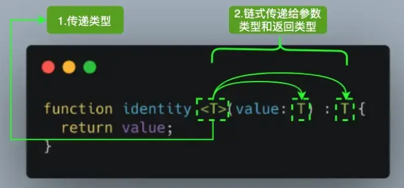

## 1.搭建学习环境

1. 安装最新版typescript

   ```
   npm i -g typescript
   ```

2. 安装ts-node

   ```
   npm i -g ts-node
   ```

3. 创建一个 tsconfig.json 文件

   ```
   tsc --init
   ```

## 2.官方playground

https://www.typescriptlang.org/zh/play?#code/Q

## 3.基础数据类型

### 3.1 JS 的八种内置类型

```
let str: string = 'liuguwoei'
let num: number = 18
let boool: boolean = false
let u: undefined = undefined
let n: null = null
let obj: object = {x: 1}
let big: bigint = 100n // tsconfig.json target 需配置到不低于es2020
let sym: symbol = Symbol('me')
```

### 3.2 注意点

#### 3.2.1 null 和 undefined

- null 和 undefined 是所有类型的子类型，可以把null 和 undefined 赋值给其他类型

- 但是需要把 tsconfig.json 中 strictNullChecks: false

  ```
  // null 和 undefined 注意点
  let nameString: string = 'well'
  nameString = null
  nameString = undefined
  ```

#### 3.2.2 number 和 bigint

```
// null 和 bigint 都表示数字，但是这两个类型不兼容
let bigInt: bigint =  100n;
let numNum: number = 6;
// bigInt = numNum;
```

## 4.其他类型

### 4.1 Array

1. 对数组类型定义的两种方式

   **必须定义至少一个类型参数，如 Number，string**

   ```
   let arrNum:Array<number> = [1,2,3]
   let arrStr:string[] = ['well', 'liu', 'guowei']
   ```

2. 定义联合类型数组

   **通过 | **

   ```
   // 定义联合类型数组
   let arr:(number | string | {})[]
   arr = [1, 'well', {}]
   ```

3. 定义知道对象成员的数组

   ```
   // 定义指定对象成员的数组
   interface arrObj {
       name: string,
       age: number
   }
   
   let arrObj:arrObj[] = [
       {
           name: 'well',
           age: 22
       }
   ]
   ```


### 4.2 函数

1. 函数声明

   ```
   // 函数声明
   function sum(x: number, y: number): number {
       return x + y
   }
   ```

2. 函数表达式

   ```
   // 完整表达式
   const mySum: (x: number, y: number) => number =  (x: number, y: number): number => x + y
   // 省略左边
   const mySum1 = (x: number, y: number) => x + y
   // 省略右边
   const mySum2: (x: number, y: number) => number = (x, y) => x + y
   ```

3. 接口定义函数类型

   ```
   // 接口定义函数类型
   interface myName {
       (firstName: string, lastName: string): string
   }
   const myNameFn: myName = (firstName: string, lastName: string) => firstName + lastName
   console.log(myNameFn('liu', 'guowei'))
   ```

4. 可选参数

   注意点： 可选参数后面不允许再出现必须参数

   ```
   function buildName(firstName: string, lastName?: string) {
       if (lastName) {
           return firstName + ' ' + lastName
       } else {
           return firstName
       }
   }
   console.log(buildName('well'))
   ```

5. 参数默认值

   ```
   function buildSpecialName(firstName: string, lastName: string = 'liu'): string {
       return firstName + ' ' + lastName
   }
   ```

6. 剩余参数

   ```
   function push(array: any[], ...items: any[]) {
       items.forEach(item => array.push(item))
       console.log(array)
   }
   console.log(push([], 1,2,3)) // [1,2,3]
   ```

7. 函数重载

   ```
   // 函数重载
   type Types = number | string
   function add(a:number,b:number):number;
   function add(a: string, b: string): string;
   function add(a: string, b: number): string;
   function add(a: number, b: string): string;
   function add(a:Types, b:Types) {
     if (typeof a === 'string' || typeof b === 'string') {
       return a.toString() + b.toString();
     }
     return a + b;
   }
   const result1 = add('Semlinker', ' Kakuqo');
   const result2 = add(1, 2);
   console.log(result1) // Semlinker Kakuqo
   console.log(result2) // 3
   ```


### 4.3 元组

1. 元组定义

   众所周知，数组一般由同种类型的值组成，但有时我们需要在单个变量中存储不同类型的值，这时候我们就可以使用元组。在 JavaScript 中是没有元组的，元组是 TypeScript 中特有的类型，其工作方式类似于数组。

   元组最重要的特性是可以限制**数组元素的个数和类型**，它特别适合用来实现多值返回。

   ```
   let x: [string, number]
   x = ['hello', 10]
   // x = ['hello', 10, 10]
   // x = [10, 'hello']
   ```

2. 元组类型的解构赋值

   ```
   let employee: [number, string] = [1, 'student']
   let [id, username] = employee
   console.log(id, username) // 1 student
   ```

3. 元组类型的可选元素

   ```
   let optionalTuple: [string, boolean?]
   optionalTuple = ['well', true]
   console.log(optionalTuple) // [ 'well', true ]
   optionalTuple = ['well']
   console.log(optionalTuple) // [ 'well' ]
   ```

4. 元组类型的剩余参数

   自己尝试未见生效

   ```
   type RestTupleType = [number, ...string[]]
   let restTuple: RestTupleType = [666, "Semlinker", "Kakuqo", "Lolo"]
   console.log(restTuple[0]) // 666
   console.log(restTuple[1]) // Semlinker
   ```

5. 只读的元组类型

```
const point: readonly [number, number] = [10, 10]
// point[0] = 1 error
```

### 4.4 void

- `void`表示没有任何类型，和其他类型是平等关系
- 如果tsconfig.json 中 strictNullChecks 为 false，则可以赋值 null 和 undefined

```
let a: void
a = null
a = undefined
```

### 4.5 never

`never`类型表示的是那些永不存在的值的类型。

```
let ne: never
let nev: never
let an: any

ne = nev
// ne = an // error
```

### 4.6 any

任何类型都可以被归为 any 类型。这让 any 类型成为了类型系统的顶级类型

```
let param: any
param = 1
param = '123'

```

### 4.7 unknown

unknown 与 any 一样，所有类型的值都可以赋值给它

```
let notSure: unknown = 4
notSure = 'string'
notSure = [1, 2, 3]
```

any 类型可以赋值给任何类型，unknown 类型只能赋值给 unknown 和 any

```
let nameString = 'well'
// nameString = notSure // error
let notSureA: unknown = 2
notSure = notSureA
let anyA: any = 2
anyA = notSure
```

### 4.8 注意点

原始类型与包装类型

```
// 原始类型和包装类型
// 原始类型如： number、string、boolean、symbol
// 包装类如： Number、String、Boolean、Symbol
// 不要使用对象类型来注解值的类型，因为这没有任何意义
let numA: number = 1
let numB: Number = 2
numB = numA
// numA = numB // error
```

## 5. 类型推断

具有初始化值的变量、有默认值的函数参数、函数返回的类型都可以根据上下文推断出来。

1. 如果声明变量有初始值

   ```
   let myStrA: string = '123'
   // myStrA = 123 // error 不能将类型“number”分配给类型“string”
   let myStrB = '123'
   // myStrB = 123 // error 不能将类型“number”分配给类型“string”
   ```

2. 默认值函数类型、函数返回类型

   ```
   function add(a: number, b = 2) {
       return a + b
   }
   const x1 = add(2)
   const x2 = add(2, 1)
   // const x3 = add(2, '1') error
   ```

## 6.类型断言

1. 类型断言演示与语法

   - <number>
   - as number
   - 更推荐 as 语法，尖括号语法在jsx上有冲突

   ```
   const arrayNumber: number[] = [1, 2, 3, 4]
   // const greaterThan2: number = arrayNumber.find(num => num > 2)
   // error 不能将类型“number | undefined”分配给类型“number”
   // 因为在ts看来，可能不存在>2的情况为undefined
   // 语法
   const greaterThan2: number = arrayNumber.find(num => num > 2) as number
   const greaterThan3: number = (<number>arrayNumber.find(num => num > 2))
   ```

2. 非空断言

   ```
   let mayNullOrUndefinedOrString: null | undefined | string
   mayNullOrUndefinedOrString!.toString() // ok
   // mayNullOrUndefinedOrString.toString() // error
   ```

3. 确定赋值断言

   let x!: number, ts 编译器就会知道该属性被明确地赋值

   ```
   // let x: number
   let x!: number
   initialize()
   console.log(x *2)
   function initialize() {
       x = 10
   }
   ```


## 7.字面量类型

TypeScript 支持 3 种字面量类型：字符串字面量类型、数字字面量类型、布尔字面量类型。

1. 字符串字面量

   ```
   // 字符串字面量
   let specifiedStr: 'this is string' = 'this is string'
   let specifiedNum: 1 = 1
   let specifiedBoolean: true = true
   
   // 字面量类型与子类型的区别,相当于父类与子类的区别
   let str: string = 'any string'
   str = specifiedStr
   // specifiedStr = str // error 不能将类型“string”分配给类型“"this is string"”
   
   // 应用场景-字面量联合类型
   type Direction = 'up' | 'down'
   function move(dir: Direction) {
       console.log(dir)
   }
   move('up')
   // move('left') // 类型“"left"”的参数不能赋给类型“Direction”的参数
   ```

2. 数字字面量类型及不二字面量类型

   ```
   interface Config {
       size: 'small' | 'big';
       isEnable:  true | false;
       margin: 0 | 2 | 4;
   }
   ```

3.  let 和 const 分析

   const 定义为一个不可变更的常量，在缺省类型注解的情况下，TypeScript 推断出它的类型直接由赋值字面量的类型决定

   ```
   {
       const str = 'this is string' // str: "this is string"
   }
   {
       let str = 'this is string' // str: string
   }
   ```

   

## 8. 联合类型、类型别名、交叉类型

1. 联合类型

   ```
   let myFavoriteNumber: string | number
   myFavoriteNumber = 'one'
   myFavoriteNumber = 1
   ```

2. 类型别名

   ```
   type Message = string | string[]
   let greet = (message: Message) => {
       console.log(message)
   }
   greet('well')
   greet(['liu', 'guo', 'wei'])
   ```

3. 交叉类型

   交叉类型是将多个类型合并为一个类型

   如果同名属性类型不兼容，则两个原子类型的交叉类型为 never，赋别的值会冲突

   ```
   // 合并原子类型没有意义，因为不存在，肯定为never
   {
       type Useless = string & number;
   }
   // 将多个接口类型合并成一个类型
   type IntersectionType = { id: number; name: string; } & { age: number };
   const mixed: IntersectionType = {
     id: 1,
     name: 'name',
     age: 18
   }
   
   // 类型冲突
   /* type IntersectionTypeConfit = { id: number} & { id: string}
   const mixedConfit: IntersectionTypeConfit = {
       id: 1 // 不能将类型“number”分配给类型“never”
   } */
   ```

## 9. 接口

### 9.1 什么是接口

面向对象语言中，接口（Interfaces）是对行为的抽象，而具体如何行动需要由类（classes）去实现（implement）。

TypeScript 中的接口是一个非常灵活的概念，除了可用于[对类的一部分行为进行抽象]以外，也常用于对「对象的形状（Shape）」进行描述

### 9.2 一个简单的例子

```
// 一个简单的例子
interface Person {
    name: string,
    age: number
}
// 定义的变量属性必须为 name和age，不能多也不能少
let tom: Person = {
    name: 'tom',
    age: 18,
}
```

### 9.3 可选 | 只读属性

```
// 定义的变量属性必须为 name和age，不能多也不能少
let tom: Person = {
    name: 'tom',
    age: 18,
}

// 可选 | 只读属性
interface Animal {
    readonly name: string,
    age?: number
}
let mike: Animal = {
    name: 'mike'
}
// mike.name = 'abc' // 无法分配到 "name" ，因为它是只读属性。
```

### 9.4 任意属性

**一旦定义了任意属性，那么确定属性和可选属性的类型都必须是它的类型的子集**

**任意属性只能有一个，如果接口中有多个类型的属性，则可以在任意属性中使用联合类型**

```
interface PersonB {
    name: string;
    age?: number; // error 类型“number | undefined”的属性“age”不能赋给“string”索引类型“string”。
    [propName: string]: string;
}
```

**由于任意类型是 string, 而上面确定属性和可选属性的类型不是string的子属性所以报错**

```
interface PersonB {
    name: string;
    age?: number; 
    [propName: string]: string | number | undefined;
}
let peter: PersonB = {
    name: 'peter',
    age: 10,
    gender: 'male',
    length: 100
}
```

### 9.5 鸭式辨形法

```
interface LabeledValue {
    label: string;
}
function printLabel(labeledObj: LabeledValue) {
console.log(labeledObj.label);
}
let myObj = { size: 10, label: "Size 10 Object" }
printLabel(myObj); // OK
// printLabel({ size: 10, label: "Size 10 Object" }) // error
```

在参数里写对象就相当于是直接给`labeledObj`赋值，这个对象有严格的类型定义，所以不能多参或少参。

如果是在外面用另一个变量接收，则不会经过额外属性检查。

### 9.6 绕开额外属性检查的方式

1. 鸭式辨型法

2. 类型断言

3. 索引签名

   ```
   // 类型断言
   interface Props { 
   	name: string; 
   	age: number; 
   	money?: number;
   }
   let p: Props = {
   	name: "兔神",
   	age: 25,
   	money: -100000,
   	girl: false
   } as Props; // OK
   
   // 索引签名
   interface PropsB { 
   	name: string; 
   	age: number; 
   	money?: number;
   	[key: string]: any;
   }
   let b: PropsB = {
   	name: "兔神",
   	age: 25,
   	money: -100000,
   	girl: false
   }; // OK
   ```


## 10. 接口与类型别名的区别

### 10.1 概念

1. 接口
   - TypeScript 的核心原则之一是对值所具有的结构进行类型检查
   - 接口的作用就是为这些类型命名和为你的代码或第三方代码定义数据模型
2. 别名
   - type(类型别名)会给一个类型起个新名字，不会新建一个类型 - 它创建了一个新 名字来引用那个类型

### 10.2 Objects/Functions

两者都可以用来描述对象或函数的类型，但是语法不同

```
interface Point {
    x: number,
    y: number
}
interface SetPoint {
    (x: number, y: number): void
}
type PointType = {
    x: number;
    y: number;
}
type SetPointType = (x: number, y:number) => void
```

### 10.3 Other Types

与接口不同，类型别名还可以用于其他类型，如基本类型（原始值）、联合类型、元组

```
// object
type PartialPointX = { x: number; };
type PartialPointY = { y: number; };
// union
type PartialPoint = PartialPointX | PartialPointY;
// tuple
type Data = [number, string];
```

### 10.4 接口可以定义多次，类型别名不可以

```
interface Class {
    name: string
}
interface Class {
    no: number
}
```

### 10.5 扩展

- 接口可以扩展类型别名，类型别名也可以扩展接口

- 接口的扩展通过继承，通过 extends 实现

- 类型别名扩展就是交叉类型， 通过 & 实现

  ```
  // 扩展-接口扩展接口
  interface PointX {
      x: number
  }
  interface MyPoint extends PointX {
      y: number
  }
  // 类型别名扩展类型别名
  type PointY = {
      X: number
  }
  type MyPointY = PointX & {
      y: number
  }
  // 接口扩展类型别名
  type PointZ = {
      x: number
  }
  interface MyPointZ extends PointZ {
      y: number
  }
  // 类型别名扩展接口
  interface PointD {
      x: number
  }
  type MyPointD = PointD & {
      y: number
  }
  ```

## 11.泛型

### 11.1 泛型介绍

如果不使用泛型的话，函数的入参和返回值可以是任意类型，如果需要增加类型声明，则需要复制，重新命名。

泛型是一个抽象类型，只有在调用的时候才确定它的值。

不只是能定义一个类型变量，可以引入希望定义的任何数量的类型变量。



```
// 泛型介绍
const identity:idBoolean = (arg) => arg
type idBoolean = (arg: boolean) => boolean
type idString = (arg: string) => string
identity(false)
// identity('123') // 类型“string”的参数不能赋给类型“boolean”的参数
function identityT<T>(value: T): T {
    return value
}
function myIdentity<T, U>(value: T, message: U): T {
    console.log(message)
    return value
}
myIdentity(68, "abc")
```

### 11.2 泛型约束

假如我想打印出size属性，如果不进行约束会报错，报错的原因在于 T 理论上是任何类型的，不管使用它的什么方法都会报错（除非这个属性和方法是所有集合共有的）

泛型约束：定义一个类型，让 T 实现这个接口即可

```
interface Sizeable {
    size: number
}
function trace<T extends Sizeable>(value: T): T {
    console.log(value.size)
    return value
}
trace(1)
```


### 11.3 泛型工具类型

#### 11.3.1 基础知识

##### 11.3.1.1 typeof

- 用途：在类型上下文中获取变量或者属性的类型

```
// 基础知识
// 1. typeof
// 获取类型结构
interface Person {
    name: string;
    age: number;
}
const tom: Person = {
    name: 'tom',
    age: 18
}
type Tom = typeof tom
const jerry: Tom = {
    name: 'jerry',
    age: 18
}
// 获取函数对象的类型
function toArray(x: number): number[] {
    return [x]
}
type Func = typeof toArray
let myToArray: Func = (x) => [x]
```

##### 11.3.1.2 keyof

获取某种类型的所有键，其返回类型是联合类型

```
type k1 = keyof Person //  // "name" | "age"
// mike: 类型必须符合k1, 类型、属性缺一不可
let mike: Person = {
    name: 'mike',
    age: 10
}
// 应用
function myProp(obj: object, key: string) {
    return (obj as any)[key];
}
function prop<T extends object, K extends keyof T>(obj: T, key: K) {
return obj[key];
}
myProp(mike, "a")
// prop(mike, "a") // 类型“"a"”的参数不能赋给类型“keyof Person”的参数
```

##### 11.3.1.3 in

可以用来枚举类型

```
type keys = 'name' | 'count'
type Animal = {
    [p in keys]: any
}
/* type Animal = {
    name: any;
    count: any;
} */
let pig: Animal = {
    name: 'pig',
    count: 111
}
```

##### 11.3.1.4 infer

```
type ReturnType<T> = T extends (
  ...args: any[]
) => infer R ? R : any;
```

以上代码中 `infer R` 就是声明一个变量来承载传入函数签名的返回值类型，简单说就是用它取到函数返回值的类型方便之后使用。

```
type ParamsType<T extends (...args: any) => any> = T extends (...args: infer R) => any ? R : any;
const add = (a: number, b: string) => a + b
type TypeAdd = typeof add // (a: number, b: string) => string
type T1 = ParamsType<TypeAdd> // [number, string]
// const arr: T1 = [1, 2] // Error: Type 'number' is not assignable to type 'string'.
```

##### 11.3.1.5 extends

```
interface Lengthwise {
    length: number;
}
function loggingIdentity<T extends Lengthwise>(arg: T): T {
    console.log(arg.length);
    return arg;
}
// loggingIdentity(3)
loggingIdentity({length: 10, value:3 })
```

### 11.4 索引类型

```
let person = {
    name: 'mike',
    age: 18
}
function getValues(person: any, keys: string[]) {
    return keys.map(key => person[key])
}
console.log(getValues(person, ['name', 'age'])) // [ 'mike', 18 ]
console.log(getValues(person, ['gender'])) // [undefined]

function myGetValues<T, K extends keyof T>(person: T, keys: K[]): T[K][] {
    return keys.map(key => person[key])
}
interface MyPerson {
    name: string,
    age: number
}
myGetValues(person, ['name'])
// myGetValues(person, ['gender']) // 不能将类型“"gender"”分配给类型“"name" | "age"”
```

### 11.5 映射类型

根据旧的类型创建出新的类型，我们称之为映射类型

```
interface TestInterface {
    name: string,
    age: number
}
// 我们还可以通过+/-指定添加还是删除
type OptionalTestInterface<T> = {
    [p in keyof T] +?:T[p]
}
type newTestInterface = OptionalTestInterface<TestInterface>
/* type newTestInterface = {
    name?: string | undefined;
    age?: number | undefined;
} */
```

### 11.6 Partial

Partial<T>将类型的属性变成可选。

1. 自定义 Partial

   ```
   /**
    * Partial 实现
    * 1.通过 keyof 拿到 T 所有属性名
    * 2.通过 in 便利属性名并赋值给 P
    * 3.通过T[P]取得相应的属性值与类型
    * 4.中间使用?,用于把属性变为可选
    */
   type myPartial<T> = {
       [P in keyof T]?: T[P]
   }
   ```

2. 举例说明

   ```
   interface UserInfo {
       id: string;
       name: string
   }
   /**
    * 如果不使用 Partial，则必须属性名、属性个数，属性类型符合缺一不可
    */
   /* const mike: UserInfo = {
       id: '1'
   } */
   
   type NewUserInfo = Partial<UserInfo>
   // 使用 Partial 后
   /* type NewUserInfo = {
       id?: string | undefined;
       name?: string | undefined;
   } */
   const tom: NewUserInfo = {
       name: 'tom'
   }
   ```

3. DeepPartial

   DeepPartial  只支持处理第一层的属性，如果需要处理多层，则需自己手动实现。

   手动实现的，大于第一层的属性名和属性类型要一致，不能出现不存在的属性名。

   ```
   interface userInfoDeep {
       name: string,
       count: {
           math: number,
           english: number 
       }
   }
   type NewUserInfoDeep = Partial<userInfoDeep>
   /* const mike: NewUserInfoDeep = {
       count: {
           chinese: 100
       }
   } */
   
   type DeepPartial<T> = {
       // 如果是 object， 则递归类型
       [U in keyof T] ?: T[U] extends object
           ? DeepPartial<T[U]>
           : T[U]
   } 
   
   type NewUserInfoDeepPar = DeepPartial<userInfoDeep>
   /* type NewUserInfoDeepPar = {
       name?: string | undefined;
       count?: DeepPartial<{
           math: number;
           english: number;
       }> | undefined;
   } */
   const mike: NewUserInfoDeepPar = {
       count: {
           math: 10
       }
   }
   ```

### 11.7 Required

Required将类型的属性变成必选

1.  自定义实现

   ```
   /**
    * 自定义实现
    * -? 是代表除 ? 这个 modifier 的标识
    */
   type MyRequired<T> = {
       [P in keyof T] -?: T[P]
   }
   ```

2. 举例说明

   ```
   interface Todo {
       title: string
   }
   type TodoRequired = Required<Todo>
   let todyTodo: TodoRequired = {
       title: '学习'
   }
   ```

### 11.8 Readonly

`Readonly<T>` 的作用是将某个类型所有属性变为只读属性，也就意味着这些属性不能被重新赋值。

```
/**
 * 自定义实现
 */
 type MyReadonly<T> = {
    readonly[P in keyof T]: T[P]
}

interface List {
    title: string
}

const listReadonly: Readonly<List> = {
    title: 'abc'
}
// listReadonly.title = '123' // 无法分配到 "title" ，因为它是只读属性。
```

### 11.9 Pick

Pick 从某个类型中挑出一些属性出来

```
type MyPick<T, K extends keyof T> = {
    [P in K]: T[P]
}

interface subject {
    title: string,
    description: string,
    completed: boolean
}
type subjectPreview = Pick<subject, "title" | "completed">
/* type subjectPreview = {
    title: string;
    completed: boolean;
} */
const mySubject: subjectPreview = {
    title: 'chinese',
    completed: false,
}
```

### 11.10 Record

`Record<K extends keyof any, T>` 的作用是将 `K` 中所有的属性的值转化为 `T` 类型。

```
type MyRecord<K extends keyof any, T> = {
    [P in K]: T
}

interface PageInfo {
    title: string;
}
type Page = "home" | "about" | "contact"
type pageRecord = Record<Page, PageInfo>
/* type pageRecord = {
    home: PageInfo;
    about: PageInfo;
    contact: PageInfo;
} */
const x: Record<Page, PageInfo> = {
    about: {
        title: "about"
    },
    home: {
        title: "home"
    },
    contact: {
        title: "contact"
    },
}
```

### 11.11 ReturnType

用来得到一个函数的返回值类型

```
/**
 * 自定义实现
 * 1. infer 在这里用于提取函数类型的返回值
 * 2.ReturnType<T> 只是将 infer R 从参数位置移动到返回值位置，因此此时 R 即是表示待推断的返回值类型
 */
type MyReturnType<T extends (...args: any[]) => any> = T extends (
    ...args: any[]
) => infer R
    ? R
    : any

type Func = (value: number) => string
type FuncReturnType = ReturnType<Func>
// type FuncReturnType = string
const foo: ReturnType<Func> = "1"
```

### 11.12 Exclude

`Exclude<T, U>` 的作用是将某个类型中属于另一个的类型移除掉。

```
type MyExclude<T, U> = T extends U ? never : T

type T0 = Exclude<"a" | "b" | "c", "a">
// type T0 = "b" | "c"
type T1 = Exclude<string | number | boolean, number>
// type T1 = string | boolean
// let t1: T1 = 1 // 不能将类型“1”分配给类型“T1”
let t2: T1 = '1'
```

### 11.13 Omit

`Omit<T, K extends keyof any>` 的作用是使用 `T` 类型中除了 `K` 类型的所有属性，来构造一个新的类型。

```
type MyOmit<T, K extends keyof any> = Pick<T, Exclude<keyof T, K>>

interface Jobs {
    title: string;
    desc: string;
    saray: number;
}
type JobsOmit = Omit<Jobs, "desc">
/* type JobsOmit = {
    title: string;
    saray: number;
} */
const MyJob: JobsOmit = {
    title: '切图仔',
    saray: 200
}
```

### 11.14 NonNullable

`NonNullable<T>` 的作用是用来过滤类型中的 `null` 及 `undefined` 类型。

```
type MyNonNullable<T> = T extends null | undefined ? never : T

type MyT = NonNullable<string | number | undefined>
// type MyT = string | number
```

### 11.15 Parameters

`Parameters<T>` 的作用是用于获得函数的参数类型组成的元组类型。

```
type MyParameters<T extends (...args: any) => any> = T extends (...args: infer P) => any
? P : never;

type A = Parameters<() =>void> // []
type B = Parameters<typeof Array.isArray> // [any]
type C = Parameters<typeof parseInt> // [string, (number | undefined)?]
type D = Parameters<typeof Math.max> // number[]
```

## 12.tsconfig.json

### 12.1 重要字段

- files - 设置要编译的文件的名称。
- include - 设置需要进行编译的文件，支持路径模式匹配。
- exclude - 设置无需进行编译的文件，支持路径模式匹配。
- compilerOptions - 设置与编译流程相关的选项。

### 12.2 complierOptions 选项

```
{
  "compilerOptions": {
  
    /* 基本选项 */
    "target": "es5",                       // 指定 ECMAScript 目标版本: 'ES3' (default), 'ES5', 'ES6'/'ES2015', 'ES2016', 'ES2017', or 'ESNEXT'
    "module": "commonjs",                  // 指定使用模块: 'commonjs', 'amd', 'system', 'umd' or 'es2015'
    "lib": [],                             // 指定要包含在编译中的库文件
    "allowJs": true,                       // 允许编译 javascript 文件
    "checkJs": true,                       // 报告 javascript 文件中的错误
    "jsx": "preserve",                     // 指定 jsx 代码的生成: 'preserve', 'react-native', or 'react'
    "declaration": true,                   // 生成相应的 '.d.ts' 文件
    "sourceMap": true,                     // 生成相应的 '.map' 文件
    "outFile": "./",                       // 将输出文件合并为一个文件
    "outDir": "./",                        // 指定输出目录
    "rootDir": "./",                       // 用来控制输出目录结构 --outDir.
    "removeComments": true,                // 删除编译后的所有的注释
    "noEmit": true,                        // 不生成输出文件
    "importHelpers": true,                 // 从 tslib 导入辅助工具函数
    "isolatedModules": true,               // 将每个文件做为单独的模块 （与 'ts.transpileModule' 类似）.

    /* 严格的类型检查选项 */
    "strict": true,                        // 启用所有严格类型检查选项
    "noImplicitAny": true,                 // 在表达式和声明上有隐含的 any类型时报错
    "strictNullChecks": true,              // 启用严格的 null 检查
    "noImplicitThis": true,                // 当 this 表达式值为 any 类型的时候，生成一个错误
    "alwaysStrict": true,                  // 以严格模式检查每个模块，并在每个文件里加入 'use strict'

    /* 额外的检查 */
    "noUnusedLocals": true,                // 有未使用的变量时，抛出错误
    "noUnusedParameters": true,            // 有未使用的参数时，抛出错误
    "noImplicitReturns": true,             // 并不是所有函数里的代码都有返回值时，抛出错误
    "noFallthroughCasesInSwitch": true,    // 报告 switch 语句的 fallthrough 错误。（即，不允许 switch 的 case 语句贯穿）

    /* 模块解析选项 */
    "moduleResolution": "node",            // 选择模块解析策略： 'node' (Node.js) or 'classic' (TypeScript pre-1.6)
    "baseUrl": "./",                       // 用于解析非相对模块名称的基目录
    "paths": {},                           // 模块名到基于 baseUrl 的路径映射的列表
    "rootDirs": [],                        // 根文件夹列表，其组合内容表示项目运行时的结构内容
    "typeRoots": [],                       // 包含类型声明的文件列表
    "types": [],                           // 需要包含的类型声明文件名列表
    "allowSyntheticDefaultImports": true,  // 允许从没有设置默认导出的模块中默认导入。

    /* Source Map Options */
    "sourceRoot": "./",                    // 指定调试器应该找到 TypeScript 文件而不是源文件的位置
    "mapRoot": "./",                       // 指定调试器应该找到映射文件而不是生成文件的位置
    "inlineSourceMap": true,               // 生成单个 soucemaps 文件，而不是将 sourcemaps 生成不同的文件
    "inlineSources": true,                 // 将代码与 sourcemaps 生成到一个文件中，要求同时设置了 --inlineSourceMap 或 --sourceMap 属性

    /* 其他选项 */
    "experimentalDecorators": true,        // 启用装饰器
    "emitDecoratorMetadata": true          // 为装饰器提供元数据的支持
  }
}
```

