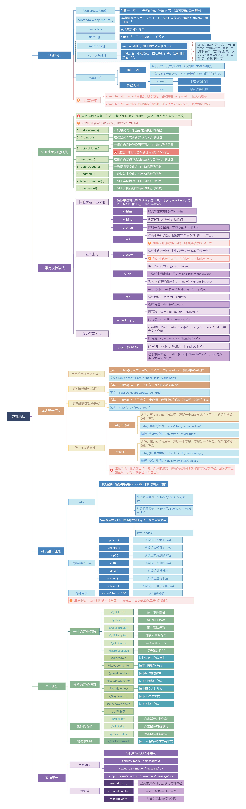
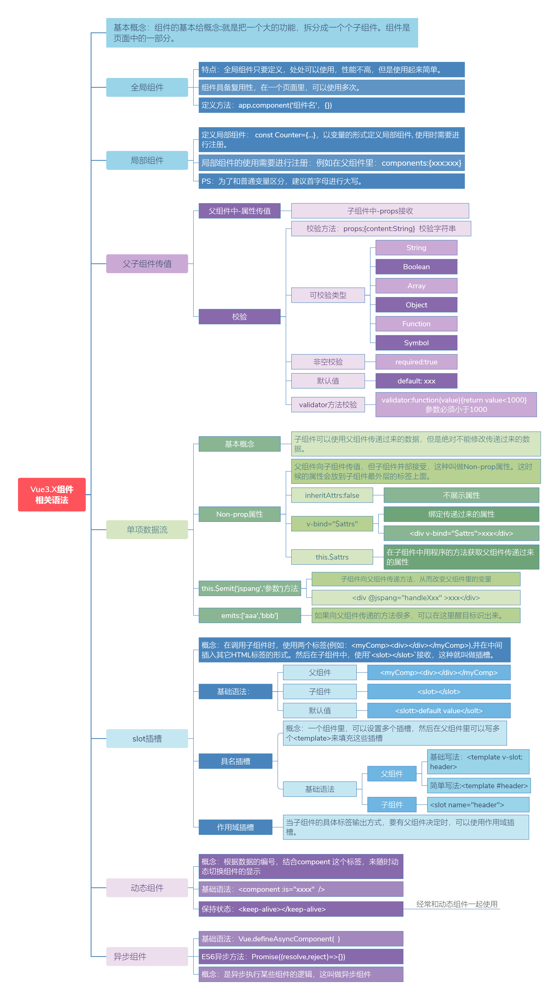
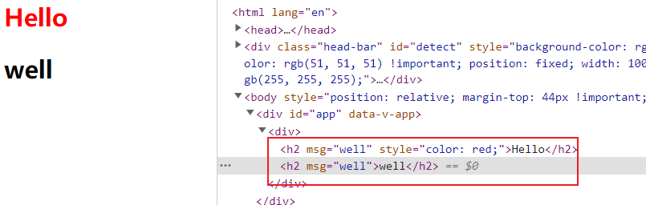
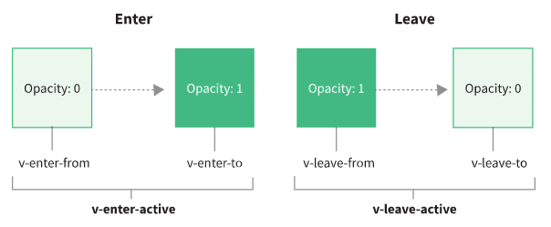
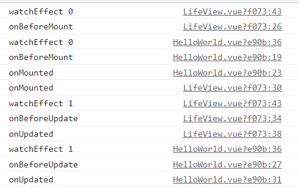

## 1.基础知识



## 2.组件相关语法



### 2.1 全局组件

```
<!DOCTYPE html>
<html lang="en">
<head>
    <meta charset="UTF-8">
    <meta http-equiv="X-UA-Compatible" content="IE=edge">
    <meta name="viewport" content="width=device-width, initial-scale=1.0">
    <title>Document</title>
    <script src="https://unpkg.com/vue@next"></script>
</head>
<body>
    <div id='app'>
    </div>
</body>
<script>
    const app = Vue.createApp({
        template: `
            <website/>
            <describe/>
            <count/>
        `
    })
    app.component('website', {
        template: `
            <h2>www.baidu.com</h2>
        `
    })
    app.component('describe', {
        template: `
            <h2>百度</h2>
        `
    })
    app.component('count', {
        data () {
            return {
                count: 0
            }
        },
        template: `
            <div>
                {{count}}
                <button @click="count++">+1</button>    
            </div>
        `
    })
    const vm = app.mount('#app')
</script>
</html>
```

- 注册： app.component('组件名', {})

### 2.2 局部组件

```
<!DOCTYPE html>
<html lang="en">
<head>
    <meta charset="UTF-8">
    <meta http-equiv="X-UA-Compatible" content="IE=edge">
    <meta name="viewport" content="width=device-width, initial-scale=1.0">
    <title>Document</title>
    <script src="https://unpkg.com/vue@next"></script>
</head>
<body>
    <div id='app'>
    </div>
</body>
<script>
    const count = ('count', {
        data () {
            return {
                count: 0
            }
        },
        template: `
            <div>
                {{count}}
                <button @click="count++">+1</button>    
            </div>
        `
    })
    const app = Vue.createApp({
        components: {
            count
        },
        template: `
            <count/>
        `
    })
    const vm = app.mount('#app')
</script>
</html>
```

### 2.3 父子组件的动态与静态传值

```
<!DOCTYPE html>
<html lang="en">
<head>
    <meta charset="UTF-8">
    <meta http-equiv="X-UA-Compatible" content="IE=edge">
    <meta name="viewport" content="width=device-width, initial-scale=1.0">
    <title>Document</title>
    <script src="https://unpkg.com/vue@next"></script>
</head>
<body>
    <div id='app'>
    </div>
</body>
<script>
    const son = ('son', {
        props: ['name', 'cname', 'hello'],
        template: `
            <div>
                <div @click="handleClick">打招呼</div>
                <div>{{name}}</div>
                <div>{{cname}}</div>
            </div>
        `,
        methods: {
            handleClick () {
                this.hello()
            }
        }
    })
    const app = Vue.createApp({
        data () {
            return {
                cname: '刘国威',
                hello: () => {
                    alert(`我是${this.cname}`)
                }
            }
        },
        components: {
            son
        },
        template: `
            <son name="well" :cname="cname" :hello="hello"  />
        `
    })
    const vm = app.mount('#app')
</script>
</html>
```

- 静态传的值都是 string 类型
- 动态传值，传data里的值，包括data的值如果是方法
- 在 data 里可以通过 this.×××直接访问

### 2.4 组件传值校验操作

```
<!DOCTYPE html>
<html lang="en">
<head>
    <meta charset="UTF-8">
    <meta http-equiv="X-UA-Compatible" content="IE=edge">
    <meta name="viewport" content="width=device-width, initial-scale=1.0">
    <title>Document</title>
    <script src="https://unpkg.com/vue@next"></script>
</head>
<body>
    <div id='app'>
    </div>
</body>
<script>
    const son = ('son', {
        props: {
            name: {
                type: String,
                required: true,
                validator: function (value) {
                    return value.search('well') !== -1
                },
                default: 'well'
            },
            cname: {
                typee: String,
                required: false
            },
            hello: {
                type: Function,
                required: false,
                default: function () {
                    alert(`我是${this.name}`)
                }
            }
        },
        template: `
            <div>
                <div @click="handleClick">打招呼</div>
                <div>{{name}}</div>
                <div>{{cname}}</div>
            </div>
        `,
        methods: {
            handleClick () {
                this.hello()
            }
        }
    })
    const app = Vue.createApp({
        data () {
            return {
                cname: '刘国威',
                hello: () => {
                    alert(`我是${this.cname}`)
                }
            }
        },
        components: {
            son
        },
        template: `
            <son name="123" :cname="cname" />
        `
    })
    const vm = app.mount('#app')
</script>
</html>
```

- name: 静态传值了'123',校验未通过，会提示
- type、required、validator、default
- 在 props 中不要使用箭头函数，箭头函数没有this，会往上找到了window。

### 2.5 单向数据流机制

```
<!DOCTYPE html>
<html lang="en">
<head>
    <meta charset="UTF-8">
    <meta http-equiv="X-UA-Compatible" content="IE=edge">
    <meta name="viewport" content="width=device-width, initial-scale=1.0">
    <title>Document</title>
    <script src="https://unpkg.com/vue@next"></script>
</head>
<body>
    <div id='app'>
    </div>
</body>
<script>
    const count = ('count', {
        props: ['count'],
        data() {
            return {
                newCount: this.count
            }
        },
        template: `
            <div>
                {{count}}
                <button @click="count++">+1</button>    
            </div>
            <div>
                {{newCount}}
                <button @click="newCount++">+1</button>    
            </div>
        `
    })
    const app = Vue.createApp({
        components: {
            count
        },
        data () {
            return {
                count: 0
            }
        },
        template: `
            <count :count="count" />
        `
    })
    const vm = app.mount('#app')
</script>
</html>
```

- 不能直接更改父组件传过来的值
- 如果需要改变，可以在data中接受

### 2.6 non-props 使用技巧

**什么是non-props?**

- 子组件没有接受父组件传递过来的参数
- 而子组件完全不变地复制了属性到根标签
- inheritAttrs: false ，禁用组件的根元素继承 attribute

```
<!DOCTYPE html>
<html lang="en">
<head>
    <meta charset="UTF-8">
    <meta http-equiv="X-UA-Compatible" content="IE=edge">
    <meta name="viewport" content="width=device-width, initial-scale=1.0">
    <title>Document</title>
    <script src="https://unpkg.com/vue@next"></script>
</head>
<body>
    <div id='app'>
    </div>
</body>
<script>
    const app = Vue.createApp({
        template: `
            <hello style="color: red;" msg="well" />
        `
    })
    app.component('Hello', {
        inheritAttrs: false,
        template: `
            <div>
                <h2 v-bind="$attrs">Hello</h2>
                <h2 :msg="$attrs.msg">{{$attrs.msg}}</h2>
            </div>
        `,
        mounted () {
            console.log(this.$attrs.msg) // well
        } 
    })
    const vm = app.mount('#app')
</script>
</html>
```



### 2.7 组件传值

```
<!DOCTYPE html>
<html lang="en">
<head>
    <meta charset="UTF-8">
    <meta http-equiv="X-UA-Compatible" content="IE=edge">
    <meta name="viewport" content="width=device-width, initial-scale=1.0">
    <title>Document</title>
    <script src="https://unpkg.com/vue@next"></script>
</head>
<body>
    <div id='app'>
    </div>
</body>
<script>
    const count = ('count', {
        props: {
            count: {
                type: Number,
                required: false,
                default: 0
            },
            show: {
                type: Boolean,
                required: false,
                default: true
            }
        },
        emits: ['update:count', 'update:show'],
        template: `
            <div>
                {{count}}
                <button @click="addOne">+1</button>
                <button @click="showHide">{{show ? '隐藏' : '显示'}}</button>
            </div>
        `,
        methods: {
            addOne () {
                this.$emit('update:count', this.count + 1)
            },
            showHide () {
                this.$emit('update:show', !this.show)
            }
        }
    })
    const app = Vue.createApp({
        components: {
            count
        },
        data () {
            return {
                count: 0,
                show: true
            }
        },
        template: `
            <div>{{count}}</div>
            <count
                v-model:show="show"
                v-model:count="count"
            />
        `
    })
    const vm = app.mount('#app')
</script>
</html>
```

- 父组件使用可以使用多个 v-model
  - v-model:show="show"
  - v-model:count="count"
- 子组件中，可以通过this.$emit()双向绑定改值
  - this.$emit('update:count')
  - this.$emit('update:show')

### 2.8 组件中插槽的使用

```
<!DOCTYPE html>
<html lang="en">
<head>
    <meta charset="UTF-8">
    <meta http-equiv="X-UA-Compatible" content="IE=edge">
    <meta name="viewport" content="width=device-width, initial-scale=1.0">
    <title>Document</title>
    <script src="https://unpkg.com/vue@next"></script>
</head>
<body>
    <div id='app'>
    </div>
</body>
<script>
    const app = Vue.createApp({
        template: `
            <h2>欢迎光临红色浪漫-请选择您的技师</h2>
            <ji-shi>
                <div style="color: red">小红</div>
                <div>
                    <project />    
                </div>   
            </ji-shi>
        `
    })
    app.component('JiShi', {
        template: `
            <div>
                <span>经过您的慎重考虑，最终选择了</span>    
                <span>
                    <slot></slot>    
                </span>    
            </div>
        `
    })
    app.component('project', {
        template: `
            <span style="color: blue;">
                project 组件    
            </span>
        `
    })
    const vm = app.mount('#app')
</script>
</html>
```

- 在子组件中通过 <slot></slot>预备一个插槽
- 插槽中可以简单插入一个值，也可以插入一个组件

### 2.9 插槽默认值与具名插槽

```
<!DOCTYPE html>
<html lang="en">
<head>
    <meta charset="UTF-8">
    <meta http-equiv="X-UA-Compatible" content="IE=edge">
    <meta name="viewport" content="width=device-width, initial-scale=1.0">
    <title>Document</title>
    <script src="https://unpkg.com/vue@next"></script>
</head>
<body>
    <div id='app'>
    </div>
</body>
<script>
    const app = Vue.createApp({
        template: `
            <h2>欢迎光临红色浪漫-请选择您的技师</h2>
            <ji-shi>
                <template v-slot:one>
                    <span>one 具名插槽</span>
                </template>
                <template #two>
                    <span>two 具名插槽(简写)</span>
                </template>
            </ji-shi>
        `
    })
    app.component('JiShi', {
        template: `
            <div>
                你选择了
                <slot>
                    <span style="color: green">请选择（插槽默认值）</span>
                </slot>    
                <slot name="one"></slot>
                <slot name="two"></slot>
                <slot name="three"></slot>
            </div>
        `
    })
    const vm = app.mount('#app')
</script>
</html>
```

- 默认值： 子组件slot中直接写
- 具名插槽
  - 子组件中 slot 中给name 值
  - 父组件中 template 使用，v-slot: name 或 #name

### 2.10 作用域插槽

```
<!DOCTYPE html>
<html lang="en">
<head>
    <meta charset="UTF-8">
    <meta http-equiv="X-UA-Compatible" content="IE=edge">
    <meta name="viewport" content="width=device-width, initial-scale=1.0">
    <title>Document</title>
    <script src="https://unpkg.com/vue@next"></script>
</head>
<body>
    <div id='app'>
    </div>
</body>
<script>
    const app = Vue.createApp({
        template: `
            <h2>欢迎光临红色浪漫-请选择您的技师</h2>
            <list v-slot="props">
                <span>{{props.item}}</span>
            </list>
            <list v-slot="{item}">
                <span>{{item}}</span>
            </list>
        `
    })
    app.component('List', {
        data () {
            return {
                list: [
                    '大脚',
                    '刘英',
                    '小红'
                ]
            }
        },
        template: `
            <div>
                <slot :item="item" v-for="item in list" />
            </div>
        `
    })
    const vm = app.mount('#app')
</script>
</html>
```

- 子组件通过在 slot 中 属性传值给父组件

  ```
  <slot :item="item" />
  ```

- 父组件通过v-slot="props" 接收，但是接受到的是一个对象

- 可以v-slot="{{item}}" 直接获取

### 2.11 动态组件和状态保持

```
<!DOCTYPE html>
<html lang="en">
<head>
    <meta charset="UTF-8">
    <meta http-equiv="X-UA-Compatible" content="IE=edge">
    <meta name="viewport" content="width=device-width, initial-scale=1.0">
    <title>Document</title>
    <script src="https://unpkg.com/vue@next"></script>
</head>
<body>
    <div id='app'>
    </div>
</body>
<script>
    const app = Vue.createApp({
        data () {
            return {
                showComponent: 'dajiao'
            }
        },
        methods: {
            handleClick () {
                this.showComponent = this.showComponent === 'dajiao' ? 'liuyin' : 'dajiao'
            }
        },
        template: `
            <keep-alive>
                <component :is="showComponent" />
            </keep-alive>
            <div>
                <button @click="handleClick">切换</button>    
            </div>
        `
    })
    app.component('dajiao', {
        template: `
            <input />
        `
    })
    app.component('liuyin', {
        template: `
            <div>well</div>
        `
    })
    const vm = app.mount('#app')
</script>
</html>
```

- 可以通过 component :is="组件名" 切换组件
- 再配合上 keep-alive ,既能避免v-if 切换的形式，也可以保持状态

### 2.12 异步组件

```
<!DOCTYPE html>
<html lang="en">
<head>
    <meta charset="UTF-8">
    <meta http-equiv="X-UA-Compatible" content="IE=edge">
    <meta name="viewport" content="width=device-width, initial-scale=1.0">
    <title>Document</title>
    <script src="https://unpkg.com/vue@next"></script>
</head>
<body>
    <div id='app'>
    </div>
</body>
<script>
    const app = Vue.createApp({
        template: `
            <async-component />
        `
    })
    app.component('async-component', Vue.defineAsyncComponent(
        () => {
            return new Promise((resolve, reject) => {
                setTimeout((data = {text: 'asyncComponent'}) => {
                    resolve({
                        template: `
                            <div>${data.text}</div>
                        `
                    })
                })
            })
        }
    ))
    const vm = app.mount('#app')
</script>
</html>
```

### 2.13 provide和inject多级组件传值

```
<!DOCTYPE html>
<html lang="en">
<head>
    <meta charset="UTF-8">
    <meta http-equiv="X-UA-Compatible" content="IE=edge">
    <meta name="viewport" content="width=device-width, initial-scale=1.0">
    <title>Document</title>
    <script src="https://unpkg.com/vue@next"></script>
</head>
<body>
    <div id='app'>
    </div>
</body>
<script>
    const app = Vue.createApp({
        provide: {
            house: '北京别墅一套'
        },
        template: `
            <child></child>
        `
    })
    app.component('child', {
        template: `
            <div>我是子组件</div>
            <child-child></child-child>
        `
    })
    app.component('child-child', {
        inject: ['house'],
        template: `
            <div>我是孙组件</div>
            <div>继承{{house}}</div>
        `
    })
    const vm = app.mount('#app')
</script>
</html>
```

- provide 传递， inject 接收
- 如果需要传 property 的值，如果值要响应式，则看下面文档即可
- https://v3.cn.vuejs.org/guide/component-provide-inject.html#%E5%A4%84%E7%90%86%E5%93%8D%E5%BA%94%E6%80%A7


## 3. 过渡 & 动画

### 3.1 动画

```
<!DOCTYPE html>
<html lang="en">
<head>
    <meta charset="UTF-8">
    <meta http-equiv="X-UA-Compatible" content="IE=edge">
    <meta name="viewport" content="width=device-width, initial-scale=1.0">
    <title>Document</title>
    <style>
        @keyframes comein {
            0% {
                transform: translateX(-100px);
            }
            100% {
                transform: translateX(0px);
            }
        }
        @keyframes comeout {
            0% {
                transform: translateX(0px);
            }
            100% {
                transform: translateX(-120px);
            }
        }
        .v-enter-active {
            animation: comein 1s;
        }
        .v-leave-active {
            animation: comeout 1s;
        }
    </style>
    <script src="https://unpkg.com/vue@next"></script>
</head>
<body>
    <div id='app'>
    </div>
</body>
<script>
    const app = Vue.createApp({
        data () {
            return {
                isShow: false
            }
        },
        methods: {
            handleClick() {
                this.isShow = !this.isShow
            }
        },
        template: `
            <transition>
                <div v-if="isShow">well</div>
            </transition>
            <button @click="handleClick">
                切换动画    
            </button>
        `
    })
    const vm = app.mount('#app')
</script>
</html>
```

- 使用 transition 组件包裹
- 声明动画 @keyframs，在 css 类名切换中使用animation
- 类名如下
  - v-enter-from：进入过渡开始
  - v-enter-active：进入过渡生效
  - v-enter-to：进入过渡结束
  - v-leave-from:离开过渡开始
  - v-leave-active:离开过渡生效
  - v-leave-to: 离开过渡结束
- v- 是class 的默认前缀，如果transition 使用了name=transiton,则v-enter-active会替换成transition-enter-active
- 

### 3.2 过渡

```
<!DOCTYPE html>
<html lang="en">
<head>
    <meta charset="UTF-8">
    <meta http-equiv="X-UA-Compatible" content="IE=edge">
    <meta name="viewport" content="width=device-width, initial-scale=1.0">
    <title>Document</title>
    <style>
        .transition-enter-from,
        .transition-leave-to {
            opacity: 0;

        }
        .transition-enter-to,
        .transition-leave-from {
            opacity: 1;

        }
        .transition-enter-active,
        .transition-leave-active {
            transition: opacity 3s ease-out;
        }
    </style>
    <script src="https://unpkg.com/vue@next"></script>
</head>
<body>
    <div id='app'>
    </div>
</body>
<script>
    const app = Vue.createApp({
        data () {
            return {
                isShow: false
            }
        },
        methods: {
            handleClick() {
                this.isShow = !this.isShow
            }
        },
        template: `
            <transition name="transition">
                <div v-if="isShow">
                    well
                </div>
            </transition>
            <button @click="handleClick">
                切换动画    
            </button>
        `
    })
    const vm = app.mount('#app')
</script>
</html>
```

- v-enter-from、v-leave-from 类名切换开始
- v-enter-active、v-leave-active 类名切换中
- v-enter-to、v-leave-to 类名切换完成

## 4.生命周期



- 父组件先onBeforeMount,后onMountd
- 父组件onUpdated,upDated都先于子组件

- watchEffect 在 onBeforeMount 和 onBeforeUpdate 先
- flush模式时watchEffect会在onBeforeMount  和 onBeforeUpdate 

## 5. setup

### 5.1 props

1. props 是响应式的，如果传入新的prop，他将被更新
2. props是响应式的，不能使用ES6解构，它会消除prop的响应性。
3. 如果需要解构prop，可以使用torefs还是完成。
4. props 的值不需要return即可在模板中使用

### 5.2 context

- 普通的js对象，可以解构
- attrs：Attribute（非响应式，有状态，避免解构）
- slots: 插槽（非响应式，有状态，避免解构）
- emit：触发方法
- expose：暴露公共 property（函数）

#### 5.2.1 attrs

- 在父组件中传递过来，而没有在props中声明的值，则可以在attrs中获取

```
<div>{{attrs.desc}}</div>

const {  attrs } = ctx
return {
	attrs
}
```

#### 5.2.2 emit

- 在emits中声明触发方法，通过ctx.emits.×××中触发
- 如果通过v-model,可以通过update:×××
- 多个v-model绑定的值，同样支持

## 6.应用配置

### 6.1 errorHandler

```js
app.config.errorHandler = (err, vm, info) => {
  // 处理错误
  // `info` 是 Vue 特定的错误信息，比如错误所在的生命周期钩子
}
```

### 6.2 globalProperties

- 添加一个可以在应用的任何组件实例中访问的全局 property。
- 组件的 property 在命名冲突时具有优先权。

```
// 之前 (Vue 2.x)
Vue.prototype.$http = () => {}

// 之后 (Vue 3.x)
const app = createApp({})
app.config.globalProperties.$http = () => {}

```

## 7.use、plugins

src/lib/MyUI/index.js

```
import MyButton from './MyButton'
import MyInput from './MyInput'

const componentPool = [
  MyButton,
  MyInput
]

export default {
  install (app, options) {
    // 这里的app可以获取到整个app实例，例如app.config.globalProperties
    console.log('app:', app)
    // options 即 use传入的第二个参数
    console.log('options:', options)

    // 注册 component
    // app.component(MyButton.name, MyButton)
    // app.component(MyInput.name, MyInput)
    // 组件按需加载
    if (options.components) {
      options.components.forEach(compName => {
        componentPool.forEach(comp => {
          if (compName === comp.name) {
            app.component(comp.name, comp)
          }
        })
      })
    } else {
      componentPool.forEach(comp => {
        app.component(comp.name, comp)
      })
    }

    // 自定义指令
    app.directive('focus', {
      // 当被绑定的元素挂载到 DOM 中时……
      mounted (el) {
        // 聚焦元素
        el.focus()
      }
    })
    // 全局挂载
    app.config.globalProperties.version = 3
  }
}

```

```
import { createApp } from 'vue'
import App from './App.vue'
import router from './router'
import * as utils from './libs/utils'
import MyUI from './libs/MyUI'

const app = createApp(App)
// globalProperties
app.config.globalProperties.utils = utils
// use plugin
app.use(MyUI, {
  components: ['MyButton', 'MyInput']
})
app.use(router).mount('#app')
```

- plugin 即是可以通过导出一个对象，对象中有install方法，此方法接受app实例和use的传参
- plugin 中可以做一系列的事情，如自定义指令，组件注册等
- 通过app.use(插件, 参数)使用

## 8.apis

### 8.1reactive

- 深层响应式对象
- 解构会丢失响应性别

### 8.2 readonly 

- 只读，不可修改

### 8.3 ref

- 返回一个响应式且可变的 ref 对象
- 如果 ref 传入一个对象，则其被 reactive 处理为深层响应式对象,(其value 变成 Proxy)
- ref 作为响应式对象的property 被访问或更改时，自动解包
- 其仅仅发生在 Object 嵌套的时候，如果是数组或者其他原生集合如Map都不会自动解包，需要.value

### 8.4 computed

- 简写与全写

### 8.5 watchEffect

- 自动收集依赖，在依赖变更自动执行，在组件卸载自动停止

- 如果需要显式调用停止，可以

  ```
  const stop = watchEffect(() => {
  })
  stop()
  ```

- 清除副作用函数

- 副作用刷新时机

  - 默认：flush: pre，在onBeforeUpdate前
  - flush: post, 在onBeforeUpdate后

- 调试

  - `onTrack` 将在响应式 property 或 ref 作为依赖项被追踪时被调用
  - `onTrigger` 将在依赖项变更导致副作用被触发时被调用

### 8.6 watch

- 监听数据源为ref的写法
- 监听数据源为getter函数或者ref写法
- 监听多个数据源写法

### 8.7 toRef、toRefs、isRef

