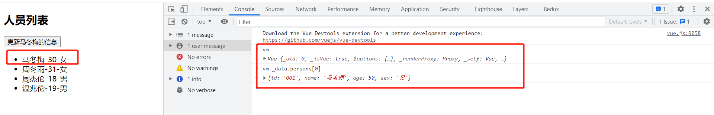
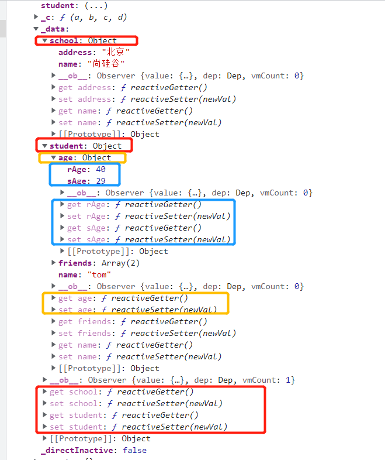
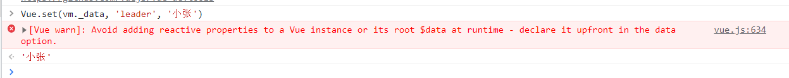

### 1.vue模板语法

1. 插值语法：
   - 功能：用于解析标签体内容。
   - 写法：{{xxx}}，xxx是js表达式，且可以直接读取到data中的所有属性。
2. 指令语法：
   - 功能：用于解析标签（包括：标签属性、标签体内容、绑定事件.....）。
   - 举例：v-bind:href="xxx" 或  简写为 :href="xxx"，xxx同样要写js表达式，且可以直接读取到data中的所有属性。

### 2.事件处理

1. 基本语法

   ```
   <input type="text" @change="inputChange()">
   <button @click="showInfo2($event,66)">点我提示信息2（传参）</button>
   ```

2. 事件修饰符

   - prevent：阻止默认事件（常用
   - stop：阻止事件冒泡（常用）
   - once：事件只触发一次（常用）
   - capture：使用事件的捕获模式
   - self：只有event.target是当前操作的元素时才触发事件
   - passive：事件的默认行为立即执行，无需等待事件回调执行完毕

### 3.计算属性computed:{}

1. 定义：要用的属性不存在，要通过已有属性计算得来。
2. 原理：底层借助了Objcet.defineproperty方法提供的getter和setter。
3. get函数什么时候执行？
   - 初次读取时会执行一次。
   - 当依赖的数据发生改变时会被再次调用。
4. 优势：与methods实现相比，内部有缓存机制（复用），效率更高，调试方便。
5. 备注：
   - 计算属性最终会出现在vm上，直接读取使用即可。
   - 如果计算属性要被修改，那必须写set函数去响应修改，且set中要引起计算时依赖的数据发生改变。

```
computed:{
	fullName:{
	//get有什么作用？当有人读取fullName时，get就会被调用，且返回值就作为fullName的值
	//get什么时候调用？1.初次读取fullName时。2.所依赖的数据发生变化时。
	get(){
	console.log('get被调用了')
	// console.log(this) //此处的this是vm
	return this.firstName + '-' + this.lastName
	},
	//set什么时候调用? 当fullName被修改时。
	set(value){
        console.log('set',value)
        const arr = value.split('-')
        this.firstName = arr[0]
        this.lastName = arr[1]
		}
	}
}


// 简写
fullName() {
	console.log('get被调用了')
    return this.firstName + '-' + this.lastName
}
```

### 4.监视属性watch:{}

1. 当被监视的属性变化时, 回调函数自动调用, 进行相关操作
2. 监视的属性必须存在，才能进行监视！
3. 监视的两种写法：
   - new Vue时传入watch配置
   - 通过vm.$watch监视
   - deep: boolean : 深度监听，Vue中的watch默认不监测对象内部值的改变（一层）
   - immediate: boolean 初始化是否调用

```
// 两种形式：
watch:{
    isHot:{
    immediate:true, //初始化时让handler调用一下
    //handler什么时候调用？当isHot发生改变时。
    handler(newValue,oldValue){
    	console.log('isHot被修改了',newValue,oldValue)
    	}
    }
}
vm.$watch('isHot',{
	immediate:true, //初始化时让handler调用一下
    //handler什么时候调用？当isHot发生改变时。
    handler(newValue,oldValue){
    	console.log('isHot被修改了',newValue,oldValue)
    }
})

// 监听多级结构中某个属性的变化
...
data: {
	numbers: {
		a: 1,
		b: 2
		c: {
			d: {
				e: 100
			}
		}
	}
}
...
'numbers.a':{
	handler(){
		console.log('a被改变了')
    }
}
```

### 5.数据监听

#### 5.1 更新时的一个问题

```
...
data: {
	persons:[
        {id:'001',name:'马冬梅',age:30,sex:'女'},
        {id:'002',name:'周冬雨',age:31,sex:'女'},
        {id:'003',name:'周杰伦',age:18,sex:'男'},
        {id:'004',name:'温兆伦',age:19,sex:'男'}
    ]
}

methods: {
	updateMei() {
		// this.persons[0].name = '马老师' //奏效
        // this.persons[0].age = 50 //奏效
        // this.persons[0].sex = '男' //奏效
        // this.persons[0] = {id:'001',name:'马老师',age:50,sex:'男'} //不奏效
        // this.persons.splice(0,1,{id:'001',name:'马老师',age:50,sex:'男'}) // 奏效
        this.$set(this.persons, 0, {id:'001',name:'马老师',age:50,sex:'男'}) // 奏效
	}
}
```

如果使用的是不奏效的，则

```
this.persons[0] = {id:'001',name:'马老师',age:50,sex:'男'} 
```

在开发者工具上可以观察，vm._data.persons[0]/ vm.persons[0]的数据虽然更新了，但页面没有更新。



#### 5.2vue.set的使用

```
data:{
	school:{
        name:'尚硅谷',
        address:'北京',
	},
	student:{
	name:'tom',
	age:{
        rAge:40,
        sAge:29,
    },
	friends:[
        {name:'jerry',age:35},
        {name:'tony',age:36}
	]
	}
}
```

在控制台输入vm查看数据



可以看到，vue的初始化时每个属性都会被加上setter和getter。现在如果我们需要往student对象上增加一个sex属性，在控制台中输入

vm._data.student.sex="男"，视图将不会得到更新，重新查看vm发现新增的属性sex没有getter和setter。

**使用vue.set()更新**

在控制台中输入 Vue.set(vm._data.student, 'sex', '男'),视图将会更新，sex属性也有自己的getter和seeter。

**不能往实例上添加属性，即不能往data身上添加新属性**

如果我们想往data身上添加新的属性leader



#### 5.3数据监听总结

1.  vue会监视data中所有层次的数据。

2.  如何监测对象中的数据？

   - 通过setter实现监视，且要在new Vue时就传入要监测的数据。

   - 对象中后追加的属性，Vue默认不做响应式处理

   - 如需给后添加的属性做响应式，请使用如下API

     ```
     Vue.set(target，propertyName/index，value) 
     vm.$set(target，propertyName/index，value)
     ```

3. 如何监测数组中的数据？

   - 通过包裹数组更新元素的方法实现，本质就是做了两件事：
   - 调用原生对应的方法对数组进行更新。
   - 重新解析模板，进而更新页面。

4. 在Vue修改数组中的某个元素一定要用如下方法：

   - 使用这些API:push()、pop()、shift()、unshift()、splice()、sort()、reverse()
   - Vue.set() 或 vm.$set()

5. 特别注意：Vue.set() 和 vm.$set() 不能给vm 或 vm的根数据对象 添加属性！！！

### 6.过滤器

1. 定义：对要显示的数据进行特定格式化后再显示（适用于一些简单逻辑的处理）,如果是复杂的，可以使用methods或者computed。
2. 语法：
   - 1.注册过滤器：Vue.filter(name,callback) 或 new Vue{filters:{}}
   - 2.使用过滤器：{{ xxx | 过滤器名}}  或  v-bind:属性 = "xxx | 过滤器名"
3. 备注
   - 过滤器也可以接收额外参数、多个过滤器也可以串联
   - 并没有改变原本的数据, 是产生新的对应的数据

```
//全局过滤器
Vue.filter('mySlice',function(value){
	return value.slice(0,4)
})

// 局部注册
new Vue({
	filters: {
		timeFormater(value,str='YYYY年MM月DD日 HH:mm:ss'){
			return dayjs(value).format(str)
		}
	}
})
```

### 7.内置指令

#### 7.1 v-text

- 作用：向其所在的节点中渲染文本内容。
- 与插值语法的区别：v-text会替换掉节点中的内容，{{xx}}则不会。

```
<div id="root">
	<div>你好，{{name}}</div>
	<div v-text="name">你好</div>
</div>
```

v-text渲染出来的dom内容就只有name对应的内容，“你好”会被去掉。

#### 7.2 v-cloak

```
<div id="root">
	<h2 v-cloak>{{name}}</h2>
</div>

<style>
	[v-cloak] {
		display:none;
	}
</style>
```

- 本质是一个特殊属性，Vue实例创建完毕并接管容器后，会删掉v-cloak属性。
- 使用css配合v-cloak可以解决网速慢时页面展示出{{xxx}}的问题。

#### 7.3 v-once

```
<div id="root">
	<h2 v-once>初始化的n值是:{{n}}</h2>
    <h2>当前的n值是:{{n}}</h2>
    <button @click="n++">点我n+1</button>
</div>
```

- v-once所在节点在初次动态渲染后，就视为静态内容了。
- 以后数据的改变不会引起v-once所在结构的更新，可以用于优化性能。

#### 7.4 v-pre

```
<div id="root">
    <h2 v-pre>Vue其实很简单</h2>
    <h2 >当前的n值是:{{n}}</h2>
    <button @click="n++">点我n+1</button>
</div>
```

- 跳过其所在节点的编译过程。
- 可利用它跳过：没有使用指令语法、没有使用插值语法的节点，会加快编译。

### 8.生命周期


```
const vm = new Vue({
	el:'#root',
    data:{
    	n:1
    },
    methods: {
    	add(){
    		console.log('add')
    	this.n++
    	},
    bye(){
        console.log('bye')
        this.$destroy()
    	}
    },
    watch:{
        n(){
        console.log('n变了')
    	}
    },
    beforeCreate() {
        console.log('beforeCreate')
        console.log(this._data) // undefined
        console.log(this.add) // undefined
    },
    created() {
        console.log('created') 
        console.log(this._data) // {__ob__: Observer}
        console.log(this.add) // ƒ add(){...}
    },
    beforeMount() {
    	console.log('beforeMount')
    },
    mounted() {
    	console.log('mounted')
    },
    beforeUpdate() {
    	// 点击add
    	console.log('beforeUpdate')
    	console.log(this._data.n) // 2 数据更新，视图未更新
    },
    updated() {
    	console.log('updated')
    },
    beforeDestroy() {
    	console.log('beforeDestroy')
    },
    destroyed() {
    	console.log('destroyed')
    },
})
```

### 9. 单文件组件与非单文件组件

- 非单文件组件：一个文件中包含有n个组件（.html）

- 单文件组件：一个文件中包含1个组件(.vue)

**vue.extend**

- 每次调用Vue.extend，返回的都是一个全新的VueComponent

- 我们只需要写<school/>或<school></school>，Vue解析时会帮我们创建school组件的实例对象，

   即Vue帮我们执行的：new VueComponent(options)。

- VueComponent的实例对象，以后简称vc（也可称之为：组件实例对象）。

- Vue的实例对象，以后简称vm。

```
//定义hello组件
const hello = Vue.extend({
	template:`
    	<div>
    		<h2>{{msg}}</h2>
    		<test></test>	
   		</div>
		`,
	data(){
		return {
			msg:'你好啊！'
		}
	},
	components:{test}
})

// 全局注册
Vue.component('hello',hello)
// 全局注册
Vue.component('button-counter', {
  data: function () {
    return {
      count: 0
    }
  },
  template: '<button v-on:click="count++">You clicked me {{ count }} times.</button>'
})


//创建vm
new Vue({
	el:'#root',
data:{
	msg:'你好啊！'
},
// 局部注册
components:{
	student
	}
})
```

### 10.props

```
props: {
  title: String,
  likes: Number,
  isPublished: Boolean,
  commentIds: Array,
  author: Object,
  callback: Function,
  contactsPromise: Promise // or any other constructor
}

propC: {
    type: String,
    required: true
},
propC: {
    type: String,
    defalut: string
}

// 简单声明接收
props:['name','age','sex']
```

- type
- required
- default

### 11. mixins

- 局部 
- 全局

```
// mixin.js(混合)
export const hunhe = {
	methods: {
		showName(){
			alert(this.name)
		}
	},
	mounted() {
		console.log('你好啊！')
	},
}
export const hunhe2 = {
	data() {
		return {
			x:100,
			y:200
		}
	}
}
```

```
// Shcool.vue
<template>
	<div>
		<h2 @click="showName">学校名称：{{name}}</h2>
		<h2>学校地址：{{address}}</h2>
	</div>
</template>

<script>
	//引入一个hunhe
	import {hunhe,hunhe2} from '../mixin'

	export default {
		name:'School',
		data() {
			return {
				name:'尚硅谷',
				address:'北京',
				x:666
			}
		},
		mixins:[hunhe,hunhe2],
	}
</script>

// Student.vue
<template>
	<div>
		<h2 @click="showName">学校名称：{{name}}</h2>
		<h2>学校地址：{{address}}</h2>
	</div>
</template>

<script>
	//引入一个hunhe
	import {hunhe,hunhe2} from '../mixin'

	export default {
		name:'School',
		data() {
			return {
				name:'尚硅谷',
				address:'北京',
				x:666
			}
		},
		mixins:[hunhe,hunhe2],
	}
</script>
```

- 局部混合，在组件实例上mixins的数组上添加
- 权重规则
  - data、showName里的属性，组件的优先，即组件如果声明了则用组件的
  - 生命周期钩子是两个都要

**全局**

```
// main.vue

//引入Vue
import Vue from 'vue'
//引入App
import App from './App.vue'
import {hunhe,hunhe2} from './mixin'

Vue.mixin(hunhe)
Vue.mixin(hunhe2)


//创建vm
new Vue({
	el:'#app',
	render: h => h(App)
})
```

- 通过Vue.mixin()全局声明

### 12. 插件

- 暴露一个install方法
- Vue.use(plugins,option1,option2...)

```
// plugins
export default {
	install(Vue,x,y,z){
		console.log(x,y,z)
		//全局过滤器
		Vue.filter('mySlice',function(value){
			return value.slice(0,4)
		})

		//定义全局指令
		Vue.directive('fbind',{
			//指令与元素成功绑定时（一上来）
			bind(element,binding){
				element.value = binding.value
			},
			//指令所在元素被插入页面时
			inserted(element,binding){
				element.focus()
			},
			//指令所在的模板被重新解析时
			update(element,binding){
				element.value = binding.value
			}
		})

		//定义混入
		Vue.mixin({
			data() {
				return {
					x:100,
					y:200
				}
			},
		})

		//给Vue原型上添加一个方法（vm和vc就都能用了）
		Vue.prototype.hello = ()=>{alert('你好啊')}
	}
}
```

### 13.子组件给父组件传值

- 父组件给子组件传递函数类型的props

  ```
  // 父组件
  <School :getSchoolName="getSchoolName"/>
  ...
  methods: {
  	getSchoolName() {}
  }
  // 子组件 School.vue
  ...
  props:['getSchoolName']
  ```

- 自定义事件

  ```
  // 监听自定义事件（父组件）
  <Student @atguigu="getStudentName"/> 
  methods: {
  	getStudentName(name,...params){
      	console.log('App收到了学生名：',name,params)
      }
  }
  
  // 触发自定义事件（子组件）
  this.$emit('atguigu',this.name,666,888,900)
  
  // 解绑自定义事件
  this.$off('atguigu')
  ```

- 自定义事件+refs

  ```
  // 父组件
  <Student ref="student"/>
  ...
  mounted() {
  	this.$refs.student.$on('atguigu',this.getStudentName) //绑定自定义事件
  	// this.$refs.student.$once('atguigu',this.getStudentName) //绑定自定义事件（一次性）
  }
  
  // 子组件
  this.$emit('atguigu',this.name,666,888,900)
  ```

### 14. 事件总线

```
const vm = new Vue({
	el:'#app',
	render: h => h(App),
	beforeCreate() {
		Vue.prototype.$bus = this //安装全局事件总线
	}
})
console.log(vm)

// 使用
// 监听
this.$bus.$on('checkTodo',callback)
// 触发
this.$emit('addTodo',1,2,3)
// 解绑
this.$off('addTodo')
```

- vm上有$on、$off、$emit,可以把Vue的原型对象上添加属性指向Vue的实例
- 由于在new Vue 后模板已经解析，所以得在beforeCreate()上没有解析和没有数据监测数据代理时实现。

### 15. nextTick()

1. 语法：```this.$nextTick(回调函数)```
2. 作用：在下一次 DOM 更新结束后执行其指定的回调。
3. 什么时候用：当改变数据后，要基于更新后的新DOM进行某些操作时，要在nextTick所指定的回调函数中执行。

### 16. 插槽

#### 16.1 默认插槽

```
// category.vue
<template>
	<div class="category">
		<h3>{{title}}分类</h3>
		<!-- 定义一个插槽（挖个坑，等着组件的使用者进行填充） -->
		<slot>我是一些默认值，当使用者没有传递具体结构时，我会出现</slot>
	</div>
</template>

// App.vue
<template>
	<div class="container">
		<Category title="美食" >
			
		</Category>

		<Category title="游戏" >
			<ul>
				<li v-for="(g,index) in games" :key="index">{{g}}</li>
			</ul>
		</Category>

		<Category title="电影">
			<video controls src="http://clips.vorwaerts-gmbh.de/big_buck_bunny.mp4"></video>
		</Category>
	</div>
</template>
```

**如果父组件很多不同的逻辑，为了避免子组件做过多的条件渲染，可以在子组件使用一个插槽占位，在父组件中传入结构**

#### 16.2 具名插槽

```
<template>
	<div class="category">
		<h3>{{title}}分类</h3>
		<!-- 定义一个插槽（挖个坑，等着组件的使用者进行填充） -->
		<slot name="center">我是一些默认值，当使用者没有传递具体结构时，我会出现1</slot>
		<div>我是category组件</div>
		<slot name="footer">我是一些默认值，当使用者没有传递具体结构时，我会出现2</slot>
	</div>
</template>

<template>
	<div class="container">
		<Category title="美食" >
			
			<a slot="footer" href="http://www.atguigu.com">更多美食</a>
		</Category>

		<Category title="游戏" >
			<ul slot="center">
				<li v-for="(g,index) in games" :key="index">{{g}}</li>
			</ul>
			<div class="foot" slot="footer">
				<a href="http://www.atguigu.com">单机游戏</a>
				<a href="http://www.atguigu.com">网络游戏</a>
			</div>
		</Category>

		<Category title="电影">
			<video slot="center" controls src="http://clips.vorwaerts-gmbh.de/big_buck_bunny.mp4"></video>
			<template v-slot:footer>
				<div class="foot">
					<a href="http://www.atguigu.com">经典</a>
					<a href="http://www.atguigu.com">热门</a>
					<a href="http://www.atguigu.com">推荐</a>
				</div>
				<h4>欢迎前来观影</h4>
			</template>
		</Category>
	</div>
</template>
```

- 名称对应

- v-slot

  ```
  <template v-slot:footer>
  	<div class="foot">
          <a href="http://www.atguigu.com">经典</a>
          <a href="http://www.atguigu.com">热门</a>
          <a href="http://www.atguigu.com">推荐</a>
  	</div>
  	<h4>欢迎前来观影</h4>
  </template>
  ```

  - 可以保留结构，如果用普通的写法，则如下面，在外层再加一层div，留好结构

  ```
  <div slot="footer">
  	<div class="foot">
          <a href="http://www.atguigu.com">经典</a>
          <a href="http://www.atguigu.com">热门</a>
          <a href="http://www.atguigu.com">推荐</a>
  	</div>
  	<h4>欢迎前来观影</h4>
  </div>
  ```

#### 16.3 作用域插槽

```
// category.vue
<template>
	<div class="category">
		<h3>{{title}}分类</h3>
		<slot :games="games" msg="hello">我是默认的一些内容</slot>
	</div>
</template>

<script>
	export default {
		name:'Category',
		props:['title'],
		data() {
			return {
				games:['红色警戒','穿越火线','劲舞团','超级玛丽'],
			}
		},
	}
</script>

// App.vue
<template>
	<div class="container">

		<Category title="游戏">
			<template scope="atguigu">
				<ul>
					<li v-for="(g,index) in atguigu.games" :key="index">{{g}}</li>
				</ul>
			</template>
		</Category>

		<Category title="游戏">
			<template scope="{games}">
				<ol>
					<li style="color:red" v-for="(g,index) in games" :key="index">{{g}}</li>
				</ol>
			</template>
		</Category>

		<Category title="游戏">
			<template slot-scope="{games}">
				<h4 v-for="(g,index) in games" :key="index">{{g}}</h4>
			</template>
		</Category>

	</div>
</template>

<script>
	import Category from './components/Category'
	export default {
		name:'App',
		components:{Category},
	}
</script>
```

- 使用场景：数据在子组件中，但是结构由父组件生成传入子组件

```
<slot :games="games" msg="hello">我是默认的一些内容</slot>
```

- 子组件向父组件传入内容 games

```
<Category title="游戏">
			<template scope="atguigu">
				<ul>
					<li v-for="(g,index) in atguigu.games" :key="index">{{g}}</li>
				</ul>
			</template>
		</Category>
```

- 父组件通过template + scope 接收子组件传过来的内容，传过来内容的名字变量不需要对应

### 17.vuex

#### 17.1 原理图


- action: 响应组件中用户的动作,相当于redux中的异步action
- mutations： 修改state中的数据，相当于redux中的同步action
- state： 公共状态，只能通过mutations修改

#### 17.2 搭建开发环境

1. 创建文件：```src/store/index.js```

```
//引入Vue核心库

  import Vue from 'vue'

  //引入Vuex

  import Vuex from 'vuex'

  //应用Vuex插件

  Vue.use(Vuex)

  

  //准备actions对象——响应组件中用户的动作

  const actions = {}

  //准备mutations对象——修改state中的数据

  const mutations = {}

  //准备state对象——保存具体的数据

  const state = {}

  

  //创建并暴露store

  export default new Vuex.Store({

   actions,

   mutations,

   state

  })
```

2. 在```main.js```中创建vm时传入```store```配置项

```
  ......

  //引入store

  import store from './store'

  ......

  

  //创建vm

  new Vue({

   el:'#app',

   render: h => h(App),

   store

  })
```

#### 17.3 基本使用

```
// store/index.js

import Vue from 'vue'
import Vuex from 'vuex'
Vue.use(Vuex)

//准备actions——用于响应组件中的动作
const actions = {
	jiaOdd(context,value){
		if(context.state.sum % 2){
			context.commit('JIA',value)
		}
	},
	jiaWait(context,value){
		setTimeout(()=>{
			context.commit('JIA',value)
		},500)
	}
}

//准备mutations——用于操作数据（state）
const mutations = {
	JIA(state,value){
		console.log('mutations中的JIA被调用了')
		state.sum += value
	},
	JIAN(state,value){
		console.log('mutations中的JIAN被调用了')
		state.sum -= value
	}
}
//准备state——用于存储数据
const state = {
	sum:0, //当前的和
	school:'尚硅谷',
	subject:'前端'
}
//准备getters——用于将state中的数据进行加工
const getters = {
	bigSum(state){
		return state.sum*10
	}
}

//创建并暴露store
export default new Vuex.Store({
	actions,
	mutations,
	state,
	getters
})
```

- mutations: 操作数据
- actions：进行其他操作或异步请求再调用mutations
- getters： vuex 中的计算属性，第二个参数可以是其他getters
- 获取state: this.$store.state.sum
- commit：this.$store.commit('JIAN',this.n)
- dispatch: this.$store.dispatch('jiaWait',this.n)

#### 17.4 辅助函数

- mapState: 从state中读取数据,帮助我们生成计算属性
- mapGetters:  store 中的 getter 映射到局部计算属性
- mapMutations: 将组件中的 methods 映射为 `store.commit` 调用
- mapActions: 将组件的 methods 映射为 `store.dispatch` 调用

#### 17.5 modules

```
// store/index.js
export default new Vuex.Store({
	modules:{
		countAbout:countOptions,
		personAbout:personOptions
	}
})
```

```
computed:{
    //借助mapState生成计算属性，从state中读取数据。（数组写法）
    ...mapState('countAbout',['sum','school','subject']),
    ...mapState('personAbout',['personList']),
    //借助mapGetters生成计算属性，从getters中读取数据。（数组写法）
    ...mapGetters('countAbout',['bigSum'])
},
methods: {
	//借助mapMutations生成对应的方法，方法中会调用commit去联系mutations(对象写法)
    ...mapMutations('countAbout',{increment:'JIA',decrement:'JIAN'}),
    //借助mapActions生成对应的方法，方法中会调用dispatch去联系actions(对象写法)
    ...mapActions('countAbout',{incrementOdd:'jiaOdd',incrementWait:'jiaWait'})
}
```

```
this.$store.state.personAbout.personList
```

### 18.router

#### 18.1 基本使用

1. 安装vue-router，命令：```npm i vue-router```

2. 应用插件：```Vue.use(VueRouter)```

3. 编写router配置项:

   ```js
   //引入VueRouter
   import VueRouter from 'vue-router'
   //引入Luyou 组件
   import About from '../components/About'
   import Home from '../components/Home'
   
   //创建router实例对象，去管理一组一组的路由规则
   const router = new VueRouter({
   	routes:[
   		{
   			path:'/about',
   			component:About
   		},
   		{
   			path:'/home',
   			component:Home
   		}
   	]
   })
   
   //暴露router
   export default router
   ```

4. 实现切换（active-class可配置高亮样式）

   ```vue
   <router-link active-class="active" to="/about">About</router-link>
   ```

5. 指定展示位置

   ```vue
   <router-view></router-view>
   ```

#### 18.2 几个注意点

1. 路由组件通常存放在```pages```文件夹，一般组件通常存放在```components```文件夹。
2. 通过切换，“隐藏”了的路由组件，默认是被销毁掉的，需要的时候再去挂载。
3. 每个组件都有自己的```$route```属性，里面存储着自己的路由信息。
4. 整个应用只有一个router，可以通过组件的```$router```属性获取到。

#### 18.3 多级路由（多级路由）

1. 配置路由规则，使用children配置项：

   ```js
   routes:[
   	{
   		path:'/about',
   		component:About,
   	},
   	{
   		path:'/home',
   		component:Home,
   		children:[ //通过children配置子级路由
   			{
   				path:'news', //此处一定不要写：/news
   				component:News
   			},
   			{
   				path:'message',//此处一定不要写：/message
   				component:Message
   			}
   		]
   	}
   ]
   ```

2. 跳转（要写完整路径）：

   ```vue
   <router-link to="/home/news">News</router-link>
   ```

#### 18.4 路由的query参数

1. 传递参数

   ```vue
   <!-- 跳转并携带query参数，to的字符串写法 -->
   <router-link :to="/home/message/detail?id=666&title=你好">跳转</router-link>
   				
   <!-- 跳转并携带query参数，to的对象写法 -->
   <router-link 
   	:to="{
   		path:'/home/message/detail',
   		query:{
   		   id:666,
               title:'你好'
   		}
   	}"
   >跳转</router-link>
   ```

2. 接收参数：

   ```js
   $route.query.id
   $route.query.title
   ```

#### 18.5命名路由

1. 作用：可以简化路由的跳转。

2. 如何使用

   1. 给路由命名：

      ```js
      {
      	path:'/demo',
      	component:Demo,
      	children:[
      		{
      			path:'test',
      			component:Test,
      			children:[
      				{
                            name:'hello' //给路由命名
      					path:'welcome',
      					component:Hello,
      				}
      			]
      		}
      	]
      }
      ```

   2. 简化跳转：

      ```vue
      <!--简化前，需要写完整的路径 -->
      <router-link to="/demo/test/welcome">跳转</router-link>
      
      <!--简化后，直接通过名字跳转 -->
      <router-link :to="{name:'hello'}">跳转</router-link>
      
      <!--简化写法配合传递参数 -->
      <router-link 
      	:to="{
      		name:'hello',
      		query:{
      		   id:666,
                  title:'你好'
      		}
      	}"
      >跳转</router-link>
      ```

#### 18.6 路由的params参数

1. 配置路由，声明接收params参数

   ```js
   {
   	path:'/home',
   	component:Home,
   	children:[
   		{
   			path:'news',
   			component:News
   		},
   		{
   			component:Message,
   			children:[
   				{
   					name:'xiangqing',
   					path:'detail/:id/:title', //使用占位符声明接收params参数
   					component:Detail
   				}
   			]
   		}
   	]
   }
   ```

2. 传递参数

   ```vue
   <!-- 跳转并携带params参数，to的字符串写法 -->
   <router-link :to="/home/message/detail/666/你好">跳转</router-link>
   				
   <!-- 跳转并携带params参数，to的对象写法 -->
   <router-link 
   	:to="{
   		name:'xiangqing',
   		params:{
   		   id:666,
               title:'你好'
   		}
   	}"
   >跳转</router-link>
   ```

   > 特别注意：路由携带params参数时，若使用to的对象写法，则不能使用path配置项，必须使用name配置！

3. 接收参数：

   ```js
   $route.params.id
   $route.params.title
   ```

#### 18.7 路由的props配置

​	作用：让路由组件更方便的收到参数

```js
{
	name:'detail',
	path:'detail/:id/:title',
	component:Detail,

	//第一种写法：props值为对象，该对象中所有的key-value的组合最终都会通过props传给Detail组件
	// props:{a:900}

	//第二种写法：props值为布尔值，布尔值为true，则把路由收到的所有params参数通过props传给Detail组件
	// props:true
	
	//第三种写法：props值为函数，该函数返回的对象中每一组key-value都会通过props传给Detail组件
	props(route){
		return {
			id:route.query.id,
			title:route.query.title
		}
	}
}

// Detail.vue

<template>
	<ul>
		<li>消息编号：{{id}}</li>
		<li>消息标题：{{title}}</li>
	</ul>
</template>

<script>
	export default {
		name:'Detail',
		props:['id','title'],
		computed: {
			// id(){
			// 	return this.$route.query.id
			// },
			// title(){
			// 	return this.$route.query.title
			// },
		},
		mounted() {
			// console.log(this.$route)
		},
	}
</script>
```

- 第一种写法只能写死数据，通常使用第二、三种
- 使用路由的props的好处是可以像组件的props那样做到接收数据，不需要像计算器那样麻烦

#### 18.8```<router-link>```的replace属性

1. 作用：控制路由跳转时操作浏览器历史记录的模式
2. 浏览器的历史记录有两种写入方式：分别为```push```和```replace```，```push```是追加历史记录，```replace```是替换当前记录。路由跳转时候默认为```push```
3. 如何开启```replace```模式：```<router-link replace .......>News</router-link>```

#### 18.9 编程式路由

1. 作用：不借助```<router-link> ```实现路由跳转，让路由跳转更加灵活

2. 具体编码：

   ```js
   //$router的两个API
   this.$router.push({
   	name:'xiangqing',
   		params:{
   			id:xxx,
   			title:xxx
   		}
   })
   
   this.$router.replace({
   	name:'xiangqing',
   		params:{
   			id:xxx,
   			title:xxx
   		}
   })
   this.$router.forward() //前进
   this.$router.back() //后退
   this.$router.go() //可前进也可后退
   ```

#### 18.10 缓存路由组件

1. 作用：让不展示的路由组件保持挂载，不被销毁。

2. 具体编码：

   ```vue
   <!-- 缓存多个路由组件 -->
   <!-- <keep-alive :include="['News','Message']"> -->
   
   <!-- 缓存一个路由组件 -->
   <keep-alive include="News">
       <router-view></router-view>
   </keep-alive>
   ```

#### 18.11 两个新的生命周期钩子

1. 作用：路由组件所独有的两个钩子，用于捕获路由组件的激活状态。
2. 具体名字：
   1. ```activated```路由组件被激活时触发。
   2. ```deactivated```路由组件失活时触发。

#### 18.12 路由守卫

1. 作用：对路由进行权限控制

2. 分类：全局守卫、独享守卫、组件内守卫

3. 全局守卫:

   ```js
   //全局前置守卫：初始化时执行、每次路由切换前执行
   router.beforeEach((to,from,next)=>{
   	console.log('beforeEach',to,from)
   	if(to.meta.isAuth){ //判断当前路由是否需要进行权限控制
   		if(localStorage.getItem('school') === 'atguigu'){ //权限控制的具体规则
   			next() //放行
   		}else{
   			alert('暂无权限查看')
   			// next({name:'guanyu'})
   		}
   	}else{
   		next() //放行
   	}
   })
   
   //全局后置守卫：初始化时执行、每次路由切换后执行
   router.afterEach((to,from)=>{
   	console.log('afterEach',to,from)
   	if(to.meta.title){ 
   		document.title = to.meta.title //修改网页的title
   	}else{
   		document.title = 'vue_test'
   	}
   })
   ```

4. 独享守卫:

   ```js
   {
       name:'zhuye',
       path:'/home',
       component:Home,
       meta:{title:'主页'},
   	children:[
           {
               name:'xinwen',
               path:'news',
               component:News,
               meta:{isAuth:true,title:'新闻'},
               beforeEnter: (to, from, next) => {
                   console.log('独享路由守卫',to,from)
                   if(to.meta.isAuth){ //判断是否需要鉴权
                       if(localStorage.getItem('school')==='atguigu'){
                           next()
                       }else{
                           alert('学校名不对，无权限查看！')
                       }
                   }else{
                       next()
                   }
               }
           }
           ...
   ```

   - 某个路由独享的，只有前置守卫

5. 组件内守卫：

   ```js
   //进入守卫：通过路由规则，进入该组件时被调用
   beforeRouteEnter (to, from, next) {
   },
   //离开守卫：通过路由规则，离开该组件时被调用
   beforeRouteLeave (to, from, next) {
   }
   ```

### 
