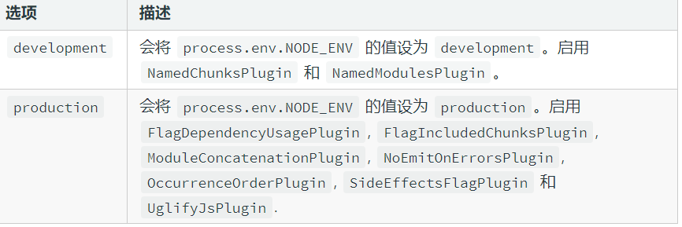
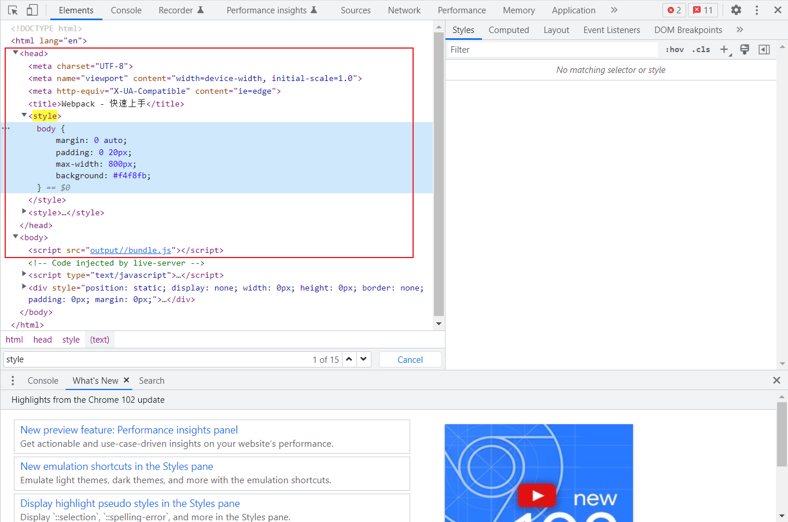

## 1. 模块工具的由来

- ES Modules 存在环境兼容问题
- 模块文件过多，网络请求频繁
- 所有的前端资源都需要模块化
- 新特性代码编译
- 模块化 JavaScript 打包
- 支持不同类型的资源模块

## 2.模块打包器（Module bundler）

- 模块加载器（Loader）
- 代码拆分（Code Splitting）
- 资源模块（Asset Module）

**打包工具解决的是前端整体的模块化，并不单指 JavaScript 模块化**

## 3. 快速上手

```
npm i webpack webpack-cli -D
```

- 默认入口

  ```
  src/index.js
  ```

- 默认出口

  ```
  dist/main.js
  ```

- 默认打包

  ```
  npx webpack
  ```

## 4.配置文件

- webpack.config.js

  ```
  const path = require('path')
  
  module.exports = {
      entry: "./src/index.js",
      output: {
          filename: "bundle.js",
          path: path.join(__dirname, 'output')
      }
  }
  ```

  **output 的路径必须为绝对路径，否则会报错**

## 5.工作模式



- 在参数使用

  ```
  npx webpack --mode development
  ```

- 在配置中使用

  ```
  module.exports = {
    mode: 'production'
  };
  ```

- 还有一个 none 模式，即不做任何处理

## 6. CSS资源模块加载

```
npm i css-loader style-loader -D 
```

```
const path = require('path')

module.exports = {
    entry: "./src/index.css",
    output: {
        filename: "bundle.js",
        path: path.join(__dirname, 'output')
    },
    module: {
        rules: [
            {
                test: /.css$/,
                use: [
                    'style-loader',
                    'css-loader'
                ]
            }
        ]
    }
}
```

- css-loader: 把css打包为js模块

- style-loader: 把css打包后的js模块引入为style

- loader执行顺序：从右到左

  

## 7. file-loader

```
npm i file-loader -D
```

```
{
    test: /.png$/,
    use: 'file-loader'
}
```

## 8.url-loader

- 可以把图片打包为data urls格式引入
- 最佳实践：
  - 小文件使用 data urls， 减少请求次数
  - 大文件单独提取存放，提高加载速度
  - 必须也安装file-loader

```
const path = require('path')

module.exports = {
  mode: 'none',
  entry: './src/main.js',
  output: {
    filename: 'bundle.js',
    path: path.join(__dirname, 'dist')
  },
  module: {
    rules: [
      {
        test: /.css$/,
        use: [
          'style-loader',
          'css-loader'
        ]
      },
      {
        test: /.png$/,
        use: {
          loader: 'url-loader',
          options: {
            limit: 10 * 1024 // 小于 10 kb 用 data urls, 大于单独提取 
          }
        }
      }
    ]
  }
}

```

## 9. 常用加载器（loader）

- 编译转换类
  - css-loader
- 文件操作类
  - file-loader
- 代码检查类
  - eslint-loader

## 10. 处理 es6

- 因为模块打包需要，所以处理了 import 和 export 特性
- 并不能处理其它语法特性

```
npm i babel-loader @babel/core @babel/preset-env -D
```

```
{
test: /.js$/,
    use: {
        loader: 'babel-loader',
        options: {
        	presets: ['@babel/preset-env']
        }
    }
}
```

## 11. 加载资源的方式

- 遵循ES Modules标准的import声明
- 遵循CommonJS标准的 require函数
- 遵循AMD标准的define函数和require函数
- 样式代码中的@import 指令和url函数
- HTML代码中图片标签的src 属性

**webpack5 中使用file-loader 与 url-loader 的正确方式**

- 增加esModule：关闭esModule 方式引入
- type: "javascript/auto"
- 如果没有这两项配置，在src和css中引入的图片打包会出错

```
{
    test: /.png$/,
    	use: {
    		loader: 'url-loader',
    		options: {
    		limit: 10 * 1024, // 小于 10 kb 用 data urls, 大于单独提取 
    		esModule: false
    	}
    },
    type: "javascript/auto"
} 
```

**webpack5 自动支持图片打包**

- assetModuleFilename:'img/[name].[hash:6][ext]'
- test: /\.(png|svg|gif|jpe?g)$/ ...

```
const path = require('path')

module.exports = {
  mode: 'none',
  entry: './src/main.js',
  output: {
    filename: 'bundle.js',
    path: path.join(__dirname, 'dist'),
    assetModuleFilename:'img/[name].[hash:6][ext]'
  },
  
  module: {
    rules: [
      {
        test: /.js$/,
        use: {
          loader: 'babel-loader',
          options: {
            presets: ['@babel/preset-env']
          }
        }
      },
      {
        test: /.css$/,
        use: [
          'style-loader',
          'css-loader'
        ]
      },
      {
        test: /\.(png|svg|gif|jpe?g)$/,
        type: 'asset', // asset/resource: 拷贝，asset/inline：base64，asset：增加generator指定阈值使用方式
        generator:{
          filename:'img/[name].[hash:6][ext]'
        },
        parser:{
            dataUrlCondition: {
                maxSize: 30*1024
            }
        }
      }
    ]
  }
}
```

## 12. 开发一个loader

